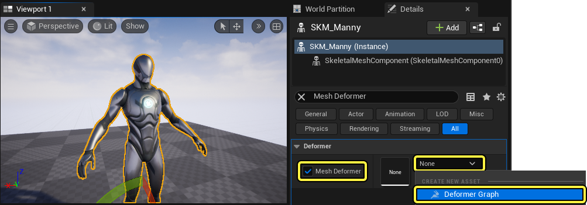
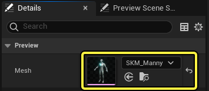
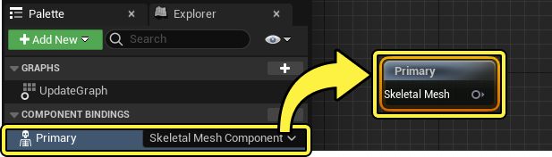
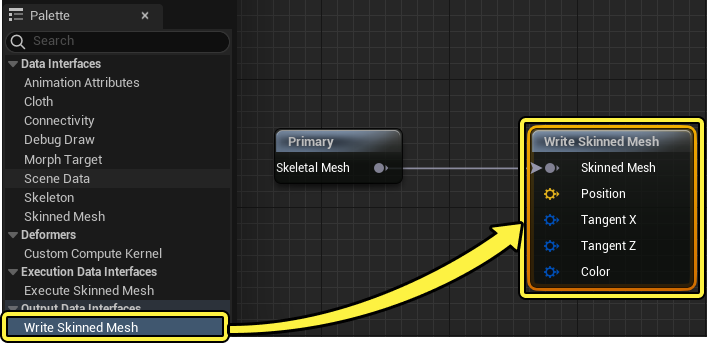
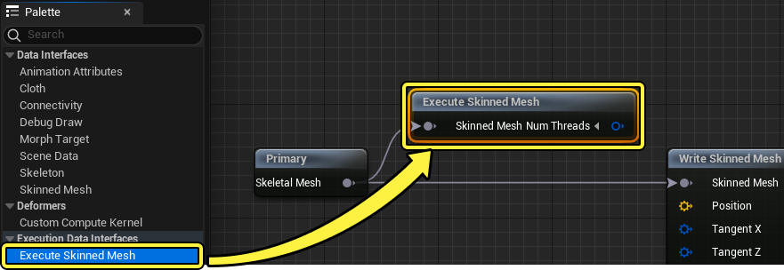
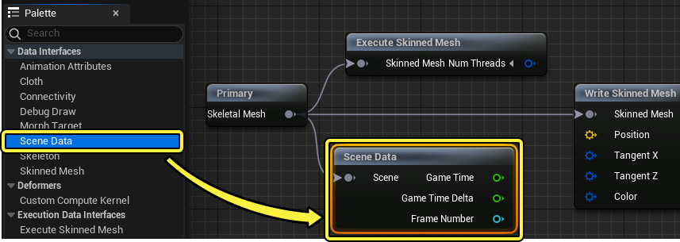
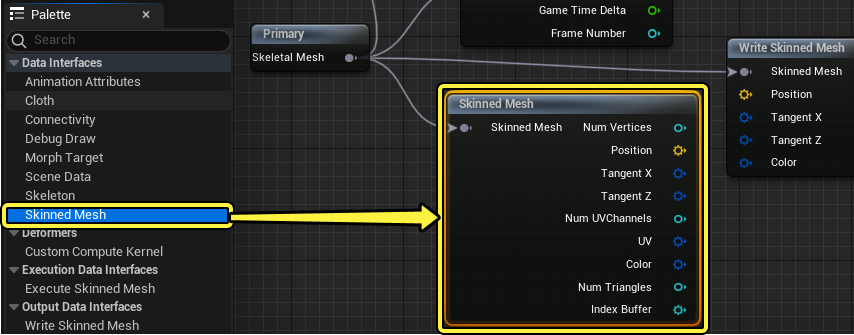

# 如何创建自定义变形器图表

> 路径：虚幻引擎5.7文档 / 为角色和对象制作动画 / 骨架网格体动画系统 / 动画操作指南和示例 / 如何创建自定义变形器图表

> 原始页面：https://dev.epicgames.com/documentation/unreal-engine/how-to-create-a-custom-deformer-graph-in-unreal-engine

你可以使用[变形器图表](../../animation-assets-and-features/deformer-graph/index.md)在 **虚幻引擎（Unreal Engine）** 中创建自定义网格体变形。创建自定义变形器图表资产后，你可以使用[变形器图表编辑器](../../animation-assets-and-features/deformer-graph/index.md#%E5%8F%98%E5%BD%A2%E5%99%A8%E5%9B%BE%E8%A1%A8%E7%BC%96%E8%BE%91%E5%99%A8)及其一组唯一的[蓝图节点](../../animation-assets-and-features/deformer-graph/index.md#%E6%8E%A7%E5%88%B6%E6%9D%BF%E7%BB%84%E4%BB%B6%E5%8F%82%E8%80%83)来编辑现有网格体变形系统，例如[变形目标](../../animation-assets-and-features/morph-target-previewer/index.md)和[布料模拟](../../../../gameplay-systems/physics/cloth-simulation/index.md)，也可以为 **线性蒙皮网格体（Linear Skinned Mesh）** 创建新的网格体变形系统。

本文档提供了示例工作流程，用于说明如何创建自定义变形器图表，在运行时将扭曲网格体变形应用于骨骼网格体角色。

#### 先决条件

- 启用

  变形器图表（Deformer Graph）

  插件

  。在

  菜单栏

  中找到

  编辑（Edit）> 插件（Plugins）

  并找到

  动画（Animation）

  分段中的

  变形器图表（Deformer Graph）

  ，或使用

  搜索栏

  。

  启用

  插件并

  重启

  编辑器。


- 你的项目包含

  骨骼网格体

  角色。我们在示例工作流程中使用了虚幻引擎人体模型，你可以在

  第三人称模板

  中访问它。

## 创建自定义变形器图表

在 **骨骼网格体角色（Skeletal Mesh Character）** 的 **细节（Details）** 面板中， **启用** **网格体变形器（Mesh Deformer）** 属性，然后从下拉菜单选择 **变形器图表（Deformer Graph）** 选项，创建新的变形器图表资产。



创建资产后， **双击** **网格体变形器（Mesh Deformer）** 属性中的资产，打开 **变形器图表编辑器（Deformer Graph Editor）** 。在变形器图表的 **细节（Details）** 面板中，使用 **网格体（Mesh）** 属性中的下拉菜单选择你要修改的网格体。



从 **控制板（Pallet）** 面板中，将 **骨骼网格体组件绑定（Skeletal Mesh Component Binding）** **拖放** 到变形器图表的 **更新图表（Update Graph）** 以读取网格体的数据。



接下来，要重新编写网格体的位置数据，请将 **Write Skinned Mesh** 节点添加到 **更新图表（Update Graph）** 并连接 **骨骼网格体（Skeletal Mesh）** 组件绑定。



将 **Execute Skinned Mesh** 添加并连接到 **骨骼网格体组件绑定（Skeletal Mesh component binding）** 以设置网格体变形的域。选择该节点并将 **域（Domain）** 属性更改为 **Vertex（顶点）** 选项。



接下来，将 **Scene Data** 节点添加并连接到 **骨骼网格体组件绑定（Skeletal Mesh component binding）** 以提取有关网格体所占据场景的信息。此工作流程使用 **时间（Time）** 数据在运行时驱动网格体变形。



要读取骨骼网格体的顶点的位置，请添加 **Skinned Mesh** 节点，并将其连接到 **骨骼网格体组件绑定（Skeletal Mesh component binding）** 。此节点提供角色网格体顶点的 **位置（Position）** 、 **切线X（Tangent X）** 和 **切线Y（Tangent Y）** 坐标。



现在，将 **Custom Compute Kernel** 添加到 **更新图表（Update Graph）** 。Custom Compute Kernel使用 **HLSL** （ **高级着色器语言** ）编程执行实际网格体变形计算。

> 图片已省略：从控制板面板将custom compute kernel节点添加到图表

在编写驱动HLSL编程或将该节点连接到图表中的其他节点之前，你必须创建 **输入** 和 **输出** 引脚，以由HLSL程序用于执行网格体变形。在 **Custom Compute Kernel** 的 **细节（Details）** 面板中，添加以下 **输入** 引脚，以利用通过各种 **读** 节点从骨骼网格体组件绑定提取的信息。

> 图片已省略：在custom compute kernel的细节面板中，添加下表中的输入绑定

| 引脚 | 数据类型 | 域 | 说明 |
| --- | --- | --- | --- |
| `线程数（Num Threads）` | **Int Vector 3** | **参数（Parameter）** | 线程数引脚可以从 **Execute Skinned Mesh** 节点的输出引脚接受网格体变形的 **域（Domain）** 。 |
| `扭曲（Twist）` | **浮点（Float）** | **参数（Parameter）** | 使用 **常量（Constant）** 或 **变量（Variable）** 值，此输入引脚可确定网格体变形的最大扭曲程度。 |
| `开始（Start）` | **浮点（Float）** | **参数（Parameter）** | 使用 **常量（Constant）** 或 **变量（Variable）** 值，此输入引脚可确定扭曲在网格体Z轴上的开始位置，以 **虚幻引擎单位（Unreal Engine Units）** （ **厘米（cm）** ）计量。 |
| `结束（End）` | **浮点（Float）** | **参数（Parameter）** | 使用 **常量（Constant）** 或 **变量（Variable）** 值，此输入引脚可确定扭曲在网格体 **Z** 轴上的结束位置，以 **虚幻引擎单位（Unreal Engine Units）** （ **厘米（cm）** ）计量。 |
| `时间（Time）` | **浮点（Float）** | **参数（Parameter）** | 此变量输入引脚在运行时从网格体提取游戏时间。 |
| `位置（Position）` | **向量3（Vector 3）** | **顶点x1（Vertex x1）** | 此输入引脚在运行时读取每个网格体轴的位置。 |
| `切线X（Tangent X）` | **向量4（Vector 4）** | **顶点x1（Vertex x1）** | 此输入引脚读取X轴的 **切线** 值。 |
| `切线Y（Tangent Y）` | **向量4（Vector 4）** | **顶点x1（Vertex x1）** | 此输入引脚读取Z轴的 **切线** 值。 |

将 **Execute Skinned Mesh** 节点的 **线程数（Num Threads）** 输出引脚连接到 **Custom Compute Kernel** 节点的 **线程数（Num Threads）** 输入引脚。然后将 **执行域（Execution Domain）** 属性设置为Custom Compute Kernel的 **细节（Details）** 面板中的 **顶点（Vertex）** 设置。

> 图片已省略：将execute skinned mesh节点连接到custom compute kernel的线程数输入，并将kernel的执行域更改为细节面板中的顶点模式

接下来，在Custom Compute Kernel的 **细节（Details）** 面板中添加以下 **输出（Output）** 引脚，输出 **Write Skinned Mesh** 节点的变形网格体数据以写回骨骼网格体。

> 图片已省略：在下表的细节面板中设置custom compute kernel的输出绑定

| 引脚 | 数据类型 | 域 | 说明 |
| --- | --- | --- | --- |
| `输出位置（Out Position）` | **向量3（Vector 3）** | **顶点x1（Vertex x1）** | 输出网格体顶点的新变形的轴位置。 |
| `OutTangentX` | **向量4（Vector 4）** | **顶点x1（Vertex x1）** | 输出 **X** 轴上修改的 **切线** 值。 |
| `OutTangentZ` | **向量4（Vector 4）** | **顶点x1（Vertex x1）** | 输出 **Z** 轴上修改的 **切线** 值。 |

**保存（Save）** 并 **编译（Compile）** 资产。

> 图片已省略：保存并编译资产

然后确保 **着色器文本编辑器（Shader Text Editor）** 面板中 **Custom Compute Kernel** 的 **声明（只读）（Declarations (Read-Only)）** 选项卡将所有输入和输出引脚注册为HLSL声明。

> 图片已省略：参考着色器文本编辑器面板的声明只读分段

**声明（只读）（Declarations (Read Only)）** 选项卡应包含以下文本：

声明（只读）

```
	// 参数和资源读/写函数	int3 ReadNumThreads();	float ReadTwist();	float ReadStart();	float ReadEnd();	float ReadTime();	uint GetVertexCount();	float4 ReadTangentX(uint VertexIndex);	float4 ReadTangentZ(uint VertexIndex);	float3 ReadPosition(uint VertexIndex);	void WriteOutTangentX(uint VertexIndex, float4 Value);	void WriteOutTangentZ(uint VertexIndex, float4 Value);	void WriteOutPosition(uint VertexIndex, float3 Value);	// 资源索引	uint Index;	// 来自SV_DispatchThreadID.x 
```

接下来，在 **着色器文本编辑器（Shader Text Editor）** 面板的 **着色器文本（Shader Text）** 分段中，输入以下HLSL程序，在骨骼网格体上执行顶点变形。

着色器文本编辑器

```
	if (Index > ReadNumThreads().x) return; 	float3 Position = ReadPosition(Index);	float4 LocalTangentX = ReadTangentX(Index);	float4 LocalTangentZ = ReadTangentZ(Index);	float Twist = ReadTwist();	float Start = ReadStart();	float End = ReadEnd(); 	float Time = sin(ReadTime());	float posz = min(max(Position.z, Start), End) / (End-Start);	float theta = posz * Twist * 0.0174533 * Time;	float sint = sin(theta);	float cost = cos(theta); 	float3 TwistPosition;	TwistPosition.x = Position.x * cost - Position.y * sint;	TwistPosition.y = Position.x * sint + Position.y * cost;	TwistPosition.z = Position.z; 	float3 TangentX;	TangentX.x = LocalTangentX.xyz.x * cost - LocalTangentX.xyz.y * sint;	TangentX.y = LocalTangentX.xyz.x * sint + LocalTangentX.xyz.y * cost;	TangentX.z = LocalTangentX.xyz.z; 	float3 TangentZ;	TangentZ.x = LocalTangentZ.xyz.x * cost - LocalTangentZ.xyz.y * sint;	TangentZ.y = LocalTangentZ.xyz.x * sint + LocalTangentZ.xyz.y * cost;	TangentZ.z = LocalTangentZ.xyz.z; 	float4 TwistTangentX = float4(normalize(TangentX), LocalTangentX.w);	float4 TwistTangentZ = float4(normalize(TangentZ), LocalTangentZ.w); 	WriteOutPosition(Index, TwistPosition);	WriteOutTangentX(Index, TwistTangentX);	WriteOutTangentZ(Index, TwistTangentZ); 
```

添加自定义HLSL程序来计算网格体变形后，将 **读** 和 **写** 节点连接到 **Custom Compute Kernel** 节点上关联的 **输入** 和 **输出** 引脚。

> 图片已省略：将读和写节点连接到custom compute kernel

最后，从 **控制板（Pallet）** 面板 **拖放** 3个 **Float Constant** 节点到 **更新图表（Update Graph）** ，以设置自定义函数的 **扭曲（Twist）** 、 **开始（Start）** 和 **结束（End）** 值。分别将一个 **Float Constant** 节点连接到 **Custom Compute Kernel** 节点上的三个可用 **输入引脚** 之一。将连接到 **扭曲（Twist）** **输入引脚** 的 **Float Constant** 节点设置为值 **180.0** ，将连接到 **开始（Start）输入引脚** 的 **Float Constant** 节点设置为值 **0** ，并将连接到 **结束（End）** 输入引脚的 **Float Constant** 节点设置为值 **100.0** 。

> 图片已省略：将3个float constant添加到图表并将其连接到custom compute kernel的扭曲、开始和结束输入

> [!NOTE]
> 改变这些值，看看函数的输入会如何修改，以动态更改变形。该函数是使用[变形器图表变量](../../animation-assets-and-features/deformer-graph/index.md#%E5%8F%98%E9%87%8F)、[资源](../../animation-assets-and-features/deformer-graph/index.md#%E8%B5%84%E6%BA%90)或[动画曲线](../../animation-assets-and-features/animation-sequences/animation-curves/index.md)驱动的，而不是常量值。

**保存（Save）** 并 **编译（Compile）** 资产，实时查看现在网格体如何在 **预览视口（Preview Viewport）** 面板中以及关卡中扭曲。

> 动图已省略：骨骼网格体现在将在运行时扭曲

> [!NOTE]
> 你可以选择网格体，并找到其 **细节（Details）** 面板的 **变形器（Deformers）** 分段，将自定义变形器图表添加到关卡中的任意角色。你可以通过 **启用** **变形器图表（Deformer Graph）** 属性并从下拉菜单选择自定义图表，将自定义变形器图表分配到角色。

有关变形器图表或[变形器图表编辑器](../../animation-assets-and-features/deformer-graph/index.md#%E5%8F%98%E5%BD%A2%E5%99%A8%E5%9B%BE%E8%A1%A8%E7%BC%96%E8%BE%91%E5%99%A8)和[蓝图节点](#%E6%8E%A7%E5%88%B6%E6%9D%BF%E7%BB%84%E4%BB%B6%E8%8A%82%E7%82%B9)的更多信息，请参阅[变形器图表](../../animation-assets-and-features/deformer-graph/index.md)文档。

受自定义变形器图表控制的网格体变形的这个和其他应用示例位于[内容示例](../../../../samples-and-tutorials/content-examples-sample-project/index.md)中。

有关用于驱动变形器图表的Custom Compute Kernel的 **HLSL** （ **高级着色器语言** ）编程的更多信息，请参阅[Microsoft高级着色器语言参考文档和编程指南](https://docs.microsoft.com/zh-cn/windows/win32/direct3dhlsl/dx-graphics-hlsl)

## 图表参考

这里你可以使用图像滑块参考工作流程示例中使用的完整的变形器图表、Custom Compute Kernel细节面板和着色器文本编辑器面板。

> 图片已省略：参考图像

**参考图像**
