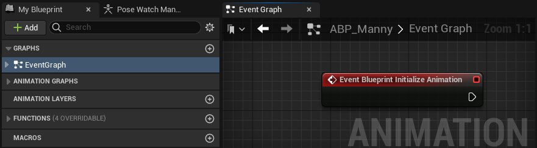
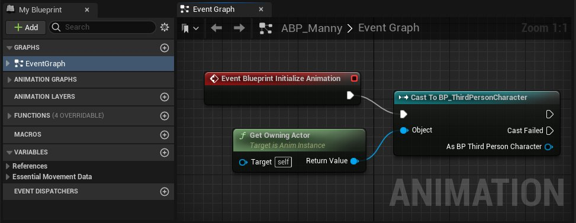
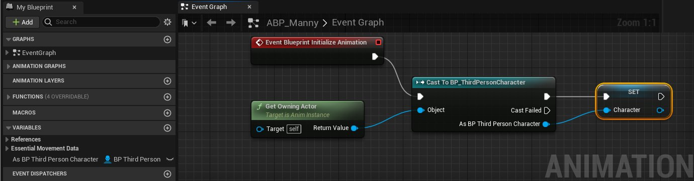
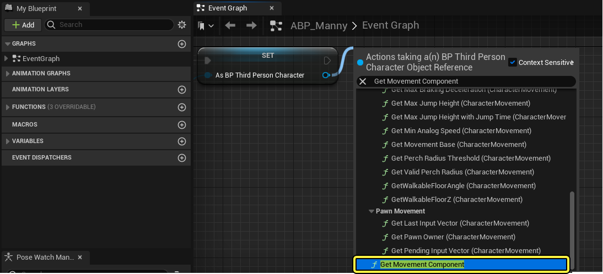
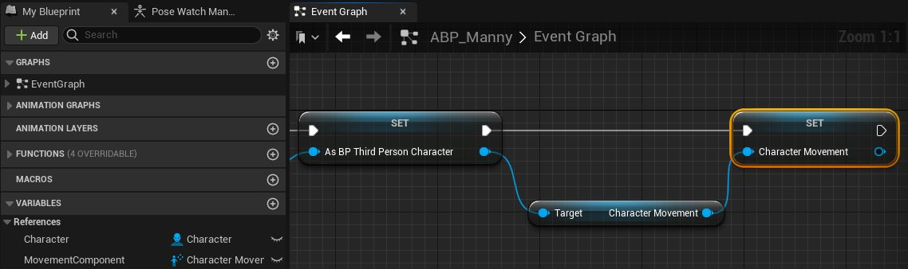
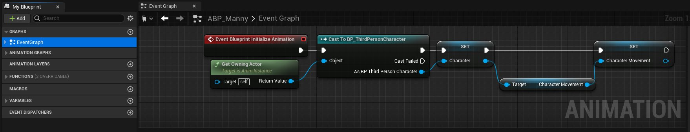
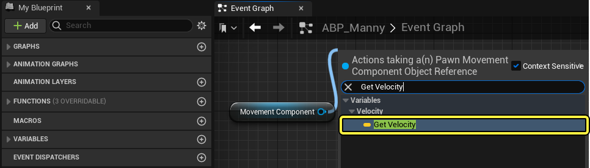
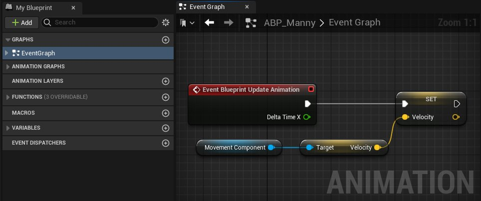

# 如何获取动画变量

> 路径：虚幻引擎5.7文档 / 为角色和对象制作动画 / 骨架网格体动画系统 / 动画操作指南和示例 / 如何获取动画变量

> 原始页面：https://dev.epicgames.com/documentation/unreal-engine/how-to-get-animation-variables-in-animation-blueprints-in-unreal-engine

为 **虚幻引擎（Unreal Engine）** 中的角色开发[动画蓝图](../../animation-blueprints/index.md)时，你可以通过动态运动和移动 **变量** 来控制动画行为。

本文将介绍如何设置动画蓝图的 **EventGraph** 逻辑，以便在项目中计算这些变量。此外，本文还将介绍如何在 **线程安全** 的 [蓝图函数](../../animation-blueprints/graphing-in-animation-blueprints/index.md#cpu%E7%BA%BF%E7%A8%8B%E4%BD%BF%E7%94%A8%E5%92%8C%E6%80%A7%E8%83%BD)中计算这些变量，并通过[属性访问（property access）](../../animation-blueprints/graphing-in-animation-blueprints/index.md#%E5%B1%9E%E6%80%A7%E8%AE%BF%E9%97%AE)节点提高项目性能和稳定性。

#### 先决条件

- 一个带有

  移动组件

  的可操控的第三人称角色。

> [!NOTE]
> 如有必要，你可以使用[第三人称模板项目](https://dev.epicgames.com/documentation/404)中的角色。

## 角色对象引用

大部分动画变量可以在 **EventGraph** 中，通过角色的[移动组件](https://dev.epicgames.com/documentation/404)计算。为了使角色的移动组件计算动画变量，你必须先创建一个引用变量。

首先，在角色的动画蓝图中的 **EventGraph** 中，创建 **Event Blueprint Initialization Animation** 节点。

从 **Event Initialization** 节点创建 **Cast** 节点，用于将动画蓝图转换为角色的蓝图。

> [!NOTE]
> 在工作流程示例中，角色的蓝图是第三人称模板项目中的 `BP_ThirdPersonCharacter`。

然后，创建 **Get Owning Actor** 节点，并将其 **返回值（Return Value）** 输出引脚连接到 **Cast** 节点的 **对象（Object）** 输入引脚。

接下来，**右键点击** Cast节点的 **作为角色（As Character）** 输出引脚，并从上下文菜单选择 **提升为变量（Promote to Variable）** 选项，以创建角色对象引用变量。

连接逻辑之后，可以在蓝图的 **EventGraph** 和 **AnimGraph** 中访问 **角色对象** 引用变量。

## 移动组件引用

为了将角色的 **移动组件（Movement Component）** 与 **角色对象（Character Object）** 分离，需要 **Get Character Movement** 节点。从 **Set Character** 变量节点的 **角色（Character）** 输出引脚，创建 **Get Character Movement** 节点。

接下来，**右键点击** 变量的 **角色移动（Character Movement）** 输出引脚，并从上下文菜单选择"提升为变量（promote to variable）"，以创建移动组件引用变量。

连接逻辑之后，可以在蓝图的 **EventGraph** 和 **AnimGraph** 中访问 **角色移动组件** 引用变量。

## 速度

在计算需要方向或速度的动画时，使用角色的速度值会很有用。

要在 **EventGraph** 中创建速度变量，请首先创建 **Event Blueprint Update Animation** 节点。

接下来，将 **移动组件（Movement Component）** 引用变量添加到 **EventGraph** 。然后，你可以使用 **Get Velocity** 节点计算表示移动组件的移动方向和大小的矢量值。

接下来，**右键点击** **Get Velocity** 节点的 **速度（Velocity）** 输出，并从上下文菜单选择 **提升为变量（Promote to Variable）** 选项，以创建速度变量。

连接逻辑之后，可以在蓝图的 **EventGraph** 和 **AnimGraph** 中访问 **速度（Velocity）** 变量。

这里，**Print String** 节点会使用角色速度的更新 **X** 、 **Y** 和 **Z** 值每帧发送调试消息。

> 动图已省略：速度打印字符串演示

### 线程安全

首先在角色的动画蓝图中创建新的线程安全型函数。

然后，**右键点击** 图表以创建 **property access** 节点。

从 **property access** 节点的下拉菜单，选择函数 **Try Get Pawn Owner > Get Movement Component > Velocity** 。然后右键点击矢量输出引脚并选择"提升为变量（promote to variable）"，以创建速度变量。

> 图片已省略：速度获取property access上下文菜单

连接逻辑之后，可以在蓝图的 **EventGraph** 和 **AnimGraph** 中访问 **速度（Velocity）** 变量。

> 图片已省略：速度线程安全型图表完全函数

为了在项目运行时期间更新此函数，请将线程安全型Velocity函数添加到 **蓝图线程安全更新动画（Blueprint Thread Safe Update Animation）** 图表。

> 图片已省略：将velocity线程安全型函数添加到蓝图线程安全更新函数

角色的动画蓝图现在会通过线程安全的方式计算角色的速度。

## 角色速度

根据角色的速度选择动画（例如奔跑或行走状态）时，使用角色移动速度变量可能很有用。

你可以根据速度变量创建 **Vector Length XY** 节点，将角色的速度与移动组件速度分离。

接下来，**右键点击** **Vector Length XY** 节点的 **返回值（Return Value）** 输出引脚，从上下文菜单选择 **提升为变量（Promote to Variable）** 。

> 图片已省略：创建vectory xy节点以从变量函数分离速度

连接逻辑之后，可以在蓝图的 **EventGraph** 和 **AnimGraph** 中访问 **速度（Speed）** 变量。

这里，**Print String** 节点会使用角色速度的更新值每帧发送调试消息。

> 动图已省略：print string调试显示角色速度演示

### 线程安全

首先在角色的动画蓝图中创建新的线程安全型函数。

接下来，创建 **property access** 节点并从下拉菜单选择 **Try Get Pawn Owner > Movement Component > Velocity** 函数。

从 **property access** 节点的输出，创建 **Vector Length XY** 节点以提取前向和横向运动（ **X** 和 **Y** 轴）。

> 图片已省略：用于获取角色速度的线程安全型函数

为了在项目运行时期间更新此函数，请将线程安全型Speed函数添加到 **蓝图线程安全更新动画（Blueprint Thread Safe Update Animation）** 图表。

> 图片已省略：将线程安全型speed函数添加到蓝图线程安全更新函数

角色的动画蓝图现在会通过线程安全的方式计算角色的速度。

## 移动阈值

要控制角色的移动何时应该触发动画播放，你可以创建"移动阈值（Movement Threshold）"变量，以在角色的速度达到设定大小时允许移动。

根据 **EventGraph** 中角色的速度变量，创建 **Greater Than or Equal To (>=)** 节点并将值设置为较低的数字。

> [!NOTE]
> 该数字可以是非常小的值，例如 `0.1` 。

**右键点击** **Greater Than or Equal To (>=)** 节点的布尔值输出引脚，并从上下文菜单选择 **提升为变量（Promote to Variable）** 。

> 图片已省略：添加greater than or equal to节点以设置将允许动画更新的最小移动

连接逻辑之后，可以在动画蓝图的 **EventGraph** 和 **AnimGraph** 中访问 **移动阈值（Movement Threshold）** 变量。

这里，**Print String** 节点会使用角色的移动阈值变量的更新状态每帧发送调试消息。

> 动图已省略：should move调试文本演示

### 线程安全

首先在角色的动画蓝图中创建新的线程安全型函数。

在线程安全型图表中创建 **property access** 节点，并将该节点设置为 **Try Get Pawn Owner > Movement Component > Velocity** 。通过 **Vector Length XY** 函数节点提取前向和横向移动。

然后通过 **Greater Than or Equal To (>=)** 节点，设置移动动画不应该发生的速度阈值。

> [!NOTE]
> 该数字可以是非常小的值，例如 `0.1`。

**右键点击** **Greater Than or Equal To (>=)** 节点的布尔值输出引脚，并从上下文菜单选择 **提升为变量（Promote to Variable）** 。

> 图片已省略：Should Move线程安全型函数

为了在项目运行时期间更新此函数，请将线程安全型Should Move函数添加到 **蓝图线程安全更新动画（Blueprint Thread Safe Update Animation）** 图表。

> 图片已省略：将should move线程安全型函数添加到蓝图线程安全更新函数

角色的动画蓝图现在会在线程安全型函数中计算角色的移动阈值变量。

## 跳跃和坠落

你可以使用"跳跃和坠落（Jumping and Falling）"变量来决定何时在角色的 **AnimGraph** 中播放跳跃和着地动画。

首先在动画蓝图的 **EventGraph** 中创建 **移动组件（Movement Component）** 变量。

现在你可以根据 **movement component** 引用变量节点创建 **IsFalling** 函数节点。

**右键点击** **Is Falling** 节点的 **返回值（Return Value）** 输出引脚，并从上下文菜单选择 **提升为变量（Promote to Variable）选项** 。

> 图片已省略：添加greater than or equal to节点以决定

连接逻辑之后，可以在动画蓝图的 **EventGraph** 和 **AnimGraph** 中访问 **跳跃和坠落（Jumping and Falling）** 变量。

这里，**Print String** 节点会使用角色的跳跃和坠落变量的更新状态每帧发送调试消息。

### 线程安全

首先在角色的动画蓝图中创建新的线程安全型函数。

创建 **property access** 节点，并将该节点设置为 **Try Get Pawn Owner > Get Movement Component > IsFalling** 。

**右键点击** property access节点的输出引脚并从上下文菜单选择 **提升为变量（Promote to Variable）** 选项。

> 图片已省略：蓝图线程安全型函数is falling

为了在项目运行时期间更新此函数，请将线程安全型Is Falling函数添加到 **蓝图线程安全更新动画（Blueprint Thread Safe Update Animation）** 图表。

> 图片已省略：将线程安全型is falling函数添加到蓝图线程安全更新函数

角色的动画蓝图现在会在线程安全型函数中计算角色的跳跃和坠落状态变量。

## EventGraph引用

这里你可以在示例工作流程中使用的 **EventGraph** 中引用完全 **事件蓝图更新动画（Event Blueprint Update Animation）** 逻辑。

> 图片已省略：事件图表上的完整更新函数
