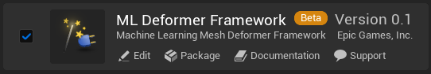
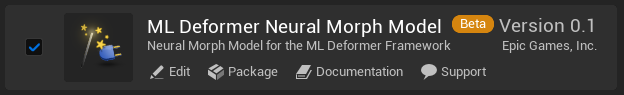
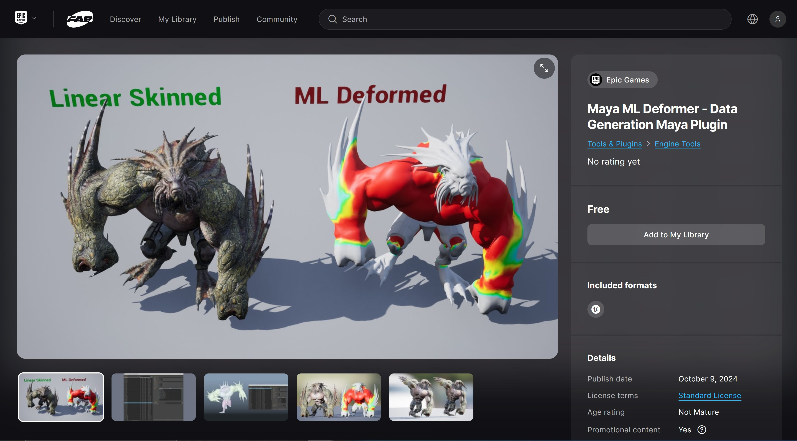
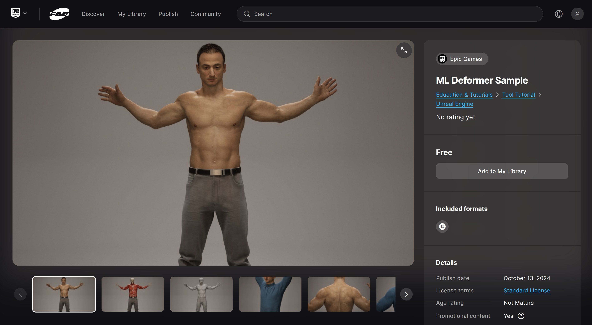
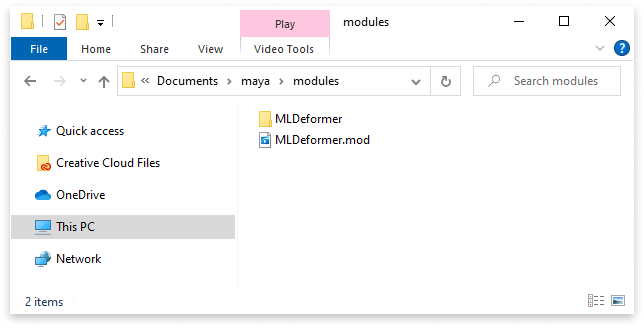
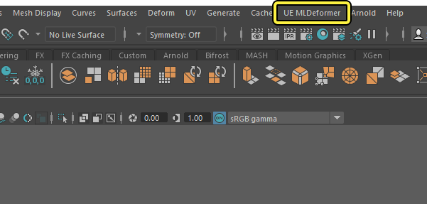
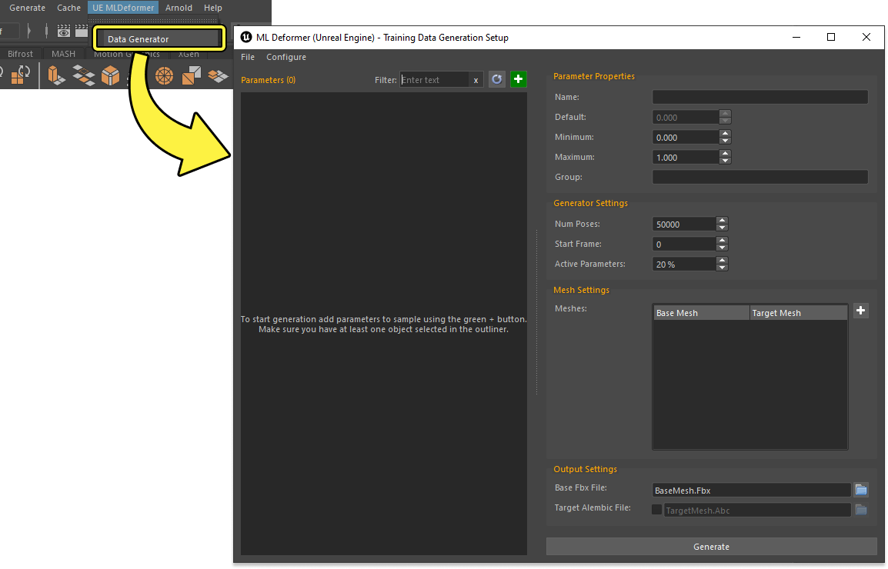
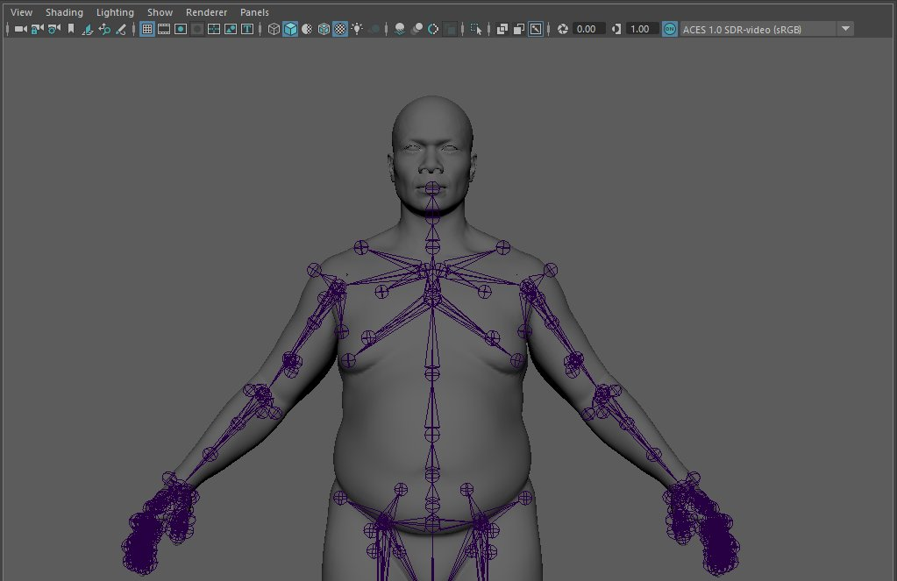

# 如何使用机器学习变形器

> 路径：虚幻引擎5.7文档 / 为角色和对象制作动画 / 骨架网格体动画系统 / 动画操作指南和示例 / 如何使用机器学习变形器

> 原始页面：https://dev.epicgames.com/documentation/unreal-engine/how-to-use-the-machine-learning-deformer-in-unreal-engine

为蒙皮[骨架网格体](../../../../working-with-content/skeletal-mesh-assets/index.md)对象创建准确的非线性变形器系统是一个复杂且计算量很大的过程，尤其是在实时计算这些变形模拟时。借助 **虚幻引擎** 的 **机器学习**（**ML**）**变形器（Deformer）** 框架，你可以使用外部预生成的网格体变形模拟数据来训练 **ML变形器模型**，以便在运行时模仿高质量网格体变形。此工作流程大幅提高了游戏内网格体变形质量的同时，无需实时变形生成所需的计算成本。

本文提供了一个示例工作流程：在Autodesk Maya中生成网格体变形模拟数据，然后在虚幻引擎中使用该数据训练 **神经变形ML变形器模型（Neural Morph ML Deformer Model）**，生成一组变形目标供框架进行选择，以便在运行时实现角色的近似网格体变形。

关于ML变形器框架、编辑器和ML变形器模型的详细概述和参考，请参阅以下文档：

- [ML变形器框架](../../animation-assets-and-features/ml-deformer-framework/index.md)

#### 先决条件

- ML变形器框架（ML Deformer Framework）

  是一款

  插件

  。你必须先启用它。在虚幻引擎菜单中导航到

  编辑（Edit）> 插件（Plugins）

  ，找到

  动画（Animation）

  部分中的

  ML变形器框架（ML Deformer Framework）

  并将其启用。启用该插件后，你需要重启编辑器。

- ML变形器神经变形模型（ML Deformer Neural Morph Model）

  是一款插件，需要启用才能使用。在虚幻引擎菜单中找到

  编辑（Edit）

  >

  插件（Plugins）

  ， 找到位于

  动画（Animation）

  分段中的

  ML变形器神经变形模型（ML Deformer Neural Morph Model）

  ， 将其启用，然后重启编辑器。

- 为了生成训练ML变形器模型所需的网格体变形数据，你必须拥有一款健壮的数字内容创建（DCC）工具，如 **Autodesk Maya**。我们提供了一款适用于Maya的插件，你可以用它为ML变形器训练流程生成必要的变形数据。但是，生成的内容可以来自任何使用脚本生成随机姿势和正确的网格体变形数据的DCC。
- 在虚幻引擎和Autodesk Maya中各有一个蒙皮角色。

#### ML变形器模型

ML变形器框架使用ML变形器模型来训练并在运行时驱动蒙皮网格体变形。 该工作流程使用神经变形模型，但你也可以选择更符合你项目目标的其他模型。每种模型都有其优点和对应的使用场景，可以通过安装其各自的插件来访问。关于不同的ML变形器模型，详见[ML变形器模型](../../animation-assets-and-features/ml-deformer-framework/index.md#ml%E5%8F%98%E5%BD%A2%E5%99%A8%E6%A8%A1%E5%9E%8B)文档。

你能以[插件](../../../../understanding-the-basics/foundational-knowledge-in/working-with-plugins/index.md)形式安装预制模型。例如在本示例中，有一部分操作需要用到ML变形器神经变形模型（ML Deformer Nural Morph Model），而你可以从"插件（Plugins）"窗口安装该模型。

- 你必须先启用

  ML变形器神经变形模型（ML Deformer Neural Morph Model）

  插件

  才能使用它。 在虚幻引擎菜单中导航到

  编辑（Edit）> 插件（Plugins）

  ，找到

  动画（Animation）

  部分中的

  ML变形器神经变形模型（ML Deformer Neural Morph Model）

  并将其启用。 启用该插件后，你需要重启编辑器。

你可以通过Fab下载[ML变形器示例项目](https://www.fab.com/listings/4c1f2eee-3004-4466-8c86-796e2e94d562)。

## Autodesk Maya插件设置

你需要下载并安装 **ML变形器 - Maya数据生成插件（ML Deformer Data Generation Maya Plugin）**。 为此，请先导航到[Maya ML变形器 - Maya数据生成插件（Maya ML Deformer - Data Generation Maya Plugin）](https://www.fab.com/listings/c3b46f42-2563-4c17-83d9-e7b573974f5b)Fab页面，然后下载插件。 这个工作流程示例使用Epic Games开发的Maya插件为角色生成随机姿势。 然而，这些生成的随机姿势可能来自任何DCC。 你也可以选择编写一个脚本，在其他DCC应用程序中生成随机姿势。

安装完插件后，它将位于虚幻引擎安装目录的 **插件** 文件夹中。 默认情况下，它位于以下路径：

`…\Engine\Plugins\Marketplace\MayaMLDeformer\Content\MayaMLDeformer.zip`

将 `MayaMLDeformer.zip` 的内容解缩压到 `C:\Users\"用户名"\Documents\maya\modules`。

> [!NOTE]
> 如果 `modules` 文件夹不存在，你可以创建一个。

现在，当你打开Autodesk Maya时，应该会在主菜单栏中看到 **UE MLDeformer**。

## 在Maya中训练数据生成

ML变形器插件为角色创建训练数据的方法是，在骨骼上设置流程性关键帧，这些关键帧将为机器学习算法生成有用的数据集。 要开始训练数据生成过程，必须首先打开该工具。

在Maya的主菜单栏中，单击 **UE ML变形器（UE ML Deformer）> 数据生成器（Data Generator）**，这将打开 **训练数据生成设置（Training Data Generation Setup）** 窗口。

还要在Maya场景中导入或打开你的蒙皮角色。 对这个示例来说，我们将使用[MetaHuman](https://docs.metahuman.unrealengine.com/en-US)。

### 添加骨骼参数

为了训练关节，你必须添加要修改的一系列节点和属性，以及这些属性的可用值范围。

选择你想添加的所有网格体的关节，然后单击 **训练数据生成设置（Training Data Generation Setup）** 窗口的 **参数（Parameters）** 部分中的 **添加 (+)（Add (+)）**。

> 图片已省略：add bone parameter to training data generation setup using green add button

选中网格体的关节并选择 **添加（Add）**（**+**）后，**添加参数（Add Parameters）** 窗口将打开，你可以在其中进一步优化你想在训练中使用的关节属性。 还可以单击 **刷新（Refresh）**，使用当前选择的内容来刷新参数列表。

> 图片已省略：add parameters maya window specify motion methods for data generation

选择你想添加为参数的关节属性，然后单击 **添加所选参数（Add Selected Parameters）** 将其添加到"训练数据生成设置（Training Data Generation Setup）"中。 在大部分情况下，关节中只有旋转属性是必要的。

> 图片已省略：add parameters maya window specify rotation methods for data generation

> [!NOTE]
> 可以使用 **属性筛选器（Attributes Filter）** 部分来自动优化和排除属性。 单击 **添加 (+)（Add (+)）** 以添加新条目并根据想要排除的属性来命名。 在这个示例工作流程中，将以下条目添加到列表中：lockInfluenceWeights、scaleX、scaleY、scaleZ、translateX、translateY、translateZ、visibility、dropoff和smoothness。
>
> > 图片已省略：add parameters maya window specify methods for the ignore list data generation

### 配置骨骼参数

添加完属性后，现在需要配置每个轴的移动范围。 具体做法是，选择每个属性，并在 **参数属性（Parameter Properties）** 中指定该轴的 **最小（Minimum）** 和 **最大（Maximum）** 移动范围。 这些值应当尽可能切合实际，具体视角色的复杂度和类型而定。 需要定义此数据，才能保障ML变形器训练过程的准确性和质量。 该插件会自动将这些值初始化为Maya中配置的关节限制（如果为该关节设置了这些限制）。 还可以提供给定参数类型的默认值。

> 图片已省略：set minimum and maximum rotation values -45 and 45

> [!NOTE]
> 正确配置这些参数可能很耗时，因此建议单击 **文件（File）> 保存配置（Save Config）**，将进度保存为`.json`文件。
>
> > 图片已省略：save config using file save config
>
> 可通过选择 **文件（File）> 加载配置（Load Config）** 来恢复保存的配置。 配置文件基于节点和属性名称，并且可以在带有匹配名称的Maya场景中使用。

### 配置网格体

要完成训练数据，必须指定 **基础网格体（Base Mesh）**，还可以选择指定 **目标网格体（Target Mesh）**。

**基础网格体（Base Mesh）** 是绑定到骨架的网格体，与整个虚幻引擎中使用的骨骼网格体资产相同，并将使用线性蒙皮。

**目标网格体（Target Mesh）** 是一个单独的网格体，包含与基础网格体相同的顶点和拓扑，但用于变形。 例如，目标网格体可能使用体积保留技术和肌肉模拟来创建逼真的变形。 目标网格体可以存在于Maya中，也可以在Houdini等外部程序中创建。 目标网格体导出为Alembic缓存`.abc`。

要指定基础和目标网格体，请单击 **网格体设置（Mesh Settings）** 区域中的 **添加 (+)（Add (+)）**。 界面上将显示一个窗口，你可以在其中单击 **选择（Select）** 按钮并指定每个网格体，目标网格体是可选的，除非你的场景中有它。

> 图片已省略：select base mesh using add button

选择你的网格体并单击 **确定（OK）**，将其添加到网格体设置列表中。

> 图片已省略：select base lod 0

> [!NOTE]
> 如果你的骨骼网格体由多个网格体组成，应当将每个单独的网格体添加到网格体设置列表中。 通常，仅当你使用[模块角色](../working-with-modular-characters/index.md)时才需要这样做。

### 开始生成姿势

最后，必须指定 **生成器设置（Generator Settings）** 以确定训练长度和配置。 将为每个 **姿势数量（Num Poses）** 的参数列表中的每个属性创建一个关键帧。

> 图片已省略：select generator settings

| 名称 | 描述 |
| --- | --- |
| **姿势数量（Num Poses）** | 要创建的随机姿势的数量，用于为这些帧创建动画。 推荐的范围是 **5000 - 25000**，但在通常情况下，可以将其设置为 **15000**。 训练需要大量数据才能得到好的结果。 预计需要大约15000帧的动画数据，以对应于虚幻中的默认训练设置。 尽管可以用较小的数据集进行训练，但结果可能较差。 姿势数量（Num Poses）值越高，训练就越慢。 可以从较小的值（如5000）开始，看看是否已经获得了好的结果。 |
| **开始帧（Start Frame）** | 随机生成的姿势将从此帧号开始。 可以设置一个大于0的值，将现有动画数据与生成的帧组合起来。 |
| **活动参数（Active Parameters）** | 每个帧之间姿势的随机数值。 大多数情况下，应当将其设置为 **75%** 左右，值越高，质量越好。 但是，将其设置为 **100%** 可能会导致模拟问题。 值为100意味着参数列表中的每个属性都将在每一帧随机化，而值为40则意味着每一帧只有40%的参数会进行随机化。 |

单击 **生成（Generate）**，在Maya中开始训练数据生成过程。 如果使用 **目标网格体（Target Mesh）** 和 **目标Alembic文件（Target Alembic File）**，则该过程可能需要特别长的时间。 还要确保具有足够的可用磁盘空间，因为Alembic文件可能会变得非常大（大约50到100 GB），具体取决于顶点计数和姿势数量（Num Poses）设置。

> 图片已省略：generate mesh deformations using generate button

如果指定的是 **目标Alembic文件（Target Alembic File）**，训练数据的生成完成后，你应该拥有导出的`.fbx`和`.abc`文件。

> 图片已省略：finished generating training data files saved to local computer

> [!NOTE]
> FBX和Alembic文件必须包含相同数量的帧，并且每个帧必须对应于相同的骨骼姿势。

## 虚幻引擎中的ML变形器资产设置

现在，可以将完成的训练文件导入虚幻引擎。

### 导入Alembic文件

首先导入你在训练过程中创建或位于其他外部变形器工具中的`.abc`文件。 在 **内容浏览器（Content Browser）** 中，单击 **导入（Import）**，然后选择你的`.abc`文件并单击 **打开（Open）**。

> 图片已省略：import alembic file to unreal engine using the import button

在导入设置对话框窗口中，为导入设置以下参数：

- 将 **导入类型（Import Type）** 设置为 **几何体缓存（Geometry Cache）**。
- **禁用展平轨道（Disable Flatten Tracks）**。 这样做才能将FBX网格体与Alembic几何体缓存轨道相匹配。 如果你只有一个网格体，可以让展平轨道（Flatten Tracks）保持启用状态，但这不是必需的。 务必确保你的Alembic轨道名称以你在Maya的大纲视图中看到的名称开始。
- 将 **压缩位置精度（Compressed Position Precision）** 设置为 **0.001** 以确保更高的准确性。 如果保留默认值，ML变形器可能会学习因压缩引入的错误。
- **启用存储导入的顶点数量（Enable Store Imported Vertex Numbers）**。 这样做才能在骨骼网格体和几何体缓存之间匹配顶点。 如果你忘记这样做，ML变形器编辑器将显示警告，你必须再次重新导入几何体缓存。

> 图片已省略：set alembic cache import option in unreal engine

设置好这些参数后，单击 **导入（Import）** 以导入几何体缓存。 鉴于Alembic文件的大小，此过程可能需要很长的时间。

### 导入训练的FBX

接下来，需要导入通过Maya训练数据创建的FBX文件。 在 **FBX导入选项（FBX Import Options）** 对话框窗口中，为导入设置以下参数：

- 如果你已将角色导入虚幻引擎，请设置 **骨架（Skeleton）** 字段以使用该角色的骨架。
- **启用导入动画（Enable Import Animations）**。
- 将 **动画长度（Animation Length）** 设置为 **导出的时间（Exported Time）**。

> 图片已省略：set fbx import option in unreal engine

设置好这些参数后，单击 **导入（Import）** 以导入FBX。 鉴于FBX文件的大小，此过程可能需要很长的时间。

### 创建ML变形器资产

接下来，必须创建 **ML变形器资产**，以便包含并关联Alembic和FBX序列。 在 **内容浏览器（Content Browser）** 中，使用 **添加(+)（Add (+)）** 选择 **动画（Animation）> 变形器（Deformers）> ML变形器（ML Deformer）**。 指定资产的 **名称（Name）** 并打开该资产。

> 图片已省略：create ml deformer asset using add animation deformers ml deformer

打开ML变形器资产后，可以选择用于训练角色网格体变形的资产的数据模型。 所选模型将对最终效果产生非常重大的影响。

| ML变形器模型 | 描述 |
| --- | --- |
| **神经变形模型（Neural Morph Model）**（**NMM**） | 这个模型在处理肉感网格体和一般变形（如体积保留变形或其他校正）时效果最好。 建议默认使用此模型。 |
| **最近的相邻模型（Nearest Neighbor Model）**（**NNM**） | 这个试验性模型是为布料变形设计的。 有关"最近邻模型（Nearest Neighbor Model）"的更多信息，请参阅[最近邻模型EDC博文](https://dev.epicgames.com/community/learning/tutorials/2lJy/unreal-engine-nearest-neighbor-model)。 |
| **顶点增量模型（Vertex Delta Model）**（**VDM**） | 这个模型是一个示例模型，可用于学习如何创建自己的变形器模型。 不应在生产中使用此模型。 |

使用下拉菜单，确保选中 **神经变形模型（Neural Morph Model）**，并确保"ML变形器模式（ML Defromer Mode）"设置为 **训练（Training）**。

> 图片已省略：select the neural morph model and training modes for the ml deformer asset

在 **ML变形器编辑器（ML Deformer Editor）** 的 **细节（Details）** 面板中，将角色的骨骼网格体和导入的已训练FBX动画序列指定给其各自的属性。 这将导致网格体显示在 **训练基础（Training Base）** 视口标签下。

> 图片已省略：select skeletal mesh and generated animation sequence in the ml deformer assets details panel

此外，将从Alembic文件导入的几何体缓存资产指定给 **几何体缓存（Geometry Cache）** 属性。 这将导致目标网格体同时显示在"训练目标（Training Target）"标签下的视口中。

> 图片已省略：select geometry cache asset in the ml deformer assets details panel

"训练基础（Training Base）"模型的网格体上将出现绿色的调试渲染。 此渲染表示基础和目标网格体之间的增量或差值。 确保渲染看起来正确无误，因为变形器模型将在训练期间通过这些增量学习。 如果与训练基础相比，目标网格体有所旋转或以其他方式偏移，可以使用 **对齐变换（Alignment Transform）** 将其对齐。 它们不需要重叠，只要旋转和缩放相匹配即可。

拖动时间轴播放头会将两个序列一起推移，这样可以验证其动画姿势是否匹配。 确保你预览的每一帧的绿色调试渲染（增量）看起来都正确无误。

> 动图已省略：scrubbing animation sequence with training base and training mesh

## 训练网格体变形

在使用神经变形模型（Neural Morph Model）训练数据模型创建和设置ML变形器资产后，可以通过设置输入来影响和控制经过训练的网格体变形的结果。

### 设置输入和输出

借助ML变形器资产中 **细节（Details）** 面板的 **输入和输出（Inputs and Outputs）** 部分，可以通过为了更好地训练模型而参考的网格体骨架来指定骨骼或曲线。 ML变形器将使用所选骨骼的旋转或曲线的增量来学习如何变形网格体。

> [!NOTE]
> 使用骨骼输入时，建议从训练中排除 **扭曲（Twist）** 和 **滚动（Roll）** 旋转以及其他辅助骨骼。 此外，变形训练只使用指定的骨骼旋转值，因此骨骼 **平移** 或 **缩放** 数据不影响训练效果。 在ML变形器很难近似模拟目标变形的区域，骨架仍可以包含这些类型的辅助骨骼。

可以通过（**+**）添加，然后从下拉菜单中选择骨骼，在 **骨骼包含列表（Bone Include List）** 属性中手动指定骨骼。

或者，也可以通过 **仅限动画骨骼（Animated Bones Only）** 按钮，使用包含动画数据的所有骨骼网格体的骨骼来自动填充"骨骼包含列表（Bone Include List）"属性。

> 图片已省略：select animated bones in the ml deformer assets details panel

但是，如果未从自动生成的列表中删除任何骨骼，骨架中的所有骨骼都将被用作输入。 这通常不会实现最好的变形效果，因此，建议你只指定变形所依赖的最小骨骼集。

> [!NOTE]
> 例如，你可能想要从 **骨骼包含列表（Bone Include List）** 中排除指骨，以便不执行复杂的手部网格体变形。 身体较小部位（如手或脚）的复杂变形对网格体外观的整体效果影响不大，并且可能需要大量的计算和资源。 线性蒙皮仍然与ML变形器一起在网格体上执行，因此从"骨骼包含列表（Bone Include List）"中排除的骨骼仍然会像往常一样变形。

与骨骼输入类似，你还可以提供一组输入[曲线](../../animation-assets-and-features/animation-sequences/animation-curves/index.md)来影响网格变形训练。 借助曲线，你可以使用骨骼旋转以外的数据来影响变形训练。 例如，曲线在处理面部动画时很有用，你可以用曲线值来控制眼皮的张开或闭合程度，或左眉头的抬起程度。

### 设置骨骼和曲线组

神经变形模型的 **局部模式（Local Mode）** 主要着眼于由单个骨骼引起的变形。 如果网格体某些部分的变形依赖于多个骨骼或曲线，这可能会造成一些问题。 例如，角色的背部区域可能会受左右锁骨的影响。

为了适应这一点，"局部模式（Local Mode）"中的"神经变形模型（Neural Morph Model）"支持使用 **骨骼组（Bone Groups）** 和 **曲线组（Curve Groups）**。 可以使用这些组来创建一组骨骼或曲线，让它们协同工作以创建更逼真的变形。 例如，创建一个骨骼组以便容纳角色的锁骨时，可以使用（**+**）**添加（Add）** 创建一个新的骨骼组，然后使用下拉菜单选择 **上臂（Upper Arm）** 和 **脊柱（Spine）** 骨骼。

这是一个示例图像，显示了一个由左股骨和右股骨组成的骨骼组。

> 图片已省略：example bone group

每个骨骼组或曲线组都会生成与 **每个骨骼/曲线的变形目标数量（Num morph targets Per bone / curve）** 属性定义的数量相同的变形目标。

### 训练模型

在ML变形器编辑器的 **细节（Details）** 面板中，将训练设置的"模式（Mode）"属性设置为 **局部（Local）**。

> [!NOTE]
> 默认情况下，使用神经变形模型创建新的ML变形器资产时，"模式（Mode）"属性将被设置为"局部（Local）"。

> 图片已省略：set the training mode to local in the detail panel

训练设置 **模式（Mode）** 可以彻底改变变形器的工作方式和可以使用的变形类型。 训练变形器模型时，可从下列模式中选择：

| 训练设置模式 | 描述 |
| --- | --- |
| **局部（Local）** | 这种模式被优化为学习单个关节周围的变形，需要的训练数据量最少。 默认情况下应使用此选项，除非在重建训练数据时遇到困难。 每个骨骼或曲线都将在这个模型中创建一组变形目标。 生成的变形目标总数为： `(num_bones + num_bone_groups) * num_morphs_per_bone_or_curve + (num_curves + num_curve_groups) * num_morphs_per_bone_or_curve + 1` 末尾的`+ 1`是始终都会创建的一个变形目标，用于数据的标准化。 它始终是生成的变形目标列表中的第一个变形目标。 "局部（Local）"模式可以处理结构化数据，例如结构化ROM，比 **局部（Local）** 模式更好。 |
| **全局（Global）** | 此模式从多个关节的协调运动中学习变形，但需要更多的训练数据。 此模式的行为方式与局部模式类似，但更像所有骨骼都在一个大的骨骼组里。 如果训练数据为随机姿势，这种模式就最有效。 |

设置完训练设置模式后，在ML变形器编辑器工具栏中选择 **训练模型（Train Model）** 按钮开始训练。

> [!WARNING]
> 这个过程可能需要很长时间，具体取决于网格体和训练数据的复杂程度。

> 图片已省略：use the train model button to train the ml deformer asset

模型的训练过程完成后，你可以使用ML变形器资产的 **压缩（Compression）** 设置（位于 **细节（Details）** 面板中）内包含的属性，减少整体的内存使用并提高变形器资产的性能。

> 图片已省略：set the ml deformer compression settings in the details panel

"压缩（Compression）"设置列表及相关功能描述如下：

| 属性 | 描述 |
| --- | --- |
| **增量零阈值（Delta Zero Threshold）** | 你可以使用此属性设置一个阈值，以厘米（**cm**）为单位，以忽略长度低于设定值的增量。 训练模型时，这些小的增量可能对我们看到的变形质量没有太大的影响。 设定值将删除长度小于给定值的所有增量，因而能够显著减少项目所需的内存量并提高GPU性能。 阈值越高，删除的增量就越多；阈值越小，忽略的增量就越少。 如果阈值为0，将使用所有增量，质量也最高，但使用的内存量最多，性能也最慢。 建议在保持变形目标的视觉保真度的同时，尽可能增大这个值。 使用ML变形器资产时，为这个属性设置一个函数值，会对项目的运行时性能和内存产生非常显著的影响。 |
| **压缩级别（Compression Level）** | 你可以使用这个属性来压缩ML变形器资产的增量。 值越高，压缩率就越高，但质量也越低。 建议在保持变形目标的视觉质量的同时，尽可能增大这个值。 调整"压缩级别（Compression Level）"属性之前，最好先将项目的 **增量零阈值（Delta Zero Threshold）** 属性的值设得足够大。 |

可以通过在ML变形器编辑器的 **细节（Details）面板** 中导航至 **统计数据（Statistics）** 属性部分，监控压缩设置的效果。

> 图片已省略：monitor the ml deformers memory usage in the statistics panel

**CPU性能（CPU Performance）**、**模型 - 已烘焙（Model - Cooked）** 和 **GPU内存（GPU Memory）** 统计数据能够让你深入了解ML变形器资产在游戏中的性能。 与ML变形器资产相关的可用 **内存（Memory）** 和 **性能（Performance）** 统计数据列表及相关功能描述如下：

> [!NOTE]
> 所列值均为估计值，实际值可能会有所不同。

| 统计数据 | 描述 |
| --- | --- |
| **CPU性能（CPU Performance）** | 此处列出的CPU性能以微秒（**μs**）为单位，因此，值`100`即表示`0.1`毫秒。 然而，大部分计算时间都将在GPU上发生，可以在 **GPU内存（GPU Memory）**（**变形目标(Morph Targets)**）属性中或通过使用 **变形目标（Morph Targets）** 类目的[Unreal Insights](../../../../testing-and-optimizing-content/unreal-insights/index.md)进行查看。 |
| **主内存（Main Memory）** | **模型 - 已烘焙（Model - Cooked）**：显示ML变形器模型在烘焙时使用的估计内存量，以兆字节（**mb**）为单位。 **模型 - 在编辑器中（Model - In Editor）**：显示ML变形器模型在编辑器中使用的估计内存量，以兆字节（**mb**）为单位。 |
| **GPU内存（GPU Memory）**（**变形目标(Morph Targets)**） | 显示ML变形器模型在运行时在GPU上使用的视频内存数量，以兆字节（**mb**）为单位。 监控ML变形器的内存使用情况时，这个统计数据是最重要的。 |

训练过程完成后，你可以在ML变形器的 **测试（Testing）** 模式下查看结果。

> 图片已省略：view the ml deformer results using the testing mode in the toolbar

可以在 **可视化（Visualization）** 面板中调整 **权重（Weight）** 属性，观察ML变形器网格体（右侧）相较于线性蒙皮网格体（左侧）的效果。

> 动图已省略：set weight to view ml deformer results in the visualization panel

启用 **显示热图（Show Heat Map）** 属性，并调整 **可视化（Visualization）** 面板中的热图选项，查看ML变形器所变形的网格体区域的直观表示。

> 图片已省略：use the heat map properties to view results in the visualization panel

## 变形器蓝图设置

为了开始在关卡中的角色上使用ML变形器，你需要使用蓝图中的 **ML变形器组件** 来设置该角色。

首先创建一个 **Actor蓝图**。 在 **内容浏览器（Content Browser）** 中，点击 **添加(+)（Add (+)）** > **蓝图类（Blueprint Class）**，然后选择 **Actor**。 在创建蓝图后将其打开。

> 图片已省略：create a new blueprint actor

将你的骨骼网格体从内容浏览器（Content Browser）拖入 **组件（Components）** 面板，以将其添加到蓝图中。

> 图片已省略：add skeletal mesh to actor blueprint

接下来，单击 **组件（Components）** 面板中的 **添加(+)（Add (+)）** 并选择 **MLDeformer**，以添加 **MLDeformer组件（MLDeformer Component）**。

> 图片已省略：add ml deformer component to actor blueprint

选择 **MLDeformer组件（MLDeformer Component）** 并在 **细节（Details）** 面板中指定你的 **ML变形器资产（ML Deformer Asset）**。

> 图片已省略：add ml deformer asset to ml deformer component in the details panel

最后，选择 **骨骼网格体组件（Skeletal Mesh Component）** 并在 **网格体变形器（Mesh Deformer）** 属性中指定 **变形器图表（Deformer Graph）**。

> 图片已省略：add ml deformer graph to the skeletal mesh component in the details panel

> [!NOTE]
> 如果没有变形器图表（Deformer Graph），可以使用位于 **引擎（Engine）> 插件（Plugins）> MLDeformer内容（MLDeformer Content）> 变形器（Deformers）** 内容文件夹中的示例 **DefaultMLDeformerGraph**。 要访问此文件夹，请单击内容浏览器（Content Browser）中的 **设置（Settings）**，并启用 **显示引擎内容（Show Engine Content）** 和 **显示插件内容（Show Plugin Content）**。
>
> > 图片已省略：set content browser filter to show engine content and show plugin content

## 更多信息

有关虚幻引擎中ML变形器系统的更多信息，请参阅以下资源。

### ML变形器框架

关于ML变形器框架、编辑器和ML变形器模型的详细概述和参考，请参阅以下文档：

- [ML变形器框架](../../animation-assets-and-features/ml-deformer-framework/index.md)

### ML变形器示例项目

一个交互式示例项目，可以观察不同模型和编辑会如何影响MetaHuman的ML变形器网格体变形，具体请参阅[ML变形器示例项目](https://unrealengine-gamedev.ol.epicgames.net/marketplace/en-US/product/ml-deformer-sample)。

### 最近邻模型相关资源

有关最近邻ML变形器训练模型的更多信息，请参阅[EDC上的最近邻模型博文](https://dev.epicgames.com/community/learning/tutorials/2lJy/unreal-engine-nearest-neighbor-model)。

### 游戏开发者大会ML变形器演示

要了解有关ML变形器系统的更多信息并观看展示ML变形器功能的在线演示，请查看[Unreal | GDC 2023的现状](https://www.youtube.com/live/teTroOAGZjM?feature=share&t=19000)讲座。
