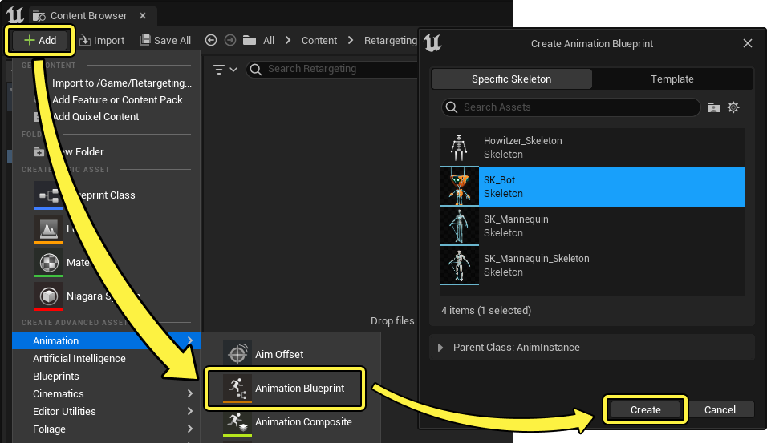
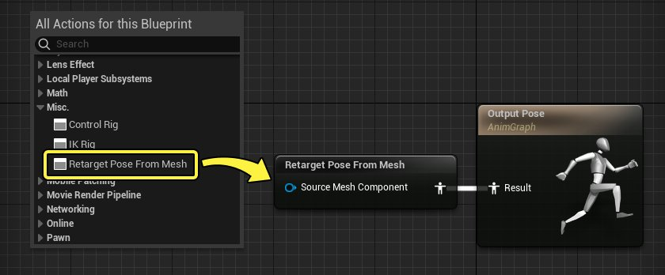
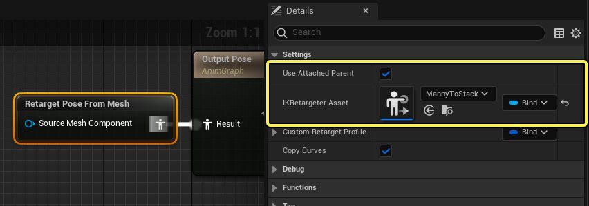
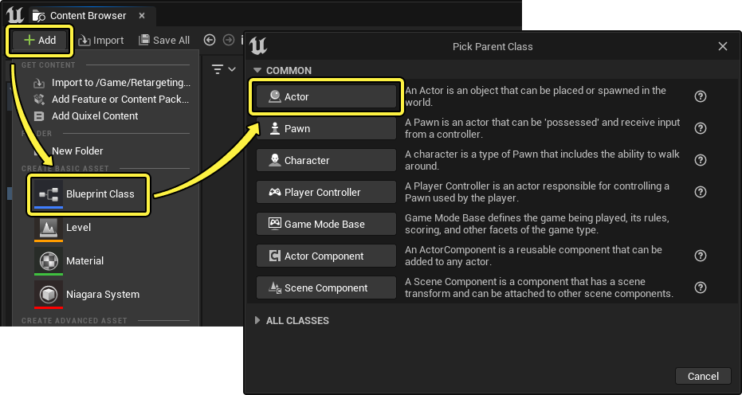
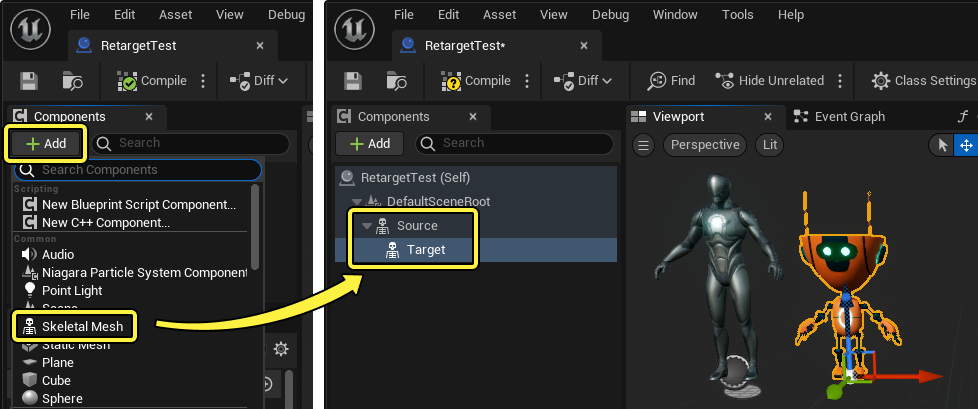
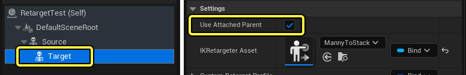
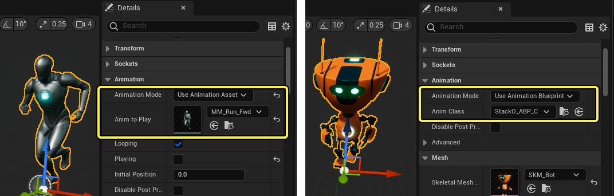
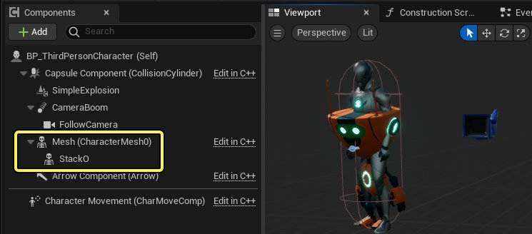

# 运行时IK重定向

> 路径：虚幻引擎5.7文档 / 为角色和对象制作动画 / 骨架网格体动画系统 / 动画操作指南和示例 / 运行时IK重定向

> 原始页面：https://dev.epicgames.com/documentation/unreal-engine/runtime-ik-retargeting-in-unreal-engine

使用[IK重定向](https://dev.epicgames.com/documentation/404)对角色进行重定向时，可以在运行时会话中进行重定向。这意味着你可以重定向至其它角色，而不需要生成新的[动画序列](../../animation-assets-and-features/animation-sequences/index.md)，也不需要[Live Link](../../live-link/index.md)会话。

该文档将介绍如何使用 **IK重定向（IK Retargeting）** 和 **从网格体重定向姿势（Retarget Pose From Mesh）** 来时角色重定向到另一个角色。

#### 先决条件

- 你已经创建好一个在角色之间重定向的

  IK重定向器资产（IK Retargeter Asset）

  。参考

  使用IK Rig重定向两足角色

  页面来了解如何操作。
- 虽然并不强制要求，但是你的角色应该能够由游戏控制，从而方便你在运行时预览重定向的效果。你可以使用

  第三人称模板

  ，其中包含一个可操控的Mannequin。

## 动画蓝图设置

第一个主要的步骤是为目标角色创建一个[动画蓝图](../../animation-blueprints/index.md)。在该示例中，Mannequin将要重定向至Stack-O-Bot，所以要为Stack-O-Bot创建一个新的 **动画蓝图（Animation Blueprint）** 以及一个 **从网格体重定向姿势节点（Retarget Pose From Mesh Node）**。

在[内容浏览器](../../../../understanding-the-basics/content-browser/index.md)中，点击 **添加 (+)**，然后选择 **动画 > 动画蓝图（Animation > Animation Blueprint）**。在接下来的窗口中，选择目标 **骨骼网格体（Skeletal Mesh）** 然后点击 **创建（Create）**。命名你的动画蓝图资产并且双击将其打开。

接下来，在[动画图表](../../animation-blueprints/graphing-in-animation-blueprints/index.md)中右键点击，然后选择 **Misc. > 从网格体重定向姿势（Retarget Pose From Mesh）** 来创建该节点，然后将其连接到 **输出姿势（Output Pose）**。

选中 **从网格体重定向姿势（Retarget Pose From Mesh）** 节点并确保设置了以下属性：

- 启用 **使用附加的父级（Use Attached Parent）**。 这样可以简化内容设置，不需要手动找到并分配 **源骨骼网格体组件（Source Mesh Component）**。
- 将 **IK重定向器资产（IKRetargeter Asset）** 设置为你在[先决条件](#prerequisites)部分创建的IK重定向器资产。

## 蓝图设置

在接下来的步骤中，你将要在同一个蓝图中设置源和目标角色，并且将上一步中创建的动画蓝图分配到目标角色上。

首先，在 **内容浏览器（Content Browser）** 中点击 **添加（+）** 来创建一个新的 **Actor蓝图（Actor Blueprint）**，然后选择 **蓝图类（Blueprint Class）** 并且点击 **Actor**。为蓝图资产命名，然后双击将其打开。

在 **蓝图（Blueprint）** 的 **组件（Components）** 面板中，点击 **添加 (+)** 并且添加两个 **骨骼网格体组件（Skeletal Mesh Components）**，一个用于源，另一个用于目标。在 **细节（Details）** 面板中将 **骨骼网格体资产（Skeletal Mesh Asset）** 属性指定到每个组件相应的骨骼网格体资产。

> [!NOTE]
> 如果你的目标动画蓝图中启用了 **使用附加的父级（Use Attached Parent）**，那么目标骨骼网格体必须设为源组件的子级才能让重定向正常运作。这是因为该设置要使用父级组件作为源。
>
> 

选中你的源角色，将 **动画模式（Animation Mode）** 设置为 **使用动画资产（Use Animation Asset）**，然后将一个动画指定给 **要播放的动画（Anim to Play）**。接下来，选中你的目标角色并且将之前创建的动画蓝图指定给 **动画类（Anim Class）**。

现在你应该能在蓝图视口中看到目标角色重定向到源角色。

> 动图已省略：retargeting results in blueprint

## 角色蓝图示例

取决于你项目的需求，运行时重定向可以用于在不同的角色上设计游戏动画。在该示例中， **第三人称模板** 角色蓝图经过修改，将Stack-O-Bot加入了其中。

之后你可以创建逻辑，来切换不同角色间的 **可视性（Visibility）**，从而在游戏场景中预览重定向的结果。

> 动图已省略：gameplay example

> [!NOTE]
> 如果你将源角色隐藏，那么必须在 **优化（Optimizations）** 分类下将 **基于动画tick的可视性选项（Visibility Based Anim Tick Option）** 设置为 **固定tick姿势和刷新骨骼（Always Tick Pose and Refresh Bones）**。
>
> > 图片已省略：always tick pose and refresh bones
