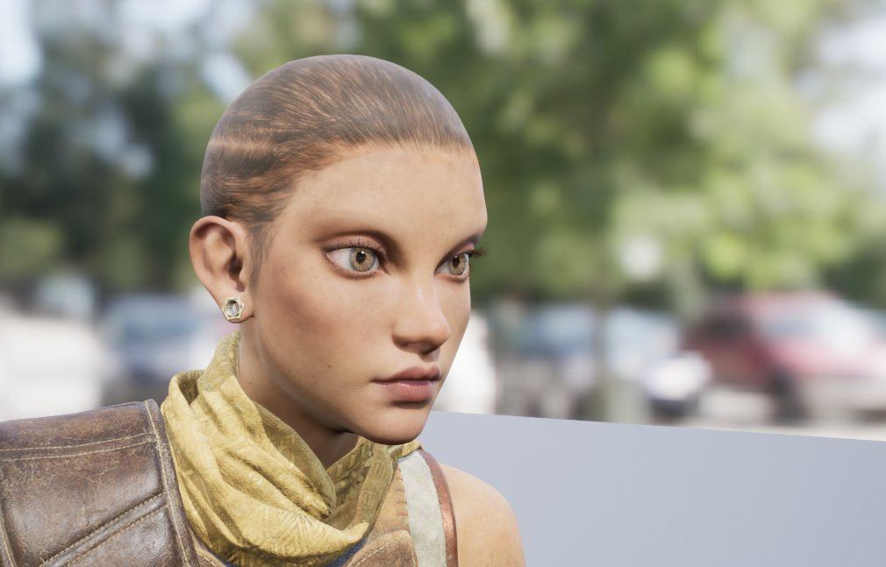
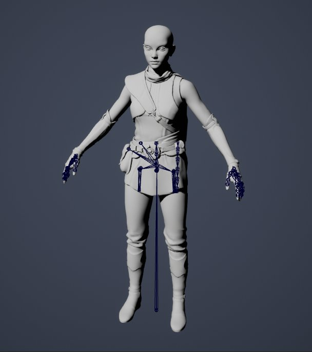
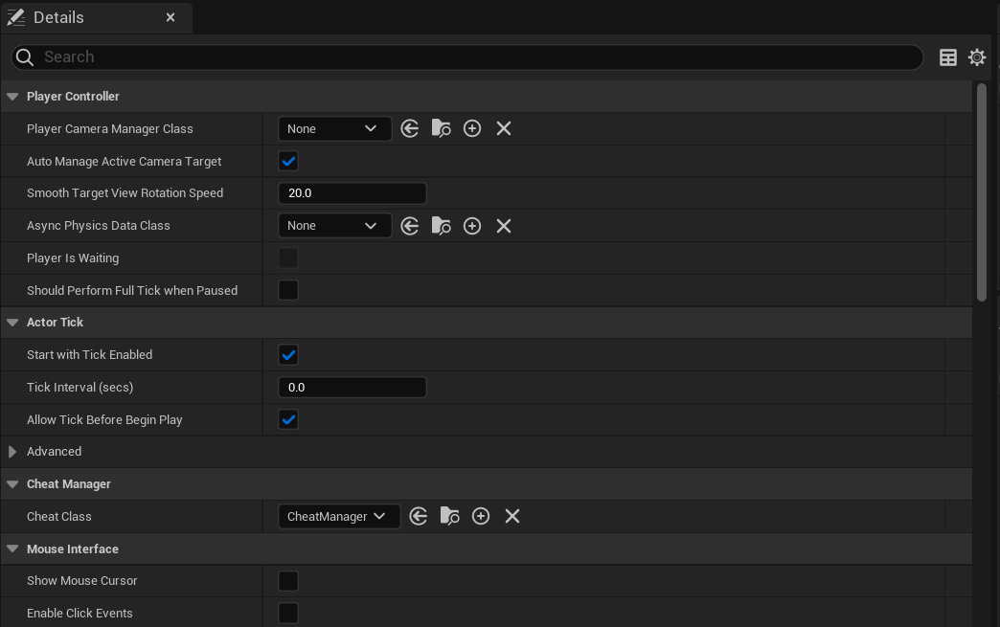
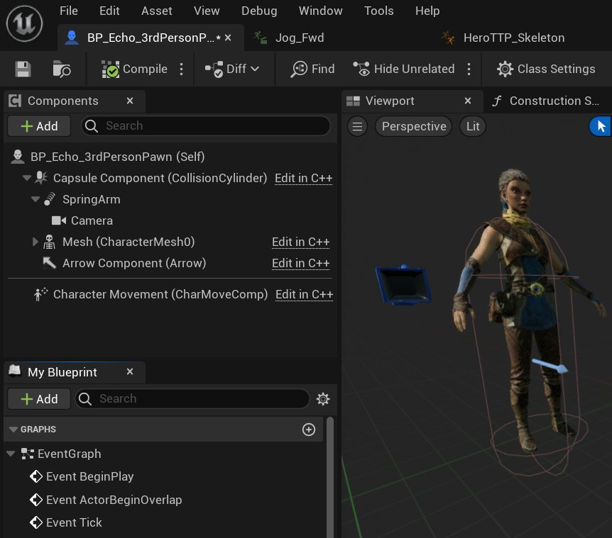
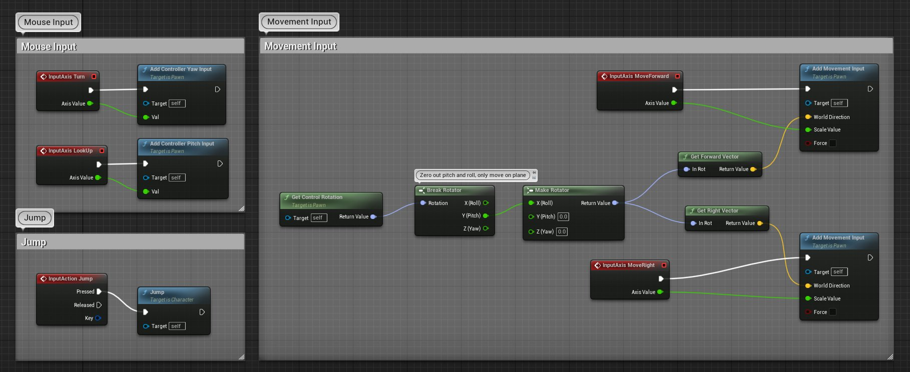
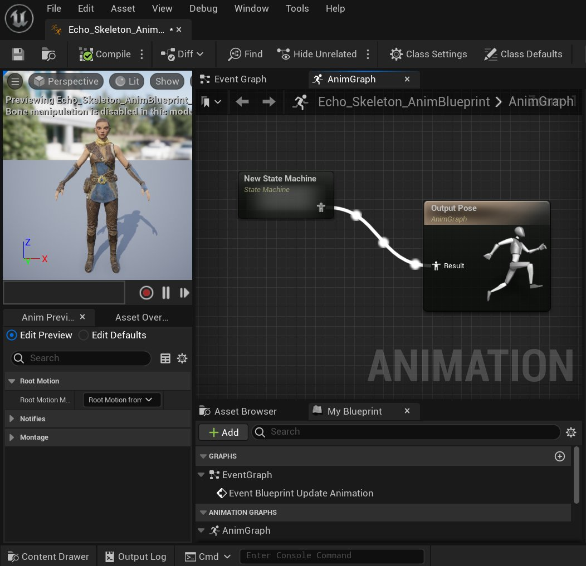
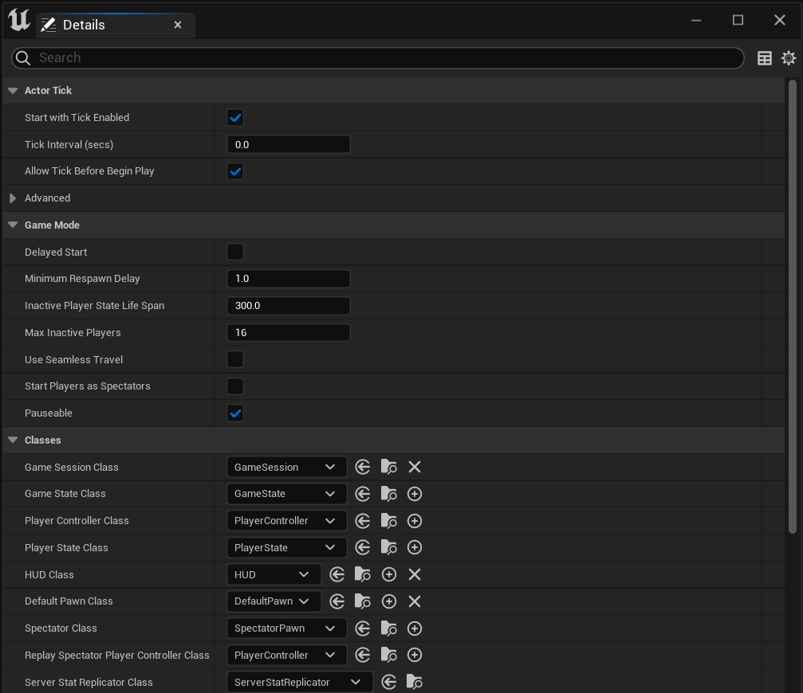

# 设置角色

> 路径：虚幻引擎5.7文档 / 为角色和对象制作动画 / 骨架网格体动画系统 / 动画操作指南和示例 / 设置角色

> 原始页面：https://dev.epicgames.com/documentation/unreal-engine/setting-up-a-character-in-unreal-engine

无论你的游戏项目或类型是什么，很可能在某个时候都需要一些动画角色在环境中移动。这可能是玩家控制的角色，也可能是某个AI驱动的实体，以某种方式与世界场景交互。无论如何，你需要知道如何设置这些角色，以便它们能够在你的世界场景中以动画的形式适当地表现出来。本文旨在向你提供有关如何实现这一点的高级概述，同时指导你使用专门的文档和示例了解具体细节。基于此目的，我们将假设你想要创建一个玩家能够以某种方式控制的角色。

> [!NOTE]
> 在整个文档中，我们将引用可以使用蓝图完成的各种脚本操作。任何可以在蓝图中完成的工作也可以在C++中完成，所以你不应该仅仅局限于蓝图可视化脚本。本文档的最后一部分包含对示例内容的引用，这些内容以C++和蓝图的形式显示了设置。

> [!TIP]
> 你还可以在1.10节的[动画内容示例](../../../../samples-and-tutorials/content-examples-sample-project/index.md)页面中找到可操作角色Owen的示例。

## 工作流程概览

虚幻引擎中角色设置的主要工作流程如下：

1. 创建你的美术资产（骨架网格体）和动画，使用第三方数字内容创建（DCC）包，如3ds Max或Maya。
2. 通过为新的骨架网格体创建新的骨架资产，或者为相同或类似的骨架网格体重用现有的骨架资产，来将骨架网格体和动画导入UE。
3. 创建玩家控制器脚本或蓝图来处理来自玩家的输入。
4. 为角色或Pawn创建一个蓝图或脚本或蓝图来解析输入并控制角色的实际移动（不是骨架动画）。
5. 为角色构造动画蓝图。
6. 创建一个使用自定义玩家控制器和任何其他自定义脚本资产的游戏模式脚本或蓝图。
7. 运行你的游戏！

这些步骤中的每一步通常都需要各种各样的子步骤才能完全成功。此列表只是给出了流程的一般概念。在下面的部分中，我们将进一步详细介绍这些步骤的意义以及如何应用它们。

## 创建美术资产

在很多方面，创建你的美术资产可能是角色开发过程中最具挑战性的部分。通常，在你使用虚幻引擎之前，必须先花大量时间进行设计、建模、表面处理、绑定和动画化。虽然我们不能教你角色设计和动画的细微差别，但我们有一些工具可以帮到你。

## 导入骨架网格体

> [!NOTE]
> 更多信息请参阅[FBX导入](../../../../working-with-content/fbx-content-pipeline/fbx-import-options-reference/index.md) and [骨架网格体](../../../../working-with-content/skeletal-mesh-assets/index.md)文档。

在创建动画角色的过程中，将骨架网格体正确导入UE4是非常重要的一步。虚幻引擎包含一个强大的导入系统，具有多种选项以加快导入过程。

## 创建玩家控制器

玩家控制器是一种特殊类型的脚本或蓝图，其主要目的是将来自玩家的输入解析为可以驱动角色的事件。例如，它可以控制如何让向上移动控制器上的模拟杆触发一件事件，并最终用于推动角色在屏幕上前进。

玩家控制器已是虚幻引擎中一个现有的类。在编辑器中，你可以使用玩家控制器的父类创建一个新蓝图，然后使用它来设置你自己的事件，这些事件将根据玩家的输入发生。

以自定义蓝图玩家控制器为例，你可以在编辑器中启动一个新项目（**文件（File）> 新项目（New Project）**）并查看 **Blueprint Top Down** 模板。所有基于蓝图的模板都将包含某种类型的玩家控制器（默认的玩家控制器或玩家控制器蓝图），不过如果你希望看到使用玩家控制器的自定义应用程序，则 **Blueprint Top Down** 模板是最直接的方法。

在新项目中，你可以在 **类查看器（Class Viewer）** 中搜索玩家控制器，关闭 **类查看器（Class Viewer）** 中的过滤器。双击此资产将打开它，然后你可以自行查看设置。

通过创建一个新项目（**文件（File）> 新项目（New Project）**）并选择 **C++ Top Down** 模板，你还可以在C++脚本中查看玩家控制器。

## 创建Pawn或角色蓝图

设置好玩家控制器后，系统就可以处理来自玩家的输入了。但是，现在你必须将这些输入转换成能够在屏幕上驱动角色的东西。这意味着需要将这些输入转换（或解析）为操作。这就是Pawn或角色类发挥作用的地方。

### 选择Pawn或角色

你会注意到我们在这里提到了两个可能的类：Pawn和角色。两者都用于游戏中由玩家或游戏内AI控制的实体。关键的区别在于角色类是Pawn类的扩展，添加了玩家物理、对特定网格体的支持，以及在创建可操作的游戏角色时所需的一般处理类型。出于我们的目的，我们将使用角色类。例如，对于只需要由AI在场景中驱动的简单元素，你通常可以使用Pawn处理。

### 角色类设置

你的角色类将从玩家控制器触发的事件开始，并使用脚本（包括蓝图可视化脚本）来控制如何处理这些输入以及如何使用它们来控制角色。例如，玩家控制器只创建一个基本事件，用于将控制器上的模拟杆上移，角色类负责接收该事件并使用它来驱动角色前进。

角色类还包含一个骨架网格体的引用，这将是玩家在玩游戏时所看到的内容的基础。在第一人称游戏中，这通常只是一对漂浮的手臂，尽管可能有一幅完整的身体，但你需要让身体适当地隐藏在环境中。对于第三人称游戏，网格体将是代表角色的骨架网格体。

角色上的运动通常通过将一些运动应用于物理形状（通常是一个胶囊体）来进行处理。此运动也与移动模式相吻合。这是一个枚举，用于跟踪角色在做什么（比如走路、跑步、摔跤、游泳等）。这些信息稍后将用于驱动骨架网格体上正在播放的动画。

以自定义蓝图角色类为例，你应在编辑器启动一个新项目（**文件（File）> 新项目（New Project）**），并为第一人称或第三人称选择蓝图模板。所有基于蓝图的模板都将包含某种类型的角色，不过我们推荐使用第一或第三人称模板，因为它们总体上很简单，而且这些类型的模板也很常用。

在新项目中，你可以在 **类查看器（Class Viewer）** 中搜索角色，在游戏文件夹中按蓝图筛选。双击此资产将打开它，然后你可以自行查看设置。

通过创建一个新项目（**文件（File）> 新项目（New Project）**）并选择第一或第三人称代码模板，你还可以在C++脚本中查看角色。

## 动画蓝图

将动画与动画蓝图中的角色连接起来是最繁重的一项工作。

当你在角色蓝图中定义了骨架网格体Actor在世界场景中的移动方式后，你可以开始基于这些移动（比如速度）在动画蓝图中分配特定的动画。

动画蓝图是目前为止角色设置中最复杂的方面。在动画蓝图中，你的所有数据都聚集起来，并从实际上让你的骨架网格体执行相应的动画。为了充分理解动画蓝图及其功能，你应该了解许多不同的动画资产，包括：

- 状态机
- 混合空间
- 序列

这些只是冰山一角。你还应该查看一下[动画蓝图](../../animation-blueprints/index.md)文档，并查看一些示例内容中包含的某些动画蓝图，例如第一和第三人称模板，以及在内容示例项目中找到的模板。

创建了定义角色运动的动画蓝图之后，你将需要确保将其分配给 **动画蓝图生成的类（Anim Blueprint Generated Class）** 属性，该属性位于角色蓝图的网格体组件下。这是必要的，因为每个骨架网格体可能有多个动画蓝图，角色蓝图需要知道它将发送必要的动画和变量数据到其中的哪一个。

## 游戏模式设置

游戏模式是一种特殊类型的类，用于定义游戏。一般来说，它只是用于定义你的游戏基本类是什么的属性集合。你将设置的主要属性包括：

- 游戏会话类（Game Session Class）

  - 游戏会话类处理登录审核以及在线游戏界面。
- 游戏状态类（Game State Class）

  - 该类控制任何关于游戏玩法的特殊规则或设置，但本文档中不介绍。
- 玩家控制器类（PlayerController Class）

  - 这将包含你为游戏中的角色设置的自定义玩家控制器。
- 玩家状态类（Player State Class）

  - 该类定义用于将相关玩家信息复制到所有客户端的任何特殊规则。
- HUD类（HUD Class）

  - 这包含创建的任何特殊的平视显示器（HUD）类，本文档中不介绍这些类。
- 默认Pawn类（Default Pawn Class）

  - 这将包含你为游戏中的角色设置的角色类。
- 旁观者类（Spectator Class）

  - 这包含了任何用来控制旁观者或只是观看操作的被动玩家的特殊类。本文档中不介绍这些类。
- 重播旁观者类（Replay Spectator Class）

  - 这包含在重播时用于控制旁观者的任何特殊类。本文档中不介绍这些类。
- 服务器统计数据复制器类（Server Stat Replicator Class）

  - 用于复制服务器"统计数据网络"数据的类。

为了测试你的角色，你至少需要设置默认Pawn类和玩家控制器类属性。

### 世界场景设置

> 图片已省略：World Settings

一旦你设置好游戏模式，要玩自定义角色，需要的最后一步就是确保当前关卡正在使用你的游戏模式。这是使用 **世界场景设置（World Settings）** 选项卡完成的，可以从主工具栏上的 **设置（Settings）** 按钮进行访问。

在 **世界场景设置（World Settings）** 中，你需要确保已经将 **游戏模式覆盖（GameMode Override）** 设置为游戏模式类的名称。一旦你这样做了，就可以保存并测试你的新角色了！

> 图片已省略：Game Mode Settings

## 总结

总结一下设置流程：

- 关卡的世界场景设置（World Settings）用于设置你所使用的游戏模式。
- 游戏模式指定你将需要哪个Pawn（角色）类和哪个玩家控制器类来玩游戏。
- 角色类：

  - 包含通过FBX导入的骨架网格体。
  - 从玩家控制器类中获取数据并将其转换为移动（而不是动画）。
  - 存储哪个动画蓝图将用于在其网格体组件中驱动骨架动画。
- 动画蓝图：

  - 将角色类中的数据放入其事件图中。
  - 使用这些数据来驱动状态机、混合空间和其他资产。
  - 这些资产使用动画序列（来自FBX文件的骨架动画数据）来动画化角色。
- 动画蓝图的最终结果应用到你的骨架网格体，这样你就可以看到游戏中的角色动画。

## 所含示例

在引擎中有几个示例，你可以查看这些设置是如何完成的，并亲自尝试。我们包含了两个模板，一个是可以用来制作自己的游戏的基本项目类型，另一个是内容示例，它是Epic的美术师和技术人员创建的预构建内容示例。

### 模板

> 图片已省略：Templates

当你在虚幻引擎中创建一个新项目时（**文件（File）> 新项目（New Project）**），你可以选择一个模板。实际上，所有这些都将使用它们自己的游戏模式、角色蓝图、动画蓝图以及本文中提到的所有资产。为了简单明了，我们强烈建议你查看第一人称或第三人称模板。

这些模板都可以以代码形式或蓝图形式使用。这样你就可以选择以你觉得最舒服的方式开发。如果你是一名编码员，你可能希望使用代码模板。如果你是一个更具艺术性的开发人员，那么你可能更愿意探索蓝图模板。要知道这两者并不相互排斥；你可以向蓝图模板项目添加代码类，就像你可以向代码模板项目添加新的蓝图类一样！

### 内容示例

> 图片已省略：Content Examples

内容示例是Epic的美术师和技术人员所设计的内容的专门版本。它们可以在名为 **ContentExamples** 的项目中找到，用户可以通过 **市场（Marketplace）** 下载它们。特别重要的是在 **地图** 文件夹的 **动画** 地图关卡中找到的资产，它显示了骨架网格体动画在角色上的各种用途。
