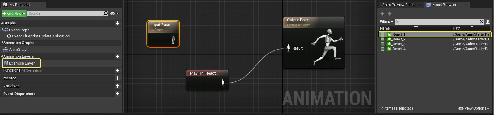

# 使用动画蓝图链接

> 路径：虚幻引擎5.7文档 / 为角色和对象制作动画 / 骨架网格体动画系统 / 动画操作指南和示例 / 使用动画蓝图链接

> 原始页面：https://dev.epicgames.com/documentation/unreal-engine/using-animation-blueprint-linking-in-unreal-engine

**动画蓝图链接** 系统是[子动画实例](../using-sub-anim-instances/index.md)的扩展。它支持在动画图表上动态切换子部分，因而支持多用户协作，而且由于动画蓝图不再加载未使用的动画，因而还可节约内存。

在本教程中，我们将创建动画蓝图，通过 **动画图层接口** 方式获取链接动画蓝图中包含的动画姿势。

> [!TIP]
> **Epic Games Launcher** 的 **学习（Learn）标签** 上的 **内容示例（Content Examples）** 项目还包含 **动画（Animation）** 贴图中的动画蓝图链接示例。

## 步骤

> [!NOTE]
> 在本指南中，我们将使用已启用 **初学者内容（Starter Content）** 的 **蓝图第一人称（Blueprint First Person）** 模板。我们还添加了 **动画初学者包（Animation Starter Pack）**，**Epic Games Launcher** 上的 **市场（Marketplace）** 中免费提供此包。

1. 在项目中，在 **内容（Content）> AnimStarterPack** 下，将 **Ue4ASP_Character** 添加到关卡中。在 **详细信息（Details）** 面板中，将 **自动拥有玩家（Auto Possess Player）** 设为 **玩家0（Player 0）**。

   因此，在编辑器中运行时可控制此角色。
2. 双击 **内容浏览器**。在 **动画（Animation）** 下，创建名为 **MyLayerInterface** 的 **动画图层接口（Animation Layer Interface）** 资源。

   此类资源类似于[蓝图接口](../../../../blueprints-visual-scripting/specialized-blueprint-visual-scripting-node-groups/types-of-blueprints/blueprint-interface/index.md)，可用来定义图层数量、名称、所属组以及任何输入。
3. 在 **MyLayerInterface** 资源中，将图层命名为 **ExampleLayer**。在 **详细信息（Details）** 面板中， 单击 **+**（加号）符号以添加 **输入（Input）**，然后单击 **编译（Compile）**。

   动画图层可公开子图表中的多个输入姿势，以及可用于混合或其他基于逻辑的实现目的的输入参数。
4. 用 **UE4_Mannequin_Skeleton**（来自Animation Starter Pack文件夹）创建动画蓝图，并将其命名为 **HitReact_AnimBP**。

   这就是动画蓝图，我们要将它链接到本指南前面在关卡中放置的角色所使用的现有动画蓝图。
5. 在工具栏上的 **HitReact_AnimBP** 中，单击 **类设置（Class Settings）** 按钮，然后在 **详细信息（Details）** 面板下的 **接口（Interfaces）** 下，添加 **MyLayerInterface**。
6. 在 **示例图层（Example Layer）** 中，将 **Hit_React_1** 动画从 **资源浏览器（Asset Browser）** 添加到图表，并连接到 **输出姿势（Output Pose）**。

   

   来自图层接口的 **输入姿势（Input Pose）** 可以导入姿势数据，并可用于与该图层中定义的任何逻辑或其他姿势数据混合。
7. 在 **内容（Content）> AnimStarterPack** 文件夹中，打开 **UE4ASP_HeroTPP_AnimBlueprint**，然后从 **类设置（Class Settings）** 添加 **MyLayerInterface**。
8. 在 **示例图层（Example Layer）** 中，将 **输入姿势（Input Pose）** 连接到 **输出姿势（Output Pose）**，如下图所示。

   在本例中，输入姿势（Input Pose）来自 **链接动画蓝图（Linked Anim BP）**（我们在其中放置了Hit React动画）。在本例中，我们将直接从链接的动画蓝图（Linked Animation Blueprint）获取姿势并切换到此姿势。
9. 在 **动画图表（Anim Graph）** 上，添加 **Linked Anim Layer** 节点（设为 **示例图层（Example Layer）**），然后按如下方式连接。

   **默认** 状态机将通过链接的动画图层传递姿势，并输出到 **输出姿势（Output Pose）**。调用 **Link Anim Class Layers** 后，将执行底层动画蓝图。

   > [!TIP]
   > Linked Anim Layer 节点具有可用于指定默认图层覆盖的 **实例类（Instance Class）** 属性。要将逻辑分解成多个动画蓝图时，这是特别实用。例如，若具有频繁更改的IK逻辑，可将其移至单独的动画蓝图中，并在主动画蓝图中将其设为默认运行。
10. 在 **内容（Content）> AnimStarterPack** 文件夹中，打开 **Ue4ASP_Character** 角色蓝图。
11. 添加 **H** 按键事件（或任何其他按键互动），拖入 **网格体（Mesh）** 组件，然后将设置的 **Link Anim Class Layers** 和 **Unlink Anim Class Layers** 节点添加到 **HitReact_AnimBP**。

    按住H时，指定为 **类中（In Class）** 的链接动画蓝图将被设为链接实例并进行执行。释放H时，任何运行指定类的图层节点将被解除链接并重置为默认值。

    > [!NOTE]
    > 另外，我们还为蹲伏添加了 **C** 键盘事件来解决警告消息。
12. **编译（Compile）** 并在编辑器中 **运行（Play）**。

## 最终结果

下面，动画蓝图正常执行，直至按下H键激活图层节点和底层动画蓝图设置（播放Hit React动画）。

动画图层和链接动画蓝图可提供维护复杂角色内的可延展性和组织的方法。有了图层和链接动画蓝图，逻辑可通过图层在动画蓝图内进行分段，也可在另一个动画蓝图中完全分离开来，并从动画蓝图中进行链接。

### 其他用例

下面显示[Fortnite](https://www.epicgames.com/fortnite/en-US/home)上利用的链接动画图层的简单用例。

上图，我们有两个接口，一个用于武器，另一个用于车辆。可同时激活这两个接口。 也可以一个动画蓝图实现其中一个接口来覆盖图表的多个点（例如，武器覆盖 `WeaponUpperBody` 和 `WeaponAdditive`）

下面是上述设置的一些可能设置：

- 开车时，由车辆接管整个姿势。
- 持枪时，车辆在下半身运行坐姿动画，由武器控制上半身。若用户更换武器，新武器动画蓝图将控制上半身，下半身继续基于车辆运行。
- 武器可覆盖上半身姿势，随即与主图表中的下半身姿势相结合，然后基于武器在整个身体姿势之上运行自定义叠加动画（例如怠速噪音）。

在Fortnite中，武器可覆盖主图表中的许多不同点。例如，针对跳跃、下降、着陆、高空滑缆等状态的运动使用状态机。

此状态机位于主图表中，而不是针对每个武器重复状态机，同时武器动画蓝图具有可覆盖每种状态的图层。

若武器无需覆盖某些状态，则不会将任何内容连接到相应图层的输出姿势。

此外，包含图层的动画蓝图还具有各自的事件图表。因此，若需处理特定车辆的数据，可将其包含在该车辆动画蓝图的事件图表中。
