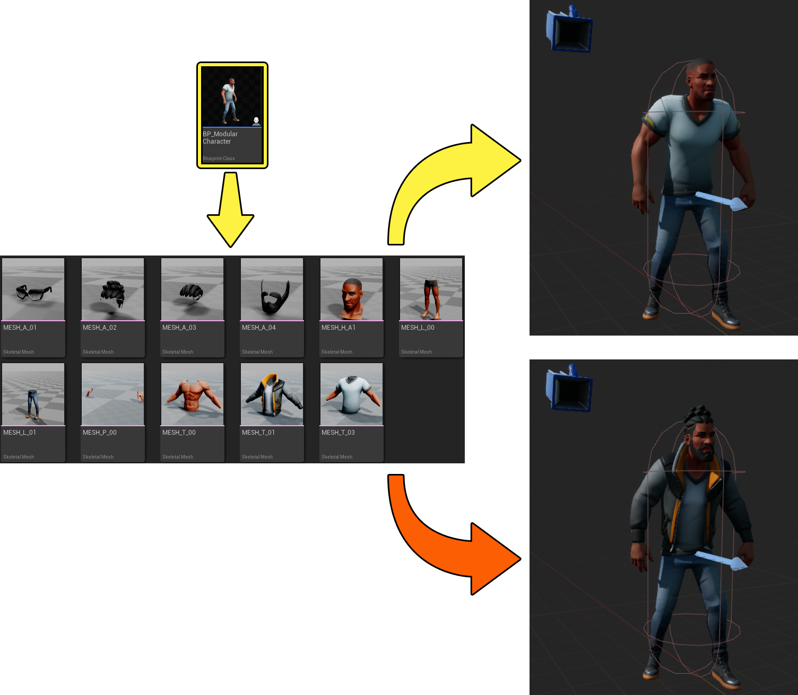
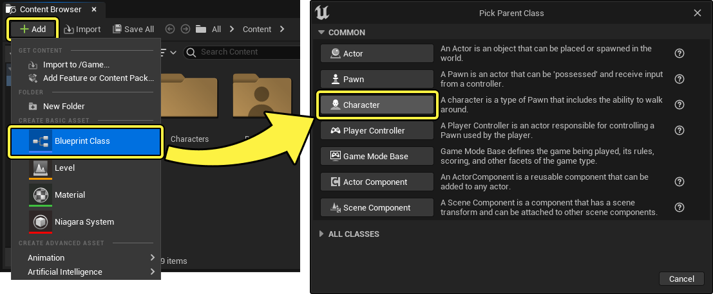
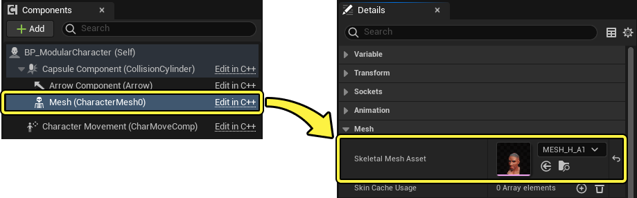
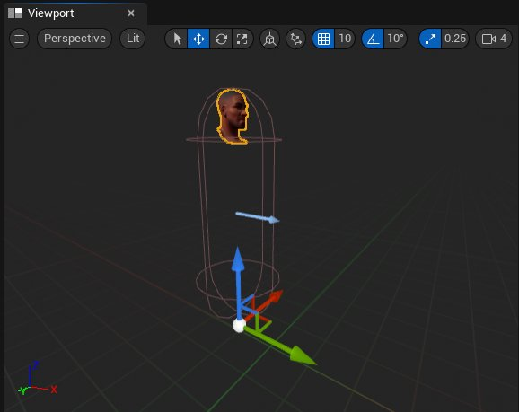
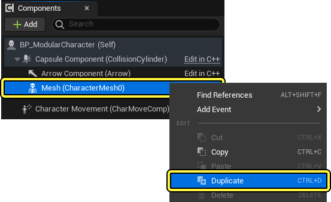
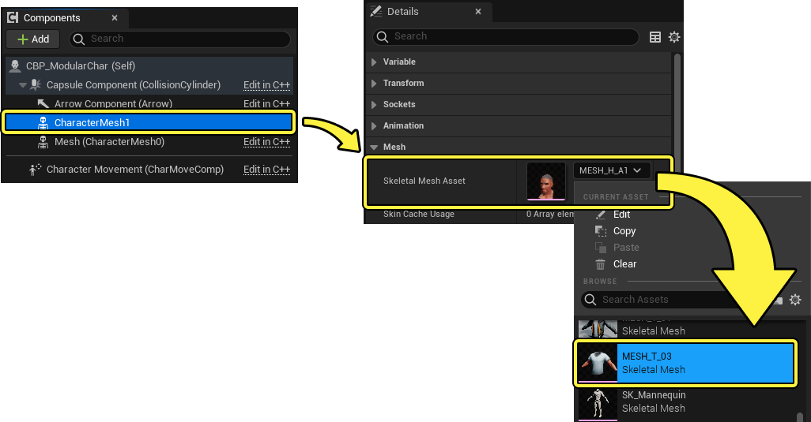
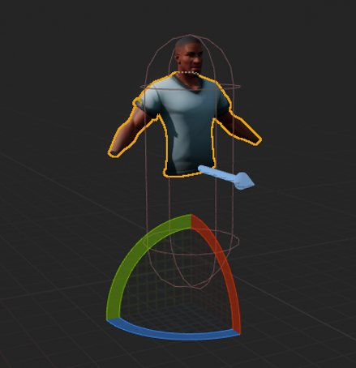

# 使用模块化角色

> 路径：虚幻引擎5.7文档 / 为角色和对象制作动画 / 骨架网格体动画系统 / 动画操作指南和示例 / 使用模块化角色

> 原始页面：https://dev.epicgames.com/documentation/unreal-engine/working-with-modular-characters-in-unreal-engine

在 **虚幻引擎** 中创建可由玩家或游戏系统自定义外观的角色（例如不同的服装或模型）时，可考虑使用 **模块化角色蓝图** 来构建角色。

使用模块化角色蓝图可以在运行时构建角色，并且构成角色的多个[骨骼网格体资产](../../../../working-with-content/skeletal-mesh-assets/index.md)可以使用蓝图逻辑进行替换，而不是导入单个骨骼网格体模型作为完整角色。 在创建具有模块化外观的角色时，使用模块化角色蓝图是一种更灵活的选择，并且比替换整个网格体更高效。

## 模块化角色设置方法

在虚幻引擎中创建模块化角色系统时，有几种不同的设置方法中可供选择，每种方法适合不同的项目需求和范围。 每种方法的简要说明及其优缺点如下。

- [设置领导者姿势组件（Set Leader Pose Component）](#%E9%A2%86%E5%AF%BC%E8%80%85%E5%A7%BF%E5%8A%BF%E7%BB%84%E4%BB%B6)通过将骨骼网格体对象的父级设置为父骨骼网格体对象来构造角色，并以独占方式在父级上运行动画。 这种方法的设置速度最快，但不支持独立动画播放或物理渲染，并且可能会带来昂贵的渲染线程性能成本。 "设置领导者姿势（Set Leader Pose）"是在虚幻引擎中设置第一个模块化角色的良好起始点。
- [从网格体复制姿势（Copy Pose from Mesh）](#%E4%BB%8E%E7%BD%91%E6%A0%BC%E4%BD%93%E5%A4%8D%E5%88%B6%E5%A7%BF%E5%8A%BF)提供了一种中间解决方案，除了可选的独立动画播放外，还可以使用此解决方案在构成角色的每个骨骼网格体对象上构建物理模拟，但对于游戏线程和渲染线程上的项目计算过程来说，此解决方案的成本最高。
- 通过在运行时[合并多个骨骼网格体（Merging Skeletal Mesh）](#%E9%AA%A8%E9%AA%BC%E7%BD%91%E6%A0%BC%E4%BD%93%E5%90%88%E5%B9%B6)对象可以在运行时渲染整个角色，从而在游戏线程和渲染线程上以相对较低的性能成本提供最全面的解决方案。 但是，这种方法需要的设置也最多，并且还具有无法利用角色变形目标的代价。

可以参考此处的图表来了解每种方法的优势、劣势和性能成本：

|  | 领导者姿势组件 | 从网格体复制姿势 | 骨骼网格体合并 |
| --- | --- | --- | --- |
| **设置成本** | 最小 | 中 | 高 |
| **游戏线程成本** | 最小 | 高 | 中 |
| **渲染线程成本** | 高 | 高 | 低 |
| **物理系统** | 否 | **AnimDynamics** 或 **RigidBody** | 是 |
| **变形目标** | 是 | 是 | 否 |

#### 先决条件

- 你将需要一组可组装成完整角色的骨骼网格体资产。 如果还没有一组这样的资产，可使用

  Fab

  中的

  City Sample Crowds

  资产包。

## 领导者姿势组件

在虚幻引擎中创建模块化角色的一种方法是使用 **领导者姿势组件（Leader Pose Component）** 系统。 通过 **领导者姿势组件蓝图** 可调用的函数，可以将蒙皮网格体组件对象设置为领导者蒙皮网格体组件对象的子项。 例如，可以将躯干定义为领导者姿势组件，为躯干指定动画，然后将脚、腿、手和头作为子项添加，这些子项将跟随分配给躯干的动画。

使用领导者姿势组件时，子网格体对象不使用任何 **骨骼变换缓冲区（Bone Transform Buffer）**，也不会独立运行任何动画，子网格体只能运行在领导者姿势组件的骨骼变换缓冲区上播放的动画。 该系统创建了一个轻量级但受限的附件系统。

下一个小节将提供一个示例工作流程，说明如何使用虚幻引擎中的领导者姿势组件系统创建一个模块化角色。

### 设置领导者姿势组件

将骨骼网格体资产导入虚幻引擎项目后，在 **内容浏览器（Content Browser）** 中使用 **添加（+）** **（Add (+)）** 创建新的角色蓝图，然后选择 **蓝图类（Blueprint Class）**。 在 **选取父类（Pick Parent Class）** 窗口中，选择 **角色（Character）** 类选项。

指定蓝图的 **名称（Name）** 并 **打开（Open）** 蓝图。

在 **组件（Components）** 面板中，选择网格体组件，然后在 **细节（Details）** 面板中使用 **骨骼网格体资产（Skeletal Mesh Asset）** 属性定义一个骨骼网格体。 建议选择不会根据游戏结构而改变的角色基本组件，例如头。

> [!NOTE]
> 如果要更改角色的所有可见组件，可以创建一个空的骨骼网格体对象作为根骨骼网格体，并将此对象用作基础资产。 空的骨骼网格体对象可能包含非常少量的几何体，这些几何体在运行时不可见，并且其他可见网格体可以围绕这些几何体进行定向。

调整基础网格体在 **视口（Viewport）** 面板中的位置。

在"组件（Components）"面板中，**右键单击** 网格体，然后从选项菜单中选择 **复制（Duplicate）**。

在 **组件（Components）** 面板中，选择复制的网格体组件，然后在 **细节（Details）** 面板中导航到 **网格体（Mesh）** 分段，并在 **骨骼网格体资产（Skeletal Mesh Asset）** 属性中选择模块化角色的另一个片段。 在此工作流示例中，对于复制的网格体组件，头组件被替换为躯干。

> [!NOTE]
> 如果已正确导出角色的网格体组件，则网格体应对齐到 **视口（Viewport）** 面板中的正确位置。 如果没有，则需要手动对齐网格体组件。

对复制的组件进行 **重命名（Rename）** 以匹配相应的网格体组件。

> 图片已省略：ImageAltText

从基础网格体组件重复此过程，直到所有网格体组件都已添加到蓝图中，并且角色拥有其所有部件。

(convert:false)

将所有网格体组件添加到角色蓝图并在 **视口（Viewport）** 面板中正确对齐后，打开蓝图的 **构造脚本（Construction Script）** 面板。 从 **构造脚本（Construction Script）** 节点创建一个 **设置领导者姿势组件（Set Leader Pose Component）** 节点。

> 图片已省略：ImageAltText

将蓝图中包含的每个网格体组件的实例拖动到图表中。

> 动图已省略：ImageAltText

将基础网格体组件连接到"设置领导者姿势组件（Set Leader Pose Component）"节点的 **新建领导者骨骼组件（New Leader Bone Component）** 输入引脚。

> 图片已省略：ImageAltText

将其余网格体组件连接到"设置领导者姿势组件（Set Leader Pose Component）"节点的 **目标（Target）** 输入引脚。

> 图片已省略：ImageAltText

保存并编译角色蓝图后，模块化角色现已组装完毕，可以在项目中对角色进行添加、动画制作和控制操作。

> 动图已省略：ImageAltText

使用"领导者姿势组件（Leader Pose Component）"节点的角色会降低角色在 **游戏线程** 上的性能成本，但不会降低角色在 **渲染线程** 上的渲染成本，了解这一点很重要。 角色仍将单独渲染相同数量的组件，但组件包含的每个额外分段还会进行额外的绘制调用。

领导者骨骼的任何子网格体对象都必须是具有精确匹配结构的子集，了解这一点同样很重要。 你不能有任何其他额外的关节或跳过任何关节。 由于没有额外关节的骨骼缓冲区数据，因此任何额外关节或跳过的关节都将使用参考姿势进行渲染。

模块化角色蓝图中包含的子网格体对象无法运行独特动画，或独立于领导者姿势组件来模拟物理系统。

## 从网格体复制姿势

在虚幻引擎中组装模块化角色的另一种方法是使用 **从网格体复制姿势（Copy Pose from Mesh）** 系统。 "从网格体复制姿势（Copy Pose From Mesh）"是一个可以在子网格体的动画蓝图中使用的 **AnimGraph** 节点，可用于从另一个骨骼网格体组件复制动画姿势。 "从网格体复制姿势（Copy Pose From Mesh）"只会复制匹配的骨骼，所有其他的都将使用参考姿势。

### 设置复制姿势组件

将骨骼网格体资产导入虚幻引擎项目后，创建一个角色蓝图并将每个网格体组件添加到蓝图中。

> 图片已省略：ImageAltText

为基础网格体组件创建一个动画蓝图，并在网格体组件的 **细节（Details）** 面板中指定该蓝图，具体做法是将 **动画模式（Animation Mode）** 属性设置为 **使用动画蓝图（Use Animation Blueprint）**，然后使用 **动画类（Anim Class）** 属性选择主动画蓝图。

> 图片已省略：ImageAltText

> [!NOTE]
> 在此工作流程示例中，模块化角色网格体使用模板人体模型的骨架资产，并可为其指定使用[第三人称模板（Third Person Template）项目](https://dev.epicgames.com/documentation/404)中的 `ThirdPerson_AnimBP` 动画蓝图。
>
> 指定此动画蓝图后，基础网格体（在本例中为角色的头）将开始运行动画，其余网格体组件将输出其参考姿势。
>
> > 动图已省略：ImageAltText

现在创建一个动画蓝图资产来驱动模块化角色每个剩余子网格体组件的动画姿势。 要创建该资产，请使用 **内容浏览器（Content Browser）** 中的 **（+）添加** **（(+) Add）**，选择 **动画（Animation）** > **动画蓝图（Animation Blueprint）**。 然后，指定模块化角色的骨架资产。 此工作流示例中使用了人体模型角色的骨架。

> 图片已省略：ImageAltText

指定动画蓝图的 **名称（Name）** 并 **打开（Open）** 该蓝图。

> 图片已省略：ImageAltText

在动画蓝图中，创建基础网格体组件的引用变量。 要创建引用变量，请先使用在 **我的蓝图（My Blueprint）** 面板的 **变量（Variables）** 分段中使用 **（+）添加** **（(+) Add）** 添加一个名为 `源网格体组件（Source Mesh Component）` 的新变量，然后选择 **Skeletal Mesh Component（骨骼网格体组件）** > **对象引用（Object Reference）**。

> 图片已省略：ImageAltText

然后在动画蓝图的 **事件图表（Event Graph）** 中，创建一个 **转换为蓝图（Cast to Blueprint）** 节点，将动画蓝图链接到角色的蓝图。 创建一个 **尝试获取Pawn所有者（Try Get Pawn Owner）** 节点，并将其 **返回值（Return Value）** 连接到"转换为蓝图（Cast to Blueprint）"节点的 **Object（对象）** 输入引脚。 从"转换到蓝图（Cast to Blueprint）"节点的 **输出** 引脚拖出，创建一个 **获取网格体（Get Mesh）** 节点。 最后，为网格体变量创建一个 **设置变量（Set Variable）** 节点，并将"获取网格体（Get Mesh）"节点的 **输出** 引脚连接到"设置变量（Set Variable）"节点的 **输入** 引脚。

> 图片已省略：ImageAltText

在 **AnimGraph** 中，创建一个 **从网格体复制姿势（Copy Pose From Mesh）** 节点。 将引用变量添加到图形中，并将其连接到"从网格体复制姿势（Copy Pose From Mesh）"节点的 **源网格体组件（Source Mesh Component）** 输入引脚。 最后，将"从网格体复制姿势（Copy Pose From Mesh node）"节点的输出姿势连接到 **输出姿势** 节点。

> 图片已省略：ImageAltText

在角色蓝图中，将每个子网格体组件设置为使用新的动画蓝图在每个子网格体组件上运行。 要设置动画蓝图，请在 **组件（Components）** 面板中选择每个子网格体组件，然后将 **动画模式（Animation Mode）** 属性设置为 **使用动画蓝图（Use Animation Blueprint）**，并将 **动画类（Anim Class）** 属性设置为子网格体动画蓝图。

> 动图已省略：ImageAltText

> [!NOTE]
> 使用"从网格体复制姿势（Copy Pose From Mesh）"跨多个网格体组件同步动画时，需要确保作为复制源的"骨骼网格体组件（Skeletal Mesh Component）"已经更新，否则会复制最后一帧的动画。 为确保基础网格体已更新，可以通过将每个子网格体对象拖动到角色蓝图的 **组件（Components）** 面板中的基础网格体组件上，将子网格体组件作为基础网格体组件的子项。
>
> > 动图已省略：ImageAltText
>
> 还可以在代码中设置此关系，也就是将基础网格体的更新设置为评估子网格体的先决条件。 如需了解更多信息，请参阅[更新依赖性](../../../../gameplay-systems/gameplay-framework/actors/actor-ticking/index.md#%E6%9B%B4%E6%96%B0%E4%BE%9D%E8%B5%96%E6%80%A7)文档。

使用"从网格体复制姿势（Copy Pose from Mesh）"方法构建模块化角色时，可以访问每个网格体组件的完整动画图表，从而可以更加动态地控制动画的独立播放。 此外，还可以使用[RigidBody](../../../skeletal-mesh-a-2df34997/animation-blueprints/animation-blueprint-nodes/animation-bluep-7b8b20e5/animation-bluepr-5a28424e/index.md)或[AnimDynamics](../../../skeletal-mesh-an-2df34997/animation-blueprints/animation-blueprint-nodes/animation-bluep-7b8b20e5/animation-bluep-ec3334f1/index.md)节点为每个网格体组件独立构建轻量级物理模拟。

但是，请务必注意，使用"从网格体复制姿势（Copy Pose From Mesh）"比使用"领导姿势组件（Leader Pose Component）"系统的性能成本更高，因为必须在每个子项上运行动画图表评估。

## 骨骼网格体合并

在虚幻引擎中创建模块化角色时，还可以使用"合并网格体（Merge Meshes）"蓝图函数节点在运行时将多个网格体合并为单个骨骼网格体。 虽然此方法在创建骨骼网格体时具有较高的初始性能成本，但重复渲染成本低于其他方法，因为只需渲染单个骨骼网格体而不是多个网格体。

例如，如果角色由三个组件（头、身体和腿）组成，并且屏幕上有50个这样的角色，则会产生50次绘制调用。 如果不使用"骨骼网格体合并（Skeletal Mesh Merge）"，每个组件都有自己的绘制调用，因此每个角色将有三次调用，总共150次绘制调用。

使用 `FSkeletalMeshMerge` 时，主网格体组件必须包含一个具有角色所有动画的完整骨架，因为合并的网格体只会使用设置为主网格体组件的骨架。 即使某些身体部位有额外的关节，成功的网格体合并仍然需要包含所有动画并在主网格体组件上运行。

同样重要的是要注意，合并的网格体一次只能运行一个动画，并且不支持将[变形目标](../../animation-assets-and-features/morph-target-previewer/index.md)转移到合并的网格体。 但是，可以通过查看 `FSkeletalMeshMerge::GenerateLODModel` 来创建将变形目标应用于合并的骨骼网格体的变通方案。 在运行时创建合并的网格体后，可以通过计算基础网格体与任何变形之间的 `FMorphTargetDelta` 来应用变形目标。

此外，在使用 `FSkeletalMeshMerge` 时，可能需要从一开始就考虑使用此方法来定制构建内容。 建议为合并的角色使用一种通用[材质](../../../../designing-visuals-rendering-and-graphics/unreal-engine-materials/index.md)，并为[纹理](../../../../designing-visuals-rendering-and-graphics/textures/index.md)确定一个 **图集**。 通过这种方式，可以在运行时剪切和应用纹理来创建一个更加动态的系统，从而将合并的角色渲染为一个网格体。

### 设置骨骼网格体合并

将骨骼网格体资产导入虚幻引擎项目后，启用 **骨骼合并（Skeletal Merging）** [插件](../../../../understanding-the-basics/foundational-knowledge-in/working-with-plugins/index.md)。 要启用该插件，请在 **菜单栏** 中导航到 **编辑（Edit）> 插件（Plugins）**，然后在 **其他（Other）** 分段下找到列出的 **骨骼合并（Skeletal Merge）** 插件，或者也可以使用 **搜索栏** 搜索该插件。 启用该插件后，需要重新启动编辑器。

> 图片已省略：ImageAltText

重新启动编辑器后，可以使用 **内容浏览器（Content Browser）** 中的 **（+）添加** **（(+) Add）** 创建一个具有空骨骼网格体组件的角色蓝图。

然后为角色蓝图添加一个 **骨骼网格体合并参数（Skeletal Mesh Merge Parameters）** 变量。 要创建此变量，请在 **我的蓝图（My Blueprint）** 面板中导航到 **变量（Variables）** 分段，使用 **（+）添加** **（(+) Add）** 创建一个新变量，并将变量类型定义为 `骨骼网格体合并参数（Skeletal Mesh Merge Parameters）` 变量。

> 图片已省略：ImageAltText

**保存（Save）** 并编译 **蓝图**。

在"我的蓝图（My Blueprint）"面板中选择"骨骼网格体合并参数（Skeletal Mesh Merge Param）"变量，打开变量 **细节（Details）** 面板。 使用 **骨架（Skeleton）** 属性定义角色的骨架。

> 图片已省略：ImageAltText

现在，可以使用 **要合并的网格体（Meshes to Merge）** 属性中的 **（+）添加** **（(+) Add）** 定义要合并的网格体。 为角色包含的每个网格体创建一个数组，并定义相应的网格体。

> 图片已省略：ImageAltText

在角色蓝图事件图表中，现在可以从"事件开始运行（Event Begin Play）"节点创建一个网格体合并节点，以合并由"骨骼网格体合并参数（Skeletal Mesh Merge Parameter）"变量定义的网格体。

> 图片已省略：ImageAltText

然后，可以使用"设置骨骼网格体资产（Set Skeletal Mesh Asset）"节点将空的骨骼网格体组件替换为生成的合并网格体。 将现有网格体节点设置为"目标（Target）"，并将生成的合并网格体设置为"新网格体（New Mesh）"。 然后，可以在空网格体对象上播放将在新的合并网格体上播放的动画。

> 图片已省略：ImageAltText

现在，可以将合并的网格体蓝图添加到关卡中，并实时观察整个骨骼网格体播放动画的情况。

> 动图已省略：ImageAltText

> [!TIP]
> 如果合并的网格体未与胶囊体组件正确对齐，可以通过在角色蓝图的 **视口（Viewport）** 面板中移动空的骨骼网格体组件来调整位置。

### 骨骼网格体合并参数参考

在此处可以参考"骨骼网格体合并参数（Skeletal Mesh Merge Parameter）"变量的属性列表及相关功能描述：

| 属性 | 描述 |
| --- | --- |
| **网格体分段映射（Mesh Section Mappings）** | 这是一个可选数组，用于将分段从源网格体映射到合并的分段条目。 |
| **每个网格体的UV变换（UVTransforms Per Mesh）** | 这是一个可选数组，用于变换每个网格体中的UV。 |
| **要合并的网格体（Meshes to Merge）** | 这些是将会合并在一起的骨骼网格体。 |
| **剥离顶级LOD（Strip Top LODs）** | 要从输入网格体移除的顶级LOD的数量。 |
| **需要由CPU访问（Needs Cpu Access）** | 生成的网格体是否出于任何原因（例如，生成粒子效果）需要由CPU访问。 |
| **合并之前更新骨架（Skeleton Before）** | 在合并之前还是之后更新骨架（还必须提供骨架）。 |
| **骨架（Skeleton）** | 这是将用于合并网格体的骨架。 你可以将此处留空以生成用于合并网格体的骨架。 |
