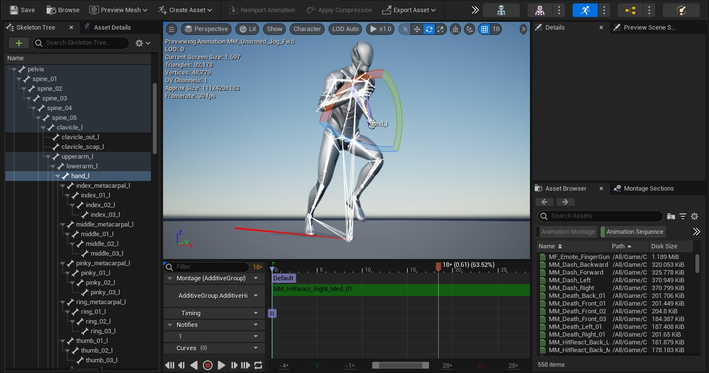

# 骨架网格体动画系统

> 路径：虚幻引擎5.7文档 / 为角色和对象制作动画 / 骨架网格体动画系统

> 原始页面：https://dev.epicgames.com/documentation/unreal-engine/skeletal-mesh-animation-system-in-unreal-engine

虚幻引擎中的角色动画基于 **骨架网格体（Skeletal Mesh）** 实现。骨架网格体是一种绑定了骨骼的模型，可用于创建动画。此外，你可以用 **动画蓝图（Animation Blueprints）** 为骨架网格体添加逻辑，以便角色和场景互动。

虚幻引擎提供了多种动画工具来用于骨架网格体，以便进一步提高你的动画效果。本文介绍了这些主要系统。

## 动画编辑器

下文中，你将了解虚幻引擎 **动画编辑器** 的相关信息，例如 **骨架编辑器**、**动画序列编辑器**、**骨架网格体编辑器** 等。

- [动画编辑器](animation-editors/index.md)

- [骨架编辑器](animation-editors/skeleton-editor/index.md) - 详解虚幻引擎中的骨架编辑模式。

- [骨架网格体编辑器](animation-editors/skeletal-mesh-editor/index.md) - 深入了解虚幻引擎中的骨架网格体编辑模式

- [动画序列编辑器](animation-editors/animation-sequence-editor/index.md) - 深入了解虚幻引擎中的动画序列编辑器。

## 动画蓝图

在虚幻引擎中，**动画蓝图** 系统是一个非常实用、内容丰富的系统，允许你以节点形式编辑动画行为。你可以控制动画混合、交互效果，并创建其他程序化行为。

- [动画蓝图](animation-blueprints/index.md)

- [动画蓝图编辑器](animation-blueprints/animation-blueprint-editor/index.md) - 动画蓝图编辑器及其界面概览

- [在动画蓝图中使用图表功能](animation-blueprints/graphing-in-animation-blueprints/index.md) - 使用动画蓝图中的各种图表在骨骼网格体上编辑、混合和操控姿势。

- [状态机](animation-blueprints/state-machines/index.md) - 使用状态机创建基于逻辑的分支动画。

- [动画节点参考](animation-blueprints/animation-blueprint-nodes/index.md) - 介绍动画蓝图中的各种动画节点

- [动画插槽](animation-blueprints/animation-slots/index.md) - 在动画图表中添加插入点来使用插槽播放动画。

- [同步组](animation-blueprints/animation-sync-groups/index.md) - 使用同步组同步不同长度的动画周期。

- [动画蓝图链接](animation-blueprints/animation-blueprint-linking/index.md) - 使用动画蓝图链接和模板将你的动画蓝图逻辑模块化。

## 动画资产和功能

下述页面介绍了各种 **动画资产** 及其相关功能。

- [动画资产和功能](animation-assets-and-features/index.md)

- [动画序列](animation-assets-and-features/animation-sequences/index.md) - 一种用于保存骨骼网格体动画的动画资产。

- [ML变形器框架](animation-assets-and-features/ml-deformer-framework/index.md) - 使用ML变形器框架训练模型，在运行时做出高质量的角色网格体变形选择。

- [运动匹配](animation-assets-and-features/motion-matching/index.md) - 利用运动匹配创建响应式动画系统，从数据库中选择动画姿势，在运行时匹配动态系统查询。

- [动态资产选择](animation-assets-and-features/dynamic-asset-selection/index.md) - 使用选择器表和代理资产在运行时动态选择动画之类的资产。

- [骨架](animation-assets-and-features/skeletons/index.md) - 了解虚幻引擎中的骨架、骨骼以及动画数据管理方式。

- [混合空间](animation-assets-and-features/blend-spaces/index.md) - 混合空间是一种图表，你可以在其中绘制任意数量的动画，以基于多个输入的值进行混合。

- [动画蒙太奇](animation-assets-and-features/animation-montage/index.md) - 动画蒙太奇动画资产可以用于将动画合并至一个资产并通过蓝图控制播放。

- [IK Rig](animation-assets-and-features/ik-rig/index.md) - 使用IK Rig和重定向工具重定向，并按程序调整动画。

- [移动](animation-assets-and-features/locomotion/index.md) - 关于虚幻引擎中角色移动功能的概述。

- [动画合成](animation-assets-and-features/animation-composites/index.md) - 动画合成用于组合多个动画并将它们作为一个整体来处理。

- [动画姿势资产](animation-assets-and-features/animation-pose-assets/index.md) - 讲解动画姿势资产，其可通过加权曲线数据来驱动动画。

- [变形器图](animation-assets-and-features/deformer-graph/index.md) - 使用变形器图为蒙皮角色和对象创建和编辑自定义网格体变形。

- [动画修改器](animation-assets-and-features/animation-modifiers/index.md) - 动画修改器可以让用户为特定动画序列或骨架定义一个动作序列。

- [Mirroring Animation](animation-assets-and-features/mirroring-animation/index.md) - Mirror animation in Unreal Engine using the Mirror Data Table.

- [蒙皮权重配置文件](animation-assets-and-features/skin-weight-profiles/index.md) - 说明如何使用蒙皮权重配置文件来提高低端平台上的视觉逼真度。

- [顶点动画工具](animation-assets-and-features/vertex-animation-tool/index.md) - 3ds Max顶点动画工具集的用户指南。

- [变形目标预览器](animation-assets-and-features/morph-target-previewer/index.md) - 动画编辑器中可用编辑模式的用户指南。

## Live Link

下文将介绍如何设置、操作 **Live Link** —— 一个从外部DCC环境实时流送动画数据的工具。

- [Live Link](live-link/index.md)

- [使用Live Link数据](live-link/using-live-link-data/index.md) - 概述可以使用Live Link将数据流送给Actor的功能。

- [Live Link插件的开发](live-link/live-link-plugin-development/index.md) - 概述插件的开发以及将其与Live Link整合的方法。

- [使用Live Link整合UE4与Motionbuilder](live-link/live-link-stream-motionbuilder-to/index.md) - 介绍如何使用Live Link插件来整合UE4与Motionbuilder

- [Live Link Curve Debugger](live-link/live-link-curve-debugger/index.md) - 使用Live Link Curve Debugger，你可以易于调试的方式，快速查看各种Live Link曲线的输出。

- [Live Link FreeD](live-link/live-link-freed/index.md) - 通过使用FreeD协议的Live Link，添加追踪和摄像机数据，该协议常用于摄像机追踪和平移、倾斜、变焦(PTZ)摄像机。

- [LiveLinkXR](live-link/livelinkxr/index.md) - 通过LiveLinkXR插件，在XR设备上使用LiveLink

- [Live Link VRPN](live-link/live-link-vrpn/index.md) - 使用Live Link VRPN插件，添加来自VR外围设备的跟踪和输入数据

- [连接你的Master Lockit系统](live-link/connecting-your-master-lockit-system/index.md) - 关于如何将LiveLink MasterLockit插件用于虚拟摄像机的指南

- [连接你的Preston系统](live-link/connecting-your-preston-system/index.md) - 关于如何将LiveLink Preston MDR插件用于虚拟摄像机的指南。

## 调试和优化

下文介绍了动画调试和性能分析相关的问题。

- [动画共享插件](animation-debugging-and-optimization/animation-sharing-plugin/index.md) - 创建可在多个角色之间高效共享的角色动画系统。

- [Animation Insights](animation-debugging-and-optimization/animation-insights/index.md) - 使用Animation Insights来观察和分析你的项目在运行期间的游戏和动画性能。

- [动画预算分配器](animation-debugging-and-optimization/animation-budget-allocator/index.md) - 该系统用于通过动态限制骨骼网格体组件更新，约束动画数据所用时间。

- [动画优化](animation-debugging-and-optimization/animation-optimization/index.md) - 使用各种方法和技术优化动画蓝图的性能和稳定性。

- [Rewind调试器](animation-debugging-and-optimization/animation-rewind-debugger/index.md) - 通过Rewind调试器，你可以录制项目的实时片段并保留数据用于调试工作流程。

- [动画压缩](animation-debugging-and-optimization/animation-compression/index.md) - 使用动画压缩流程降低项目动画数据对内存的影响。

## 工作流程指南和示例

下文介绍了使用虚幻引擎动画工具创建的指南和内容示例。

- [使用IK重定向器修正滑步](animation-workflow-guides-and-examples/fix-foot-sliding-with-ik-retargeter/index.md) - 在迥异的角色之间重定向时，使用快速栽植（Speed Planting）工作流程解决滑步问题。

- [使用IK Rig重定向两足角色](animation-workflow-guides-and-examples/retargeting-bipeds-with-ik-rig/index.md) - 了解如何使用虚幻引擎的IK Rig和重定向功能重定向两种不同的两足角色。

- [使用重定向配置文件](animation-workflow-guides-and-examples/animating-ik-retarget-settings/index.md) - 在运行时对重定向的角色覆盖IK重定向器设置并为其制作动画。

- [运行时IK重定向](animation-workflow-guides-and-examples/runtime-ik-retargeting/index.md) - 使用来自网格体的重定向姿势来在角色上启用动态的运行时重定向。

- [使用模块化角色](animation-workflow-guides-and-examples/working-with-modular-characters/index.md) - 通过组合多个骨骼网格体组件来创建角色。

- [如何创建自定义变形器图表](animation-workflow-guides-and-examples/how-to-create-a-custom-deformer-graph/index.md) - 如何创建自定义变形器图表资产，在运行时对网格体和角色变形。

- [如何使用机器学习变形器](animation-workflow-guides-and-examples/how-to-use-the-machine-learning-deformer/index.md) - 使用ML变形器为蒙皮角色训练机器学习网格体变形模型。

- [使用分层动画](animation-workflow-guides-and-examples/using-layered-animations/index.md) - 演示如何将动画混合在一起，本例中是一个可以在移动过程中发射武器的角色。

- [创建瞄准偏移](animation-workflow-guides-and-examples/creating-an-aim-offset/index.md) - 角色使用瞄准偏移将武器瞄准鼠标或控制器的方向。

- [动画蓝图覆盖](animation-workflow-guides-and-examples/animation-blueprint-override/index.md) - 说明如何覆盖子动画蓝图中的动画。

- [创建动态动画](animation-workflow-guides-and-examples/creating-dynamic-animations/index.md) - 使用AnimDynamics为角色提供基于实体的附属动画。

- [混合动画](animation-workflow-guides-and-examples/blending-animations/index.md) - 在一个骨架网格体上的两个动画之间平滑过渡

- [基于运动的混合](animation-workflow-guides-and-examples/locomotion-based-blending/index.md) - 用于混合角色的行走和慢跑动画的混合空间示例。

- [设置角色](animation-workflow-guides-and-examples/setting-up-a-character/index.md) - 关于如何在虚幻引擎中设置基本角色或骨架网格体的高级概述。

- [从另一个骨架网格体复制姿势](animation-workflow-guides-and-examples/copy-a-pose/index.md) - 展示如何使用

- [创建姿势资产](animation-workflow-guides-and-examples/creating-a-pose-asset/index.md) - 如何使用动画编辑器生成单帧姿势资产。

- [曲线驱动动画](animation-workflow-guides-and-examples/curve-driven-animation/index.md) - 说明如何使用姿势资产和曲线数据新建由动画曲线数据驱动的动画序列。

- [面部动画共享](animation-workflow-guides-and-examples/facial-animation-sharing/index.md) - 介绍使用姿势资源、动画蓝图和动画曲线共享面部动画的方法。

- [使用iOS设备录制面部动画](animation-workflow-guides-and-examples/recording-face-animation-on-ios-device/index.md) - 使用Live Link Face、ARKit和Live Link捕捉面部动画并将其应用于虚幻引擎中的角色。

- [编辑动画层](animation-workflow-guides-and-examples/editing-animation-layers/index.md) - 通过动画层编辑功能编辑一段闲散动画以创建新的填弹动画。

- [使用动画蓝图链接](animation-workflow-guides-and-examples/using-animation-blueprint-linking/index.md) - 演示在动画图表的子部分之间动态切换。

- [基于物理的动画](animation-workflow-guides-and-examples/physics-driven-animation/index.md) - 你可以混合基于物理的动画的结果来使得你的角色产生布娃娃效果。

- [动画姿势快照](animation-workflow-guides-and-examples/animation-pose-snapshot/index.md) - 动画姿势快照可以在蓝图中捕获运行时骨架网格体姿势，还可以在动画蓝图中混入或混出其他姿势。

- [使用重定向动画](animation-workflow-guides-and-examples/using-retargeted-animations/index.md) - 提供示例，说明如何为多个角色设置和使用重定位后的动画。

- [使用子动画实例](animation-workflow-guides-and-examples/using-sub-anim-instances/index.md) - 展示如何在其他动画蓝图中使用子动画蓝图实例。

- [如何获取动画变量](animation-workflow-guides-and-examples/how-to-get-animation-variables-in-animation-f9136b17/index.md) - 如何获取并使用动画变量，以便在动画蓝图事件图表和线程安全型函数中设置角色动画。

## 动画相关的快捷键和技巧

下文介绍了你在使用虚幻引擎各种动画工具时，能让你更有成效的快捷键、提示、流程技巧和控制台命令。

- [动画生产率提示与技巧](animation-shortcuts-and-tips/index.md)
