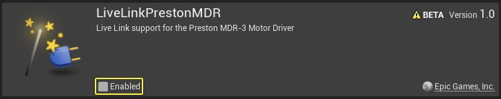
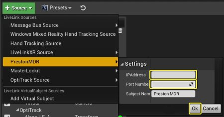
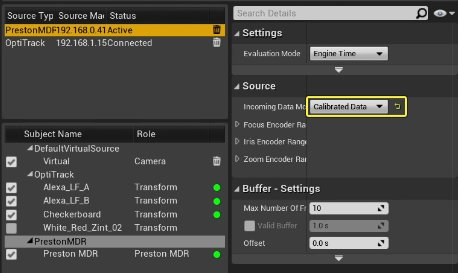
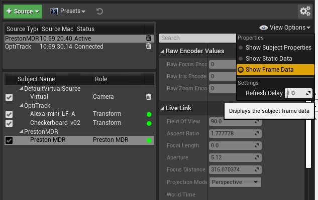
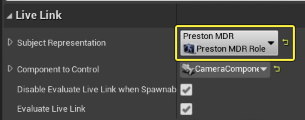
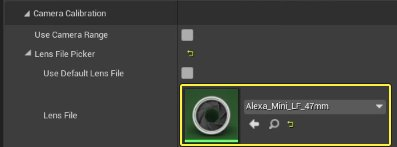

# 连接你的Preston系统

> 路径：虚幻引擎5.7文档 / 为角色和对象制作动画 / 骨架网格体动画系统 / Live Link / 连接你的Preston系统

> 原始页面：https://dev.epicgames.com/documentation/unreal-engine/connecting-your-preston-system-in-unreal-engine

## 步骤

如果你要将Preston系统用于制片摄像机，请执行以下步骤。

在本示例中，Preston MDR单元需要将序列输出转换到以太网。这是使用Tibo序列到以太网转换器执行的。此以太网连接需要位于虚幻引擎所在的相同网络上。其他硬件设备也可用于流送Preston数据。请咨询相关插件的供应商，或设置是否使用不同的设备发送Preston数据。

1. 点击 **设置（Settings）> 插件（Plugins）**，打开 **插件菜单（Plugins Menu）**。点击 **虚拟制片（Virtual Production）** 类别并搜索 **LiveLinkPrestonMDR** 插件。

   
2. 启用该插件，然后点击消息窗口上的 **是（Yes）**。点击 **立即重启（Restart Now）** 以重启编辑器。

   

   
3. 编辑器完成加载后，转到 **Live Link** 窗口并点击 **+ 源（+ Source）> PrestonMDR**。输入 **Tibo的IP地址** 和 **端口号1001**，然后点击 **确定（OK）**。

   
4. 从列表选择Preston主题，并将 **传入数据模式（Incoming Data Mode）** 下拉菜单设置为 **校准后的数据（Calibrated Data）**。

   
5. 选择带有绿色圆圈的Preston MDR设备。打开 **查看选项（View Options）** 下拉菜单并将设置更改为 **显示帧数据（Show Frame Data）**。这将显示Live Link数据。

   
6. 更改Preston手动单元上的聚焦和光圈，以查看"光圈"和"对焦距离"的值如何变化，并验证这些值是否匹配摄像机上的值。
7. 在 **世界大纲视图（World Outliner）** 窗口中选择你的 **电影摄像机Actor（CineCamera Actor）**，然后转到 **细节（Details）** 面板。选择你的 **Live Link控制器（Live Link Controller）** 组件，然后向下滚动到 **Live Link** 分段。点击 **主题表示（Subject Representation）** 下拉菜单，然后选择你的Preston主题。

   
8. 向下滚动到 **摄像机校准（Camera Calibration）** 分段，然后点击 **镜头文件（Lens File）** 下拉菜单。选择你的摄像机的镜头文件。

   
9. 将 **聚焦方法（Focus Method）** 设置从 **手动（Manual）** 更改为 **禁用（Disabled）**。这将阻止CG电影摄像机上的焦点发生变化，因为焦点是由物理摄像机通过使用Live Link虚拟主题手动输入的值控制的。

   > 图片已省略：将

#### 结果

在本指南中，你使用Live Link设置并连接了Preston MDR，以将聚焦、光圈和变焦流送到连接到UE中电影摄像机的镜头文件。
