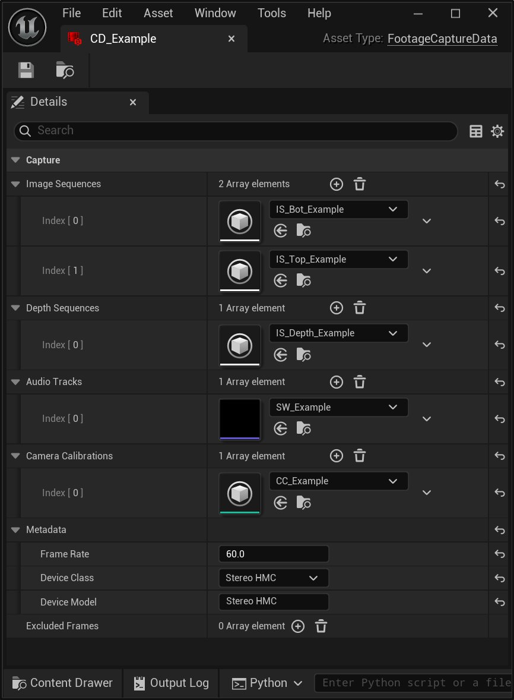
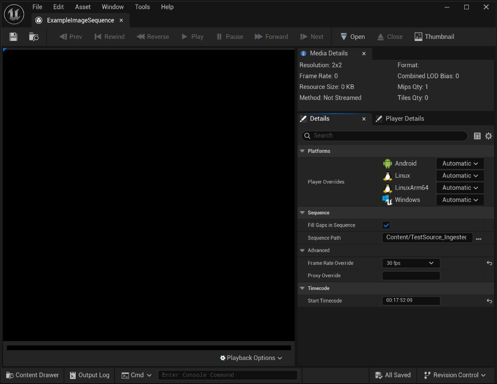
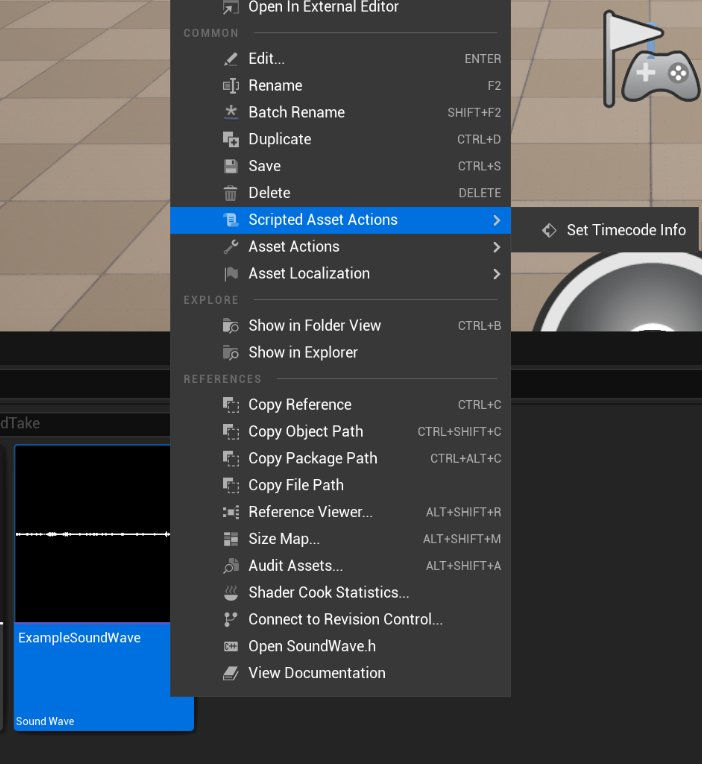
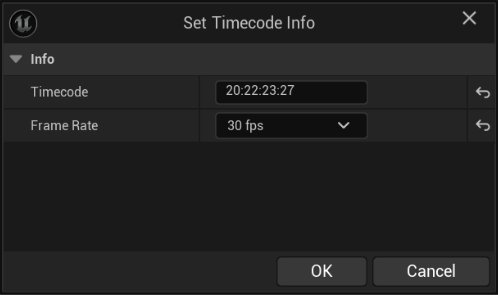

# 捕获数据资产

> 路径：虚幻引擎5.7文档 / 为角色和对象制作动画 / 骨架网格体动画系统 / Live Link / LiveLink Hub / 捕获管理器 / 捕获数据资产

> 原始页面：https://dev.epicgames.com/documentation/unreal-engine/capture-data-asset

**捕获数据**资产由**捕获管理器**在摄取流程中创建。 处理表演捕获数据时，它将跟踪所需的各种数据和元数据集。 其中一些数据是可选的，但通常可用（例如音频）。

捕获数据资产可以被输入到[MetaHuman身份](https://dev.epicgames.com/documentation/metahuman/metahuman-identity-asset?application_version=5.6)和[MetaHuman表演](https://dev.epicgames.com/documentation/metahuman/metahuman-performance-asset?application_version=5.6)资产中。

> [!WARNING]
> 虽然该资产通常由自动流程创建，但你也可根据具体需求手动创建。 虽然你可以手动配置捕获数据资产，但请注意，信息配置不完整或不正确将造成难以预料且难以解决的问题。

一份**捕获数据**资产可以引用一份或多份下列其他资产，具体取决于其代表的数据：

- **图像媒体源（Img Media Source）**（适用于深度和/或RGB视频）
- **声波（Sound Wave）**（适用于音频轨道）
- **摄像机校准（Camera Calibration）**

> [!WARNING]
> 切勿混淆iOS设备的**设备类（Device Class）**和**设备型号（Device Model）**。 **捕获数据**资产的内部的**设备类（Device Class）**是有限选项中的固定选择，即消费者眼中"型号"的俗称。 **设备型号（Device Model）**是不那么广为人知的版本设定，**不一定符合**面向公众的型号。 设备型号通常先于向消费者推广的品牌型号。 例如，iPhone 12设备的型号很可能是iPhone 13,N。

## 时间码信息

你可以使用**ImgMediaSource**资产编辑器查看并设置图像和深度序列的时间码。

你可以选择**脚本化资产操作（Scripted Asset Action） > 设置时间码信息（Set Timecode Info）**来查看并设置SoundWave资产的时间码和时间码帧率。

输入所需的时间码（Timecode）和时间码帧率（Frame Rate）值，然后点击**确认（OK）**即可完成设置。

