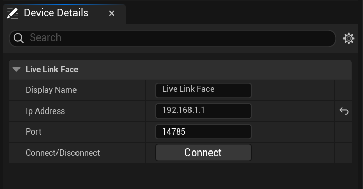

# Live Link面部设备

> 路径：虚幻引擎5.7文档 / 为角色和对象制作动画 / 骨架网格体动画系统 / Live Link / LiveLink Hub / 捕获管理器 / 捕获管理器设备 / Live Link面部设备

> 原始页面：https://dev.epicgames.com/documentation/unreal-engine/live-link-face-device

**Live Link Face**设备让你可以直接从运行[Live Link Face应用程序](https://dev.epicgames.com/documentation/metahuman/live-link-face-app?application_version=5.6)且已连接的iOS设备处摄取镜头试拍。 使用此种设备时，请确保Live Link Face应用程序在前台运行（即处于活动状态）。

> [!WARNING]
> 虽然Android设备上的Live Link Face应用程序可用于在MetaHuman Animator中制作实时动画，但它不支持离线处理的捕获。

- **显示名称（Display Name）**：**设备（Devices）**列表中的设备显示名称。
- **IP地址（Ip Address）**：设备在网络上的IP地址。
- **端口（Port）**：设备在网络上的端口。
- **连接（Connect）**：可从音频文件的文件夹和名中提取的令牌，用于识别镜头试拍。

> [!NOTE]
> Live Link Hub和移动设备都必须能够通过网络建立连接；请确保你的网络设置、防火墙、VPN等设置允许这种连接。

## 捕获数据

你可以通过Live Link Hub的实时数据（Live Data）布局触发Live Link Face应用程序的录制功能。 这将为该应用程序传递**会话**、**场记板**和**镜头试拍**的信息。

> [!NOTE]
> 这在所有连接的Live Link Hub设备上触发录制；无法单独触发特定设备。
