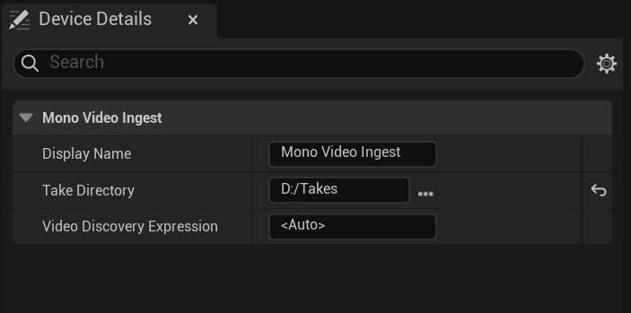

# 单目视频设备

> 路径：虚幻引擎5.7文档 / 为角色和对象制作动画 / 骨架网格体动画系统 / Live Link / LiveLink Hub / 捕获管理器 / 捕获管理器设备 / 单目视频设备

> 原始页面：https://dev.epicgames.com/documentation/unreal-engine/mono-video-device

**单目视频**设备让你可以将单个视频文件摄取为单目镜头试拍。 如果视频中包含音轨，那么摄取过程也会提取音轨。



- **显示名称（Display Name）**：**设备（Devices）**列表中的设备显示名称。
- **镜头试拍目录（Take Directory）**：视频文件所在根文件夹的路径。 此文件夹可包含子文件夹。
- **视频发现表达式（Video Discovery Expression）**：可从文件夹和文件名中提取的[令牌](index.md#discovery-expression-tokens)，用于识别镜头试拍。

**单目视频**设备预期在**镜头试拍目录**中找到的内容的直观示例如下：

Console Output

```
+-- takes|   +-- take_1.mov|   \-- take_2.mov|\-- take_3.mov
```

## 发现表达式令牌

**视频发现表达式**用于定义镜头试拍中的视频文件的命名规范。 可用的令牌如下：

|  |  |
| --- | --- |
| `<Slate>` | 场记板名称。 |
| **`<Name>`** | 摄像机的标识符。 |
| **`<Take>`** | 镜头试拍编号。 |
| **`<Any>`** | 任意有效字符串。 |
| `<Auto>` | 在不使用其他令牌的情况下，根据目录结构自动识别镜头试拍。 |

你可以使用定界符 `_-.\` 来分隔令牌。

> [!NOTE]
> 若未使用 `<Auto>` 令牌，那么 `<Slate>` 和 `<Name>` 都必须存在。

以镜头试拍`MyTakeFolder/MySlate_MyName_SomeString-005.mov`为例。 若视频发现表达式被设为默认值`<Auto>`，则识别以下令牌：

|  |  |
| --- | --- |
| **Slate** | `MySlate_MyName_SomeString` |
| **Name** | `video`（默认值） |
| **Take** | `1`（默认值） |

但若视频发现表达式被设为`<Slate>_<Name>_<Any>-<Take>`，则提取以下令牌：

|  |  |
| --- | --- |
| **Slate** | `MySlate` |
| **Name** | `MyName` |
| **Take** | `5` |
| **Any** | `SomeString` |

以上两种情况均会忽略拓展名`.mov`。
