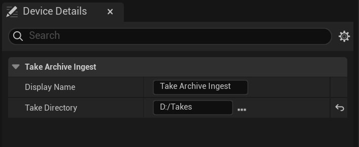

# 镜头试拍档案设备

> 路径：虚幻引擎5.7文档 / 为角色和对象制作动画 / 骨架网格体动画系统 / Live Link / LiveLink Hub / 捕获管理器 / 捕获管理器设备 / 镜头试拍档案设备

> 原始页面：https://dev.epicgames.com/documentation/unreal-engine/take-archive-device

**镜头试拍档案**设备让你可以摄取任意使用镜头试拍元数据文件（`.cptake`）识别的视频、音频、深度数据和校准数据。 如果你希望对数据的呈现方式拥有更多掌控，或镜头试拍的内容与其他**捕获管理器**设备不兼容，则可使用此设备。 该设备向下兼容**虚幻引擎**5.5及更早版本中的供捕获管理器和**MetaHuman Animator**使用而创建的镜头试拍。



- **显示名称（Display Name）**：**设备（Devices）**列表中的设备显示名称。
- **镜头试拍目录（Take Directory）**：`.cptake`元数据文件所在根文件夹的路径。 此文件夹可包含子文件夹。

**镜头试拍档案**设备预期在**镜头试拍目录**中找到的内容的直观示例如下：

Console Output

```
+-- take_1|   +-- top.mov|   |-- bot.mov|   \-- metadata.cptake||-- metadata.cptake\-- take_2.mov
```

## 镜头试拍元数据文件（.cptake）

镜头试拍元数据文件（`.cptake`）由用户创建，可描述镜头试拍的内容。 该文件让捕获管理器可以处理不符合其他设备预期的数据，或者让你取得更多控制权。

镜头试拍元数据文件中的信息使用JSON格式编码，并遵循一个模式，该模式位于`\Engine\Plugins\VirtualProduction\CaptureManager\CaptureManagerCore\Content\TakeMetadata\Schema`中。 根据该模式，每份镜头试拍都必须有`UniqueId`（指定为GUID）、`TakeNumber`、`Slate`和`Device`分段。 每份镜头试拍可选择性地拥有`Video`、`Depth`、`Audio`或`Calibration`等媒体内容的数组。

下面是一个单目视频镜头试拍的`.cptake`文件的最低限度示例：

Console Output

```
{
  "Version": {
    "Major": 4,
    "Minor": 2
  },
  "UniqueId": "2b42db4d-11e5-49ab-8a4d-a78212345597",
  "TakeNumber": 1,
  "Slate": "MySlateName",
  "Device": {
    "Name": "MyDeviceName",
```

### 支持的设备类型

兼容MetaHuman Animator的支持设备类型如下：

- StereoHMC
- iPhone

> [!NOTE]
> 在将**Live Link Face**的镜头试拍转换为`.cptake`格式时，请将`Model`的值设为原`take.json`文件中`deviceModel`的数值成分。 例如，如果`take.json`文件中的`deviceModel`为`iPhone14`,`3`，则请将新的`.cptake`元数据文件中的`Model`设为`14`,`3`。

### 支持的格式

`Video`分段支持的`Format`的值如下：

- mov
- mp4
- png
- jpg
- jpeg

`Depth` 分段支持的 `Format` 的值如下：

- mha_depth
- exr

`Audio` 分段支持的 `Format` 的值如下：

- wav
- mov
- mp4

`Calibration` 分段支持的 `Format` 的值如下：

- opencv
- mhaical
