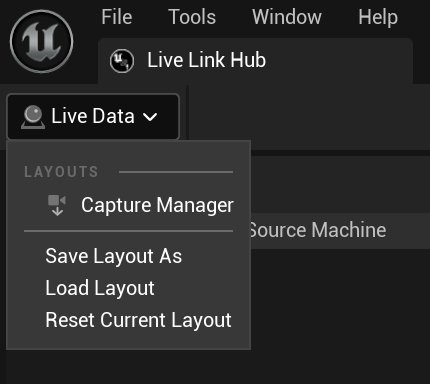
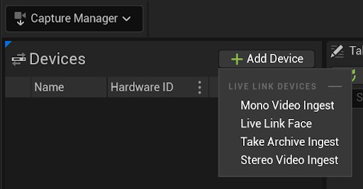
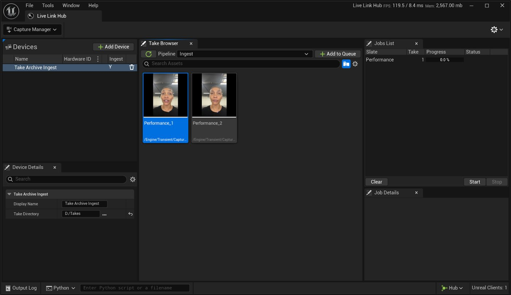
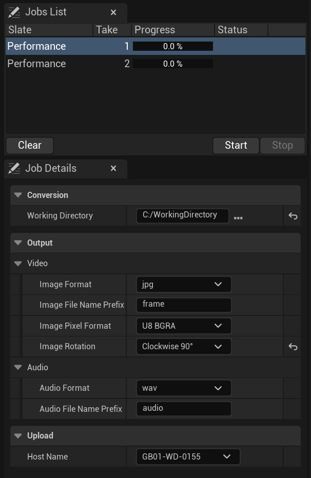

# 捕获管理器快速入门

> 路径：虚幻引擎5.7文档 / 为角色和对象制作动画 / 骨架网格体动画系统 / Live Link / LiveLink Hub / 捕获管理器 / 捕获管理器快速入门

> 原始页面：https://dev.epicgames.com/documentation/unreal-engine/capture-manager-quick-start

本页介绍了**捕获管理器**使用入门和进行镜头试拍摄取的基本步骤。 本文假定你已经熟悉了[Live Link Hub](../../index.md)，并已拍摄好了要摄取的素材。

## 启用捕获管理器编辑器插件

要使用**Live Link Hub**中的捕获管理器，你需要**捕获管理器编辑器（Capture Manager Editor）**插件。 该插件随**虚幻引擎**5.6或更高版本一起提供。

要在你的虚幻引擎项目中启用捕获管理器编辑器插件，请执行以下步骤：

1. 创建或打开虚幻引擎项目。
2. 转到虚幻编辑器的菜单栏，找到**编辑（Edit） > 插件（Plugins）**。 这将打开**插件（Plugins）**窗口。
3. 在此窗口中搜索"Capture Manager Editor"。
4. 启用**捕获管理器编辑器（Capture Manager Editor）**插件。

如需详细了解如何在项目中启用插件，请参阅虚幻引擎文档的[使用插件](../../../../../../understanding-the-basics/foundational-knowledge-in/working-with-plugins/index.md)页面。

> [!NOTE]
> 启用插件时，你可能会看到一条警告消息，即"你必须重启虚幻编辑器才能使更改生效（You must restart Unreal Editor for your changes to take effect）"。如果已启用所需的所有插件并准备重启虚幻编辑器，请点击**立即重启（Restart Now）**。

## 捕获管理器工作流程

捕获管理器摄取镜头试拍的工作流程包含以下步骤：

1. 要打开**捕获管理器**，请在**布局（Layouts）**下拉菜单中将其选中。

   
2. 点击**添加设备（Add Device）**并选择对应待摄取数据的选项。

   

   - **单目视频（Mono Video）**：将单个视频文件摄取为单目镜头试拍。 如果视频中包含音轨，那么摄取过程也会提取音轨。
   - **Live Link Face**：直接从运行[Live Link Face应用程序](https://dev.epicgames.com/documentation/metahuman/live-link-face-app?application_version=5.6)且已连接的iOS设备处摄取。
   - **镜头试拍档案（Take Archive）**：摄取使用镜头试拍元数据文件（`.cptake`）识别的任意镜头试拍视频、音频、深度和校准数据。
   - **立体视频（Stereo Video）**：将成对的视频文件摄取为立体镜头试拍。 视频还可能随附一份音频文件（`.wav`）。

   > [!TIP]
   > **镜头试拍档案**设备向下兼容供虚幻引擎5.5及更早版本中的捕获管理器和**MetaHuman Animator**使用而创建的镜头试拍。
3. 选择**管线（Pipeline）**以定义将在摄取期间执行的阶段。 支持的管线如下：

   - **摄取（Ingest）**：下载 （如果适用，从Live Link Face下载）、转换（转换为虚幻引擎所需的格式）以及（在虚幻引擎中）创建资产。
   - **下载（Download）**：仅下载 （如果适用，从Live Link Face下载）。
4. 在**镜头试拍浏览器（Take Browser）**中选择一份或多份镜头试拍，然后点击**添加到队列（Add to Queue）**，以将其添加到摄取队列。

   
5. 你可以在**作业细节（Job Details）**面板中编辑摄取的选项。

   
6. 准备好摄取**作业列表（Jobs List）**中的镜头试拍后，点击**开始（Start）**即可开始对应流程。

   |  |  |
   | --- | --- |
   | [作业列表开始](https://dev.epicgames.com/community/api/documentation/image/aa23ad58-6209-43da-875e-be16064896ab?resizing_type=fit) | [作业列表进行中](https://dev.epicgames.com/community/api/documentation/image/01b311d4-eb07-4ff6-8ed8-5d7a6536f4a8?resizing_type=fit) |

成功摄取所选镜头试拍后，系统将创建资产并在当前项目的**内容浏览器**中显示该资产。
