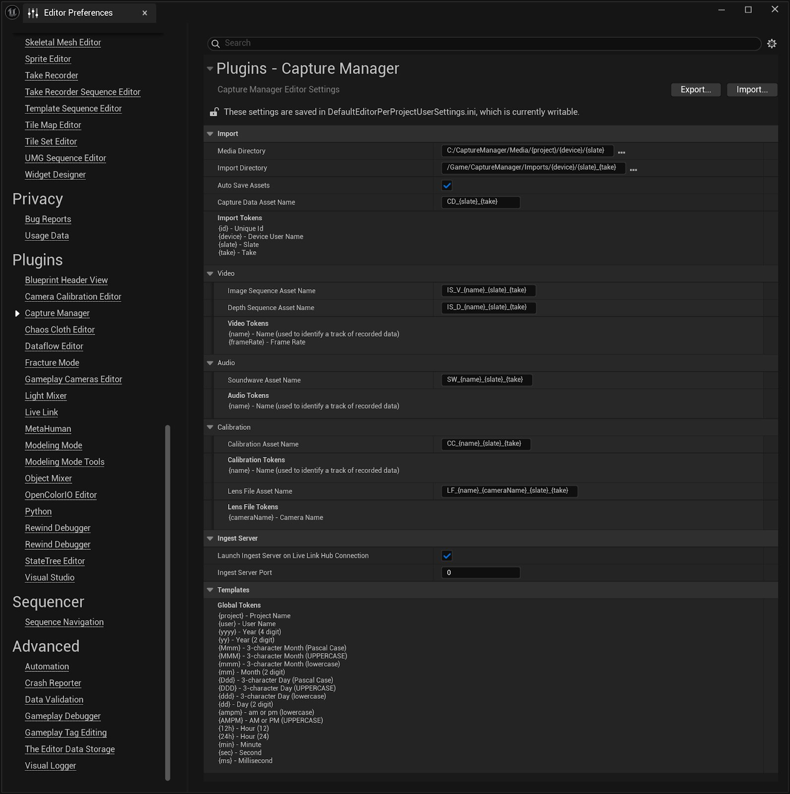

# 虚幻引擎编辑器偏好设置

> 路径：虚幻引擎5.7文档 / 为角色和对象制作动画 / 骨架网格体动画系统 / Live Link / LiveLink Hub / 捕获管理器 / 配置捕获管理器 / 虚幻引擎编辑器偏好设置

> 原始页面：https://dev.epicgames.com/documentation/unreal-engine/unreal-engine-editor-preferences

## 常规设置

**虚幻引擎**中的设置见[编辑器偏好设置（Editor Preferences）](../../../../../../../understanding-the-basics/foundational-knowledge-in/unreal-editor-preferences/index.md)。要进行访问，找到**编辑（Edit） > 编辑器偏好设置（Editor Preferences）**窗口，并找到**插件（Plugins） > 捕获管理器（Capture Manager）**分段。

> [!NOTE]
> 这些设置在UEFN中不可用。
>
> 

- **媒体目录（Media Directory）**：虚幻引擎客户端计算机上存储原始媒体数据（例如图像序列和音频文件）的位置。
- **导入目录（Import Directory）**：项目中创建已摄取资产的位置。
- **自动保存资产（Auto Save Assets）**：创建资产后是否应自动保存。
- **捕获数据资产名称（Capture Data Asset Name）**：摄取过程中创建的捕获数据资产的命名规范。
- **连接Live Link Hub时启动摄取服务器（Launch Ingest Server on Live Link Hub Connection）**：检测到与Live Link Hub的连接时启动摄取服务器。
- **视频/音频/校准资产名称（Video / Audio / Calibration Asset Name）**：摄取过程中创建的视频、音频和校准资产的命名规范。

你可以使用命名标记自动填充**媒体目录**、**导入目录**和**捕获数据**的部分内容，以及**视频/音频/校准**资产的名称。
