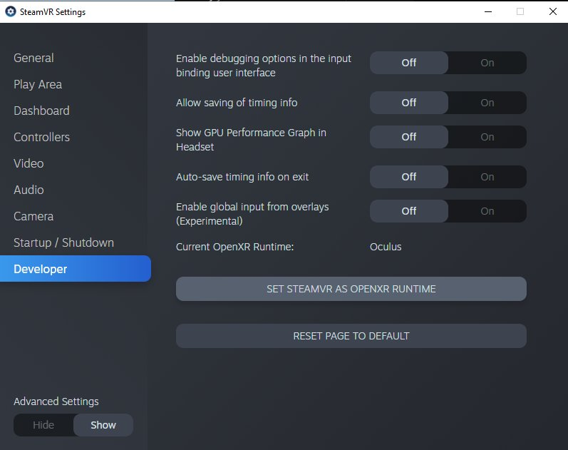

# LiveLinkXR

> 路径：虚幻引擎5.7文档 / 为角色和对象制作动画 / 骨架网格体动画系统 / Live Link / LiveLinkXR

> 原始页面：https://dev.epicgames.com/documentation/unreal-engine/livelinkxr-in-unreal-engine

**实时链接（Live Link）** 提供了一个公共接口，以将来自外部源的动画数据流送至虚幻引擎（UE）并进行处理。它被设计成可以通过虚幻插件进行扩展，允许第三方开发新的特性，并无需更改引擎和维持这些更改。

**LiveLinkXR** 将此功能扩展至可以用于XR设备。通过使用LiveLinkXR插件，你可以添加XR源，例如用于实时链接工具的Vive追踪器和HMD。

> [!NOTE]
> LiveLinkXR当前仅支持OpenXR。目前SteamVR平台支持通过OpenXR进行无标头渲染（在不触发渲染器的情况下运行RP）。要使用Vive追踪器，你必须运行SteamVR并将其设置为你的开放XR运行时：
>
> 

本文将介绍如何设置和配置LiveLinkXR插件，调整工具的各种设置，以及提供可能会用到的故障排除和变通方案步骤。

## 启用LiveLinkXR

1. 点击 **编辑（Edit）** 选项卡将其展开，在 **配置（Configuration）** 标题栏下，点击 **插件（Plugins）**。
2. 使用搜索框找到 **LiveLinkXR** 插件，然后点击 **启用（Enabled）**。
3. 在显示的框中，选择 **是（Yes）**。
4. 使用搜索框找到Vivetracker插件，并点击 **启用（Enabled）**。
5. 通过展开 **窗口（Window）** 选项卡并点击 **实时链接（Live Link）**，启动 **实时链接（Live Link）** 工具。
6. 关闭并使用命令行参数 `-xrtrackingonly` 重启引擎。

   示例：`D:\Program Files\UE_5.2\Engine\Binaries\Win64\UnrealEditor.exe -xrtrackingonly`

   如果不使用此命令行参数，你的追踪器、手柄和头显将只在VR预览模式或VR编辑器模式中可用。
7. 展开 **LiveLinkXR源（LiveLinkXR Source）** 选项，查看与其关联的各种设置。

### 源设置

利用LiveLinkXR源设置，你可以调整数据源并调整本地更新速率。

| **设置名称（Setting Name）** | **用途（Purpose）** |
| --- | --- |
| **追踪追踪器（Track Trackers）** | 追踪OpenXR中的所有Vive追踪器。 |
| **追踪控制器** | 追踪所有控制器。 |
| **追踪HMD** | 追踪所有HMD。 |
| **本地更新速率（赫兹）（Local Update Rate in Hz）** | 读取各个设备的追踪数据时采用的更新速率（以赫兹为单位）。 |

## 添加LiveLinkXR源

> [!NOTE]
> 尽管下面的流程是使用带追踪器的Vive HMD制定的，但你应该可以在SteamVR支持的任何VR设备上使用Live Link XR。

> [!WARNING]
> SteamVR必须正在运行才能添加新的LiveLinkXR源。如需了解如何设置SteamVR，请查看[SteamVR故障排除页面](https://support.steampowered.com/kb_article.php?ref=8566-SDZC-9326)。

启用LiveLinkXR插件并已根据需要调整设置后，就可以添加XR源。

1. 启动 **实时链接（Live Link）** 工具，展开 **源（Source）** 窗口，然后在 **LiveLinkXR源（LiveLinkXR Source）** 下，点击 **添加（Add）**。
2. 如果所有配置均正确，则点击 **添加（Add）** 之后，应该能够看到已添加到实时链接工具的表中的项。这些项应该对应你在 **数据源（Data Source）** 设置下已经选择的 **数据源（Data Source）**。

> [!NOTE]
> 如果要使用超过一个追踪器定位器（Tracker Puck），必须在SteamVR中使用SteamVR Vive追踪器设置窗口中设置每个定位器的角色：

## 将VR源与蓝图和网格体关联

启用LiveLinkXR插件之后，你的项目将获得LiveLinkXR蓝图和网格体的访问权限。这些宝贵的预制项可以帮助你入门。本节将带领你找到和使用这些项。

1. 导航至 **内容浏览器（Content Browser）**，展开 **视图选项（View Options）** 菜单，然后选择 **显示引擎内容（Show Engine Content）** 和 **显示插件内容（Show Plugin Content）**。
2. 你应该立刻就能看到新项显示在 **内容浏览器（Content Browser）** 导航窗口中。
3. 在 **内容浏览器（Content Browser）** 中，找到 **LiveLinkXR Content** 文件夹并打开其下的 **蓝图（Blueprints）**。
4. 将 **BP_LiveLinkXR_DataHandler** 拖到你的场景中。

   > [!NOTE]
   > 你可以验证通过Toggle Debug Vis（切换调试可视性）选项接收的追踪数据。通过使用 **切换调试可视性（Toggle Debug Vis）** 调试工具执行此操作。
   >
   > 1. 在
   >
   >    实时链接（Live Link）
   >
   >    中设置源并将
   >
   >    BP_LiveLinkXR_DataHandler
   >
   >    拖到你的场景之后，从
   >
   >    世界大纲（World Outlier）
   >
   >    中选择处理程序并导航至
   >
   >    细节（Details）
   >
   >    面板。
   > 2. 展开
   >
   >    默认（Default）
   >
   >    类别并点击
   >
   >    切换调试可视性（Toggle Debug Vis）
   >
   >    按钮。
   >
   > 1. 对于已设置的每个
   >
   >    实时链接源（Live Link Source）
   >
   >    ，关卡中都应显示一个
   >
   >    BP_LiveLinkXR_DebugVis
   >
   >    调试可视化。
   > 2. 这些项随后应根据其在真实世界的动作来移动。
5. 从 **世界大纲（World Outlier）** 中选择 **BP_LiveLinkXR_DataHandler** 并导航至 **细节（Details）** 面板。
6. 要添加新条目，请展开 **细节（Details）** 下的 **默认（Default）** 部分，然后点击 **Subject Name to Attached Actor（@@@）** 旁边的 **+** 按钮。
7. 在新元素旁边的文本框中，输入 **实时链接（Live Link）** 窗口中的 **主题名称（Subject Name）**。
8. 对要追踪的所有源，根据需要重复此流程。
9. 使用元素旁边的 **下拉菜单（dropdown menu）** 将 **追踪数据（tracking data）** 映射至场景中的 **对象（Object）** 或 **Actor**。

### 校准

你可以使用 **切换调试可视性（Toggle Debug Vis）** 旁边的 **校准（Calibrate）** 按钮，设置与世界中任意actor相关的新追踪源。在点击按钮之后，将使用LiveLink主题 **校准主题名称（Calibration Subject Name）** 中的转换来计算相对于 **校准目标Actor（Calibration Target Actor）** 转换的新世界原点转换。

1. 要充分利用校准功能，请首先从 **世界大纲（World Outliner）** 中选择 **BP_LiveLinkXR_DataHandler**。 在 **细节（Details）** 面板中，从 **校准目标Actor（Calibration Target Actor）** 旁边的下拉菜单中选择你关卡中的一个Actor。
2. 选择目标actor之后，在提供的框中输入 **校准主题名称（Calibration Subject Name）**。这应该与要追踪的LiveLink主题名称之一匹配。
3. 调整设置之后，点击

   切换调试可视性（Toggle Debug Vis）

   旁边的

   校准（Calibrate）

   按钮。
4. 请注意，设备的相对追踪原点现在相对于你的新校准。

左侧是BP_LiveLinkXR_DataHandler actor最初被拖动到关卡中时的位置信息。右侧是校准之后相对于关卡中另一个actor的位置信息。

## 使用不带HMD的Vive追踪器

默认情况下，无法使用不带HMD的Vive追踪器。本节简要介绍允许你在UE中使用不带HMD的追踪器的可能变通方案。

> [!WARNING]
> 本流程是可能的变通方案之一，不受Valve、HTC或Epic支持。它有可能意外停止工作，或导致SteamVR出现意外问题。除非你是SteamVR故障排除方面的专家，否则不建议尝试此变通方案。

1. 首先，完全关闭Steam和SteamVR。

   > [!TIP]
   > 关闭主程序之后，查看任务管理器中是否有任何仍在运行的Steam进程，确保完全关闭。
2. 在你的计算机上找到以下文件：`<Steam Install Directory> /steamapps/common/SteamVR/drivers/null/resources/settings/default.vrsettings`。
3. 复制文件并将"_BACKUP"添加到文件扩展名末尾。
4. 有几种方法可以备份此流程中介绍的文件。下面展示的方法是复制原始文件并更改文件扩展名。
5. 在文本编辑器中打开原始 `default.vrsettings` 文件。
6. 在 `driver_null` 对象中，将 `enable` 属性值从 `false` 更改为 `true`。

   > [!NOTE]
   > 如果使用的是nDisplay，请将 `windowWidth`、`windowHeight`、`renderWidth`和 `renderHeight` 设置为 **0** （零）。这有助于避免在屏幕中间出现无法最小化的VR编译器窗口。
7. 保存并关闭。
8. 找到以下文件：`<Steam Install Directory>/steamapps/common/SteamVR/resources/settings/default.vrsettings`。

   > [!NOTE]
   > 文件的名称相似，但它们位于不同的文件夹中。
9. 创建 `default.vrsettings` 文件的备份。
10. 在

    steamvr

    标题栏下，将

    requireHmd

    设置更改为

    false

    。
11. 在

    steamvr

    标题栏下，将

    forcedDriver

    设置更改为

    "null"

    。
12. 在

    steamvr

    标题栏下，将

    activateMultipleDrivers

    设置更改为

    true

    。
13. 更新正确的设置之后，文件应如下所示：

    ```
         "steamvr": {     "requireHmd": false,     "forcedDriver": "null",     "forcedHmd": "",     "displayDebug": false,     "debugProcessPipe": "",     "enableDistortion": true,     "displayDebugX": 0,     "displayDebugY": 0,     "allowDisplayLockedMode": false,     "sendSystemButtonToAllApps": false,     "loglevel": 3,     "ipd": 0.063,     "ipdOffset": 0.0,     "background": "",     "backgroundUseDomeProjection": false,     "backgroundCameraHeight": 1.6,     "backgroundDomeRadius": 0.0,     "environment": "",     "hdcp14legacyCompatibility": false,     "gridColor": "",     "playAreaColor": "",     "showStage": false,     "activateMultipleDrivers": true,
    ```
14. 保存并关闭

    default.vrsettings

    文件。
15. 启动

    Steam

    和

    SteamVR

    。
16. 由于你更改了SteamVR设置，可能需要重新运行

    空间校准（Room Calibration）

    。
17. 在完成空间校准之后，重新启动 **SteamVR**，你应该无需HMD便可追踪设备。
18. 准备好重新使用HMD之后，关闭

    SteamVR

    ，恢复

    备份中的已编辑文件（edited files from the backups）

    ，然后重新启动

    SteamVR

    。

## 故障排除

### SteamVR问题

如果你的HMD、控制器或追踪器未显示在SteamVR中，则他们不会显示在UE中。如果你在设置VR设备方面有任何问题，建议查看[Steam VR故障排除](https://support.steampowered.com/kb_article.php?ref=8566-SDZC-9326)指南寻求帮助。
