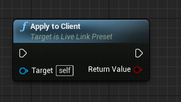
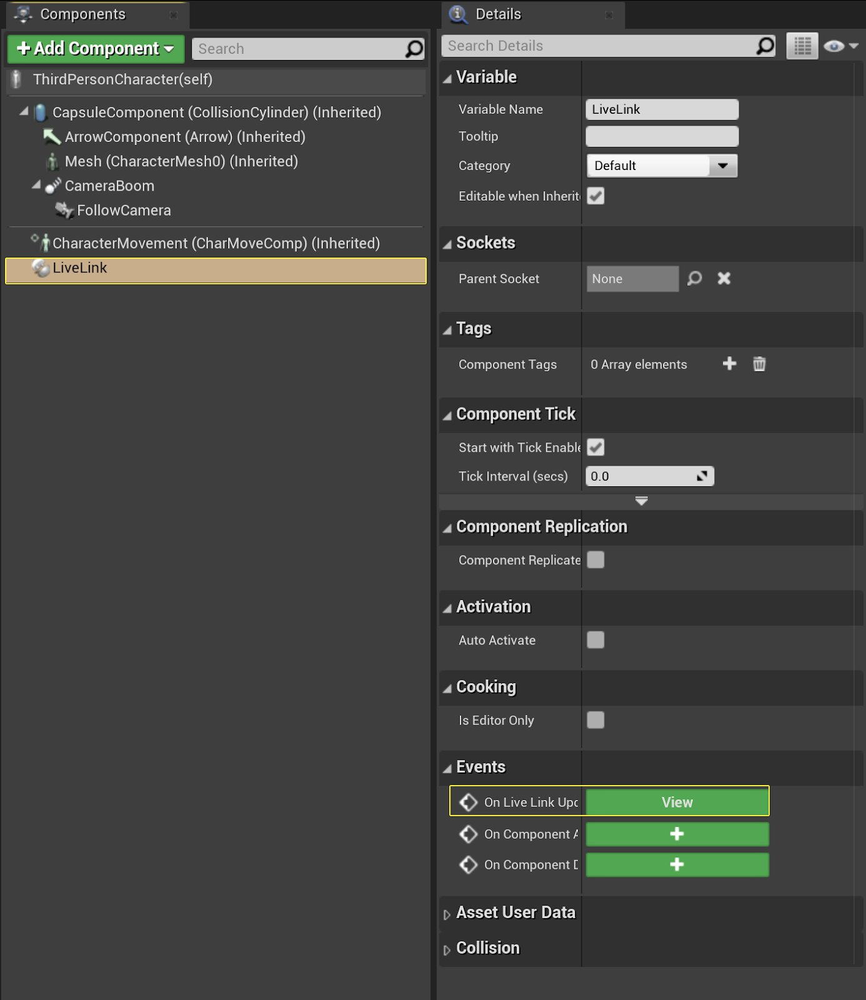
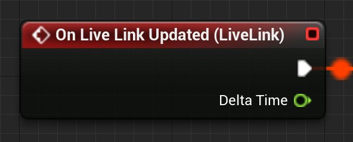
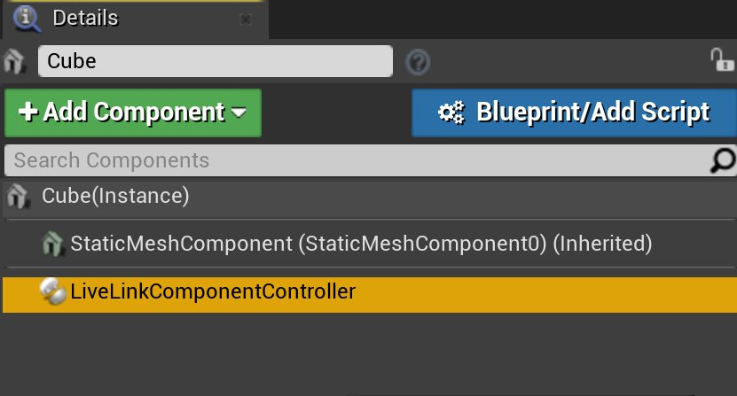
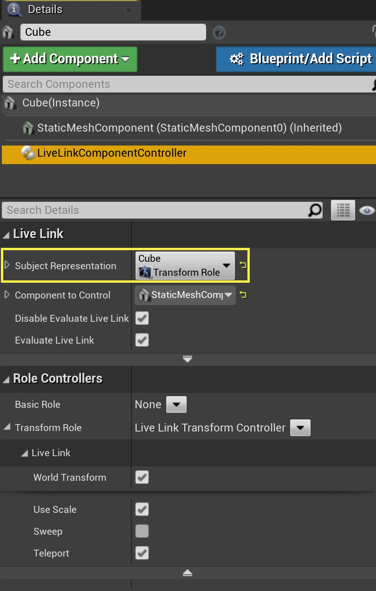
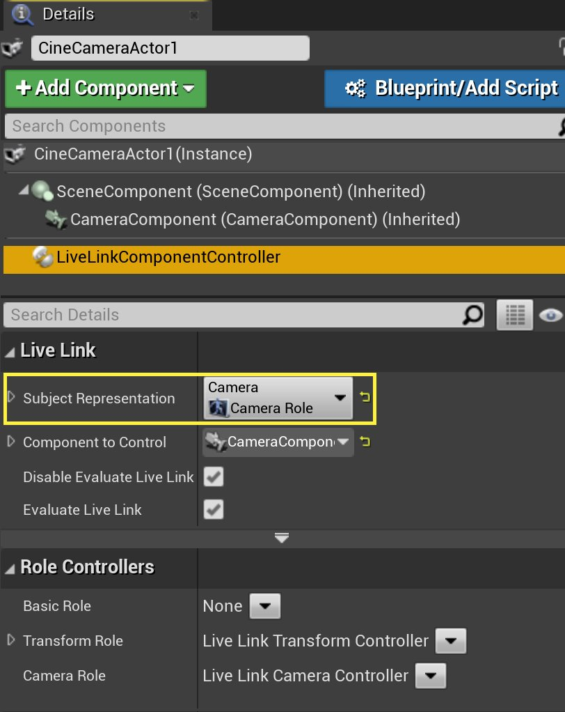
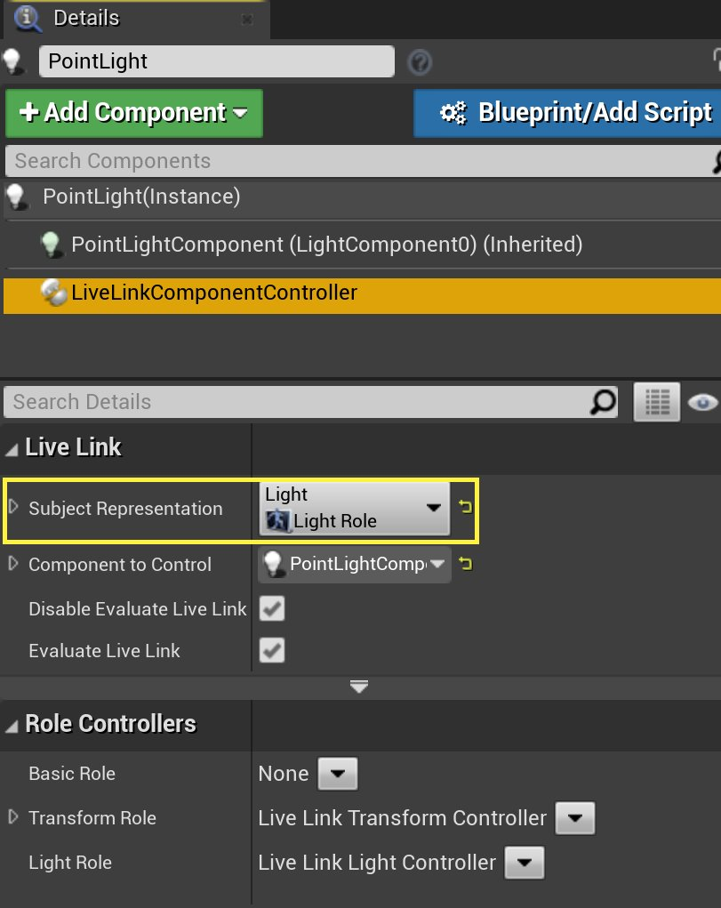
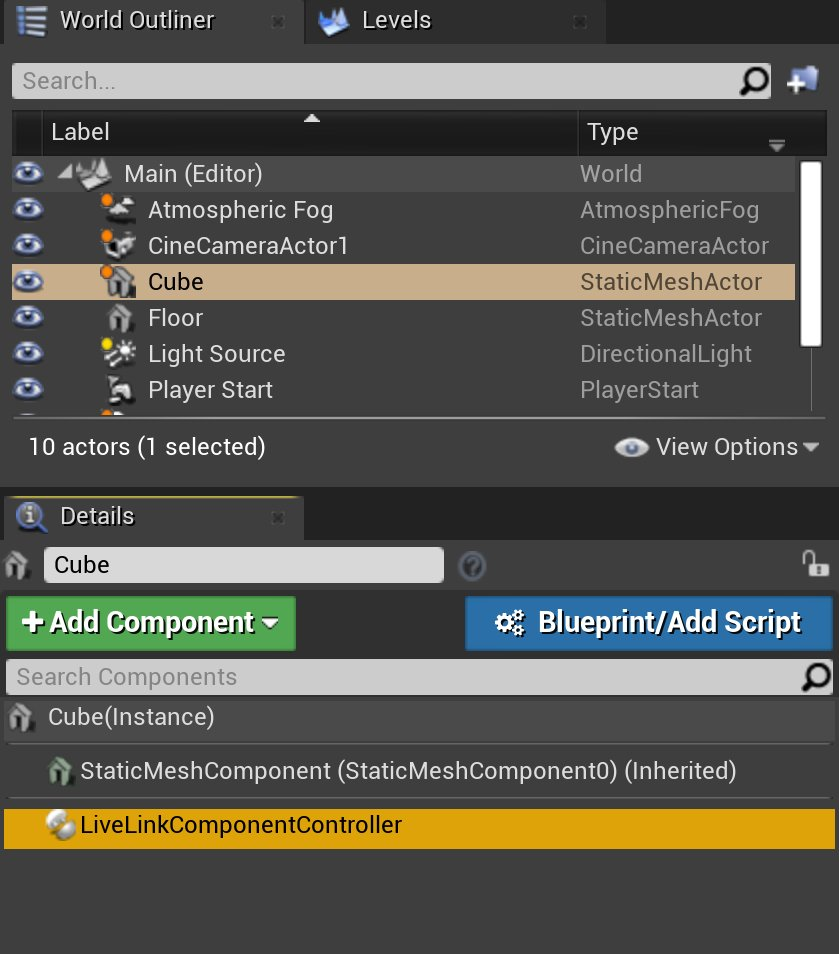

# 使用Live Link数据

> 路径：虚幻引擎5.7文档 / 为角色和对象制作动画 / 骨架网格体动画系统 / Live Link / 使用Live Link数据

> 原始页面：https://dev.epicgames.com/documentation/unreal-engine/using-live-link-data-in-unreal-engine

**Live Link**让用户可以从各种源头流送各种类型的数据，并将这些数据直接用于关卡中的Actor。 为改进此流程，**虚幻引擎**开发出了一些功能，旨在简化将Live Link数据应用于关卡中Actor的过程。

- **Live Link预设（Live Link Presets）**能保存数据源的设置，供日后使用。
- **LiveLink控制器组件（LiveLink Controller Component）**让你能使用LiveLink控制器。 它们能简化将Live Link信息用于Actor的过程，我们还添加了几个蓝图节点以方便收集这些数据。
- **LiveLink骨架动画组件（LiveLink Skeletal Animation Component）**能公开**OnLiveLinkUpdated**事件节点，该节点会在每次Live Link更新时检索关于主题和数据源的信息，并可通过蓝图执行若干其他功能。

如需详细了解如何启用Live Link并设置连接，请参阅[Live Link插件](../index.md)文档。

> [!NOTE]
> 在虚幻引擎4.23版之前，**LiveLink骨架动画组件（LiveLink Skeletal Animation Component）**被称为**Live Link组件（Live Link Component）**。

## Live Link预设

虚幻引擎会从[Live Link连接](../index.md)窗口中创建的各种源获取Live Link数据。 创建后，你可以将这些数据源保存为**预设（Presets）**，并使用**Apply to Client**节点来通过蓝图访问这些数据源。

可以利用此节点在应用程序启动时加载Live Link预设。

> [!TIP]
> 要激活Live Link预设，你还可使用Live Link面板的预设（Presets）按钮，或在项目设置（Project Settings）在菜单的**插件（Plugins） - Live Link**分段中设置**默认Live Link预设（Default Live Link Preset）**。 也可使用命令行'LiveLink.Preset.Apply Preset=/Game/Folder/MyLiveLinkPreset.MyLiveLinkPreset'应用预设。

## Live Link组件

### Live Link骨骼动画组件

用**组件（Components）**面板为Actor蓝图添加Live Link骨架动画组件后，该组件不会成为其他组件的子节点。 它会被单独保存在你的蓝图内，使你可以访问**On Live Link Updated事件**。

每次更新组件（包括编辑器内）时都会触发On Live Link Updated事件。

On Live Link Updated节点事实上取代了**Tick事件**，不同点在于，它还可以在编辑器内运行。 例如，如果你希望在编辑器内实时驱动一些数据，则可以使用此节点。

### Live Link控制器组件

Live Link控制器组件位于角色蓝图中，允许你使用Live Link控制器。 这些控制器会自动从Live Link对象获取数据，并通过Live Link控制器将这些数据应用到Actor中对应的组件。

## 使用Live Link控制器

Live Link控制器能快速获取Live Link数据，并流送给场景中的Actor。 每个控制器都会读取来自Live Link对象的数据，并自动应用到你选择的Actor身上。 根据情况，控制器分为三种不同种类：

- 变换（Transform）
- 摄像机
- 光源

有关这些不同的Live Link控制器的详细信息，请见下文。

### 变换（Transform）

变换控制器能从Live Link对象快速捕获变换数据，并将这些数据应用于关卡中的Actor。

此控制器提供以下选项：

| 设置 | 说明 |
| --- | --- |
| **世界变换（World Transform）** | 将组件的变换设置为世界空间。 取消选中则意味着设置为本地空间。 |
| **使用缩放（Use Scale）** | 使用来自Live Link的缩放数据。 |
| **扫描（Sweep）** | 扫描根组件并检查阻挡碰撞，沿途触发重叠，如果阻挡，则会在未达目标时停止。 |
| **瞬移（Teleport）** | 传送物理状态（如果启用了物理碰撞）。若勾选，则物理速度保持不变。若未勾选，则基于位置变化更新物理速度。 |

### 摄像机

摄像机控制器会将Live Link对象中的摄像机设置和移动数据以及摄像机角色直接应用到你关卡中的摄像机Actor。

可以做动画处理的摄像机设置包括：

- 视野（以角度为单位）
- 高宽比（宽/高）
- 焦距
- 以F值（F-stop）计算的摄像机孔径
- 摄像机焦距（厘米，仅支持手动聚焦）
- 摄像机投影模式（透视、正交等）

### 光源

光源控制器将Live Link对象中的光源设置以及光源角色直接应用到你关卡中的光源Actor。

可以做动画处理的光源设置包括：

- 色温（以开尔文为单位）。
- 总能量（勒克斯值）。
- 滤波器颜色。
- 内锥角（聚光源的角度）。
- 外锥角（聚光源的角度）。
- 光源可见影响（适用于点光源和聚光源）。
- 光源形状的软半径（适用于点光源和聚光源）。
- 光源形状的长度（适用于点光源和聚光源）。

> [!NOTE]
> 可以使用外部插件添加或创建额外的控制器。 如需详细了解外部插件，请参阅[插件](../../../../production-pipeline/plugins/index.md)文档。

### 将控制器应用于Actor

要应用Live Link控制器，首先将Live Link控制器组件添加到你的Actor：

> [!NOTE]
> 这一部分要求你已连接Live Link源。 如需详细了解如何连接到源，请参阅[Live Link插件](../index.md)文档。

请按以下步骤利用**细节（Details）**面板添加组件：

1. 选择关卡中的**Actor**。
2. 转到**细节（Details）**面板，点击**+添加组件（+ Add Component）**按钮，并搜索**Live Link控制器（Live Link Controller）**组件。
3. 添加后，在组件列表中选择该组件，打开**主题表示（Subject Representation）**下拉菜单。 从列表中选择要作为此Actor数据源的对象。 虚幻引擎将基于你的选择为你选择**要控制的组件（Component to Control）**。 必要时可以调整。

设置控制器后，你的Actor将开始从选定Live Link对象自动接收数据。

## 常见蓝图节点

可以通过各种蓝图节点访问Live Link数据。

### 获取Live Link主题

有时你需要获取主题列表才能使用**Evaluate Live Link Frame**节点。 此时你可以使用**Get Live Link Subjects**节点：

> 图片已省略：Get Live Link Subjects蓝图节点

这将返回Evaluate Live Link Frame函数认为有效的一组对象。

### 计算Live Link帧

调用Evaluate Live Link Frame函数可以获取与所提供的对象名称关联的Live Link数据。 此函数提供当前帧是否有效的执行引脚，以及可以从**数据结果（Data Result）**输出中访问的静态数据和帧数据。 此数据由选择用于评估对象的角色类型所确定。

下例显示直接从数据结构引脚访问的数据。

> 图片已省略：使用连接的输出对Live Link Frame蓝图节点求值

### 使用来自Evaluate Live Link Frame的数据

Evaluate Live Link Frame可以使用多个蓝图函数评估所提供的数据。 结果数据取决于评估的角色。 评估动画角色时，会看到以下内容：

- Get Basic Data
- Get Curves
- Get Metadata
- Get Root Transform
- Get Transform by Index
- Get Transform by Name
- Number of Transforms
- Transform Names

### Get Basic Data

**Get Basic Data**节点将返回当前主题帧中所存主题的基本结构。

> 图片已省略：Get Basic Data蓝图节点

### Get Curves

**Get Curves**函数让你可以获取所有混合形状或动画曲线，并将名称映射返回到各个条目的值。

> 图片已省略：Get Curves节点

你可以使用**Find**节点并输入名称以检索某个曲线的值（或使用布尔值确定是否找到了该值）。

> 图片已省略：Find Map节点

### Get Metadata

**Get Metadata**函数会返回主题帧中存储的主题元数据结构，你可拆分该结构以检索信息：

> 图片已省略：Get Metadata节点

字符串元数据是指定字符串在对象上的映射，例如你可能需要将某个要流送对象的类型作为一个指定字符串传递。 元数据还包括**场景时间码（Scene Timecode）**和**场景帧率（Scene Framerate）**，你可拆分其结构以获取所需信息。

| 输出 | 说明 |
| --- | --- |
| **字符串元数据（String Metadata）** | 指定字符串的映射，用于提供有关某个帧或对象的额外信息，例如"类型（Type）"："摄像机（Camera）"。 |
| **场景时间码（Scene Timecode）** | 与当前帧关联的时间码值。并不保证其唯一性，例如在MotionBuilder中编辑单个帧会导致为多个帧发送该帧的时间码。 |
| **场景帧率（Scene Framerate）** | 场景时间码对应的帧率。 |

### Get Root Transform

**Get Root Transform**函数会将主题帧的根变换以Live Link变换的形式返回（如果无变换，则返回身份）。

> 图片已省略：Get Root Transform节点

这将返回一个Live Link变换而非标准变换，因为可以在上面调用其他函数（下文中介绍）：

| 功能 | 说明 |
| --- | --- |
| **Child Count** | 返回给定Live Link变换的子项数。 |
| **Component Space Transform** | 返回给定Live Link变换（相对于你的型号的根）的根空间中的变换值。 |
| **Get Children** | 返回给定Live Link变换的子Live Link变换数组。 |
| **Get Parent** | 如果存在父项，返回父Live Link变换，如果不存在父项，返回身份变换。 |
| **Has Parent** | 返回给定Live Link变换是否有父变换。 |
| **Parent Bone Space Transform** | 返回给定Live Link变换的父空间中的变换值（它的内部存储方式，并无论父骨骼如何，均与之相关联）。 |
| **Transform Name** | 返回给定Live Link变换的名称。 |

### Get Transform By Index

**Get Transform By Index**函数会返回指定索引处的某个主题帧中存储的Live Link变换（如果变换索引无效，此函数返回一个身份变换）。

### Get Transform by Name

**Get Transform by Name**函数类似于**Get Transform by Index**，但获取的是变换名称（Transform Name）数据。

### Number of Transforms

**Number of Transforms**函数会返回主题帧内的变换数量。

> 图片已省略：Number of Transforms节点

其用例之一是与**Get Transform By Index**结合使用，以遍历并检索你的所有Live Link变换（类似于下方示例）：

> 图片已省略：遍历变换蓝图部分

点击查看大图。

### Get Transform Names

**Get Transform Names**函数会返回某帧中所有变换的名称数组。

> 图片已省略：Get Transform Names节点

## 使用蓝图应用Live Link预设

蓝图与Live Link的一个常见用法是，在运行时使用**Apply to Client**节点将Live Link预设分配给骨架网格体：

> 图片已省略：Apply to Client节点

1. 首先在Live Link面板中创建Live Link预设。 如需详细了解预设，请参阅[Live Link插件](../index.md)文档。
2. 在角色蓝图中，新建一个变量并在**细节（Details）**面板中将**变量类型（Variable Type）**设为**Live Link预设（Live Link Preset）**，从而创建预设的引用。
3. 编译你的蓝图，将新变量的默认值设置为你保存的Live Link预设。
4. 将该变量拖到蓝图中，并从菜单中选择**Get**。
5. 从该变量拖开引线，并搜索**Apply to Client**节点。
6. 将**Event Begin Play**节点连接到**Apply to Client**节点。
