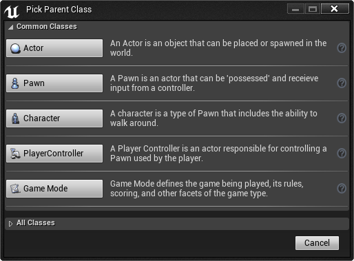

# 蓝图基础用户指南

> 路径：虚幻引擎5.7文档 / 蓝图可视化脚本 / 蓝图剖析 / 蓝图基础用户指南

> 原始页面：https://dev.epicgames.com/documentation/unreal-engine/blueprint-basic-user-guide-in-unreal-engine

本页面包含 **蓝图** 的最基本用例和常用操作，帮助你快速上手。

有关蓝图的更多详细信息，请参阅 [蓝图可视化脚本](../../index.md) 文档。

## 创建蓝图

可通过多种方法创建蓝图，第一种是通过使用 **内容浏览器** 中的 **添加（Add New）** 按钮：

1. 在 **内容浏览器（Content Browser）** 中，点击 **新增（Add New）** 按钮。
2. 从下拉菜单的 **创建基本资产（Create Basic Asset）** 部分中选择 **蓝图类（Blueprint Class）**。

   > [!NOTE]
   > 可通过 **创建高级资产（Create Advanced Asset）** 下的 **蓝图（Blueprints）** 选项来创建各种不同的[蓝图资产类型](../../specialized-blueprint-visual-scripting-node-groups/types-of-blueprints/index.md)。
3. 为蓝图资产选择 **父类（Parent Class）**。欲知更多信息，请参见[父类](../../specialized-blueprint-visual-scripting-node-groups/types-of-blueprints/blueprint-class-assets/index.md#%E7%88%B6%E7%B1%BB)。

   

选择类之后，新的蓝图资源将添加到 **内容浏览器** 中，你可以为它指定名称。

### 使用资源创建蓝图

也可以通过在 **内容浏览器** 中 **右键单击** 资源，然后在 *资源操作（Asset Actions）* 下选择 **使用此资源创建蓝图...（Create Blueprint Using This...）** 选项的方法创建蓝图。

> [!NOTE]
> 只能针对支持该选项的资源——静态网格体、骨架网格体、粒子效果、声音提示或声波等——使用该选项。如果所选择的资源不支持该选项，该选项将显示为灰色。

选择 **使用此资源创建蓝图...（Create Blueprint Using This...）** 选项之后，你将收到选择保存位置的提示。确认保存位置之后，蓝图将自动在蓝图编辑器中打开。

## 在关卡中放置蓝图

要在关卡中放置蓝图，你可以...

将它从 **内容浏览器** 中 **拖放到** 关卡中。

或者在 **内容浏览器** 中选中蓝图，然后在关卡中 **右键单击** 并从上下文菜单中选择 **放置Actor（Place Actor）**。

## 放置蓝图节点

在 **图表（Grap）** 中放置节点的方法有多种（请参阅 [放置节点](../../blueprint-workflows/placing-nodes/index.md) 了解更多信息），本部分将介绍最常用的方法以及如何连接节点。

多数情况下，可在蓝图图表中 **单击右键** 访问 **快捷菜单** 放置节点。

从上图菜单中展开任意类目（或子类目），然后选择需要的节点添加至图表中。

窗口右上角有一个名为 **Context Sensitive** 的选项。它为默认开启，禁用此选项后将基于当前上下文自动筛选菜单中显示的选项。

如下图所示，**Context Sensitive** 选项开启时 **单击右键** 并搜索 **Animation**，便会出现筛选列表。

然而，如取消勾选 **Context Sensitive** 并搜索 **Animation**，便会出现所有与 animation 相关的内容。

图表中 **单击右键** 呼出快捷菜单，也可拖动现有节点访问快捷菜单。

在上图中有一个 **Character Movement** 组件引用，拖动其输出引脚可添加连接上下文的节点。如下例所示，这些节点和被拖动的节点为相关。

在上图中，搜索 **Set Max Walk**，然后从菜单中选择 **Set Max Walk Speed** 对角色的最高步行速度进行设置。

## 连接蓝图节点

要连接节点,从一个引脚拖出引线并连接到同一类型的另一个引脚（在一些情况下将会创建转换节点，例如，将浮点输出连接到文本输入时将会在这两个引脚之间创建转换节点并自动转换和连接这两个节点）。

以下是两个节点间的基本连接，输入引脚和输出引脚的类型相同。

以下是正在进行的转换的示例。

- 请参阅

  蓝图编辑器速查表

  获取基于节点的更多操作和快捷键。

## 创建变量

**Variables（变量）** 是保存值或参考世界场景中的对象或Actor的属性。这些 属性可以由包含它们的 **蓝图（Blueprint）** 通过内部方式访问，也可以 通过外部方式访问，以便设计人员使用放置在关卡中的蓝图实例 来修改它们的值。

你可以在 **MyBlueprint** 窗口中为蓝图创建变量，方法是单击变量列表标题上的 **添加按钮 （+）**。

创建好变量之后，需要能够定义变量的属性。

- 有关变量类型和使用变量的更多信息，请参阅

  蓝图变量

  。
