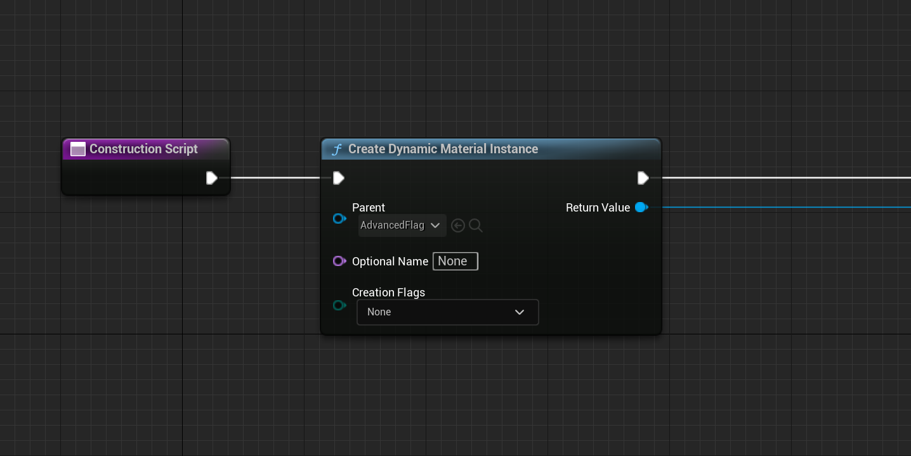
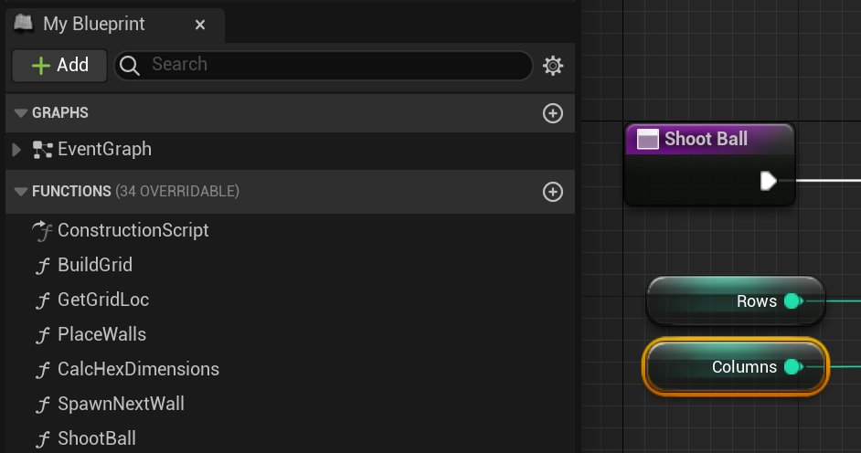

# 图表

> 路径：虚幻引擎5.7文档 / 蓝图可视化脚本 / 蓝图剖析 / 图表

> 原始页面：https://dev.epicgames.com/documentation/unreal-engine/graphs-in-unreal-engine

**图表（Graph）** 是一个节点网络，可连接到另一个节点网络以定义该网络的执行流。图表是在蓝图中实现功能的基础。 每个蓝图都可以包含一个或多个图表，具体取决于蓝图类型，这些图表定义了蓝图特定方面的实现。蓝图中的各个图表也可以包含 子图表，这些子图表本质上是折叠到其自身单独图表中的节点集合，主要用于组织用途。虽然一些专用类型的图标具有独特 属性，但包括添加变量应用、添加和连接节点以及调试在内的关键原则始终适用。

## 图表类型

### 事件图表

**事件图表（Event Graphs）** 是蓝图图表的最常见类型。每个新建的蓝图类（Blueprint Class）在创建时都将包含一个事件图表（Event Graph），但可以添加更多事件图表。这些追加的事件图表（Event Graph）可以 帮助组织你的蓝图网络。事件图表（Event Graph）通常包含蓝图的游戏进程行为的网络，而[事件](../../specialized-blueprint-visual-scripting-node-groups/events/index.md)、 [自定义事件](../../specialized-blueprint-visual-scripting-node-groups/events/custom-events/index.md)和 **输入（Input）** 节点则通过事件图表来启动执行流。

有关这一部分的更多信息，请参阅[事件图表](../event-graph/index.md)文档。

### 构造脚本

**构造脚本（Construction Scripts）** 对于蓝图类是唯一的，每个蓝图类中都只有一个构造脚本（ConstructionScript）。构造脚本（Construction Script）对蓝图类初始化很有用， 因为它们会在为蓝图类设置 **组件（Components）** 列表之后立即运行。

有关这一部分的更多信息，请参阅[构造脚本](../../specialized-blueprint-visual-scripting-node-groups/construction-script/index.md)文档。

### 函数

**函数（Functions）** 是属于特定 **蓝图（Blueprint）** 的节点图表，它们可以从蓝图中的另一个图表 执行或调用。函数具有一个由节点指定的单一进入点，函数的名称 包含一个执行输出引脚。当您从另一个图表调用函数时，输出执行引脚将被激活， 从而使连接的网络执行。

有关这一部分的更多信息，请参阅[函数](../../specialized-blueprint-visual-scripting-node-groups/functions/index.md)文档。

### 宏

**蓝图宏（Blueprint Macros）** 或 **宏（Macros）** 本质上与节点的折叠图相同。它们有一个由隧道节点 指定的入口点和出口点。每个隧道都可以有任意数量的执行或数据引脚，当在其他蓝图和图表中使用时， 这些引脚在宏节点上可见。

有关这一部分的更多信息，请参阅[宏](../../specialized-blueprint-visual-scripting-node-groups/macros/index.md)文档。

## 使用图表

无论你的图表是构造脚本（Construction Script）、事件图表（EventGraph）、函数（Function）还是宏（Macro），你都将在[编辑器](../../user-interface-reference-for-the-blueprints-vis-53faed96/index.md)的[图表](../../user-interface-reference-for-the-blue-73593f79/user-interface-breakdown/blueprints-visual-scripting-user-interface-for-871cf78a/index.md)模式中编辑它。从根本上说， 所有图表都包含由线路连接起来的节点网络。
