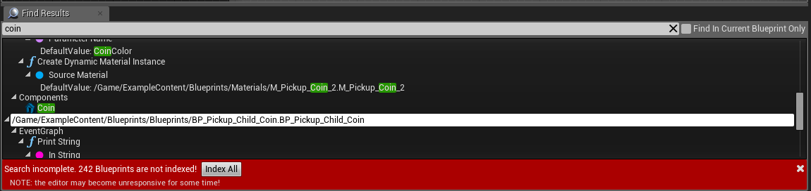

# 蓝图搜索

> 路径：虚幻引擎5.7文档 / 蓝图可视化脚本 / 蓝图剖析 / 蓝图搜索

> 原始页面：https://dev.epicgames.com/documentation/unreal-engine/searching-in-blueprints-in-unreal-engine

## 搜索蓝图

在蓝图编辑器中时，可点击 **工具栏** 中的 **Search** 或使用 **Ctrl+F** 呼出 [搜索结果（Find Results）](../../user-interface-reference-for-the-bl-73593f79/user-interface-components/find-result-panel-in-the-blueprints-visual-scri-5f9f8e6c/index.md) 窗口。 可在此处搜索蓝图中匹配搜寻条件的节点、引脚、引脚值、图表、变量和变量值。也可搜索动画图表。

右键单击蓝图中的节点或 **My Blueprint** 窗口中的元素， 然后点击 **Find References** 同样可以打开 **Find Results** 窗口，搜索栏填入元素名称和元素的 MemberGuid即使项目其他部分拥有多个该名称，这也能确保您搜索的是特定变量或函数。

搜索为异步过程，意味这搜索完成后即可使用编辑器。也可同时在不同蓝图中进行多项搜索。 它利用搜索数据的资源注册表，因此最近编入索引的数据固定和资源文件结合。

此工具默认搜索当前蓝图，取消勾选 **Find in Current Blueprint Only** 复选框后即可搜索项目中的所有蓝图。蓝图未在系统中编入索引时将显示下图中的提示：

点击 **Index All** 后进程将变得极慢，使编辑器停滞。因为此项将加载所有未编入索引的蓝图，并将它们重新保存以缓存搜索数据。如不希望 重新保存内容，或内容受源控制保护无法签出，它将直接加载所有蓝图资源，缓存内存中最新的搜索数据。 如未重新保存内容，每次打开编辑器时都需要执行 **Index All**。

## 高级搜索语法

过滤器是一项高级搜索功能，可针对蓝图中特定的数据子集进行搜索。 例如，可将拥有特定命名节点的蓝图或带特定名称和标记集的属性单独隔离出来。 它们可被嵌套和组合，形成每个特定需求的高级查询。部分过滤器只能在其他过滤器中使用，但所有过滤器均可用作起始点。 以下是搜索标记的非详尽列表，以及用作的数据类型。无需使用过滤器便可对所有标记进行搜索。

某些项目只能通过标记搜索，防止不使用标记进行搜索时出现混乱。这些项目以下标记为"(Explicit)"。当前仅可对用户添加的成员变量进行过滤。

以搜索字符串 `Nodes(Name=Coin)` 为例，它将找到蓝图中所有命名包含"coin"的节点。

| 过滤器 | 搜索标记 | 子过滤器 |
| --- | --- | --- |
| 蓝图 | Name ParentClass (Explicit) Path (Explicit) Interfaces (Explicit) | Graphs Functions Macros EventGraphs Nodes Pins Variables/Properties Components |
| Graphs Functions Macros EventGraphs | Name 说明 | Nodes Pins Variables/Properties（针对本地变量） |
| 节点 | Name ClassName (Explicit) Comment | 引脚 |
| Pins Variables/Properties Components | Name DefaultValue IsArray (Explicit) IsReference (Explicit) IsSCSComponent (Explicit) PinCategory (Explicit) ObjectClass (Explicit) |  |

> [!TIP]
> PinCategory 是引脚的类型，"布尔"、"字符串"、"Actor"、"MyBlueprint"。ObjectClass 是引脚/变量/组件所代表的结构体或对象。

### All 子过滤器

`All` 是一个特殊的子过滤器。嵌套在另一个过滤器中时，它可使其中的数据对通过过滤器的对象的所有子类进行测试。

范例：`Graphs(Name=MyFunction && All(Return))`

包含名称"MyFunction"的所有图表将对其所有子类（节点、本地变量和引脚）测试字符串"Return"。
