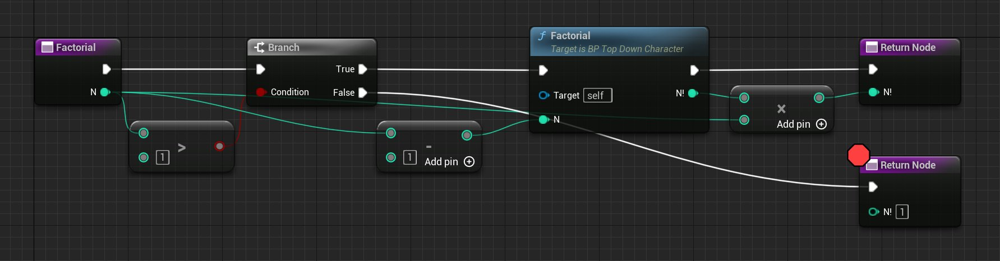
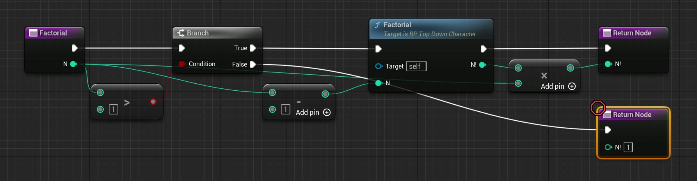
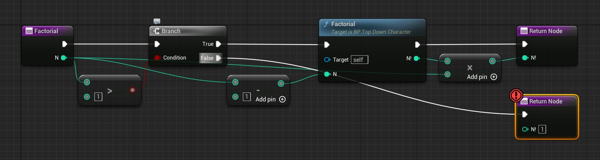
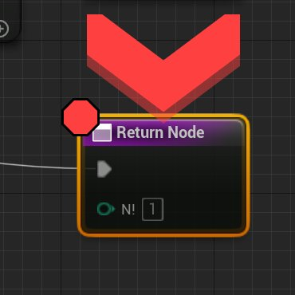
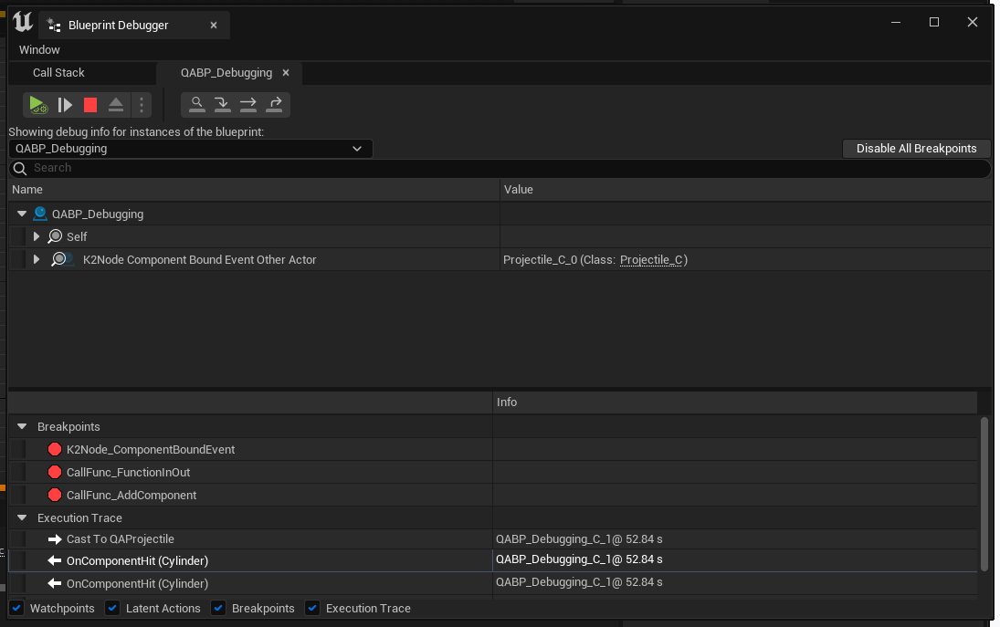
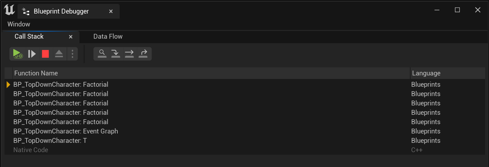

# 蓝图调试器

> 路径：虚幻引擎5.7文档 / 蓝图可视化脚本 / 蓝图调试器

> 原始页面：https://dev.epicgames.com/documentation/unreal-engine/blueprint-debugger-in-unreal-engine

使用蓝图调试器在 **在编辑器中运行（Play-In-Editor）** (**PIE**)或 **在编辑器中模拟（Simulate-In-Editor）** 模式期间暂停项目执行。暂停后，你可以使用 **断点** 单步调试蓝图或关卡蓝图图表。

## 调试功能按钮

项目正在运行时，蓝图调试器功能按钮在[工具栏](../user-interface-reference-for-the-blueprint-73593f79/user-interface-components/toolbar-in-the-blueprints-visual-scripting-editor/index.md)中会变为启用。

根据你所调试的蓝图类型以及调试会话的当前状态，工具栏上将显示不同的调试功能按钮。一些功能按钮仅在相关时显示，例如在到达某个断点时。

"蓝图调试器（Blueprint Debugger）"窗口可从"工具（Tools）"菜单或从蓝图编辑器中的"调试（Debug）"菜单打开。此窗口将在PIE或SIE模式处于活动状态时显示上下文相关调试按钮。

## 断点

**断点** 是可以放置在蓝图图表节点上的标识。

带有活动断点的节点在PIE或SIE模式期间即将执行时，模拟将暂停，你将导航至蓝图编辑器的图表视图中的节点。暂停后，你可以观察变量值并单步调试蓝图中的执行流。

给定蓝图的所有断点都显示在 **蓝图调试器（Blueprint Debugger）** 窗口中，并可以在选中时在蓝图的图表中查看。

要在节点上放置断点，请右键点击该节点，然后从上下文菜单选择 **添加断点（Add Breakpoint）**。放置之后，节点的左上角将显示实线红色八边形。要删除断点，可以右键点击该节点，或调试器窗口中该断点的条目，然后选择 **删除断点（Remove Breakpoint）** 。

此断点将在执行Print节点之前的时刻中断游戏。

要临时禁用断点而不将其完全删除，你可以右键点击蓝图节点，或调试器窗口中该断点的条目，然后从上下文菜单选择 **禁用断点（Disable Breakpoint）** 。

禁用的断点将显示为红色八边形的轮廓。禁用的断点只有在重新启用之后才会执行。相较于反复删除和重新创建断点，禁用断点更方便，也更不容易出现人为失误。

此断点已禁用，目前不会执行，但它可以根据需要重新启用。

要启用已禁用的断点，请 **右键点击** 该节点并选择 **启用断点（Enable Breakpoint）**，或点击 **调试器窗口（Debugger window）** 中该断点旁边的八边形图标。要实现此操作，你还可以在 **调试器（Debugger）** 窗口中 **右键点击** 该断点，然后选择 **启用断点（Enable Breakpoint）** 。

断点可以随时创建、禁用、启用或删除，包括在调试会话期间。断点保存在你的项目的 `.ini` 文件中，因此它们会在编辑器会话之间持久留存，但不会为你项目上的其他开发人员复制。

> [!NOTE]
> 如果断点放置在无效的位置，它将显示为带有感叹号的黄色图标。
>
> 编译蓝图有时会解决该问题，但如果未解决，将鼠标悬停在蓝图图标上会显示警告消息。

此断点无效，因而永远到达不了。在某些情况下，重新编译蓝图可能会解决此问题。

使用断点暂停执行时，编辑器将高亮显示节点，并在其上方放置一个红色大箭头。

刚到达此断点，并且执行已暂停。

## 观察

**观察（Watches）** 会跟踪蓝图节点引脚值，这样就可以在调试会话期间查看。

受到观察的引脚会保留图表中其节点最近一次执行期间分配的值。

要开始观察引脚，请右键点击蓝图图表中引脚的名称，并从上下文菜单选择 **观察此值（Watch this value）** 。你已经在观察的引脚将在上下文菜单中显示 **停止观察此值（Stop watching this value）**，而不是 **观察此值（Watch this value）**。

> [!NOTE]
> 在断点处停止时，将鼠标悬停在引脚上会显示交互式提示文本，其中包含更即时的调试信息，完全就像引脚被观察时你会在调试器中看到的那样。
>
> 尚未执行其节点的引脚没有可用的调试信息，并将显示表明此事实的消息，而不是显示数据值。
>
> 这是因为，仅当节点执行其底层代码至少一次时，引脚的值才会更新。
>
> 甚至蓝图变量节点也需要执行代码来检索变量的值，并且仅当另一个节点尝试访问其输出值时才会这样做。

## 蓝图调试器

**蓝图调试器（Blueprint Debugger）** 将窗口显示断点、观察点和执行追踪堆栈。

此窗口还包含执行功能按钮，可用于在使用断点时停止、恢复或单步调试代码。

你可以使用选项卡在完整执行调用堆栈和特定蓝图实例的断点、观察、调用堆栈信息之间切换。

### 数据流选项卡

**数据流选项卡（Data Flow tab）** 会显示你想观察的所有数据，以加快调试。

它支持对象筛选，以列出你所选蓝图类的所有实例，并且可以检查此蓝图中的所有属性。

你可以观察你在编辑器中打开的且属于当前调用堆栈的蓝图类。

执行暂停时，你可以看到使用当前数据填充的合并调用堆栈。

你可以在此处的蓝图之间跳转，以检查属性值和节点输出。

此视图支持扩展数组、集、映射和其他数据结构，使你能够高效地观察它们所包含的数据。

### 调用堆栈

蓝图调试会话期间可用的 **调用堆栈（Call Stack）** 在概念上与大部分C++开发环境中的调用堆栈相似。

调用堆栈显示了蓝图可视脚本函数与原生（C++）代码函数之间的执行流。当前正在执行的蓝图可视脚本函数将在堆栈顶部列出。

> [!NOTE]
> 蓝图宏不在调用堆栈中显示。而是哪个函数调用了它们，它们就作为这个函数的一部分显示。

上述蓝图函数以递归方式执行阶乘计算。函数结尾已经放置了断点

到达断点时，调用堆栈会列出当前正在执行的函数，从顶部的当前函数开始，向下继续到发出调用的函数。

这意味着，每行条目包含其正下方所列函数调用的函数的名称。在递归（自我调用）函数的情况下，相同的函数名称可能会在堆栈中多次出现。

此调用堆栈将显示对如上所示阶乘函数的五级递归调用。该函数最初从Actor的主蓝图图表调用，后者转而由从原生（C++）代码调用的 BeginPlay 事件触发。

### 执行追踪

**执行追踪（Execution Trace）** 堆栈将显示已执行的节点的列表，其中最近的节点列在顶部。

随着你在调试时单步调试图表，此列表会更新。
