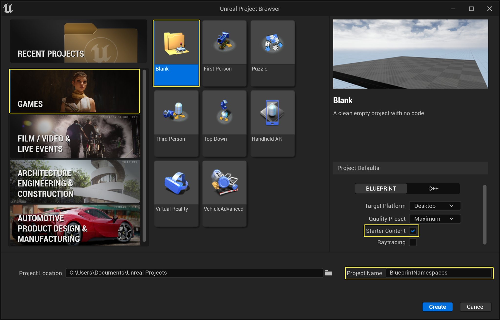
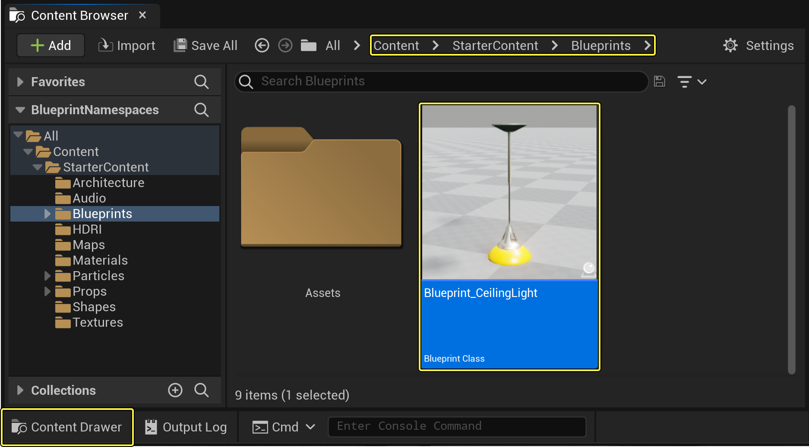
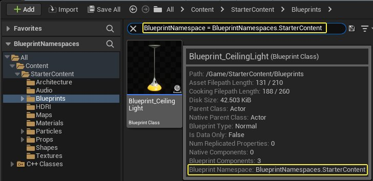

# 蓝图命名空间

> 路径：虚幻引擎5.7文档 / 蓝图可视化脚本 / 蓝图简介 / 蓝图命名空间

> 原始页面：https://dev.epicgames.com/documentation/unreal-engine/blueprint-namespaces-in-unreal-engine

## 蓝图命名空间

**蓝图命名空间（Blueprint Namespaces）** 可以防止加载不必要的资产，从而加快蓝图资产的打开时间。这对于大型项目非常有用，因为引擎通常会在初始化时会加载所有[蓝图函数库](../../blueprints-technical-guide/blueprint-function-libraries/index.md)和[宏库](../../specialized-blueprint-visual-scripting-node-groups/types-of-blueprints/blueprint-macro-library/index.md)资产，不论你要用的蓝图是否引用了这些库。

通过将资产分组成为蓝图命名空间，你可以推迟资产的加载时间，让它们在需要时才加载。在蓝图编辑器中操作时，使用蓝图命名空间还有另外一种好处，那就是蓝图资产可以在上下文菜单中采取的操作，都会过滤到其蓝图命名空间。

### 使用此功能

如需查看此功能的运行示例，请按照以下步骤操作：

1. 首先，点击一个新 **游戏（Games）** > **空白项目（Blank Project）** > 将 **初学者内容包（Starter Content）** 命名为 **BlueprintNamespaces** 。

   
2. 点击 **内容侧滑菜单（Content Drawer）** 将其打开，然后导航到 **初学者内容包（Starter Content）** > **蓝图（Blueprints）** ，双击 **Blueprint_CeilingLight** 蓝图以打开其 **类默认值（Class Defaults）** 。

   
3. 在 **工具栏（Toolbar）** 中，点击 **类设置（Class Settings）**，然后导航到 **细节（Details）** 面板中的 **蓝图选项（Blueprint Options）** 类别。在 **蓝图命名空间（Blueprint Namespace）** 变量中，将命名空间键入到文本字段中。

   

   在示例中，我们将蓝图命名空间命名为 "BlueprintNamespaces.StarterContent"

   > [!NOTE]
   > 在将命名空间输入到"蓝图命名空间（Blueprint Namespace）"文本字段中时，编辑器将验证字符串以确保其中不包含任何不兼容的字符，例如"#"或","。
4. 点击 **编译（Compile）** 并 **保存（Save）** **蓝图（Blueprints）** 。

   
5. 导航到 **内容浏览器（Content Browser）** ，将鼠标悬停在 **Blueprint_CeilingLight** 资产上，阅读用于显示命名空间数据的提示文本。

   

   在启动编辑器之后，可以通过在内容浏览器中搜索"BlueprintNamespace=StarterContent"来查看哪些库资产已经分配了命名空间。

   > [!NOTE]
   > 如果打开的蓝图资产中包含对某个新创建资产的引用，则该蓝图资产作为引用资产的蓝图程序包导入依赖项。如果新蓝图基于已经引用了此类资产之一的父蓝图类，则也会发生同样的行为。

## 导入命名空间

导入过程类似于在 `.cpp` 源文件中为库标题添加"#include"。在使用蓝图命名空间时，可以通过以下任一方法导入命名空间。

### 设置蓝图命名空间

通过按照以下步骤进行操作，可以将蓝图命名空间添加到你希望在编辑器中具有访问权限的命名空间组：

1. 打开 **内容侧滑菜单（Content Drawer）** ，然后双击 **蓝图（Blueprints）** 以打开其 **类默认值（Class Defaults）** 。
2. 在 **工具栏（Toolbar）** 中，点击 **类设置（Class Settings）**，导航到 **细节（Details）** 面板中的 **蓝图选项（Blueprint Options）** > **蓝图命名空间（Blueprint Namespaces）** 类别，然后在文本字段中键入命名空间。
3. 在 **工具栏（Toolbar）** 中，点击 **编译（Compile）** 并 **保存（Save）** 。

   > [!NOTE]
   > 打开蓝图时，任何设置为相同命名空间的共享库资产在蓝图编辑器初始化时都会自动导入。

### 修改编辑器偏好设置或项目设置

如果你更喜欢能够为所有蓝图资产自动导入共享库资产的工作流，那么可以修改 **编辑器偏好设置（Editor Preferences）** 或 **项目设置（Project Settings）** ，以确保编辑器导入共享库资产的指定子集，而无论打开的蓝图是属于该命名空间还是导入该命名空间。

> [!NOTE]
> 对编辑器偏好设置进行编辑将影响用户的本地示例，而对项目设置进行编辑将会把更改应用到整个项目范围。这将影响在你的项目宏共享源控制权限的所有用户。

要为本地编辑器实例设置默认导入设置，请执行以下操作：

1. 在 **工具栏（Toolbar）** 中，导航到 **编辑（Edit）** > **编辑器偏好设置（Editor Preferences）** > **内容编辑器（Content Editors）** > **蓝图编辑器（Blueprint Editor）** > **试验（Experimental）** ，在 **始终包含的命名空间（Namespaces to Always Include）** 字段中，点击 **添加（Add）** （**+**）按钮将命名空间作为元素添加到列表中。

   导航到编辑器偏好设置之后，即可在本地修改为蓝图编辑器设置的全局命名空间。

要为所有用户自定义你的项目，以确保共享库资产的某个子集总是在整个项目范围中被导入，可以通过以下步骤启用该功能：

1. 导航到 **编辑（Edit）** > **项目设置（Project Settings）** > **编辑器（Editor）** > **蓝图项目设置（Blueprint Project Settings）** > **试验（Experimental）**，然后在 **始终包含的命名空间（Namespaces to Always Include）** 数组列表中，点击 **添加（Add）** （**+**）将命名空间添加到列表：

   在项目设置中，我们已经编辑了蓝图项目设置以包含名为"BlueprintNamespaces.StarterContent"的命名空间。

- 你可以通过点击 **添加（Add）** （**+**）按钮，为蓝图显式导入一个或多个命名空间。
- 添加一个导入将会立即加载当前分配到命名空间的任何共享库。
- 移除一个导入不会对编辑器中的性能造成任何负面影响，但是将不再具有与该命名空间关联的类型和操作菜单过滤行为。

### 隐式导入命名空间

可以通过选择上下文菜单中的一个非导入类型或操作项来隐式导入命名空间。在选择非加载的类型选择器后，该类型的文件包将加载到所选的强引用类型上。

> [!NOTE]
> 这样看起来可能会破坏自动导入行为，但是，选择非导入类型需要采取额外的隐式导入步骤，如此才能将该类型的名称空间添加到上文介绍的蓝图显式导入。

要查看此功能的运行方式，请执行以下方式：

1. 创建名为 **TestType** 的新蓝图资产，然后导航到 **类设置（Class Settings）** > **细节（Details）** > **蓝图选项（Blueprint Options）** ，并将其分配到名为"YourNameSpace.AutoImportTest"的名称空间：

   在示例中，我们将蓝图命名空间命名为 BlueprintNamespaces.AutoImportTest。
2. 点击 **编译（Compile）** 和 **保存（Save），然后重新启动编辑器。
3. 点击 **内容侧滑菜单（Content Drawer）**，然后导航到 **内容（Content）** > **初学者内容包（Starter Content）** > **蓝图（Blueprints）** ，双击 **Blueprint_CeilingLight** 蓝图以打开其 **类默认值（Class Defaults）** 。

   > [!NOTE]
   > 可以打开任何现有的蓝图，或创建新蓝图。在示例中，我们选择使用现有的Blueprint_CeilingLight。
4. 在 **类默认值（Class Defaults）** 中，导航到 **我的蓝图（My Blueprint）** > **变量（Variables）** ，然后点击 **添加（Add）** （**+**）创建名为 **TestTypeVar** 的新变量。
5. 点击 **布尔值（Boolean）** 下拉箭头，打开引脚类型选择器，然后在文本字段中搜索并选择 **TestType** ，然后选择 **对象引用（Object Reference）** 。
6. 点击 **类设置（Class Settings）** ，然后导航到 **细节（Details）** 面板 > **导入（Imports）** > **导入的命名空间（Imported Namespaces）** ，此时将看到 YourNamespace.AutoImportTest 已显示在"导入的命名空间（Imported Namespaces）"类别中。

使用自动导入功能不需要取消加载该类型。命名空间（如果是非全局并且尚未导入）在选择时将会自动导入。启用命名空间导入功能将自动导入该资产的命名空间至蓝图中。

- 如果更改任何函数输入参数的默认值，则本地变量将导入与该值关联的任何命名空间。
- 更改结构体或容器类型的默认值将导入与容器的内部值和结构体子成员属性关联的任何命名空间。
- 在组件面板中添加任何新组件将会自动导入与该选定的组件类型关联的任何命名空间。此行为还会应用到非导入的组件类型。

## 过滤非导入类型和操作

默认情况下，非导入类型和操作显示在上下文菜单中，但如果你希望为非导入类型启用额外的过滤层，请执行以下操作：

1. 点击 **内容侧滑菜单（Content Drawer）** ，然后点击 **添加（Add）（+） > 创建高级资产（Create an Advanced Asset） > 蓝图（Blueprints） > 蓝图函数库（Blueprint Function Library）** ，找到名为 **Bp_FilterFunctionLibrary** 的蓝图函数库。
2. 双击 **Bp_FilterFunctionLibrary** ，打开其 **类默认值（Class Defaults）** 。在 **我的蓝图（My Blueprint）** 中，导航到 **函数（Functions）** 类别，将 **NewFunction_0** 重命名为 **FilteredFunction_0** 。找到 **类设置（Class Settings）** ，然后导航到 **细节（Details）** > **蓝图选项（Blueprint Options）** > **蓝图命名空间（Blueprint Namespaces）** ，然后输入"YourNamespace.FilterTest"。

   在示例中，此名称为"BlueprintNamespaces.FilterTest"。
3. 点击 **添加(+)（Add (+)）** 按钮，创建名为 **FilteredFunction_1** 的新函数。
4. 点击 **类设置（Class Settings）** ，然后在 **细节（Details）** 面板中，导航到 **蓝图选项（Blueprint Options）** > **蓝图命名空间（Blueprint Namespaces）** ，然后从下拉菜单中选择命名空间"YourNamespace.FilterTest"（在下面展示的示例中，此名称变为"BlueprintNamespaces.FilterTest"）。
5. 点击 **编译（Compile）** 和 **保存（Save）** 。
6. 导航到 **内容（Content）** > **初学者内容包（Starter Content）** > **蓝图（Blueprints）** ，然后双击 **Blueprint_CeilingLight** 打开其 **类默认值（Class Defaults）** 。
7. 在 **类默认值（Class Defaults）** 中，导航到 **事件图表（Event Graph）**，然后右键点击以打开 **操作（Actions）** 菜单。在搜索 **过滤出的函数（Filtered Function）** 时，它将显示在上下文菜单中。
