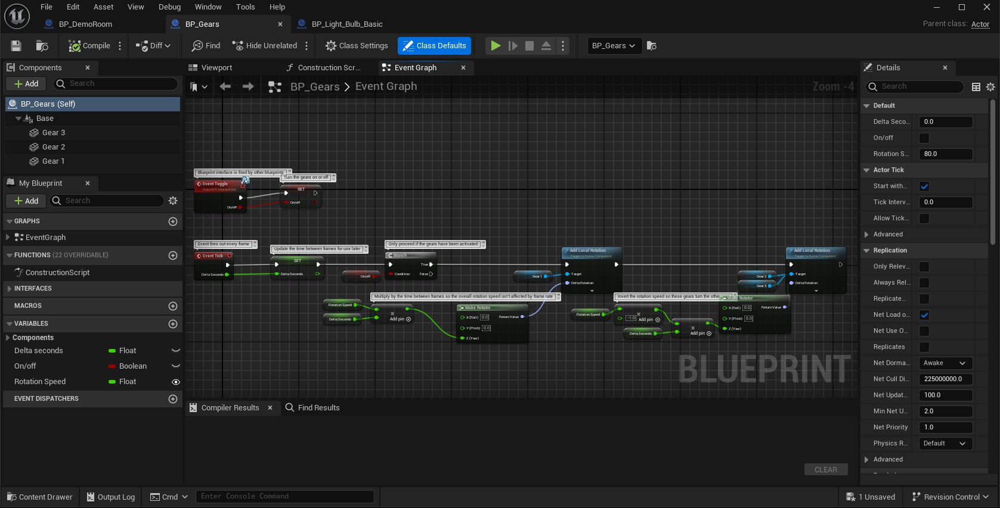

# 蓝图简介

> 路径：虚幻引擎5.7文档 / 蓝图可视化脚本 / 蓝图简介

> 原始页面：https://dev.epicgames.com/documentation/unreal-engine/introduction-to-blueprints-visual-scripting-in-unreal-engine

虚幻引擎中的 **蓝图可视化脚本（Blueprint Visual Scripting）** 系统是使用基于节点的接口创建Gameplay元素的可视化编程语言。基于节点的工作流程为设计师提供了通常只有程序员才能使用的广泛脚本概念和工具。此外，在虚幻引擎的C++实现方案中，可用的蓝图特有标记可以让程序员创建基线系统，并让设计师扩展这些系统。

就像许多常用的脚本语言，你可以使用该系统在引擎中定义面向对象（OO）的类或对象。系统连同你定义的对象常常直接称为"蓝图"。

### 必备知识

我们推荐先了解以下主题，然后再继续阅读该页面：

- 虚幻引擎术语
- 虚幻引擎中的关卡

## 蓝图的用法

蓝图的工作方式是将节点图表用于各种用途，例如对象构造、单独的函数和通用Gameplay事件。你可以使用引线连接事件、函数、变量的节点来创建Gameplay元素。

## 常用蓝图类型

最常使用的蓝图类型是 **关卡蓝图** 和 **蓝图类**。

完整类型列表请参见[蓝图类型](../specialized-blueprint-visual-scripting-node-groups/types-of-blueprints/index.md).

## 关卡蓝图

关卡蓝图包含地图中关卡特有事件的逻辑。每个关卡都有一个关卡蓝图，它可以：

- 引用和操控关卡中的Actor
- 使用

  关卡序列Actor

  控制过场动画
- 管理关卡流送

关卡蓝图还可以与关卡中放置的蓝图类交互，例如读取变量和触发自定义事件。更多信息请参阅[关卡蓝图](../specialized-blueprint-visual-scripting-node-groups/types-of-blueprints/level-blueprint/index.md)。

## 蓝图类

蓝图类定义了可以作为实例放入地图中的新类或Actor类型。编辑整个项目中使用的蓝图类将更新其所有实例。

蓝图类是创建门、开关、可收集物品、可摧毁场景等交互资源的理想类型。更多详情请参见[蓝图类](../specialized-blueprint-visual-scripting-node-groups/types-of-blueprints/blueprint-class-assets/index.md)。

## 蓝图的其他作用

以下主题是你可以使用蓝图系统实现的一些示例。

## 使用构造脚本创建可自定义的预设

> 图片已省略：构造脚本

[构造脚本](../specialized-blueprint-visual-scripting-node-groups/construction-script/index.md)是蓝图类中的一类图表，在编辑器中放置或更新Actor时该蓝图类将执行（不会在游戏进程中执行）。利用此脚本可十分容易地创建可自定义的道具，以改进环境美术师的工作流程。例如，自动更新材质来匹配自身点光源组件颜色与亮度的光照设备；或是将植物网格体在区域中随机散射的蓝图。

在[内容示例](../../samples-and-tutorials/content-examples-sample-project/index.md) 地图中，包含所有例子（以上图标所示）的演示房间是由多个组件组合而成的单个蓝图。蓝图的构造脚本会根据蓝图 **细节** 面板中公开的参数创建不同静态网格体和光源。使用内容示例地图，我们可进入演示房间蓝图中，设置长度、高度和生成的房间数（以及另一些选项），片刻后便能创建出完整的房间组合。

## 创建可操作角色

[Pawns](../../gameplay-systems/gameplay-framework/pawn/index.md)同样也是蓝图类的其中一种，是玩家可控制的Actor的物理表示。使用Pawn类，你可以需要的所有元素组合起来，创建一个可操作的[角色](../../gameplay-systems/gameplay-framework/pawn/characters/index.md)，从而操纵[摄像机](../../gameplay-systems/gameplay-framework/cameras/index.md)行为，设置鼠标、控制器和触摸屏的输入事件，并创建用于处理骨架网格体动画的动画蓝图资源。

角色蓝图内置了移动、跳跃、游泳和坠落所需行为的角色组件。要完成设置，你必须依照玩家控制角色的方式添加输入事件。

详情请参见[设置角色动作](https://dev.epicgames.com/documentation/unreal-engine/setting-up-character-movement)。

## 创建HUD

蓝图脚本同样可用于创建游戏的HUD（抬头显示）。与蓝图类的设置相似，蓝图脚本包含事件序列与变量，但其被指定至项目的GameMode资源，而非直接添加至关卡。

可设置HUD来读取其他蓝图中的变量，以显示生命条、更新分数、显示任务标志等。HUD还可用于添加元素的命中框，如可以点击的按钮。

> [!NOTE]
> 虽然蓝图充满了可能性，但[虚幻运动图形](../../user-interfaces/umg-editor-reference/index.md)系统在UI布局方面对于设计师更加友好。该系统同样基于蓝图可视化脚本。

## 蓝图编辑器和图表

**蓝图编辑器（Blueprint Editor）** 是用于构造蓝图元素以构建可视化脚本的用户界面。

蓝图编辑器的UI会因选择的蓝图类型而异。大部分 **蓝图编辑器** 的核心功能是用于布置蓝图网络的 **事件图表（Event Graph）** 选项卡。

如需详细了解界面，请参阅[蓝图编辑器](../user-interface-reference-for-the-blueprints-vis-53faed96/index.md)。

## 入门指南

若要继续了解虚幻引擎中可视化脚本的基础知识，请参阅以下页面。

- [蓝图脚本编写基础](basic-scripting-with-blueprints/index.md) - 介绍蓝图可视化脚本中的变量和执行流程。

- [蓝图可视化脚本概述](overview-of-blueprints-visual-scripting/index.md) - 蓝图总览页面包含蓝图剖析和可用的不同蓝图类型。

- [蓝图快速入门指南](quick-start-guide-for-blueprints-visual-scripting/index.md) - 创建并运行你的第一个蓝图。

## 蓝图示例和教程

这些实践资源可供你详细了解蓝图系统。

- 示例项目
- 蓝图教程
