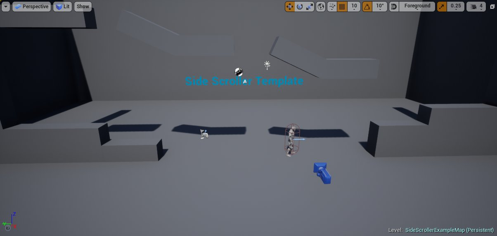
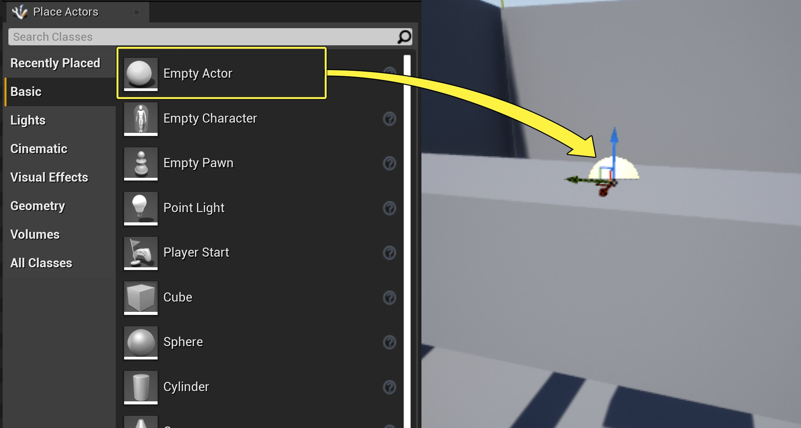
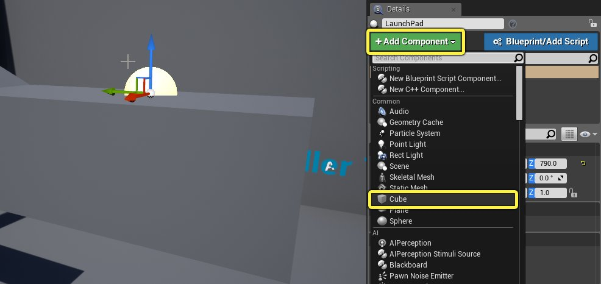
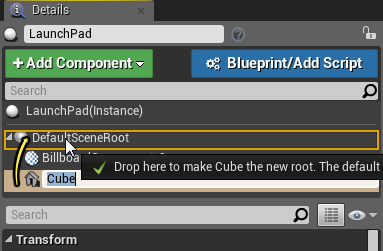
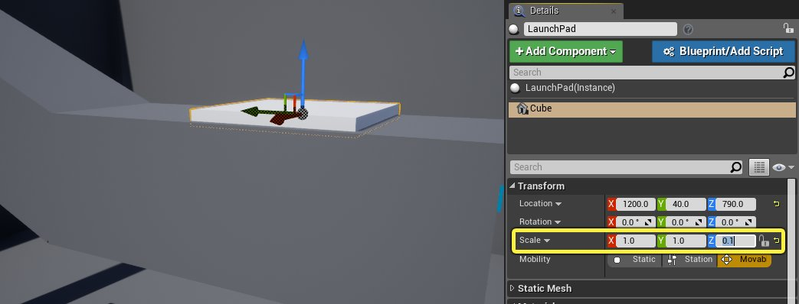
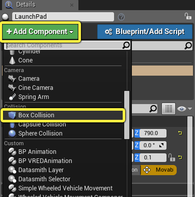
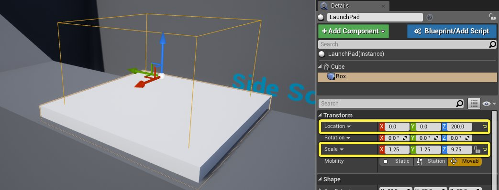
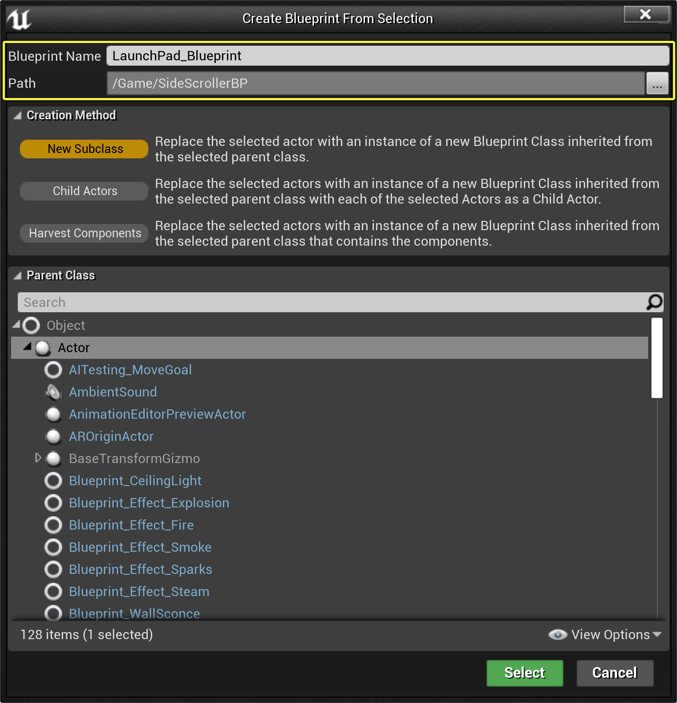

# 蓝图快速入门指南

> 路径：虚幻引擎5.7文档 / 蓝图可视化脚本 / 蓝图简介 / 蓝图快速入门指南

> 原始页面：https://dev.epicgames.com/documentation/unreal-engine/quick-start-guide-for-blueprints-visual-scripting-in-unreal-engine

该快速入门指南将带领你在关卡中使用不同的组件构建一个角色，然后将其转换为一个蓝图类，你可以将弹射行为添加到其中，这样你的角色就可以在关卡中四处飞翔！将其制作为一个蓝图类还意味着，你可以在你的世界场景中创建任意数量的弹跳平台，只需从 **内容浏览器** 拖动到该关卡即可。

## 1 - 必要的项目设置

1. 在虚幻项目浏览器的"新建项目"选项卡中，使用游戏模板和以下设置

   创建新项目

   - 横板过关游戏
   - 蓝图
   - 含初学者内容包
2. 根据你的游戏设置，选择最合适的可扩展性和质量设置。

   > [!NOTE]
   > 如果你不确定哪些设置适合你，你可以在[项目设置](../../../understanding-the-basics/working-with-projects-and-templates/creating-a-new-project/index.md)部分中找到更多信息。
3. 给你的项目起一个名字，然后点击

   创建项目（Create Project）

   按钮来创建它。

你现在应该会看到一个横版过关关卡，以便你继续添加内容。

## 2 - 构建你的弹跳平台

你将在关卡编辑器中构建弹跳平台，然后将其转换为蓝图类，以便将游戏行为添加到其中。

1. 首先，在视口中移动，直到看到该关卡的顶部平台。

   我们将使用空Actor创建容器来容纳弹跳平台的所有部分。你将需要两个部分（或组件），一个用于表示弹跳平台的形状，另一个是角色重叠时的触发器。
2. 在主工具栏中，点击 **模式（Modes）** 按钮，在下来菜单中点击 **选择（Select）** 来显示"放置Actor"面板。
3. 在 **放置Actor（Place Actors）** 面板中，单击 **基础（Basic）**，然后查找 **空Actor（Empty Actor）**。
4. 将它拖动到关卡中，这样它就位于顶部的一个平台上了。

   
5. 现在你已经在关卡中选择了Actor，它的属性在 **细节（Details）** 面板中可见。在 **细节（Details）** 面板顶部，你可以重命名它。继续并在框中单击以输入一个新名称，例如"LaunchPad"。
6. 在 **细节（Details）** 面板中，单击 **添加组件（Add Component）** 按钮，然后在 **常见（Common）** 下选择 **立方体（Cube）**。

   
7. 单击并拖动新添加的 **立方体（Cube）** 至 **DefaultSceneRoot**，使 **立方体（Cube）** 成为新的根节点。

   
8. 选择 **立方体（Cube）** 组件后，将 **比例（Scale）** 更改为 (X: 1.0, Y: 1.0, Z: 0.1)

   
9. 现在，我们将添加一个盒体碰撞组件，每当有东西与它重叠时，就会触发一个事件。在 **细节（Details）** 面板中，单击 **添加组件（Add Component）** 按钮，然后在 **碰撞（Collision）** 下选择 **盒体碰撞（Box Collision）**。

   
10. 将 **盒体碰撞（Box Collision）** 比例更改为( X: 1.25, Y: 1.25, Z: 9.75)，位置更改为( X: 0, Y: 0, Z: 200)，让盒体盖住并延伸到弹射板的上方。

    

> [!TIP]
> 任何时候需要更改Actor的属性时，例如要放大整个弹跳平台，你可以点击 **细节（Details）** 面板中 **添加组件（Add Components）** 按钮下的 **LaunchPad（实例）（LaunchPad (Instance)）**。

现在你已经有了你想要的Actor，我们将把它转换为蓝图类。你可以在 **蓝图编辑器（Blueprint Editor）** 中添加更多组件，就像你在关卡中所做的那样去调整它们。

## 3 - 将你的Actor转换为蓝图类

在蓝图中进行更改意味着每次创建一个新的弹跳平台时，它都具有你在 **蓝图编辑器（Blueprint Editor）** 中创建的外观和感觉。虽然你可以在关卡中复制LaunchPad Actor，但是你对特定弹跳平台所做的任何更改都只会影响该副本。

1. 在 **细节（Details）** 面板中，单击 **蓝图/添加脚本（Blueprint/Add Script）** 按钮。
2. 接着会弹出 **从选项创建蓝图（Create Blueprint from Selection）** 对话框。接下来我们要编辑蓝图的默认路径。

   
3. 将路径从 **Game/SideScrollerBP** 改为 **Game/SideScrollerBP/Blueprints**。
4. 现在，你可以重命名你的蓝图，或者让它继续使用默认名称 **LaunchPad_Blueprint**。
5. 点击 **创建蓝图（Create Blueprint）**。

你的蓝图现在可以在 **内容浏览器（Content Browser）** 中看到。现在，你可以从 **内容浏览器（Content Browser）** 拖放到该关卡，创建大量平台网格体和触发器的副本，但其上还没有任何行为。在下一步中，你将开始在蓝图中设置图表节点，以便在角色穿过弹跳平台时弹射角色。

> 图片已省略：BPQS_3_FinalResult.png

## 4 - 创建你的起始点

要开始向蓝图类添加行为，需要在蓝图编辑器中打开它。

1. 双击 **内容浏览器（Content Browser）** 中的蓝图类。
2. **蓝图编辑器（Blueprint Editor）** 将打开，你可在视口中看到你的 **立方体（Cube）** 和 **盒体（Box）** 组件。此时，如果你调整 **盒体（Box）** 组件的位置，它将应用于你从这个蓝图类创建的所有弹跳平台。就像在LaunchPad Actor上处理组件一样，你可以在 **组件（Components）** 列表中选择 **盒体（Box）** 组件并调整位置。尝试把位置设为 (X: 0, Y: 0, Z: 350)。

   > 图片已省略：BPQS_4_Step2.png
3. 停靠在 **视口（Viewport）** 选项卡旁边的是 **构造脚本（Construction Script）** 选项卡和 **事件图表（Event Graph）** 选项卡。由于你将创建游戏行为，你应该从 **事件图表（Event Graph）** 开始。现在单击该选项卡。

   事件是蓝图图表执行的起始点，并且可以与许多不同的游戏进程场景相关联。最常用事件的选择将立即可见，被视为半透明的事件节点。虽然肯定对你的许多蓝图图表有用，但我们将制作一个我们自己的事件。
4. 我们想要一个当任何东西与我们的 **盒体（Box）** 组件重叠时将执行的事件。首先，在 **组件（Components）** 选项卡中选择 **盒体（Box）** 组件。
5. 右键单击图表中的某个空白位置，打开快捷菜单以便在图表中添加节点。

   > [!NOTE]
   > 要在图表中四处移动，请右键单击并拖动图表。此时，你可以将图表拖到左侧，将预先放置的事件节点移出屏幕左侧，并创建更多的空白空间来创建弹跳平台逻辑。
6. 我们正在为该组件添加一个事件，因此要展开 **为盒体添加事件（Add Event for Box）** 下拉菜单，然后展开 **碰撞（Collision）**。你也可以使用搜索框，使用"组件开始重叠（Component Begin Overlap）"来过滤菜单。
7. 选择 **在组件开始重叠时（On Component Begin Overlap）**。

   > 图片已省略：BPQS_4_Step7.png

你的图表现在有一个 **OnComponentBeginOverlap** 节点。当某些内容与弹跳平台的盒体组件重叠时，连接到此事件的任何节点都将执行。

在本指南的下一步中，你将开始将节点连接到该节点的输出引脚，并了解更多关于在蓝图中使用节点的内容。

## 5 - 测试重叠Actor

现在，任何内容与盒体触发器重叠时，**OnComponentBeginOverlap** 事件都将执行。但是，如果重叠的内容是我们的化身或Pawn，那么我们只想实际执行我们的弹射行为。把它想成是这样的问题："与盒体触发器重叠的Actor是不是与我们的Pawn相同的那个Actor？"

我们将通过处理来自 **OnComponentBeginOverlap** 事件的其他Actor输出来实现这一点。

1. 单击 **OnComponentBeginOverlap** 事件上的 **其他Actor（Other Actor）** 引脚，并拖动到图表上的一个空白点中，释放以打开快捷菜单。

   > [!TIP]
   > 快捷菜单是自适应性的，通过当前使用的引脚进行过滤，只显示兼容的节点。
2. 在搜索框中键入"="，以过滤可用节点，然后选择 **等于（对象）（Equal (Object)）**。

   > 图片已省略：BPQS_5_Step2.png

   我们可以将 **横版过关角色（Side Scroller Character）** 设置为 **Equals** 节点的另一个输入，但是如果我们更改了正在使用的角色，就需要重新打开该蓝图并手动更新它。所以，让我们来获得一个对当前使用的Pawn的引用。
3. 右键单击

   图表空白位置，打开快捷菜单。
4. 在菜单搜索框中键入 **玩家Pawn（Player Pawn）**，然后（在 **游戏（Game）** 下）选择 **获取玩家Pawn（Get Player Pawn）**。
5. 将 **获取玩家Pawn（Get Player Pawn）** 上的 **返回值（Return Value）** 输出连接到 **Equals** 节点上的第二个输入。

   > 图片已省略：BPQS_5_Step5.png

   现在我们有了一个节点，它将告诉我们另一个Actor是不是我们的玩家控制的Pawn，我们将使用该答案来更改我们图表的执行流程。也就是说，当执行流程离开On Component Begin Overlap节点时，我们将引导执行流程。为此，我们想要使用Flow Control节点，特别是 **Branch** 节点。
6. 拖出 **OnComponentBeginOverlap** 节点上的执行引脚，并在图表的空白部分中释放。

   > 图片已省略：BPQS_5_Step6.png
7. 在搜索中键入"Branch"，然后从快捷菜单中选择 **分支（Branch）**。

   > 图片已省略：BPQS_5_Step7.png
8. 将 **Equals** 节点的输出引脚连接到 **Condition** 节点的输入布尔引脚。

   > 图片已省略：BPQS_5_Step8.png

现在，你可以根据重叠的Actor是否是你的Pawn来设置要执行的不同行为了。下一步中我们就会这么做，并且如果 **Equals** 比较的结果是 **True**，就设置蓝图节点来启动我们的角色。

## 6 - 让你的角色跳起来

我们的弹跳平台将使用一个名为 **Launch Character** 的函数来工作。**Launch Character** 函数将指定的速度添加到角色的当前速度，允许你将其扔向任何你想要的方向。不过它只对角色有效，所以我们需要确保我们的Pawn（化身）是一个角色（类人化身）。

我们通过转换做到这一点。转换试图将你的输入转换为不同的类型，以便你可以访问仅允许用于该特定类型的特定功能。如果你的输入基于该类型，则会成功。

除了以后添加的任何其他特殊行为之外，你可以在关卡中放置的所有内容都是Actor。这意味着你可以获得关卡中的任何内容的引用，并将其转换为 **Actor**，然后就会成功。然而，关卡中并不是所有东西都是游戏中代表你的Pawn，所以将一些东西转换为 **Pawn** 可能成功也可能失败。

1. 拖出 **Get Player Pawn** 节点的 **返回值（Return Value）** 引脚。
2. 在搜索框中键入"Cast"，然后在快捷菜单中选择 **转换为角色（Cast to Character）**。
3. 拖出 **Cast to Character** 节点的 **As Character** 引脚。
4. 在搜索框中键入"Launch"，然后在快捷菜单中选择 **弹射角色（Launch Character）**。

   > 图片已省略：BPQS_6_Step4.png

   单击图像以查看完整尺寸。

   > [!NOTE]
   > 注意，用于成功转换的输出执行引脚自动连接到 **弹射角色（Launch Character）** 的输入执行引脚。
5. 在 **Launch Character** 节点的Z字段中键入 **3000**。
6. 最后，将 **Branch** 节点的 **True** 执行引脚连接到 **Cast to Character** 节点的输入执行引脚，这样 **转换为角色（Cast to Character）** 和 **弹射角色（Launch Character）** 仅在重叠的Actor是我们的Pawn时发生。

   > 图片已省略：BPQS_6_Step6.png

   单击图像以查看完整尺寸。

   此时，使用工具栏按钮 **编译（Compile）** 和 **保存（Save）** 蓝图，然后关闭蓝图编辑器。
7. 从 **内容浏览器（Content Browser）** 中拖曳几个弹跳平台到你的关卡。

   > 图片已省略：BPQS_6_Step7.png
8. 单击工具栏中的 **运行（Play）**，然后在关卡中奔跑（使用WASD）和跳跃（使用空格键）。降落在其中一个平台上，观看你在空中飞翔！

## 7 - 放手尝试！

使用你在本快速入门指南的课程中所学到的知识，尝试执行以下操作：

1. 使用[音频组件](https://dev.epicgames.com/documentation/404)在角色被弹射出去时播放声音。
2. 创建[变量](../../specialized-blueprint-visual-scripting-node-groups/blueprint-variables/index.md)来存储你的弹射速度，并公开它，以便你可以在关卡的每个副本上设置它。
3. 将[粒子系统组件](../../../designing-visuals-rendering-and-graphics/general-features-of-rendering/rendering-components/index.md)添加到你的蓝图，并使用 **初学者内容包（Starter Content）** 中的[粒子系统](../../../visual-effects/index.md)之一。
4. 添加一个[箭头组件](../../../understanding-the-basics/actors-and-geometry/basic-components/index.md)并使用其旋转来定义弹射角色的方向。
5. 使用[时间轴](../../specialized-blueprint-visual-scripting-node-groups/timelines/index.md)将一些动画添加到盒体网格体来表示它正在弹射角色。

有关蓝图可视化脚本的更多信息，请参阅[蓝图](../../index.md)页面。

关于这一快速入门所涉及的具体内容：

1. 有关可创建的不同类型蓝图类的快速概述，请参阅：[蓝图入门](../index.md)
2. 有关蓝图类的更多信息，请参阅：[蓝图类](../../specialized-blueprint-visual-scripting-node-groups/types-of-blueprints/blueprint-class-assets/index.md)
3. 有关创建和使用蓝图类的更多简短教程，请参阅：[蓝图教程](../../blueprint-workflows/index.md)
4. 有关蓝图编辑器的更多信息，请参阅：[蓝图编辑器](../../user-interface-reference-for-the-blueprints-vis-53faed96/index.md)
