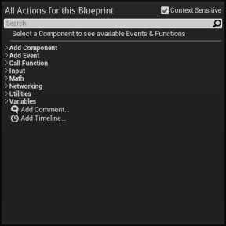
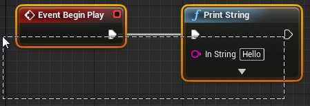
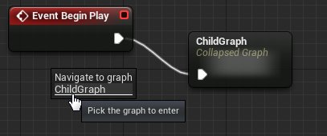
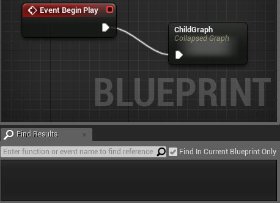
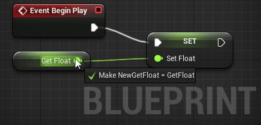
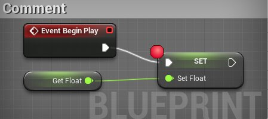
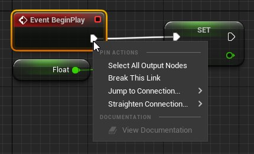
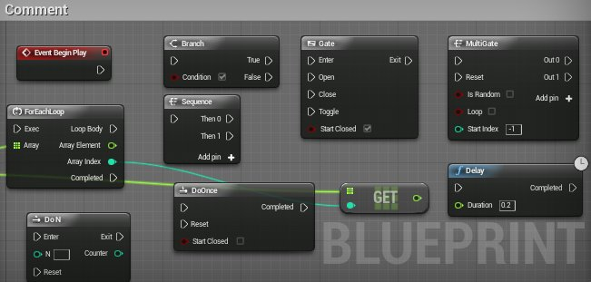

# 蓝图编辑器速查表

> 路径：虚幻引擎5.7文档 / 蓝图可视化脚本 / 专用蓝图节点组 / 蓝图编辑器速查表

> 原始页面：https://dev.epicgames.com/documentation/unreal-engine/blueprint-editor-cheat-sheet-in-unreal-engine

**蓝图** 内置了很多提高效率的快捷方式，随着您应用编辑器，很多快捷方式自然而然地就会用到，但是还有一些快捷方式则略有隐藏。本文介绍了最常用的操作和快捷方式，使用它们进行操作效率会更高。您也可以从下面下载这些快捷方式的列表。

点击下载： [彩色版本](https://d1iv7db44yhgxn.cloudfront.net/documentation/attachments/90e0bf26-7b2b-4f18-b1e9-8efd6741b2fc/blueprintcheatsheet-1989117414.pdf) | [黑白版本](https://d1iv7db44yhgxn.cloudfront.net/documentation/attachments/09dd336b-a919-4b11-9647-98ac6eb45afa/blueprintcheatsheet_blackandwhite-1276559864.pdf)

## 图表操作

| 操作 | 命令 |
| --- | --- |
| 图表操作菜单 | 在图表上 **右击** |

## 选择

| 动作 | 命令 |
| --- | --- |
| 选择节点 | **单击** 一个节点 |
| 添加到选中项 | **Shift + 单击** 一个节点 |
| 切换选中状态 | **Ctrl + 单击** 一个节点 |
| 区域选择 (替换) | **鼠标左键** 拖拽 |
| 区域选择 (添加) | **Shift + 鼠标组件** 拖拽 |
| 区域选择(删除) | **Ctrl + 鼠标左键** 拖拽 |

## 导航

| 动作 | 命令 |
| --- | --- |
| 平移图表 | **鼠标右键** 拖拽 |
| 缩放来适应到选中项 | **Home（起始键）** |
| 放大/缩小 | **向上/向下 滚动鼠标滚轮** |
| 放大/缩小 | 按住 **鼠标左键 + 鼠标右键** 并拖拽 |
| 以超过1:1的比例缩放 | **Ctrl + 缩放** |
| 进入到子图表 | **下一页按键** |
| 进入到父项图表 | **上一页按键** |

## 通用命令

| 动作 | 命令 |
| --- | --- |
| 在内容浏览器中查找 | **Ctrl + B** |
| 保存蓝图 | **Ctrl + S** |
| 恢复 | **Ctrl + Y** |
| 取消 | **Ctrl + Z** |
| 在该蓝图中查找 | **Ctrl + F** |
| 在任何蓝图中查找 | **Ctrl + Shift + F** |
| 编译蓝图 | **F7** |

## 变量操作(我的蓝图)

| 操作 | 命令 |
| --- | --- |
| 视情况 获得/设置 变量 | **鼠标左键** 拖拽连接到兼容引脚上 |
| 获得/设置 变量(通过菜单) | **鼠标左键** 拖拽到图表中 |
| 获得变量 | **Ctrl + 鼠标左键** 拖拽到图表中 |
| 设置变量 | **Alt + 鼠标左键** 拖拽到图表中 |
| 修改现有节点 | **鼠标左键** 拖拽到 Get/Set 的边缘处 |
| 修改类目或重新排序 | 在我的蓝图中使用 **鼠标左键** 拖拽 |

## 节点操作

| 操作 | 命令 |
| --- | --- |
| 节点相关的关联菜单 | **右击** 一个节点 |
| 跳转到相关的 节点/图表 | 在一个节点上 **双击左键** |
| 移动节点 | **鼠标左键** 拖拽节点 |
| 移动选中的节点 | **方向键** |
| 删除选中的节点 | **删除键** |
| 重命名节点/编辑注释 | **左击** 标题 |
| 重命名节点/编辑注释 | **F2** |
| 切换断点 | **F9** |
| 清除所有断点 | **Ctrl + Shift + F9** |
| 剪切选中项 | **Ctrl + X** |
| 复制选中项 | **Ctrl + C** |
| 粘帖节点 | **Ctrl + V** |
| 克隆选中项 | **Ctrl + W** |
| 围绕选中项添加注释 | **C** |

## 引脚操作

| 操作 | 命令 |
| --- | --- |
| 引脚相关的关联菜单 | **右击** 引脚 |
| 着重显示连接线 | **鼠标** 悬停到引脚上 |
| 连接到另一个引脚 | **左击** + 拖拽到那个引脚 |
| 引脚的过滤后的操作菜单 | **左击** + 拖拽到图表 |
| 断开所有连接 | **Alt + 左击** 引脚 |
| 移动所有连接 | **Ctrl + 鼠标左键** 拖拽到引脚 |

## 创建相关的快捷方式

| 操作 | 命令 |
| --- | --- |
| Branch Node（分支节点） | **B +左击** |
| Comment Box Node（注释框节点） | **C** |
| Delay Node（延迟节点） | **D + 左击** |
| Sequence Node（序列节点） | **S + 左击** |
| Gate Node（门节点） | **G + 左击** |
| For-Each Loop Node(For-Each循环节点) | **F +左击** |
| Multi-gate Node（多门节点） | **M + 左击** |
| Do N Times Node（执行N次 节点） | **N + 左击** |
| Do Once Node（执行一次 节点） | **O + 左击** |
| BeginPlay Event （开始运行 事件） | **P + 左击** |
