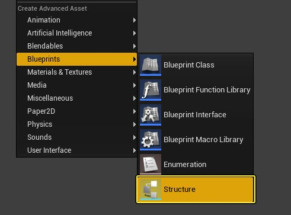
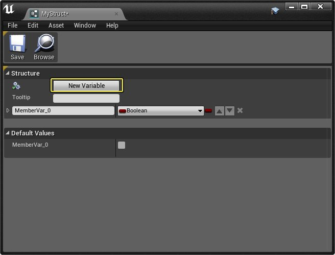
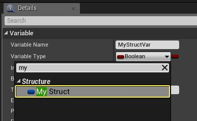
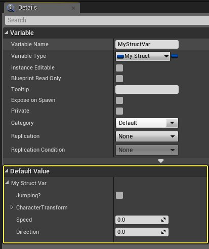
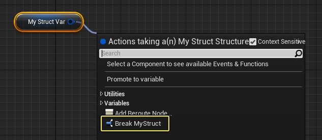
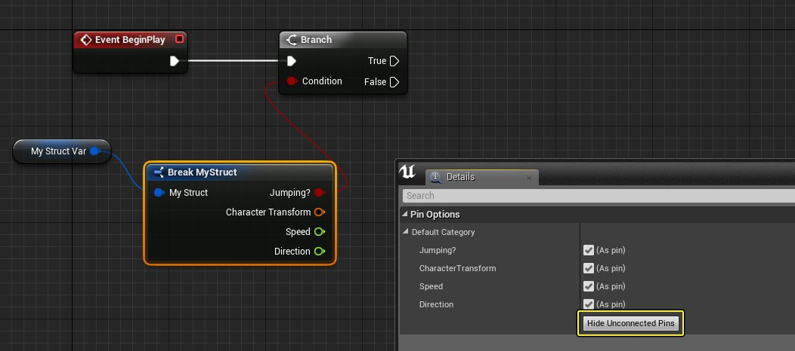
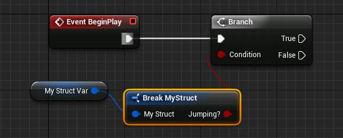

# 蓝图中的结构体变量

> 路径：虚幻引擎5.7文档 / 蓝图可视化脚本 / 专用蓝图节点组 / 蓝图变量 / 蓝图中的结构体变量

> 原始页面：https://dev.epicgames.com/documentation/unreal-engine/blueprint-struct-variables-in-unreal-engine

结构体是相关联的不同数据类型的合集，便于进行访问。您可能已经在蓝图中用到了简单结构体， 因为矢量、旋转体和变形均为结构体变量。例如矢量结构体保存彼此关联的 X 浮点、Y 浮点和 Z 浮点变量。

结构体也可保存其数据。变形结构体保存 Actor 的位置（矢量结构体）、旋转（旋转体结构体）和大小（矢量结构体）数据。

## 创建结构体

将结构体变量添加到蓝图的方法和添加其他 [蓝图变量](../index.md) 的方法相同。简单结构体（如矢量、旋转体和变形）位列于变量类型下拉菜单的顶部。

此下拉菜单还有一个 **Structure** 部分，在此可找到蓝图当前可用的全部结构体变量。

## 访问结构体信息

结构体的工作是将数据捆绑起来，因此您需要访问那些小块的信息。可通过几种不同方法执行：

### 分离结构体引脚

如需在节点上访问结构体中的单个变量，可使用分离结构体引脚（Split Struct Pin）。

如需分离结构体引脚，右键点击引脚并选择 **Split Struct Pin**。

这将把结构体中包含的所有变量公开为节点上的单独引脚，便于您输入数值或单独对其进行操作。

如需取消执行 **Split Struct Pin**，右键点击任意新引脚并选择 **Recombine Struct Pin**。

可分离重组输入和输出结构体引脚。

## 拆分结构体

将结构体拆分为单独部分通常是在函数或宏中进行重复的游戏性逻辑。使用 **Break Struct** 节点可轻松复制贯穿蓝图图表的行为。 如需创建 **Break Struct** 节点，从结构体输出引脚连出引线，从快捷菜单选择 **Break [Struct Name]**。

使用的结构体不同，**Break Struct** 节点的命名和输出引脚也有所不同；但总体而言，结构体将被拆分为单独的部分。

举例而言，如需使用 **Hit Result** 的 **Impact Point**、**Hit Component** 和 **Hit Bone Name**， 可在函数中放置一个 **Break Hit Result** 节点，意味着只需将 **Hit Result** 作为函数输入进行输入，并将这三个数据块在函数中固定保持分离。

### 组成结构体

与将结构体筛分为单独数据块相似，也可使用正确的数据组成结构体。

如需创建 **Make Struct** 节点，从结构体输入引脚连出引线，从快捷菜单选择 **Make [Struct Name]**。

使用的结构体不同，**Make Struct** 节点的命名和输入引脚也有所不同；但总体而言，可通过其包含的所有数据组成结构体。

### 设置结构体中的成员

有时结构体会包含大量数据，而需要修改的只是其中数个元素。对结构体中的成员进行设置即可精确地对数据进行修改， 无需将作为固定常量的所有数据引脚连接起来。

如需通过 **Set Members in Struct** 节点修改可用成员，先选择节点。**Details** 中的复选框可将成员作为节点上的引脚公开。 未公开的成员变量不会被 **Set Members in Struct** 节点修改。

## 使用自定义结构体

除使用引擎提供的结构体外，还可设置自己的变量和数值创建自定义结构体。

要创建自定义结构体，在 **内容浏览器** 中点击右键，然后选择 **创建高级资源** 和 **蓝图** 下的 **结构体**。

定义结构体命名并打开后，即可在 **结构窗口** 中添加变量及其默认值。

之后可通过创建变量并将 **变量类型** 指定为结构体命名，将此结构体作为变量添加到其他蓝图中。

编译后可查看添加到结构体中的所有可定义变量。

### 拆分自定义结构体

将自定义结构体添加到图表时，可将其拖动并拆分，以访问其中变量。

之后可将结构体中的单个变量连接到其他蓝图节点。另外也可在 **细节** 面板中点击 **隐藏未连接引脚** 按钮，隐藏未连接到其他蓝图节点的引脚。

将隐藏Break Struct节点上所有未连接的引脚。

启用所需变量旁的（作为引脚）属性，可在 **细节** 面板中重新启用显示引脚。
