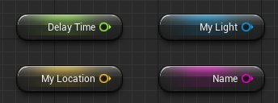
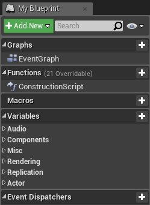

# 蓝图变量

> 路径：虚幻引擎5.7文档 / 蓝图可视化脚本 / 专用蓝图节点组 / 蓝图变量

> 原始页面：https://dev.epicgames.com/documentation/unreal-engine/blueprint-variables-in-unreal-engine

**Variables（变量）** 是保存值或参考世界场景中的对象或Actor的属性。这些 属性可以由包含它们的 **蓝图（Blueprint）** 通过内部方式访问，也可以 通过外部方式访问，以便设计人员使用放置在关卡中的蓝图实例 来修改它们的值。

变量显示为包含变量名称的圆形框：

## 变量类型

变量能够以各种不同的类型创建，其中包括数据类型（例如布尔、整数和浮点），以及用于保存对象、Actor和特定类等对象的引用类型。 此外，您还可以创建每种变量类型的数组。每种类型都采用颜色编码，以便于识别：

| 变量类型 | 颜色 | 范例 | 表示 |
| --- | --- | --- | --- |
| **布尔（Boolean）** | 栗色 |  | true或false值（`bool`）。 |
| **字节（Byte）** | 夏尔巴蓝色 |  | 0与255之间的整数值（`unsigned char`）。 |
| **整数（Integer）** | 海绿色 |  | −2,147,483,648与2,147,483,647之间的整数值（`int`）。 |
| **64位整数（Integer64）** | 苔绿色 |  | −9,223,372,036,854,775,808与9,223,372,036,854,775,807之间的整数值（`long`）。 |
| **浮点（Float）** | 黄绿色 |  | 例如0.0553、101.2887、-78.322等带小数的数值（`float`）。 |
| **命名（Name）** | 淡紫色 |  | 用于在游戏中识别事物的一段文本。 |
| **字符串（String）** | 洋红色 |  | 例如 `Hello World` 之类的一组字母数字字符（`string`）。 |
| **文本（Text）** | 粉色 |  | 向用户显示的文本。针对要本地化的文本使用此类型。 |
| **矢量（Vector）** | 金色 |  | 三个数字组成的集（X、Y、Z）。此类型对3D坐标和RGB颜色数据很有用。 |
| **旋转体（Rotator）** | 菊蓝色 |  | 定义3D空间中旋转的一组数字。 |
| **变形（Transform）** | 橙色 |  | 结合平移（3D位置）、旋转和缩放的数据集。 |
| **对象（Object）** | 蓝色 |  | 如光源、Actor、静态网格体、摄像机和SoundCue等蓝图对象。 |

## 我的蓝图（My Blueprint）选项卡中的变量

我的蓝图（My Blueprint）选项卡允许将自定义变量添加到蓝图，并列出所有现有变量， 包括在[组件列表](../components-window/index.md)中添加的组件实例变量， 或通过将值提升到图表中的变量而创建的变量。

### 公开变量

要在蓝图之外修改变量，需将其设为公开。

眼睛默认为闭合（私有）；选择眼睛以将其打开并设为公开。也可选中或清除 **可编辑实例（Instance Editable）** 框，将变量设为私有或公开。

将变量设为公开后，可在主编辑器窗口的 **细节（Details）** 面板中修改变量的值。

上面，变量 **光源颜色（LightColor）** 已被设置为可编辑（ Editable），我们现在可以在关卡编辑器的 **细节（Details）** 面板中设置此值。

### 变量提示文本

您还可以为变量添加 **提示文本（Tooltip）**，当鼠标在编辑器中悬停于变量之上时，将显示此提示文本。

您可以从变量的 **细节（Details）** 面板中添加 **提示文本（Tooltip）**。当您执行此操作时，如果变量设置为 **公开（Public）**，那么眼睛（Eye）图标将从黄色变为绿色，表示已为该变量编写提示文本。

### 生成时公开

**生成时公开（Expose on Spawn）** 允许您设置变量是否应在生成其所在的蓝图时可访问。

上面我们有一个名为 **光源颜色（LightColor）** 的变量，它是一个设置为 **生成时公开（Expose on Spawn）** 的线性颜色属性。该变量在点光源的蓝图中实现，点光源使用 **设置光源颜色（Set LightColor）** 节点和 **光源颜色（LightColor）** 变量来确定光源的颜色。

下面，在另一个蓝图中，使用一个脚本来生成点光蓝图，由于 **光源颜色（LightColor）** 变量设置为生成时公开（Expose on Spawn），所以 **从类生成Actor（Spawn Actor from Class）** 节点上提供了设置此值的选项，这使我们能够在游戏世界中生成光源时设置其颜色。

### 私有变量

通过在变量上选中 **私有（Private）** 选项，可以防止从外部蓝图修改变量。

例如，下面有一个未设置为私有的变量：

在另一个蓝图中，我们生成包含此变量的蓝图，然后关闭 **返回值（Return Value）**，结果是我们可以访问此变量。

但如果我们将它设置为私有：

然后再次生成蓝图并尝试访问此变量，结果是我们无法访问。

### 向过场动画公开

若希望 **Sequencer** 影响变量的值，选择 **向过场动画公开（Expose to Cinematics）**。

> [!NOTE]
> 欲了解Sequencer的详情，参阅[用Sequencer进行实时合成](../../../working-with-media/integrating-media/real-time-compositing-with-composure/real-time-compositing-with-sequencer/index.md)。

## 提升为变量

您还可以使用 **提升为变量（Promote to Variable）** 创建变量。

右键单击蓝图节点上的任何输入或输出数据引脚，并选择 **提升为变量（Promote to Variable）** 选项。

通过在 **新光源颜色（New Light Color）** 引脚上单击右键并选择 **提升为变量（Promote to Variable）** 选项，我们可以将一个变量指定为 **新光源颜色（New Light Color）** 值。

或者，您可以拖出一个输入或输出引脚，并选择 **提升为变量（Promote to Variable）**。

## 访问蓝图中的变量

在使用蓝图中的变量时，您会通过以下两种方式之一访问它们：通过使用 **获取（Get）** （被称为Getter）来获取变量的值，或使用 **设置（Set）** 节点（被称为Setter）来设置变量的值。

您可以通过在图表中单击右键并键入 **Set (变量名)** 或 **Get (变量名)**，为变量创建一个 **设置（Set）** 节点（上面1）或 **获取（Get）** 节点（上面2）。另一种方法是按住 **Ctrl** 键并将变量从 **我的蓝图（MyBlueprint）** 窗口拖动变量来创建一个 **获取（Get）** 节点，或者按住 **Alt** 键并从 **我的蓝图（MyBlueprint）** 窗口中拖动变量来创建一个 **设置（Set）** 节点。

## 编辑变量

您可以在执行之前将变量值设置为蓝图节点网络的一部分或默认值。若要设置变量默认值：

1. 单击蓝图编辑器工具栏上的 **类默认（Class Defaults）**，以在 **细节（Details）** 面板中打开默认设置（Defaults）。
2. 在 **细节（Details）** 面板中，从变量名称右侧输入所需的默认值。

   上面我们突出显示了颜色（Color）变量，我们可以在其中设置其默认颜色。

> [!NOTE]
> 如果您没有看到变量在默认中列出，请确保单击了 **编译（Compile）** 按钮。

### 重命名变量

若要重命名变量：

1. 在 **我的蓝图（My Blueprint）** 选项卡中右键单击变量名称，然后在出现的菜单中选择 **重命名（Rename）**。
2. 在文本框中键入新的变量名称，然后按 **Enter**。

### 变量属性

您可以在 **细节（Details）** 面板中为变量设置所有属性。有些变量可能具有比此处所示更多的属性，例如，对于矢量，有 **公开到过场动画（Expose to Cinematics）**，对于整数或浮点数等数字变量，有 **滑块范围（Slider Range）**。

| 属性 | 说明 |
| --- | --- |
| **变量类型（Variable Type）** | 在下拉菜单中设置变量类型，并确定变量是否为数组。 |
| **可编辑实例（Instance Editable）** | 设置可否在 **类默认（Class Defaults）** 和蓝图的 **细节（Details）** 选项卡中编辑变量的值。 |
| **提示文本（Tooltip）** | 为变量设置提示文本。 |
| **私有（Private）** | 设置该变量是否应为私有且是否不应由派生蓝图修改。 |
| **类别（Category）** | 从现有类别中选择，或键入一个新的类别（Category）名称。设置类别（Category）确定变量在 **类默认（Class Defaults）**、**我的蓝图（My Blueprint）**选项卡和蓝图的 **细节（Details）** 选项卡中所处的位置。 |
| **复制（Replication）** | 选择变量的值是否应在客户端之间复制，以及如果复制该值，是否应通过回调函数发出通知。 |

### 变量高级属性

| 属性 | 描述 |
| --- | --- |
| **配置变量（Config Variable）** | 在配置文件中读取默认值（若存在）？利用此选项可自定义不同项目和配置间的变量默认值和行为。 |
| **临时（Transient）** | 加载时不进行序列化且以零填充。 |
| **游戏存档（SaveGame）** | 针对游戏存档进行序列化。 |
| **高级显示（Advanced Display）** | 默认在类默认窗口中隐藏。 |
| **多行（Multi line）** | 可显示多行。要在编辑变量时新增行，同时按下Shift+Enter。 此选项仅适用于 **字符串** 和 **文本** 变量。 |
| **废弃（Deprecated）** **废弃消息（Deprecation Message）** | 进行废弃。任何引用变量的节点将生成编译器警告，表明应删除或替换此变量。 （可选）可指定消息来包含此提醒。例如：`不再支持X。请用Y替代。` |

### 获取和设置变量值

您还可以通过获取（Get）和设置（Set）节点的方式将变量作为蓝图网络的一部分进行编辑。最简单的创建方法是将变量直接从变量（Variables）选项卡拖至事件图表（Event Graph）中。一个小菜单随即出现，询问您是否要创建获取（Get）或设置（Set）节点。

#### 获取（Get）节点

获取（Get）节点提供具有变量值的网络部分。完成创建后，您可以将这些节点插入任何具有适当类型的节点。

#### 设置（Set）节点

设置（Set）节点允许更改变量的值。请注意，这些节点必须由执行线调用才能执行。

| **从我的蓝图选项卡拖动时的快捷方式（Shortcuts when dragging from the My Blueprint tab）** |  |
| --- | --- |
| **Ctrl-拖动** | 创建获取（Get）节点。 |
| **Alt-拖动** | 创建设置（Set）节点。 |
