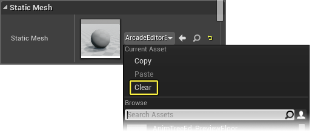

# 组件窗口

> 路径：虚幻引擎5.7文档 / 蓝图可视化脚本 / 专用蓝图节点组 / 组件窗口

> 原始页面：https://dev.epicgames.com/documentation/unreal-engine/components-window-in-unreal-engine

**组件** 是一种可以被添加到Actor的功能性部件。

在向Actor添加组件后，该ActorIU可以使用该组件提供的功能，如：

- 聚光源组件（Spot Light Component）可以让你的Actor发出聚光灯一样的光线。
- 旋转移动组件（Rotating Movement Component）可以让你的Actor旋转。
- 音频组件（Audio Component）可以让你的Actor播放音效。

组件必须附加到Actor，不能独立存在。

> [!NOTE]
> 有关组件（Components）的更多信息，请参阅[组件概述](../../../gameplay-systems/gameplay-framework/components/index.md)文档。

## 组件（Components）窗口

了解组件（Components）后，**蓝图编辑器（Blueprint Editor）** 中的 **组件（Components）** 窗口允许您将组件添加到蓝图。这提供了以下方法：通过胶囊组件（CapsuleComponent）、盒体组件（BoxComponent）或球体组件（SphereComponent）添加碰撞几何体，以静态网格体组件（StaticMeshComponent）或金属网格体组件（SkeletalMeshComponent）形式添加渲染几何体，使用移动组件（MovementComponent）控制移动。还可以将组件（Components）列表中添加的组件指定给实例变量，以便您在此蓝图或其他蓝图的图表中访问它们。

## 添加组件

从 **组件（Components）** 窗口将组件添加到蓝图：

1. 从下拉列表中选择要添加的组件类型，即_CameraComponent_。
2. 从列表中选择组件后，您将收到要求您输入组件名称的提示。

您还可以通过从 **内容浏览器（Content Browser）** 将资产拖放到 **组件（Components）** 窗口来添加组件。

> [!NOTE]
> 此方法适用的资产包括：静态网格体（StaticMesh）、声音提示（SoundCue）、骨架网格体（SkeletalMesh）和粒子系统（ParticleSystem）。

## 移除组件

若要从 **组件（Components）** 窗口移除组件，请 **右键单击** 组件名称并选择 **删除（Delete）**。

> [!TIP]
> 您还可以在窗口中选择组件并按 **删除（Delete）** 键来移除它。

## 变形组件

当组件被添加到关卡中的实例时，它将被默认放置在该实例的位置。但是，它们可以根据需要在 **细节（Details）** 面板或 **视口（Viewport）** 中进行变形、旋转和缩放，其方法与您可以[变形actor](../../../understanding-the-basics/actors-and-geometry/transforming-actors/index.md)的方法类似。

您可以通过在 **组件（Components）** 窗口中单击组件名称或在 **视口（Viewport）** 中之间单击组件来选择要变形的组件。在 **视口（Viewport）** 中变形、旋转和缩放组件时，按住 **Shift** 以启用捕捉。该捕捉要求 **关卡编辑器（Level Editor）** 中启用捕捉，并使用 **关卡编辑器（Level Editor）** 中的 **捕捉网格（Snap Grid）** 设置（请参阅[Actor吸附](../../../understanding-the-basics/actors-and-geometry/actor-snapping/index.md)了解有关网格吸附（Grid Snapping）的更多信息）。

您还可以在 **细节（Details）** 面板中为选定组件输入 **位置（Location）**、**旋转（Rotation）** 和 **缩放（Scale）**的精确值。

> [!NOTE]
> 变形、旋转或缩放父组件同样会将变形向下传播到所有子组件。

## 组件资产

添加组件后，您可能需要指定占用组件的资产（例如为静态网格体组件（StaticMeshComponent）指定一个静态网格体使用）。有几种不同的方法可以用来为组件类型指定资产，如下所述。

### 指定组件资产

若要在**组件（Components）** 窗口中将资产指定给组件：

1. 选择组件（Component）后，在 **细节（Details）** 面板中找到组件类型对应的部分。

   上面我们添加了一个静态网格体组件（StaticMeshComponent），我们将在 **静态网格体（StaticMesh）** 下指定要使用的资产。
2. 单击 **静态网格体（Static Mesh）** 下拉框，然后从上下文菜单中选择要使用的资产。

另一种指定资产的方法可以使用 **内容浏览器（Content Browser）** 完成。

1. 在 **内容浏览器（Content Browser）** 中选择您想要指定为与组件一起使用的资产的资产。
2. 选择 **组件（Component）** 后，在 **细节（Details）** 面板中找到组件类型对应的部分。

   上面我们添加了一个静态网格体组件（StaticMeshComponent），我们将在 **静态网格体（StaticMesh）** 下指定要使用的资产。
3. 因为在 **内容浏览器（Content Browser）** 中已有一个资产被选中，请勿单击 **静态网格体（Static Mesh）** 框，而应单击按钮。

   这会将在 **内容浏览器（Content Browser）** 中选择的资产作为组件中要使用的资产。

### 移除组件资产

若要从组件中移除指定资产：

1. 在组件的 **细节（Details）** 面板中，单击当前指定资产旁边的按钮。
2. 或者，单击资产的 **当前资产（Current Asset）** 框，然后从上下文菜单中选择 **清除（Clear）**。

   

   在这两种方法中，资产都将作为指定给组件的对象而被删除。

### 浏览至组件资产

您还可以浏览至组件的当前指定资产，跳转至 **内容浏览器（Content Browser）** 并在其中进行定位：

1. 在组件的 **细节（Details）** 面板中，按下当前指定资产旁边的Blueprint - Browse Asset Button按钮。
2. 打开 **内容浏览器（Content Browser）**，显示选定的指定资产。

## 重命名组件示例变量

在 **组件（Components）** 窗口中创建的组件将根据其类型自动生成实例变量名称。

若要更改这些变量的名称：

1. 在 **组件（Components）** 窗口中选择组件，其细节将随即显示在 **细节（Details）** 面板中。
2. 在 **细节（Details）** 面板的 **变量名称（Variable Name）** 字段中输入组件的新名称，并按 **Enter** 确认。

   > [!TIP]
   > 您可以通过在 **组件（Components）** 窗口中选择一个组件然后按下 **F2** 来快速重命名此组件。

## 组件事件和功能

您可以通过不同的方法将基于组件的事件和/或功能快速添加到蓝图的 **事件图表（Event Graph）** 中。以这种方式创建的任何事件或功能都是特定于该特定功能，不需要经过测试来验证所涉及的组件。

1. 添加可以为其创建事件的组件，例如盒体组件（BoxComponent）。
2. 为您的组件提供一个名称，这里我们将其称为触发器（Trigger）。
3. 在 **细节（Details）** 面板中，单击 **添加事件（Add Event）** 按钮并选择所需的事件类型。

   您还可以在 **组件（Components）** 窗口中 **右键单击** 组件，并从 **添加事件（Add event）** 上下文菜单中选择事件。
4. 无论采用哪种方式，都会将一个新的事件节点（基于选定类型）添加到 **事件图表（Event Graph）**，该图表将自动打开。

您还可以通过 **我的蓝图（My Blueprint）** 窗口从 **事件图表（Event Graph）** 为组件添加事件和功能：

1. 在 **我的蓝图（My Blueprint）** 窗口中，在 **组件（Components）** 下，选择您的组件。
2. 在图表中 **右键单击** 以弹出上下文菜单。

   如果组件有任何关联的事件或功能，它们将被列于顶部。

   > [!NOTE]
   > 并非所有组件都有关联的事件。例如，点光源组件（PointLightComponent）只包含功能。

   您还可以在 **我的蓝图（My Blueprint）** 窗口中 **右键单击** 组件，以访问 **添加事件（Add Event）** 上下文菜单。
