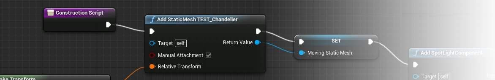

# 构造脚本

> 路径：虚幻引擎5.7文档 / 蓝图可视化脚本 / 专用蓝图节点组 / 构造脚本

> 原始页面：https://dev.epicgames.com/documentation/unreal-engine/construction-script-in-unreal-engine

创建蓝图类的实例时，**构造脚本（Construction Script）** 在组件列表之后运行。它包含的节点图表允许蓝图实例执行初始化操作。构造脚本的功能可以非常丰富，它们可以执行场景射线追踪、设置网格体和材质等操作，从而根据场景环境来进行设置。例如，光源蓝图可判断其所在地面类型，然后从一组网格体中选择合适的网格体，或者，栅栏蓝图可以向各个方向射出射线，从而确定栅栏可以有多长。

> [!NOTE]
> 仅类蓝图包含 **Construction Scripts（构造脚本）** 。关卡蓝图没有构造脚本。

**Construction Script(构造脚本)** 图表的执行入口点是一直存在的 *ConstructionScript* 节点。

## 应用图表

请参照[蓝图编辑器图表编辑器](../../user-interface-reference-for-the-blu-73593f79/user-interface-components/graph-editor-for-the-blueprints-visual-scripting-editor/index.md)获得关于在蓝图中应用 **ConstructionScript（构造脚本）** 和其他图表的详细指南。
