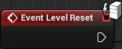
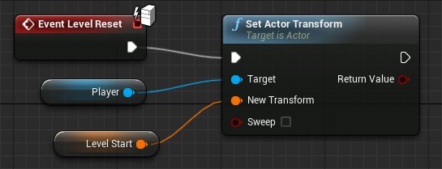
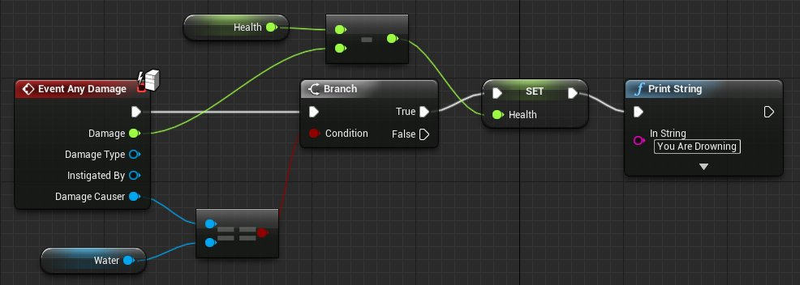
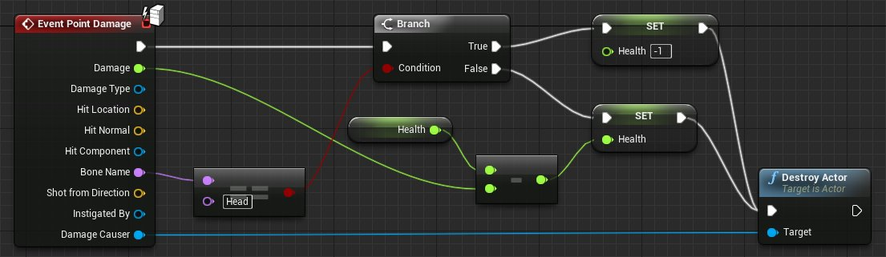
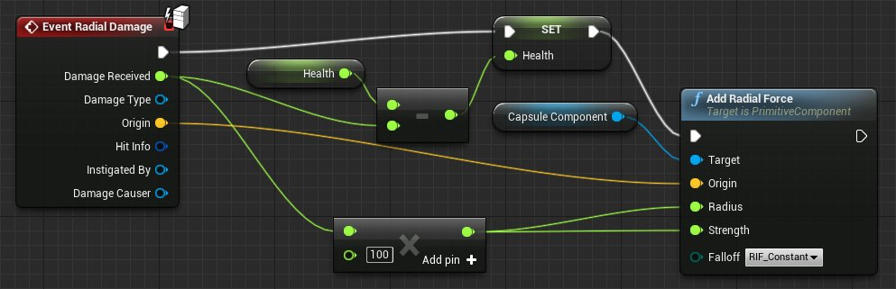
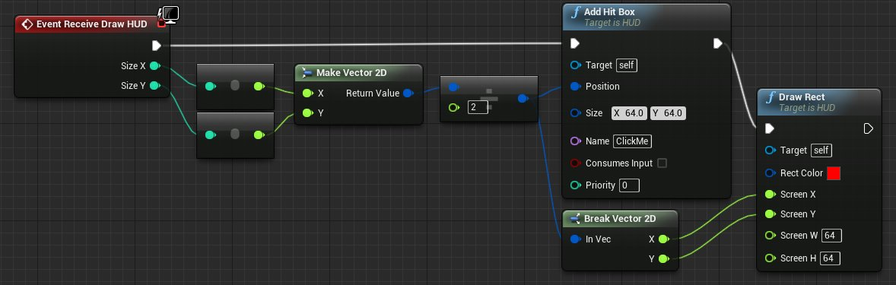
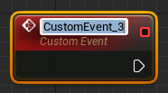

# 事件

> 路径：虚幻引擎5.7文档 / 蓝图可视化脚本 / 专用蓝图节点组 / 事件

> 原始页面：https://dev.epicgames.com/documentation/unreal-engine/events-in-unreal-engine

**事件（Events）** 是从游戏性代码中调用的节点， 在 **事件图表（EventGraph）** 中开始执行个体网络。 它们使蓝图执行一系列操作，对游戏中发生的特定事件（如游戏开始、关卡重置、受到伤害等）进行回应。

这些事件可在蓝图中访问，以便实现新功能，或覆盖/扩充默认功能。任意数量的 **Events** 均可在单一 **EventGraph** 中使用，但每种类型只能使用一个。

一个事件只能执行一个目标。如果想要从一个事件触发多个操作，需要将它们线性串联起来。

Blueprint Class Events Expanded Level Blueprint Events Expanded

## Event Level Reset

> [!NOTE]
> 此蓝图事件节点仅在关卡蓝图中可用。

**Level Reset** 事件在关卡重启时发出执行信号。 它在关卡重新加载后进行某项触发时非常实用。 如玩家角色已死亡，但关卡无需重新加载时。

## Event Actor Begin Overlap

多项条件同时满足时，将执行该事件：

- Actor 之间的碰撞响应必须允许重叠。
- 执行事件的两个 Actor 的

  Generate Overlap Events

  均设为 true。
- 最后，两个 Actor 的碰撞开始重叠；两者移到一起或其中一个创建时与另一个重叠。

> [!NOTE]
> 关于碰撞详细信息，请查阅：[碰撞响应](../../../gameplay-systems/physics/collision/index.md)。

此蓝图 Actor 和保存在 Player Actor 变量中的 Actor 重叠时，它将增加 Counter 整数变量。

| 项目 | 描述 |
| --- | --- |
| 输出引脚 |  |
| **Other Actor** | Actor - 这是与此蓝图发生重叠的 Actor。 |

## Event Actor End Overlap

多项条件同时满足时，将执行该事件：

- Actor 之间的碰撞响应必须允许重叠。
- 执行事件的两个 Actor 的

  Generate Overlap Events

  均设为 true。
- 最后，两个 Actor 的碰撞停止重叠；它们将分离，或在其中一个将被销毁。

> [!NOTE]
> 关于碰撞详细信息，请查阅：[碰撞响应](../../../gameplay-systems/physics/collision/index.md)。

当此蓝图 Actor 不与其他 Actor 发生重叠时（保存在 Player Actor 变量中的 Actor 除外），它将销毁重叠的 Actor。

| 项目 | 描述 |
| --- | --- |
| 输出引脚 |  |
| **Other Actor** | Actor - 这是与此蓝图发生重叠的 Actor。 |

## Event Hit

只要其中一个相关 Actor 的碰撞设置中 **Simulation Generates Hit Events** 设为 true，该事件便会执行。

> [!NOTE]
> 如您使用 Sweeps 创建运动，即使未选中标记也将获得此事件。只要 Sweep 阻止您移过阻挡物体，这便会发生。

| 项目 | 描述 |
| --- | --- |
| 输出引脚 |  |
| **My Comp** | 原始组件 - 被命中的执行 Actor 上的组件。 |
| **Other** | Actor - 参与碰撞的其他 Actor。 |
| **Other Comp** | 原始组件 - 参与碰撞，被命中的其他 Actor 上的组件。 |
| **Self Moved** | 布尔型 - 接受来自另一个物体运动的命中时使用（如为 false），对 Hit Normal 和 Hit Impact Normal 的方向进行调整，以便表现其他物体对被命中物体施加的力。 |
| **Hit Location** | 矢量 - 两个碰撞 Actor 之间的接触位置。 |
| **Hit Normal** | 矢量 - 碰撞方向。 |
| **Normal Impulse** | 矢量 - Actor 碰撞的力。 |
| **Hit** | 命中结果结构体 - 一次命中中收集到的所有数据，可剥离并"打破"该结果，访问数据的单个位元。 |

在此例中，蓝图执行 Hit 时，它将在冲撞点生成爆炸效果。

## Event Any Damage

此蓝图事件节点仅在服务器上执行。在单人游戏中，本地客户端即视为服务器。

此事件在造成整体伤害时出现。如溺死或环境伤害，并非点伤害或放射伤害。

| 项目 | 描述 |
| --- | --- |
| 输出引脚 |  |
| **Damage** | 浮点型 - 传入 Actor 的伤害量。 |
| **Damage Type** | 伤害类型对象 - 这是在输出伤害上包含额外数据的对象。 |
| **Instigated By** | Controller - 负责伤害的对象的控制器（Controller）。可以是开枪的玩家控制器，或是投手雷造成伤害的 AI控制器。 |
| **Damage Causer** | Actor - 输出伤害的 Actor。这可以是子弹或爆炸。 |

此处，如果对 Actor 造成的伤害来自水，将减少体力值并在屏幕上生成警告。

## Event Point Damage

此蓝图事件节点仅在服务器上执行。在单人游戏中，本地客户端即视为服务器。

**点伤害（Point Damage）** 代表由投射物、扫射武器、甚至近战武器造成的伤害。

| 项目 | 描述 |
| --- | --- |
| 输出引脚 |  |
| **Damage** | 浮点型 - 传入 Actor 的伤害量。 |
| **Damage Type** | 伤害类型对象 - 这是在输出伤害上包含额外数据的对象。 |
| **Hit Location** | 矢量 - 应用伤害的位置。 |
| **Hit Normal** | 矢量 - 碰撞方向。 |
| **Hit Component** | 原始组件 - 被命中的执行 Actor 上的组件。 |
| **Bone Name** | 名称 - 命中的骨骼名称。 |
| **Shot from Direction** | 矢量 - 伤害来源的方向。 |
| **Instigated By** | Actor - 负责伤害的 Actor。这是开枪或投手雷造成伤害的 Actor。 |
| **Damage Causer** | Actor - 输出伤害的 Actor。这可以是子弹或爆炸。 |

在此例中，受到任意伤害时均会从 Actor 的体力值减去造成的伤害。但如果 Actor 的头部被击中，则 Actor 的体力值设为 -1。

## Event Radial Damage

此蓝图事件节点仅在服务器上执行。在单人游戏中，本地客户端即视为服务器。

**放射伤害（Radial Damage）** 事件在该序列的父 Actor 受到放射伤害时调用。这可用于处理基于爆炸伤害或间接伤害的事件。

| 项目 | 描述 |
| --- | --- |
| 输出引脚 |  |
| **Damage Received** | 浮点型 - 从事件接收的伤害量。 |
| **Damage Type** | 伤害类型对象 - 这是在输出伤害上包含额外数据的对象。 |
| **Origin** | 矢量 - 3D 空间中的伤害来源位置。 |
| **Hit Info** | 命中结果结构体 - 一次命中中收集到的所有数据，可剥离并"打破"该结果，访问数据的单个位元。 |
| **Instigated By** | 控制器 - 发起伤害的控制器（AI 或玩家）。 |
| **Damage Causer** | Actor - 输出伤害的 Actor。可以是子弹、火箭、激光或角色的拳击。 |

## Event Actor Begin Cursor Over

使用鼠标界面时，鼠标光标在 Actor 上悬停时执行的事件。

鼠标经过此 Actor 后，它将把动态材质实例上名为 Highlight 的标量参数设为 1.0。

## Event Actor End Cursor Over

使用鼠标界面时，鼠标光标在 Actor 上移开时执行的事件。

它将把保存在 Target Notification 中的 Actor 设为在游戏中隐藏。

## Event Begin Play

游戏开始时将在所有 Actor 上触发此事件。游戏开始后生成的所有 Actor 上均会立即调用此事件。

开始游戏时，此 Actor 将把其体力值设为 1000，分数设为 0。

## Event End Play

Actor 不存在于世界场景中时执行此事件。

此 Actor 不存在于世界场景中时，字符串将输出，说明事件被调用的原因。

| 项目 | 描述 |
| --- | --- |
| 输出引脚 |  |
| **End Play Reason** | EEndPlayReason 枚举 - 说明 Event End Play 被调用原因的枚举。 |

## Event Destroyed

Actor 被销毁时执行此事件。

此例中，Score 变量设为 Value 加 Score。

> [!WARNING]
> Destroyed 事件将在之后的版本中移除！Destroyed 函数的功能已合并到 EndPlay 函数。

## Event Tick

游戏进程中每帧调用的简单事件。

| 项目 | 描述 |
| --- | --- |
| 输出引脚 |  |
| **Delta Seconds** | 浮点型 - 输出帧之间的时间量。 |

此例使用 Delta Seconds 构成倒数计时器显示日志，最后的 tick 为"Blast Off!"

## Event Receive Draw HUD

> [!NOTE]
> 此事件仅限继承自 HUD 类的蓝图类可用。

这是一个特殊事件，使蓝图可绘制到 HUD。此事件须创建 HUD 绘制节点。

| 项目 | 描述 |
| --- | --- |
| 输出引脚 |  |
| **Size X** | Int - 渲染窗口的像素宽度。 |
| **Size Y** | Int - 渲染窗口的像素高度。 |

这会在渲染窗口的中央创建一个可点击的 Hit Box，其后有一个红框，便于辨认。

## Custom Event

Custom Event 节点是拥有自身工作流程的特殊节点，请查阅 [自定义事件节点](custom-events/index.md) 中的更多内容。

> [!NOTE]
> 扩展阅读：
>
> - 自定义事件
>
>   ：创建可以在蓝图序列的任意点上被调用的事件。
> - 通过Sequencer调用事件
>
>   ：创建在播放动画序列时在指定时间触发的事件。
