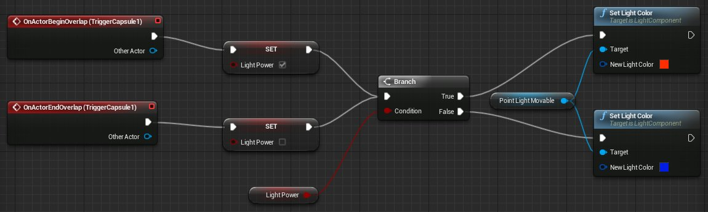
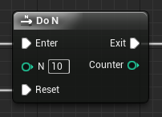
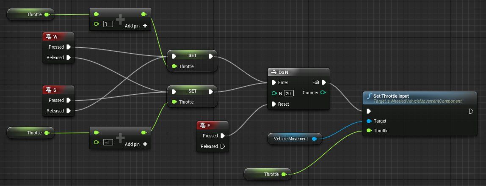
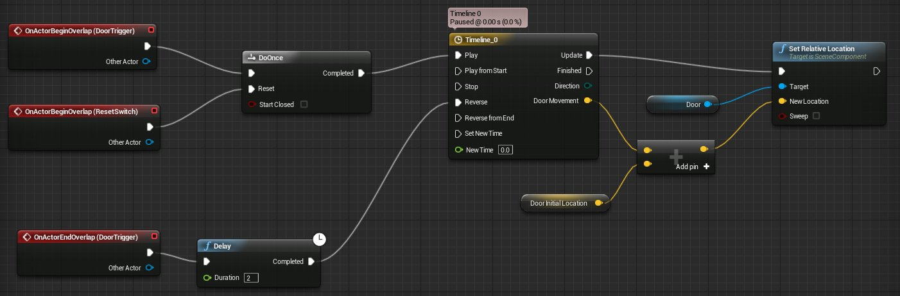
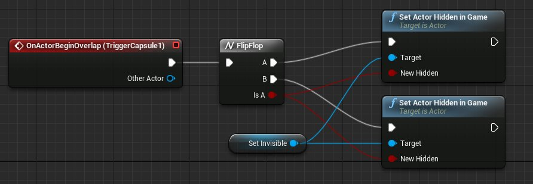
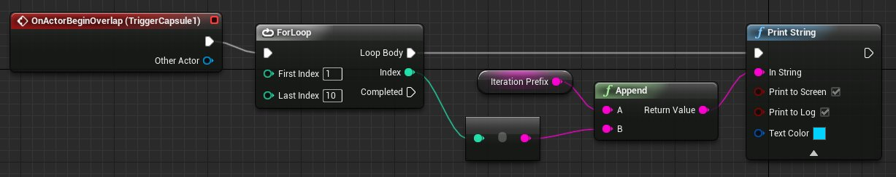
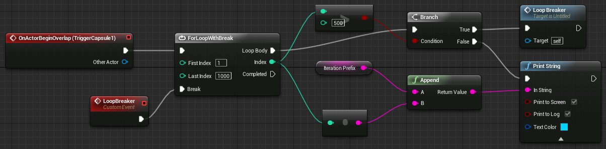
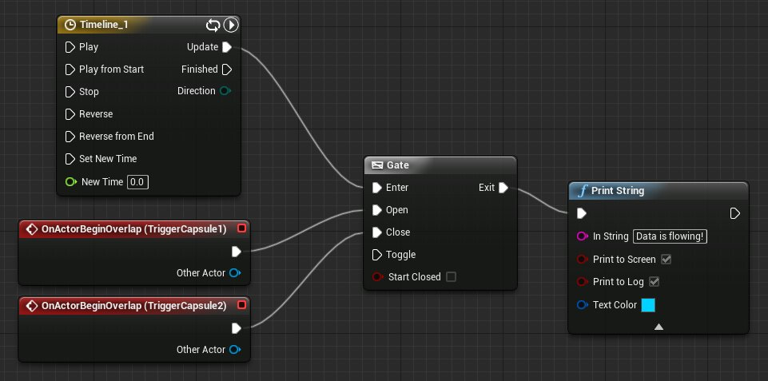

# 流程控制

> 路径：虚幻引擎5.7文档 / 蓝图可视化脚本 / 专用蓝图节点组 / 流程控制

> 原始页面：https://dev.epicgames.com/documentation/unreal-engine/flow-control-in-unreal-engine

## 开关节点

开关节点读取数据输入，并会基于该输入值来从匹配的（或可选的默认）执行输出中发送执行流程。 可用的开关有以下几种类型： **Int** (整型），**String** （字符串型）， **Name** （名称型），以及 **Enum** （枚举型）。

一般而言，开关节点会根据其估算的数据类型拥有执行输入以及数据输入。 输出均为执行输出。 **Enum** 开关会自动从 **Enum** 属性中生成输出执行引脚，而 **Int**, **String** 及 **Name** 开关拥有可自定义的输出执行引脚。

## 编辑开关节点

当 **Int**, **String**, 或 **Name** 开关节点被添加到蓝图时，唯一可用的输出执行引脚为 **Default** （默认）引脚。 如输入未能匹配定义的任意其它指定输出引脚，则 **Default** （默认）输出执行引脚将会被触发。 我们可以通过在引脚上点击 **右键** 并选择 **Remove Execution Pin** （移除执行引脚）或通过对开关节点的 **Details** （细节）选项卡取消勾选 **Has Default Pin** （拥有默认引脚）选项来实现对它的移除。

#### 编辑Int类型的开关：

1. 选择 **Graph** （图表）选项卡的开关节点从而在 **Details** （细节）选项卡中打开其属性。
2. 变更 **Start Index** （开始索引）为您想要比对的最低整数值。
3. 点击开关节点的 **Add Pin** （添加引脚）来对您的 **Start Index** （开始索引）值添加引脚。

进一步点击 **Add Pin** （添加节点）将会添加更多引脚，每次对引脚数量值加1。如需删除执行引脚，对引脚右键点击并选择 **Remove Execution Pin** （移除执行引脚）。请注意如移除 **Switch on Int** 节点的一个输出引脚，将会导致任意拥有更高值的引脚的值降低1，从而来填充间隔。

#### 编辑Name或String类型的开关：

1. 选择 **Graph** （图表）选项卡的开关节点从而在 **Details** （细节）选项卡中打开其属性。
2. 点击 **Pin Names** （引脚名称）右侧的Add Pin按钮。
3. 在出现的文本框中输入您想要 **String** 或 **Name** 类型的值与其进行比对的值。

对其它您想要添加的引脚重复该过程。引脚也可通过在 **Details** （细节）选项卡中点击Pin Options按钮来复制，插入或删除。 如需删除执行引脚，您也可以对引脚右键点击并选择 **Remove Execution Pin** （移除执行引脚）。

## 标准流程控制节点

这些节点提供了一系列方法来控制执行的流程。

### Branch

在面对单个 *True*/*False* 判定的情况下，**Branch(分支)** 节点是一种创建基于判断的流程的简单方式。在执行后，分支节点会查找附加的布尔变量的输入值，并在合适的输出节点下方来输出执行脉冲值。

在下图这个简单的示例中，分支节点会查找布尔变量的当前状态。 如该值为 *true* ，则其会将光照的颜色设置为红色。 如其为 *false* ，则设置为蓝色。

点击查看大图

| 项目 | 描述 |
| --- | --- |
| 输入引脚 |  |
| **(Unlabeled)** | 该执行输入会触发分支检查。 |
| **Condition** | 取入用来显示哪个输出引脚将被触发的布尔值。 |
| 输出引脚 |  |
| **True** | 如输入的状态为 `true` ，则输出执行脉冲。 |
| **False** | 如输入的状态为 `false` ，则输出执行脉冲。 |

### DoN

**DoN** 节点将会 **N** 次触发执行脉冲。 在达到限制后，它将会停止所有的输出执行，直到脉冲被传入其 **Reset** （重置）输入。

例如，您可以启动车辆20次，然后在绑定到 **Reset** （重置）输入的加油事件被激活前，无法再次启动车辆。

点击查看大图

| 项目 | 描述 |
| --- | --- |
| 输入引脚 |  |
| **Enter** | 该执行输入会触发DoN检查。 |
| **n** | 该输入设置了DoN节点将会触发的次数。 |
| **Reset** | 该执行输入将会重置DoN节点，这样它可以被再次触发。 |
| 输出引脚 |  |
| **Exit** | 该执行引脚仅在DoN的触发次数尚未达到N次时，才会被触发，或者在其Reset（重置）输入被调用时进行触发。 |

### DoOnce

**DoOnce** 节点-正如名称所显示的-将会仅仅触发执行脉冲一次。 在之后，它将会停止所有的输出执行，直到脉冲被传入其 **Reset** （重置）输入。 该节点等同于DoN节点中 **N = 1** 的情况。

我们举例来说，您可以对一扇开启的门的节点网络设置DoOnce，这样这扇门将仅仅开启一次。 不过您可以绑定一个触发事件到Reset（重置）输入，这样会导致在触发器被激活时，门会再次打开。

点击查看大图

| 项目 | 描述 |
| --- | --- |
| 输入引脚 |  |
| **(Unlabeled)** | 该执行输入会触发DoOnce检查。 |
| **Reset** | 该执行输入将会重置DoOnce节点，这样它可以被再次触发。 |
| 输出引脚 |  |
| **Completed** | 该执行引脚仅在DoN尚未被触发时，才会被触发，或者在其Reset（重置）输入被调用时进行触发。 |

### FlipFlop

**FlipFlop** 节点取入执行输出并在两个执行输出间切换。 其第一次被调用时，将会输出A。 第二次被调用时，将会输出B，然后再是A，然后又是B，循环往复。 该节点同时有布尔变量输出，使您可以追溯输出A何时被调用。

点击查看大图

| 项目 | 描述 |
| --- | --- |
| 输入引脚 |  |
| **(Unlabeled)** | 该执行输入会触发FlipFlop。 |
| 输出引脚 |  |
| **A** | 该输出引脚在首次及之后FlipFlop被触发的每个奇数次被调用。 |
| **B** | 该输出引脚在第二次及之后FlipFlop被触发的每个偶数次被调用。 |
| **Is A** | 输出布尔变量值，以表明输出A是否被触发。 这个函数生效后，将会在每次FlipFlop节点被触发后，在 `true` 和 `false` 间切换。 |

### ForLoop

**ForLoop** 节点的工作原理等同于标准的代码循环，将会在开始和结束之间的每个索引触发执行脉冲。

在此简单示例中，当玩家触碰简单的关卡触发器时，将会触发循环。 该循环将会迭代10次，每次都会调用Print String(输出字符串），它会记录前缀信息以及当前迭代信息。

> [!WARNING]
> 循环迭代将会在不同的帧间发生，这样的话大量循环可能会影响性能表现。

点击查看大图

| 项目 | 描述 |
| --- | --- |
| 输入引脚 |  |
| **(Unlabeled)** | 该执行输入会启动循环。 |
| **First Index** | 取入表示循环首个索引的整数值。 |
| **Last Index** | 取入表示循环最后索引的整数值。 |
| 输出引脚 |  |
| **Loop Body** | 当其在不同的索引间移动时，对循环的每次迭代输出执行脉冲。 |
| **索引** | 输出循环的当前索引。 |
| **Completed** | 当循环完成时，触发标准的执行输出引脚。 |

### ForLoopWithBreak

**ForLoopWithBreak** 节点包含了能中断循环的输入引脚，除此之外，它运行的方式与ForLoop节点非常相似。

在此简单示例中，当玩家触碰简单的关卡触发器时，将会触发循环。 该循环会迭代1000次，每次都会触发分支，该分支会检查循环是否达到了500次迭代。如果没有达到，屏幕上会出现当前迭代次数的信息。 在其超过500次后，分支会调用Custom Event（自定义事件），该值将会中断循环。 Custom Event（自定义事件）用来让整体更容易看懂，从而不需要把线重新拉回Break（中断）输入引脚附近。

> [!WARNING]
> 循环迭代将会在不同的帧间发生，这样的话大量循环可能会影响性能表现。

点击查看大图

| 项目 | 描述 |
| --- | --- |
| 输入引脚 |  |
| **(Unlabeled)** | 该执行输入会启动循环。 |
| **First Index** | 取入表示循环首个索引的整数值。 |
| **Last Index** | 取入表示循环最后索引的整数值。 |
| **Break** | 该执行输入会中断循环。 |
| 输出引脚 |  |
| **Loop Body** | 当其在不同的索引间移动时，对循环的每次迭代输出执行脉冲。 |
| **索引** | 输出循环的当前索引。 |
| **Completed** | 当循环完成时，触发标准的执行输出引脚。 |

### Gate

**Gate（门）** 节点用来开启和关闭执行流。 简单来说，Enter输入取入执行脉冲，同时门的当前状态（开启或关闭）将会决定这些脉冲是否从Exit输出中传出。

在此简单示例中，一条没有轨迹的时间轴， 同时启用了自动播放并激活了循环，将对门节点的Enter输入引脚进行更新。 关卡中有两个触发器。 一个触发器开门，另一个关门。如门为开启状态，执行脉冲会离开Exit引脚，此时Print String（输出字符串）被调用，它会登记一条信息到屏幕上。 当玩家触碰Close（关闭）触发器时，门会关闭并且信息会停止显示。 如果随后触碰Open（开启）触发器，该信息会再次出现。

点击查看大图

| 项目 | 描述 |
| --- | --- |
| 输入引脚 |  |
| **Enter** | 此执行输入表示任何由门控制的执行。 |
| **Open** | 此执行引脚设置门的状态为 *open* （开启），使执行脉冲传送到Exit输出引脚。 |
| **Close** | 此执行引脚设置门的状态为 *closed* （关闭），使执行脉冲停止传送到Exit输出引脚。 |
| **Toggle** | 此执行引脚反向转换门的当前状态。 *Open* （开启）变成 *closed* （关闭），反之亦然。 |
| **Start Closed** | 此布尔变量输入决定了门的起始状态。 如设置为 *true* ，则门的初始状态为关闭。 |
| 输出引脚 |  |
| **Exit** | 如果门的当前状态为 *open* （开启），则任何流入Enter输入引脚的执行脉冲将会离开Exit输出引脚。 如门为 *closed* （关闭）状态，则Exit引脚将无法产生作用。 |

### MultiGate

**MultiGate** 节点取入单个数据脉冲并将其传送到任意数量的潜在输出。 这个过程随机按顺序发生，可能会循环。

在本例中，一个简单的循环及自动播放的时间轴每隔半秒输出脉冲。该脉冲到达MultiGate并做相应传送，触发一系列Print String（输出字符串）节点中的一个，而此系列节点如按顺序播放，会展示一条特殊信息。

> 图片已省略：undefined

点击查看大图

| 项目 | 描述 |
| --- | --- |
| 输入引脚 |  |
| **(Unlabeled)** | 取入任意需经过此MultiGate的脉冲的主输入。 |
| **Reset** | 默认把当前输出索引设置回0，或如果该值非 -1，则将其设置为当前设置的 *Start Index* （开始索引）值。 |
| **Is Random** | 如设置为 *true* ，则以随机顺序选择输出。 |
| **Loop** | 如设置为 *true* ,则输出将持续以循环方式重复。 如设置为 *false* ，则MultiGate值会在使用了所有输出后停止运行。 |
| **Start Index** | 取入一个整数值来表示MultiGate应首先使用的输出索引值。 -1在这里表示未指定起始点。 |
| 输出引脚 |  |
| **Out #** | 每个输出引脚代表了MultiGate节点可用来发送脉冲的可能输出引脚。 |
| **Add pin** | 尽管算不上真正的输出引脚，此按钮使您能够添加您想要的任意数量的输出。 如需移除输出引脚，可通过右键点击并选择Remove Output Pin（移除输出引脚）来执行。 |

### Sequence

**Sequence （序列）** 节点使得单个执行脉冲能按顺序触发一系列事件。 节点可能有任意数量的输出，所有的输出引脚都会在序列节点一获得输入时就被调用。 它们将总是按顺序被调用，但不会有任何延迟。 对一般用户来说，输出引脚看起来好像被同时触发了一样。

本例中，序列节点在关卡的起始处被调用。 然后它按顺序触发5个Print String（输出字符串）节点。 但是，由于没有延迟，这些信息看起来是同时出现的。

> 图片已省略：undefined

点击查看大图

| 项目 | 描述 |
| --- | --- |
| 输入引脚 |  |
| **(Unlabeled)** | 取入任意需经过此Sequence(序列）的脉冲的主输入。 |
| 输出引脚 |  |
| **Out #** | 每个输出引脚代表了Sequence（序列）节点可用来发送脉冲的可能输出引脚。 |
| **Add pin** | 尽管算不上真正的输出引脚，此按钮使您能够添加您想要的任意数量的输出。 如需移除输出引脚，可通过右键点击并选择Remove Output Pin（移除输出引脚）来执行。 |

### WhileLoop

> 图片已省略：BP_WhileLoop-1.png

测试条件和主体就是构成 **WhileLoop** 的全部。在主体中执行语句之前，蓝图计算WhileLoop的测试条件，以确定它是否为true。在主体中执行语句之后，蓝图重新计算测试条件，如果条件仍为true，它将继续在循环主体中执行语句。否则，如果测试条件返回false，则蓝图将终止循环并退出循环的主体。

下表介绍了节点的引脚：

| 项目 | 说明 |
| --- | --- |
| 输入引脚 |  |
| **（未标注）（(Unlabeled)）** | 它是主要执行输入，它接收将驱动此WhileLoop的所有脉冲。 |
| **条件（Condition）** | 它是循环的测试条件。 |
| 输出引脚 |  |
| **循环主体（Loop Body）** | 当在索引之间移动时，它在循环的每次迭代时输出一个执行脉冲。 |
| **完成（Completed）** | 它是一个标准执行输出引脚，在循环结束时立即触发。 |

> [!TIP]
> **最佳实践：**使用WhileLoop时，应考虑以下问题。
>
> - 循环的终止条件是什么？
> - 条件是否在循环的第一次测试之前初始化？
> - 再次测试条件之前，是否在每个循环周期中更新了条件？
>
> 回答这三个问题可以帮助避免无限循环，无限循环会导致游戏无响应（或崩溃）。

#### 使用示例

下面示例显示了一个蓝图，它在进入WhileLoop主体计算 **计数器（Counter）** 是否小于 **计数限制（Count Limit）** (2)之前，将 `Start WhileLoop` 输出到 **视口（Viewport）**(1)。当测试条件(2)计算出 `true` 时，则蓝图仍位于WhileLoop主体中，并在将 `Counter Value: [Counter]` 输出到视口(3)之前递增计数器整数。当测试条件(2)计算出 `false` 时，则蓝图退出WhileLoop主体，并将 `WhileLoop Completed` 输出到视口。

> 图片已省略：BP_WhileLoop_ExampleUsage.png

点击查看大图
