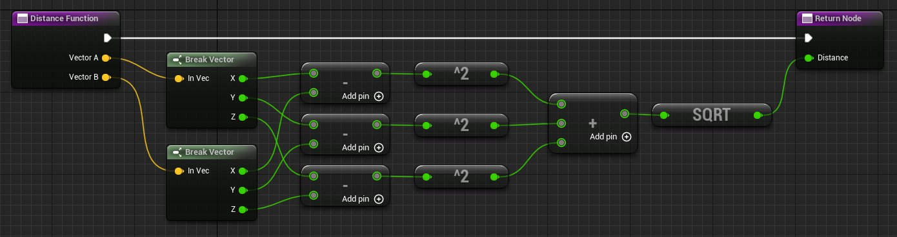

# 函数

> 路径：虚幻引擎5.7文档 / 蓝图可视化脚本 / 专用蓝图节点组 / 函数

> 原始页面：https://dev.epicgames.com/documentation/unreal-engine/functions-in-unreal-engine

**函数（Functions）** 是属于特定 **蓝图（Blueprint）** 的节点图表，它们可以从蓝图中的另一个图表 执行或调用。函数具有一个由节点指定的单一进入点，函数的名称 包含一个执行输出引脚。当您从另一个图表调用函数时，输出执行引脚将被激活， 从而使连接的网络执行。

关于参考与使用信息，请参阅[委托](../../../cpp-programming/delegates-and-lambda-functions/index.md)页面。

## 访问说明符

创建函数时，您可以指定哪些其他对象可以访问和不可以访问这些函数。这可以通过设置 **访问说明符（Access Specifier）** 属性来完成，此属性在 **细节（Details）** 面板中可用于任何选中的函数。

此属性包含以下设置：

| **设置（Setting）** | **说明（Description）** |
| --- | --- |
| **公开（Public）** | 公开（Public）设置意味着任何其他对象都可以调用此函数。这是默认设置。 |
| **受保护（Protected）** | 受保护（Protected）设置意味着只能由当前蓝图以及从当前蓝图派生的任何蓝图调用此函数。 |
| **私有（Private）** | 私有（Private）设置意味着只能从当前蓝图中调用此函数。 |

## 纯和非纯

函数可以为 **纯（Pure）** 类型，也可以为 **非纯（Impure）** 类型。主要区别在于，纯函数承诺不以任何方式修改状态 或类的成员，而非纯函数可以自由修改状态。纯函数通常用于只输出数据值的 getter函数或运算符。

非纯函数必须通过将执行线连接到[事件图表](../../anatomy-of-a-blueprint/event-graph/index.md)中的[函数调用节点](function-calls/index.md)来显式执行。 非纯函数是使用以下方法之一指定的：

- 在UFUNCTION声明中为代码中定义的UFUNCTION指定

  蓝图可调用（BlueprintCallable）

  关键字。
- 对于通过

  蓝图编辑器（Blueprint Editor）

  添加的函数，不选中

  纯（Pure）

  复选框。

纯函数连接到数据引脚，当需要依赖它们的数据时，编译器会自动执行它们。这 意味着，对于纯函数连接到的每个节点，纯函数将被调用一次。纯函数是使用以下方法之一指定的：

- 在函数声明中为代码中定义的函数指定

  蓝图纯（BlueprintPure）

  关键字。
- 对于通过

  蓝图编辑器（Blueprint Editor）

  添加的函数，选中

  纯（Pure）

  复选框。

## 创建函数

### 在蓝图中

在 **蓝图类（Blueprint Class）** 或 **关卡蓝图（Level Blueprint）** 中创建函数：

1. 在 **我的蓝图（My Blueprint）** 选项卡中，单击 **函数** 列表标头上的 **添加按钮（Add Button）**，新建一个函数。
2. 为函数输入一个名称。

函数将在蓝图编辑器的 **图表编辑器（Graph Editor）** 选项卡中的一个新选项卡中打开。

您还可以通过在 **我的蓝图（My Blueprint）** 选项卡中 **单击右键** 并选择 **函数（Function）** 来创建函数。

### 在蓝图接口中

在 **蓝图接口（Blueprint Interface）** 中创建的函数与在 **蓝图类（Blueprint Class）** 或 **关卡蓝图（Level Blueprint）** 中创建的函数具有相同的创建方法，但两者的实现却大相径庭。

若要在 **蓝图接口（Blueprint Interface）** 中创建函数：

1. 在 **我的蓝图（My Blueprint）** 选项卡中，单击 **函数** 列表标头上的 **添加按钮（Add Button）**，新建一个函数。
2. 为函数输入一个名称。

函数将在蓝图编辑器的 **图表编辑器（Graph Editor）** 选项卡中的一个新选项卡中打开。

您还可以通过在 **我的蓝图（My Blueprint）** 选项卡中 **单击右键** 并选择 **函数（Function）** 来创建函数。

关于参考与使用信息，请参阅[Gameplay定时器](../../../gameplay-systems/gameplay-framework/gameplay-timers/index.md)页面。

## 编辑函数

一旦创建了一个函数，您就需要定义它的功能。这是一个分为两步的过程：

- 创建必要的输入和输出参数。
- 在输入和输出之间创建一个节点网络来定义函数行为。

您可以在 **细节（Details）** 选项卡中设置 **说明（Description）**、**类别（Category）**、**访问说明符（Access Specifier）**，以及此函数是否为 **纯（Pure）**。

若要打开函数的 **细节（Details）** 选项卡，您可以：

- 在

  我的蓝图（My Blueprint）

  选项卡中选择函数。
- 在图表中选择函数节点，函数在其中进行调用。
- 在函数的图表中选择函数条目（或结果）节点。

### 输入和输出参数

您还可以在 **细节（Details）** 选项卡中为函数设置输入和输出参数。

若要添加输入或输出参数，请执行以下操作：

1. 在 **细节（Details）** 窗格的 **输入（Inputs）** 或 **输出（Outputs）** 部分中，单击 **新建（New）** 按钮。
2. 命名新参数并使用下拉菜单设置其类型。在此示例中，有两个名为 **矢量A（VectorA）** 和 **矢量B（VectorB）** 的矢量数据输入，以及一个名为 **距离（Distance）** 的浮点数据输出。

   > [!NOTE]
   > 与[蓝图宏](../types-of-blueprints/blueprint-macro-library/index.md)不同，您只能向函数添加数据输入和输出。

   函数图表中的条目节点和结果节点与任何函数调用节点一样，将自动使用正确的引脚进行更新。
3. 您还可以通过展开参数的条目来设置默认值，以及选择是否应该通过引用来传递此值。

若要更改此参数在节点边缘上的引脚位置，请在展开的 **细节（Details）** 窗格条目中使用向上和向下箭头。

现在可以定义函数的功能。我们将通过在条目节点与结果节点之间创建节点网络来实现这一点。

### 定义功能

您可以通过创建连接输入节点和输出节点的蓝图图表来定义函数。在本示例中，我们将创建必要的网络来应用三维版本的勾股定理（如下所示），同时返回三维空间中两点之间的距离。

```
	dx = (x2-x1)^2	dy = (y2-y1)^2	dz = (z2-z1)^2 	D = sqrt(dx+dy+dz)
```

转换为蓝图中的一个节点网络...



*单击图像显示完整视图。*

## 调用函数

一旦创建并定义了函数，即应在 **事件图表（EventGraph）** 中调用它。若要创建将调用函数的节点：

- 将函数从 **我的蓝图（My Blueprint）** 选项卡拖动至事件图表（EventGraph）中的空白位置。
- 在事件图表（EventGraph）中单击右键或从相应的执行或数据引脚中拖动以打开上下文菜单。在上下文菜单中搜索函数，然后选择它以添加函数调用节点。

下面的网络采用两个矢量，并在每个标记上计算它们之间的距离，然后将此距离打印到屏幕上。

在此示例中，我们创建了2个公开矢量变量。在每个矢量变量的设置中，我们将 **显示三维控件（Show 3D Widget）** 设置为"真（True）"。现在，将蓝图添加到关卡后，三维控件将出现在A点和B点定义的位置。 三维控件允许我们通过在视口中移动A点和B点来轻松更改 **A点（Point A）** 和 **B点（Point B）** 的值。

现在，当我们测试图时，这两个点之间的距离会记录在每一个标记上，证明函数有效。

### 从外部蓝图调用函数

您还可以从另一个蓝图内调用蓝图中的 **函数（Function）**，只要您引用了包含要调用函数的蓝图。

以下面的例子为例，我们在角色蓝图（名为 **我的角色（MyCharacter）**）中有一个名为 **承受伤害（Take Damage）** 的函数，它每次被调用时都会使名为 **玩家生命值（PlayerHealth）** 的变量减去10。

在另一个蓝图中（当玩家从 **我的角色（MyCharacter）** 蓝图中发射武器时，该蓝图便是生成的投射物），我们有一个关于投射物击中物体时会产生什么结果的脚本。

该脚本是蓝图第一人称模板项目（Blueprint First Person Template Project）中包含的默认 **我的发射物（MyProjectile*）** 蓝图，当发射物击中模拟实体的物体时，它确实会执行一些操作，并且会在击中位置添加脉冲。假设我们想检查是否击中玩家，如果击中，则调用 **承受伤害（Take Damage）** 函数。

我们可以通过拖走 **事件击中（Event Hit）** 的 **其他（Other）** 引脚并 **投射到（Casting To）** 我们的 **我的角色（MyCharacter）** 蓝图来执行该操作。

一旦我们完成此操作，我们将获得一个对玩家角色的引用，然后可以拖走 **作为我的角色（As My Character）** 引脚，并调用位于该蓝图中的函数 **承受伤害（Take Damage）**。

然后，我们可以将脚本的其余部分连接起来，以便在发射物击中玩家后销毁发射物：

如果我们在编辑器中运行，我们将看到类似于下面的内容。

我们已经将 **玩家生命值（PlayerHealth）** 变量连接到 **打印字符串（PrintString）** 节点，以便能够显示其当前值。在默认情况下，它被设置为100，当玩家向墙壁射击时，它会弹回并击中玩家，您可以看到 **承受伤害（Take Damage）** 函数被调用，并在每次击中时将 **玩家生命值（PlayerHealth）** 变量减去10。

## 故障排除函数

如果您在函数调用节点上看到了一个 **警告！（Warning!）** 栏，显示 **"找不到名为[函数名称]的函数"（"Unable to find function with name [FunctionName]"）** 消息，请 **编译（Compile）** 蓝图。

如果您更改了函数的输入或输出参数的数量，您还需要 **编译（Compile）** 蓝图。
