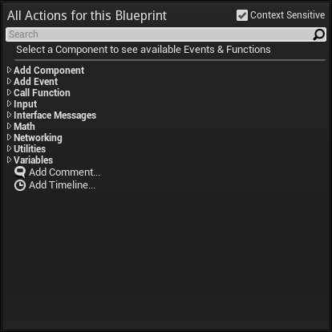
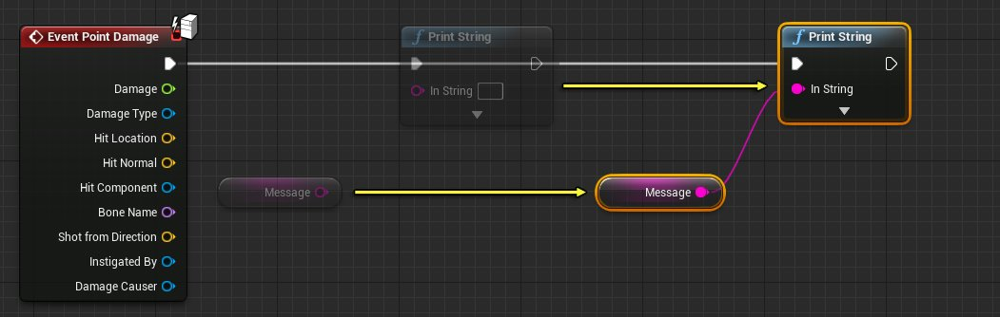
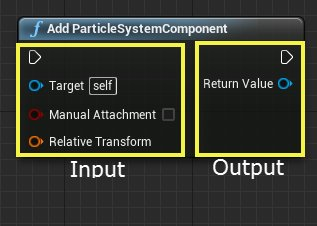
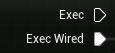
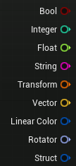
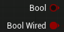
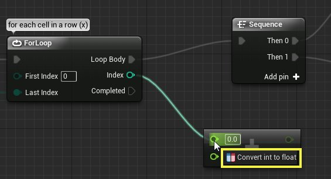
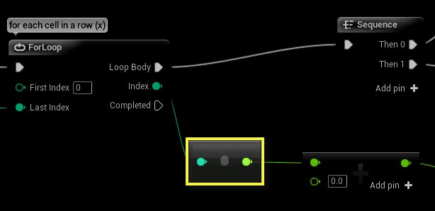

# 节点

> 路径：虚幻引擎5.7文档 / 蓝图可视化脚本 / 专用蓝图节点组 / 节点

> 原始页面：https://dev.epicgames.com/documentation/unreal-engine/nodes-in-unreal-engine

**Nodes（节点）** 是指可以在图表中应用其来定义特定图表及其包含该图表的蓝图的功能的对象，比如事件、函数调用、流程控制操作变量等。

## 应用节点

尽管每种类型的节点执行一种特定的功能，但是所有节点的创建及应用方式都是相同的。这有助于在创建节点图表时提供一种直观的体验。

### 放置节点

通过从 **关联菜单** 中选择一种节点类型，可以把新节点添加到图表中。关联菜单中所列出的节点类型，根据访问该类型列表的方式及当前选中的对象的不同而有所差别。

- 在 **图表编辑器** 选卡中，**右击** 空白区域，会弹出可以添加到图表中的所有节点的列表。如果选中一个Actor，那么将会列出那种类型的Actor支持的事件。

  
- 从节点的一个引脚处拖拽鼠标产生一个连接并在空白处释放鼠标，会弹出一个节点列表，这些节点具有和连接的起始引脚相兼容的引脚。

  Blueprint New ConnectionBlueprint Context Menu - Pin Specific

### 选择节点

在 **图表编辑器** 选卡中单击一个节点，可以选中该节点。

通过按住 **Ctrl** 键并单击节点，可以将节点添加到当前的选中项或者将其从当前的选中项删除。

通过单击并拖拽鼠标创建一个区域选择框，可以选中多个节点。按住 **Ctrl** 键+单击并拖拽鼠标创建一个区域选择框，可以切换对象的选中状态。按住 **Shift** 键+单击并拖拽鼠标创建一个区域选择框，可以把选择框中的对象添加到当前选中项。

要想取消选中所有节点，仅需点击 **图表编辑器** 选卡的空白区域即可。

### 移动节点

通过单击并拖拽一个节点，可以移动该节点。如果选中了多个节点，那么单击选中项内的任何节点并拖拽鼠标将会移动所有节点。

### 引脚

节点两侧都可以有引脚。左侧的引脚是输入引脚，右侧的引脚是输出引脚。

有两种主要引脚类型： 执行引脚（execution pins）和数据引脚（data pins）。

#### 执行引脚

**执行引脚（Execution pins）** 用于将节点连接在一起以创建执行流程。当输入执行引脚被激活后，节点将被执行。一旦节点的执行完成，它将激活一个输出执行引脚来继续执行流程。执行引脚在未连接时显示为空心状态，连接到另一个执行引脚后则显示为实心。函数调用节点始终只有一个输入执行引脚和一个输出执行引脚，因为函数只有一个进入点和一个退出点。其他类型的节点可以有多个输入执行引脚和输出执行引脚，从而允许不同的行为，具体情况取决于哪一个引脚被激活。

#### 数据引脚

**数据引脚（Data Pins）** 用于将数据导入节点或从节点输出数据。数据引脚只能与同类型的相连接，可以连接到同一类型的变量（这些变量有自带数据引脚），也可以连接到其他节点上同类型数据引脚。与执行引脚一样，数据引脚在未连接到任何对象时会显示为空心，在连接到对象后则显示为实心。

节点可以有任意数量的输入或输出数据引脚。函数调用（Function Call）节点的数据引脚对应于相应函数的参数和返回值。

#### 自动类型转换

通过蓝图中的自动类型转换功能，不同数据类型的引脚可以相连接。当尝试在两个引脚间建立连接时，可以通过显示的工具提示信息识别兼容的类型。

从一种类型的引脚拖拽一条线连接到另一种类型的引脚，但是这两种类型是兼容的，那么将会创建一个 **autocast(自动类型转换)** 节点连接两个引脚。

#### Promote to Variable（提升为变量）

在蓝图中，数据引脚所表示的值可以通过 **Promote to Variable（提升为变量）** 命令转换为一个变量。这个命令会在蓝图中创建一个新的变量，并将其连接到那个提升为变量的数据引脚上。对于输出数据引脚来说，可以使用Set节点来设置新变量的值。从本质上讲，这仅是手动地添加一个新变量到图表中并将其和数据引脚相连的快捷方式。

您还可以使用 **提升为变量（Promote to Variable）** 创建变量。

右键单击蓝图节点上的任何输入或输出数据引脚，并选择 **提升为变量（Promote to Variable）** 选项。

通过在 **新光源颜色（New Light Color）** 引脚上单击右键并选择 **提升为变量（Promote to Variable）** 选项，我们可以将一个变量指定为 **新光源颜色（New Light Color）** 值。

或者，您可以拖出一个输入或输出引脚，并选择 **提升为变量（Promote to Variable）**。

### 连线

引脚之间的连接称为 **连线** 。连线代表执行流程或者数据流向。

#### 执行引脚连线

执行引脚间的连线代表执行的流程。执行连线显示为白色的箭头，箭头从一个输出执行引脚指向一个输入执行引脚。箭头的方向表明执行流程的走向。

当正在执行'执行引脚'间的连线时，执行引脚连线会产生一个可视化的标识符。在运行过程中，当一个节点完成执行并激活了下一个节点时，执行引脚间的连线突出显示，表明正在从一个节点转移到另一个节点。

执行连线的可视化标识符会随着时间逐渐消失。

> 图片已省略：undefined

#### 数据连线

数据连线把一个数据引脚连接到同种类型的另一个数据引脚上。数据连线显示为带颜色的箭头，用于可视化地表示数据的转移，箭头的方向代表数据移动的方向。和数据引脚的颜色一样，数据连线的颜色是由数据类型决定的。

> 图片已省略：Blueprint Data Wire

#### 应用连线

在 **图标编辑器** 选卡中，可以使用以下几种方法之一创建连线：

- 点击一个引脚并拖拽鼠标，在同类型的另一个引脚上释放鼠标，这样来创建一个直接连接。

  仅能在两种兼容类型的引脚间创建连接。如果您向一个不兼容的引脚上拖拽一个连接，将会显示一个错误，提示您不能建立连接。
- 从一个引脚拖拽一个连接并在空白区域释放鼠标，会调出一个情境关联的菜单，该菜单中列出了和连线起始节点类型相兼容的所有节点。从列表中选择一个节点将会创建那个节点的一个新实例并且连线会连接到该节点的一个兼容引脚上。

  > 图片已省略：Blueprint Wire Creation - New Node

  通过使用以下方法可以断开两个引脚间的连线:
- **Alt + 单击** 其中一个连接的引脚。
- **右击** 所连接的其中一个引脚，并选择Break Link(断开连接)。

### 合并的图表

出于组织管理的目的，图表中的一组节点可以合并到一个子图表中。这样会创建一个具有层次结构的图表，在父项图表中可以把一个大的或复杂的图表部分作为一个单独的节点看待，该节点具有输入和输出，但是仍然可以编辑合并的图表中的内容。

> 图片已省略：undefined

> 图片已省略：undefined

和宏不同，一组合并的节点是不能共享的，即使在一个单独的关卡蓝图或蓝图类中也不可以共享。如果您复制此合并节点，它会复制内部图表。如果您想创建同种近似行为的多个变种，这个操作是非常方便的，但是这也意味着任何缺陷修复都要应用到每个拷贝版本中。设计这个功能的主要目的是整理图表，隐藏内部复杂度，而不是用于共享或重用。

#### 通道

合并的图表使用通道节点来和包含它的图表进行外部通信和交互。

> 图片已省略：undefined

**Inputs（输入）** 通道节点作为合并图标的入口点。它包含和父项图表中合并图表节点上的输入引脚相对应的执行引脚和数据引脚。

> 图片已省略：Blueprint Tunnel Entrance Node

**Outputs(输出)** 通道节点作为合并图标的出口点。它包含和父项序列中合并图表节点上的输出引脚相对应的执行引脚和数据引脚。

> 图片已省略：Blueprint Tunnel Exit Node

这些引脚是在合并节点时自动生成的。连接到序列中第一个节点的引脚上的任何执行引脚连线和数据引脚连线，都会导致在 **输入** 通道节点上创建对应的引脚，这些引脚出在父项序列中出现在合并图表节点上作为输入引脚。类似地，任何连接到序列最后一个节点的执行引脚连线或数据引脚连线，都会导致在 **输出（Outputs）** 通道节点上创建对应的引脚，从而在父项序列中作为合并图表的引脚。

#### 合并一组节点

1. 在图表中选择要合并的节点，这可以通过单击并在节点周围拖拽一个区域选择框或者通过 **按住Ctrl并单击每个节点** 来实现。

   > 图片已省略：undefined
2. **右击** 其中一个节点并选择 **Collapse Nodes（合并节点）** 。

   > 图片已省略：Blueprint Collapse Nodes - Menu Option
3. 在出现的新节点的文本域中输入该合并图标的名称并按下 **回车** 键。

   > 图片已省略：Blueprint Collapse Nodes - Graph Name
4. 现在，合并图表显示成了一个单独的节点，并在 **My Blueprint（我的蓝图）** 选卡中出现了到该合并图表的引用。

   > 图片已省略：undefined
5. 要想编辑该合并节点，请 **双击** 该合并图表节点或者在 **我的蓝图** 选卡中选择该子图表。

   > 图片已省略：undefined

#### 展开一个合并的图表:

1. **右击** 一个合并图表节点，并选择 **Expand Node（展开节点）** 。

   > 图片已省略：Blueprint Expand Node - Menu Option
2. 合并图表节点会被它所包含的节点所代替，不再出现在 **我的蓝图** 选卡的图表层次结构中。

   > 图片已省略：Blueprint Expand Node - Resulting Nodes
