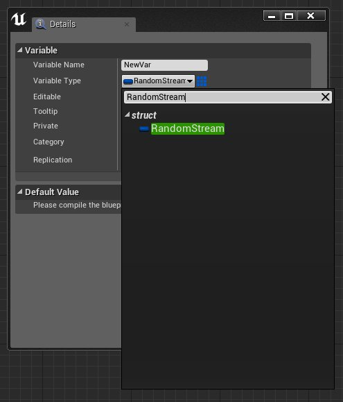
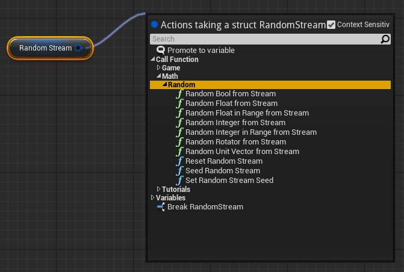
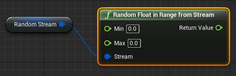
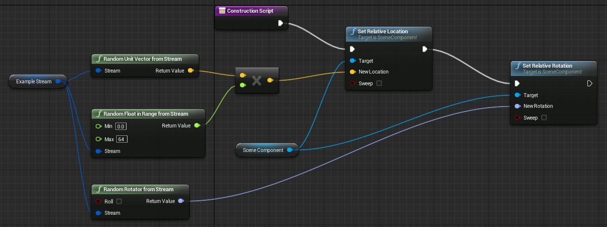
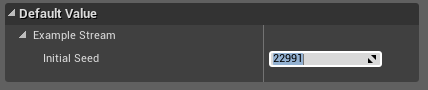

# 随机流

> 路径：虚幻引擎5.7文档 / 蓝图可视化脚本 / 专用蓝图节点组 / 随机流

> 原始页面：https://dev.epicgames.com/documentation/unreal-engine/random-streams-in-unreal-engine

**RandomStreams（随机流）** 允许在蓝图、关卡蓝图及针对动画的动画蓝图中重复地生成及应用随机数。当设置类似于散射物体或者构建程序化的场景时， 这是非常有用的。此时您可能需要一种随机的效果，但是同时又想确保每次计算蓝图时产生一致的分布。之前， 使用随机值会导致每次计算蓝图时产生不同的分布，这意味着当移动蓝图或者执行其它的导致需要重新计算图表的动作时， 会产生完全不同的效果。通过使用随机流，您可以基于一个种子值调整效果来获得期望的结果，然后在维持整体效果的过程中 执行任何其他修改。

## RandomStream（随机流）变量

RandomStreams(随机流)在蓝图中以一种特殊类型的结构体变量呈现。像其他变量一样，您可以通过在 **图表** 模式中的 **我的蓝图** 面板中创建此类变量并添加它们。

请参照[创建变量](../blueprint-variables/index.md#creatingvariables)部分获得关于如何在类蓝图或关卡蓝图中添加新变量的完整指南。

## 随机流函数

为了使用随机流变量，我们提供了一组函数，它们可以取入一个RandomStream（随机流）作为输入，且根据函数功能不同它们输出一个不同类型的随机值。

| 函数 | 描述 |
| --- | --- |
| **Random Bool from Stream** | 随机输出0或1。 |
| **Random Float from Stream** | 随机输出 (0.0, 1.0) 范围之间的一个浮点值。 |
| **Random Float in Range from Stream** | 随机输出(Min, Max) 范围之间的一个浮点值。 |
| **Random Integer From Stream** | 输出(0, Max - 1) 范围之间的一个均匀分布的随机整型值。 |
| **Random Integer In Range From Stream** | 输出(Min, Max) 范围之间的一个随机整型值。 |
| **Random Rotator From Stream** | 输出一个随机的Rotator（旋转度）值。 |
| **Random Unit Vector From Stream** | 输出一个随机的单位长度的向量值。 |

选择上面显示的其中一个函数，将会把该函数放置到图表中并连接到RandomStream变量上。

以下示例展示了如何使用RandomStream（随机流）函数来随机地放置及旋转一个属于某个蓝图的组件：

正如您看到的，随机的布尔值、浮点型值、整型值、向量及旋转度都可以从同一个流中提取出来。

## 初始种子

Initial Seed（初始种子）属性用于计算随机值流。每次计算一个单独的随机种子所产生的随机值序列 都将是一样的，这为我提供了前面提到的一致性。不同的种子生成不同的值序列。

所以，修改一个RandomStream的Initial Seed（初始种子）将会导致所生成的值发生变化。这可以用于调整一种随机效果，直到您获得您需要的 序列或分布为止。蓝图的每个实例都会生成一个新的Initial Seed（初始种子值）。这意味着每次在世界中放置一个蓝图的实例时或者复制一个现有实例时， 将会赋予属于该蓝图的每个RandomStream变量一个新的Initial Seed（初始种子）值。所以，每个实例都将是不同的，并且可以对其进行调整来创建实际期望的效果。

### 修改初始种子

要想直接在变量上设置Initial Seed（初始种子）属性， 则RandomStream变量必须暴露为可编辑的。 一旦暴露了该变量，那么当选中一个蓝图的实例时，就可以在 **详细信息** 选卡中看到此Initial Seed（初始种子）属性。

在蓝图图表中，您还可以将Initial Seed（初始种子）设置为一个特定的值或一个新的随机值。

当您具有一个放置了很多个对象(比如草叶或石头)的蓝图，但您总是想以相同的方式放置它们，以便用于测试或其他目的时，**Set Random Stream Seed** 节点就很有用了。 它将会覆盖将该蓝图放置到关卡中时随机设置的Initial Seed（初始种子）。
