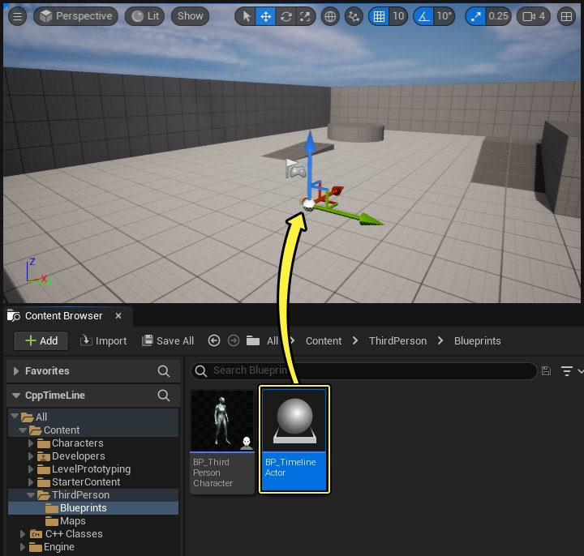
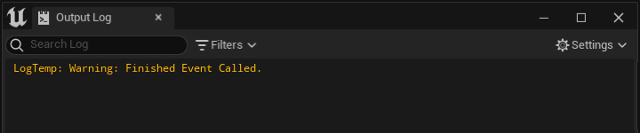

# 创建时间轴

> 路径：虚幻引擎5.7文档 / 蓝图可视化脚本 / 专用蓝图节点组 / 时间轴 / 创建时间轴

> 原始页面：https://dev.epicgames.com/documentation/unreal-engine/creating-timelines-in-unreal-engine

编程语言

C++

从下拉菜单中选择一个选项以查看与之相关的内容

## 创建时间轴

你可按照以下步骤，在**Actor**类中创建并实例化自定义的**时间轴组件**。

1. 找到你的**C++ Classes文件夹**，并点击**添加+（Add+）**。 在下拉菜单中选择**新建C++类（New C++ Class）**。
2. 选择**Actor**类作为**父类**。

   点击查看大图。
3. 将新建的Actor类命名为**Timeline Actor**。

   点击查看大图。
4. 找到`TimelineActor.h`文件并包含以下`TimelineComponent`类的库。

   TimelineActor.h

   C++

   ```
   #include "Components/TimelineComponent.h"
   ```
5. 在TimelineActor类定义中实现以下类声明：

   TimelineActor.h

   C++

   ```
   protected:         UPROPERTY(EditAnywhere, BlueprintReadWrite)        UTimelineComponent* ExampleTimelineComp;
   ```

   > [!NOTE]
   > 在此代码示例中，你需要使用[属性说明符标签](https://dev.epicgames.com/documentation/unreal-engine/unreal-engine-uproperties?application_version=5.7)**EditAnywhere**和**BlueprintReadWrite**。
6. 找到`TimelineActor.cpp`文件，然后将以下代码添加到你的TimelineActor构造函数`ATimelineActor::ATimelineActor()`之中。

   TimelineActor.cpp

   C++

   ```
   ATimelineActor::ATimelineActor()     {         // Set this actor to call Tick() every frame.  You can turn this off to improve performance if you don't need it.         PrimaryActorTick.bCanEverTick = true;         ExampleTimelineComp = CreateDefaultSubobject<UTimelineComponent>(TEXT("TimelineComponent"));     }
   ```
7. **编译**你的代码。
8. 找到**C++ Classes文件夹**，右键点击你的**TimelineActor**，并基于你的TimelineActor类创建蓝图。 将其命名为**Bp_TimelineActor**。
9. 创建TimelineActor蓝图后，你可以查看**类默认值（Class Defaults）**。 在**组件（Components）**选项卡中，这时你应该可看到你的时间轴组件示例。

### 阶段性代码

TimelineActor.h

C++

```
#pragma once
	#include "Components/TimelineComponent.h"
	#include "CoreMinimal.h"
	#include "GameFramework/Actor.h"
	#include "TimelineActor.generated.h"

	UCLASS()
	class CPPTIMELINE_API ATimelineActor : public AActor
	{
		GENERATED_BODY()
```

TimelineActor.cpp

C++

```
#include "TimelineActor.h"

	// Sets default values
	ATimelineActor::ATimelineActor()
	{
		// Set this actor to call Tick() every frame.  You can turn this off to improve performance if you don't need it.
		PrimaryActorTick.bCanEverTick = true;
		ExampleTimelineComp = CreateDefaultSubobject<UTimelineComponent>(TEXT("TimelineComponent"));
	}
```

## 时间轴变量

当你在C++中使用`UProperty说明符`创建时间轴组件后，该组件会成为**组件（Components）**选项卡中的可用变量。 对于想要继续通过蓝图脚本对时间轴组件进行迭代的设计人员来说， 这个变量很有用。

> [!NOTE]
> 上图显示了使用原生C++时间轴变量获取蓝图中时间轴的当前播放速率（Current Play Rate）值。

如需了解全部的可用蓝图时间轴节点及其功能详情，请参阅[时间轴节点](../timelines-nodes/index.md)页面。

## 创建FTimeLineEvent

时间轴事件（`FOnTimelineEvent`）属于[动态委托](../../../../cpp-programming/delegates-and-lambda-functions/dynamic-delegates/index.md)，可以为时间轴组件提供处理事件的能力。 请按以下步骤创建你自己的`FTimeLineEvent`，并将其绑定到你的时间轴组件的已完成功能。

1. 找到`TimelineActor.h`文件并在**类定义**中声明以下代码：

   TimelineActor.h

   C++

   ```
   protected:          //Delegate signature for the function which will handle our Finished event.         FOnTimelineEvent TimelineFinishedEvent;          UFUNCTION()         void TimelineFinishedFunction();
   ```
2. 找到`TimelineActor.cpp`，并实现以下代码：

   TimelineActor.cpp

   C++

   ```
   void ATimelineActor::TimelineFinishedFunction()      {         UE_LOG(LogTemp, Warning, TEXT("Finished Event Called."));      }
   ```
3. 找到`ATimelineActor::BeginPlay()`方法，并实现以下代码：

   TimelineActor.cpp

   C++

   ```
   // Called when the game starts or when spawned      void ATimelineActor::BeginPlay()     {         Super::BeginPlay();          TimelineFinishedEvent.BindUFunction(this, FName("TimelineFinishedFunction"));         ExampleTimelineComp->SetTimelineFinishedFunc(TimelineFinishedEvent);         ExampleTimelineComp->PlayFromStart();     }
   ```

   现在你已成功将`TimelineFinished`事件绑定到自定义`TimelineFinished`函数。
4. 编译你的代码。 打开**编辑器（Editor）**并找到**内容浏览器（Content Browser）**。 找到你的**BP_TimelineActor**并将其拖移到**关卡**中。

   
5. 按下**播放（Play）**按钮。 这时你应该可以在**输出日志（Output Log）**窗口看到以下消息：

   

### 已完成代码

TimelineActor.h

C++

```
#pragma once
	#include "Components/TimelineComponent.h"
	#include "CoreMinimal.h"
	#include "GameFramework/Actor.h"
	#include "TimelineActor.generated.h"

	UCLASS()
	class CPPTIMELINE_API ATimelineActor : public AActor
	{
		GENERATED_BODY()
```

TimelineActor.cpp

C++

```
#include "TimelineActor.h"

	// Sets default values
	ATimelineActor::ATimelineActor()
	{
		// Set this actor to call Tick() every frame.  You can turn this off to improve performance if you don't need it.
		PrimaryActorTick.bCanEverTick = true;
		ExampleTimelineComp = CreateDefaultSubobject<UTimelineComponent>(TEXT("TimelineComponent"));
	}
```
