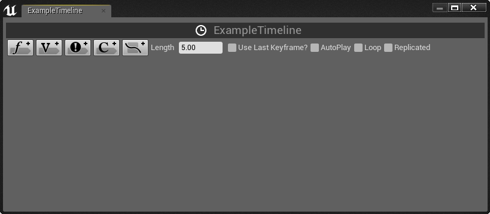
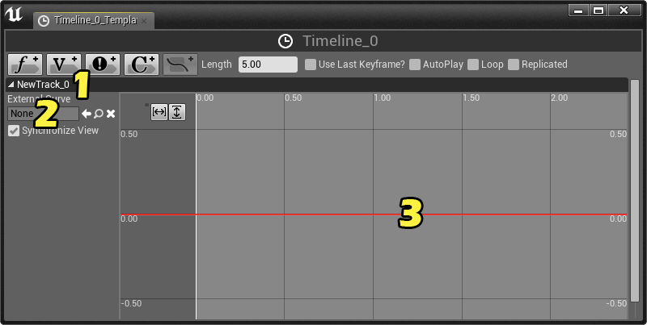
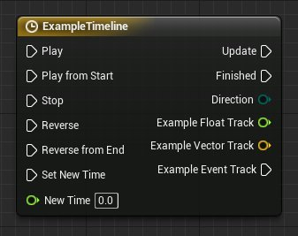

# 编辑时间轴

> 路径：虚幻引擎5.7文档 / 蓝图可视化脚本 / 专用蓝图节点组 / 时间轴 / 编辑时间轴

> 原始页面：https://dev.epicgames.com/documentation/unreal-engine/editing-timelines-in-unreal-engine

**时间轴** 可以通过对 **图表** 选项卡的时间轴节点 **双击** 来编辑，或者在 **My Blueprint（我的蓝图）** 选项卡的时间轴内进行编辑。 这样会在新选项卡中打开 **时间轴编辑器**。

## 时间轴编辑器

| 按钮/选框 | 描述 |
| --- | --- |
|  | 添加新的浮点轨道到时间轴，以对标量浮点值进行动画处理。 |
|  | 添加新的向量轨道到时间轴，以对浮点向量值（例如旋转值或平移值）进行动画处理。 |
|  | 添加一个事件轨道，该轨道会提供另一个执行输出引脚，此引脚将在轨道的关键帧时间处被触发。 |
|  | 添加新的线性颜色轨道到时间轴，以对颜色进行动画处理。 |
|  | 添加外部曲线到时间轴。 此按钮仅在 **Content Browser（内容浏览器）** 中选择外部曲线后才能被激活。 |
|  | 该按钮使您能为此时间轴设置回放长度。 |
|  | 如此按钮未激活，将忽略序列的最后关键帧。 这可以帮助防止动画循环时被跳过。 |
|  | 如启用该按钮，此时间轴节点无需输入即可开始，而且将在关卡一开始就开始播放。 |
|  | 如启用该按钮，除非通过Stop输入引脚来停止，时间轴动画将会无限制地重复播放。 |
|  | 如启用，时间轴动画将跨客户端被复制。 |

## 添加轨道

时间轴使用 **轨道** 来定义单个数据的动画。 可以为浮点值，向量值，颜色值或事件。 轨道可通过点击 **Add Track** （添加轨道）按钮之一来添加到时间轴。 举例来说，点击Blueprint Timeline - Add Float Track Button按钮来添加轨道并为新轨道输入名称。 按下 **回车** 来为您的新浮点轨道保存名称。

1. Track Name

   （轨道名称）-您可以在任何时候为此区域内的轨道输入新名称。
2. External Curve group

   （外部曲线组）-使您可以从

   内容浏览器

   中选择外部曲线资源，而不用创建您自己的曲线。
3. Track timeline

   （轨道时间轴）- 此轨道的关键帧图表。 您可以把关键帧放置到这里，并且您将看到作为运算结果的插值曲线。

## 添加关键帧

当您放置完轨道后，您可以开始添加关键帧以定义您的动画。

如需了解更多时间轴关键帧及曲线的信息，请参阅[关键帧及曲线页面](../keys-and-curves/index.md)。

在您完成编辑轨道后，该轨道的数据或事件执行将由与轨道名称相同的数据或执行引脚来输出。

