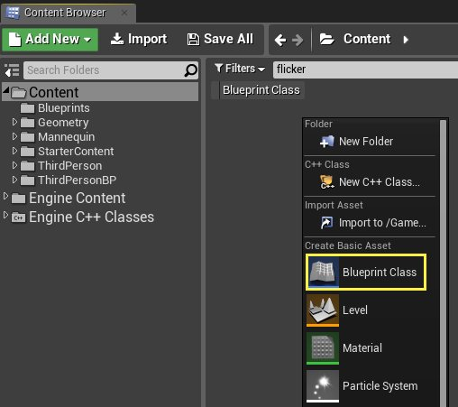

# 创建蓝图类

> 路径：虚幻引擎5.7文档 / 蓝图可视化脚本 / 专用蓝图节点组 / 蓝图类型 / 蓝图类 / 创建蓝图类

> 原始页面：https://dev.epicgames.com/documentation/unreal-engine/creating-blueprint-classes-in-unreal-engine

可使用本文档中的提高任一方法，通过 **内容浏览器（Content Browser）** 或 **关卡编辑器（Level Editor）** 创建 **蓝图资产**。

## 通过内容浏览器创建

内容浏览器功能有一个专门的 **新增（Add New）** 按钮，用于在当前目录下新建蓝图资产。你也可以右键点击 **资产视图（Asset View）** 或 **资产树（Asset Tree）** 在选定位置创建蓝图资产。

### 使用新增按钮

1. 在 **内容浏览器（Content Browser）** 中，点击 **新增（Add New）** 按钮。
2. 从下拉菜单的 **创建基本资产（Create Basic Asset）** 部分中选择 **蓝图类（Blueprint Class）**。

   > [!NOTE]
   > 可通过 **创建高级资产（Create Advanced Asset）** 下的 **蓝图（Blueprints）** 选项来创建各种不同的[蓝图资产类型](../../index.md)。
3. 为蓝图资产选择 **父类（Parent Class）**。欲知更多信息，请参见[父类](../index.md#%E7%88%B6%E7%B1%BB)。

   

### 使用资产视图

1. 在 **内容浏览器（Content Browser）** 里的 **资产视图（Asset View）**（右侧面板） 里面右键点击，打开快捷菜单。
2. 在 **创建基础资产（Create Basic Asset*）** 中选择新建 **蓝图类** 。

   
3. 为你的蓝图选择一个父类。

   

   > [!NOTE]
   > 查看[父类](../index.md#%E7%88%B6%E7%B1%BB)页面来了解如何选择父类。

### 使用资产树

1. 在 **内容浏览器（Content Browser）** 上的 **资产树（Asset Tree）** （左侧面板）点击右键。
2. 在出现的快捷菜单中，选择 **新资产（New Asset）**，然后选择 **蓝图类（Blueprint Class*）**。
3. 为你的蓝图选择一个父类。

   

   > [!NOTE]
   > 查看[父类](../index.md#%E7%88%B6%E7%B1%BB)页面来了解如何选择父类。

## 在关卡编辑器中创建

可通过关卡编辑器（Level Editor）中的一个或多个选定 **Actor** 创建 **蓝图资产（Blueprint Asset）**。创建的蓝图将包含Actor，并将保留在关卡编辑器（Level Editor）中做的所有Actor属性更改以及Actor之间的空间关系。此功能可将多Actor系统保存到单个可重复使用的资产中。

1. 在关卡编辑器（Level Editor）视口中选择一个或多个Actor。
2. 在关卡编辑器（Level Editor）工具栏中，单击 **蓝图（Blueprint）** 下拉菜单，然后选择 **将选择转换为蓝图类（Convert Selection to Blueprint Class）**。

   > [!TIP]
   > 如果仅选择一个Actor，则 **细节（Details）** 面板中将显示 **蓝图/添加脚本（Blueprint/Add Script）** 按钮。由于从单个Actor创建蓝图资产所需的用户信息较少，因此可使用此按钮直接跳至[新子类](#newsubclass)菜单，以节省时间。
3. 此时，编辑器将提供三种从所选Actor创建新蓝图资产的方法：**新子类（New Subclass）**、**子Actor（Child Actors）** 和 **收获组件（Harvest Components）**。
4. 选择方法后，从窗口底部的列表中为新蓝图资产选择父Actor类。如果使用 **新子类（New Subclass）** 方法，则父类将进一步受限为所选Actor或其子类的类。
5. 选择方法并选择父类后，新蓝图资产将显示在内容浏览器（Content Browser）中。

### 新子类

**新子类（New Subclass）** 仅在选定单个Actor时可用。此方法可将蓝图资产作为Actor子类或其任一子类创建，包含所做的任何Actor属性更改。这个方法最直接。蓝图资产将保留对选定Actor的属性进行的更改。

### 子Actor

**子Actor（Child Actors）** 方法基于任意Actor类创建蓝图资产。新Actor拥有默认组件，并且关卡编辑器（Level Editor）视口中的每个选定Actor有一个额外的 **子Actor组件（Child Actor Component）**。子Actor组件将保留对选定Actor属性进行的更改。

> [!TIP]
> 通常，由于此方法不会引入新行为或非必要组件，所以用户会选择基础Actor类。

### 收获组件

**收获组件（Harvest Components）** 方法基于任意Actor类创建单个蓝图资产（Blueprint Asset），然后收获所有选定Actor的组件，并将组件附加到新Actor。当Actor主要作为其组件的容器时，请使用此方法。举例而言，由于通常只会出现渲染和潜在碰撞这类行为，多个 **静态网格体Actor** 可有效地组合为拥有多个静态网格体组件的单个Actor。但是，由于AI控制的角色做出的行为拥有Actor级别的自主权，并可能需要单独控制组件并单独访问组件数据，因此这类角色通常需要保留为单独的Actor。

### 在类查看器中创建

[类查看器（Class Viewer）](../../../../../understanding-the-basics/assets-and-content-packs/class-viewer/index.md) 也可以创建蓝图资产。在使用类查看器时，它可以按以下方式帮助过滤显示的类：

1. 在 **Class Viewer** 工具栏, 点击 **Filters**.
2. 在 **Filters** 菜单中, 选择 **Blueprint Bases Only**.

要新建蓝图资产，需选择想要用作基础的类。在本例中，**CameraActor** 就是我们的基类。

1. 点击所选基类右边的向下箭头，或直接右键点击类。
2. **创建蓝图（Create Blueprint）**选项将会出现在快捷菜单中。点击它打开创建蓝图的对话框。
3. 输入蓝图类的名字并选择保存它的文件夹位置。
4. 在创建蓝图对话框的上方，点击 "创建 [Path]/[Name]" 。这将创建蓝图资产并在 **蓝图编辑器中**打开它。
5. 点击蓝图编辑器工具栏中的 **保存**，以保存新建的蓝图资产，完成流程。
