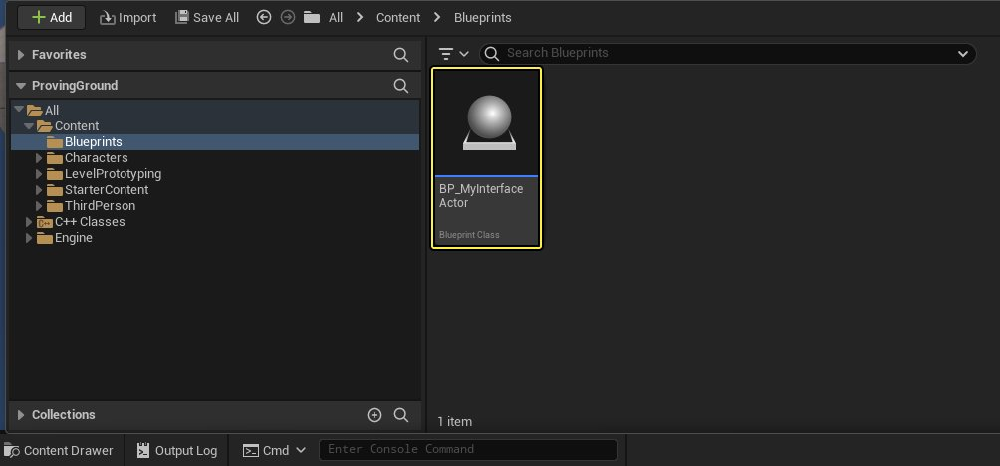
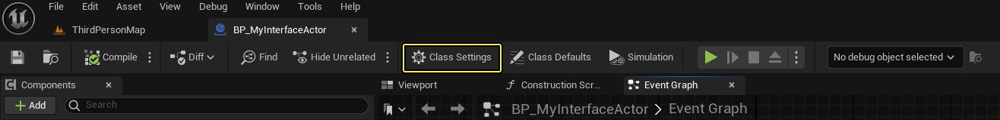
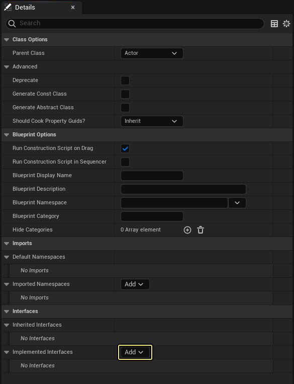
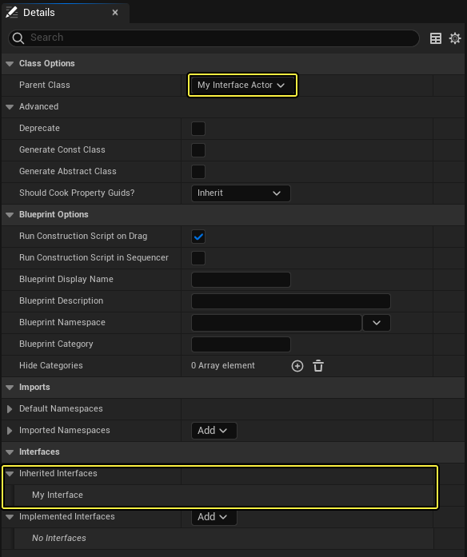
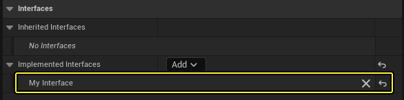
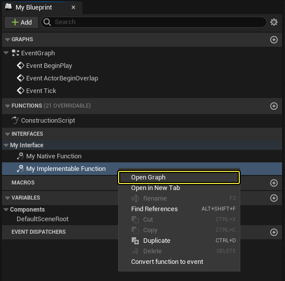
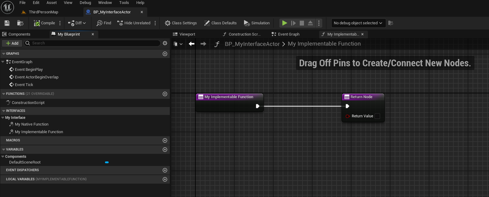
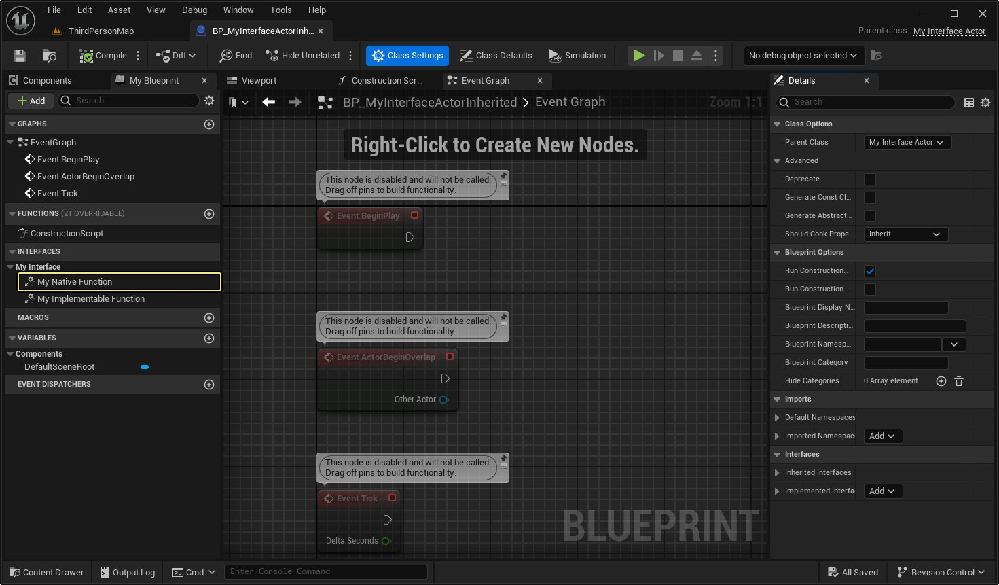

# 在蓝图中实现接口

> 路径：虚幻引擎5.7文档 / 蓝图可视化脚本 / 专用蓝图节点组 / 蓝图类型 / 蓝图接口 / 在蓝图中实现接口

> 原始页面：https://dev.epicgames.com/documentation/unreal-engine/implementing-blueprint-interfaces-in-unreal-engine

接口是一种常见的与不同类型的对象进行交互的方式，这些对象都具备某些特定的功能。这意味着无论对象之间有多么不同，你都可以强制不同类型的对象实现某些相同的功能。蓝图可以实现：

- 蓝图接口
- 虚幻C++接口

### 添加接口

要创建剪口，请查看以下文档：

- 创建蓝图接口
- 创建虚幻C++接口

## 本文使用的内容

文本所使用的内容是一个在C++中定义的虚幻引擎接口，以及一个实现该接口的Actor。头文件和源文件如下：

MyInterface.h

```
#pragma once #include "CoreMinimal.h"#include "UObject/Interface.h"#include "MyInterface.generated.h" // 该类不需要修改。UINTERFACE(MinimalAPI, Blueprintable)class UMyInterface : public UInterface{	GENERATED_BODY()};  class SAMPLE_API IMyInterface{	GENERATED_BODY() 	// 将该类添加接口函数。该类将被继承，以实现此接口。public: 	virtual bool MyInterfaceFunction(); 	UFUNCTION(BlueprintCallable, BlueprintImplementableEvent, Category=MyInterface)	bool MyImplementableFunction(); 	UFUNCTION(BlueprintCallable, BlueprintNativeEvent, Category=MyInterface)	FString MyNativeFunction(); 	// 工具函数public:	FString GetInterfaceName();};
```

MyInterface.cpp

```
#include "MyInterface.h" // 在此为任何未被定义为纯虚函数的IMyInterface函数添加默认功能。bool IMyInterface::MyInterfaceFunction(){	return false;} FString IMyInterface::GetInterfaceName(){	return FString(TEXT("MyInterface"));}
```

MyInterfaceActor.h

```
#pragma once #include "CoreMinimal.h"#include "GameFramework/Actor.h"#include "MyInterface.h"#include "MyInterfaceActor.generated.h" UCLASS()class SAMPLE_API AMyInterfaceActor : public AActor, public IMyInterface{	GENERATED_BODY()	 public:		// 为该Actor的属性设置默认值	AMyInterfaceActor(); 	// 接口函数实现	virtual bool MyInterfaceFunction() override; 	FString MyNativeFunction_Implementation() override; 	// 每帧调用	virtual void Tick(float DeltaTime) override; protected:	// 游戏启动或生成时调用	virtual void BeginPlay() override; };
```

MyInterfaceActor.cpp

```
#include "MyInterfaceActor.h" // 设置默认值AMyInterfaceActor::AMyInterfaceActor(){ 	// 将该Actor设置为每帧调用Tick()。如不需要，可以将其关闭以提升性能。	PrimaryActorTick.bCanEverTick = true;} bool AMyInterfaceActor::MyInterfaceFunction(){	return true;} FString AMyInterfaceActor::MyNativeFunction_Implementation(){	return FString(TEXT("My Native Function C++ Implementation first."));} // 游戏启动或生成时调用void AMyInterfaceActor::BeginPlay(){	Super::BeginPlay();} // 每帧调用void AMyInterfaceActor::Tick(float DeltaTime){	Super::Tick(DeltaTime);}
```

## 向现有蓝图添加函数

向现有蓝图添加函数，请按以下步骤操作：

1. 打开现有蓝图类。

   

   现有蓝图类
2. 在蓝图工具栏中，选择 **类设置（Class Settings）**。

   

   打开蓝图类设置。
3. 找到 **类设置细节面板**。在 **接口（Interfaces） > 实现接口（Implemented Interfaces）** 下拉菜单中选择接口并选择 **添加（Add）**。

   

   添加想要此蓝图实现的接口。
4. 搜索你想让类实现的接口。

   > [!TIP]
   > 本实例使用在 `MyInterface.h` 中定义的、名为 `MyInterface` 的C++接口。
5. 找到接口后将其选中，然后 **编译（Compile）** 并 **保存（Save）** 蓝图。

现在，你应该已将蓝图配置为实现该接口。**我的蓝图（My Blueprint）** 选项卡应显示你所选接口的类别，以及该接口为你提供的所有可实现的函数。

> [!NOTE]
> 类设置（Class Settings）中的接口（Interfaces）类别下的"继承接口（Inherited Interfaces）"分段会自动填充此类通过其父蓝图或C++类继承的所有接口。如下所示，一个蓝图继承自 `MyInterfaceActor` C++类，从而继承了 `MyInterface`。
>
> 
>
> 列出此蓝图的继承接口。

## 移除接口

要从蓝图类移除接口，请在类设置（Class Settings）的实现接口（Implemented Interfaces）列表中，点击要移除的接口旁的X按钮。



从此蓝图移除继承的接口。

## 实现接口函数

你可以使用以下任一方法，在蓝图中实现继承自接口的接口函数：

- 在

  我的蓝图（My Blueprint） > 接口（Interfaces）

  中双击函数，打开其蓝图图表。
- 在

  我的蓝图（My Blueprint） > 接口（Interfaces）

  中右键点击函数，选择

  打开图表（Open Graph）

  。



打开函数的蓝图图表。

你可以在此为类实现接口函数。关于在蓝图中实现函数的更多详情，请参阅[蓝图函数](../../../functions/index.md)一文。



蓝图中接口函数的默认实现。

### 重载接口函数

接口函数的蓝图实现会默认覆盖其父类中的实现。要在蓝图中首先调用父类的视线，请参阅[蓝图原生事件](#%E8%93%9D%E5%9B%BE%E5%8E%9F%E7%94%9F%E4%BA%8B%E4%BB%B6)中的第4步。

## 蓝图原生事件

`BlueprintNativeEvent` 函数与 `BlueprintImplementableEvent` 函数不同。`BlueprintImplementableEvent` 函数只能在蓝图内实现。而 `BlueprintNativeEvent` 函数可以在蓝图、C++或两者中同时实现。要实现 `BlueprintNativeEvent`，请选择最适合你需求的情况，并按其步骤操作：

- 要单纯在蓝图中实现

  BlueprintNativeEvent

  ，请按照

  实现接口函数

  一节中的指示操作。
- 要在C++中实现

  BlueprintNativeEvent

  ，请参阅

  虚幻接口

  一文。
- 要在蓝图中重载

  BlueprintNativeEvent

  并让蓝图代用其父类包含的C++实现，请参阅

  在蓝图中重载蓝图原生事件

  一节。

### 在蓝图中重载蓝图原生事件

要在蓝图中重载在C++中定义的蓝图原生事件，请按以下步骤操作：

1. 打开继承自一个实现了某个接口的C++类的蓝图。

   - 在这种情况下，C++类的实现应如下所示：

     ```
           FString AMyInterfaceActor::MyNativeFunction_Implementation()      {          return FString(TEXT("My Native Function C++ Implementation first."));      }
     ```
2. 在 **我的蓝图（My Blueprint）** 面板中打开 `BlueprintNativeEvent` 函数。

   

   打开蓝图实现。
3. 如果你尚未在蓝图中实现此函数，你应该会看到一个主函数节点。

   > 图片已省略：Main Blueprint function node

   蓝图函数定义。
4. 右键点击此节点并选择 **添加对父函数的调用（Add Call to Parent Function）**。

   > 图片已省略：Add call to parent function

   在函数中添加对父函数的调用。
5. 在 **Parent** 节点后添加蓝图功能。

   > 图片已省略：Add Blueprint functionality after parent node

   在调用父函数后添加额外的功能。

## 调用接口函数

根据实际情况，调用接口函数的方法不止一种。如果你想在蓝图中调用 **My Implementable Function**，有多种选择：

- My Implementable Function（对象）
- My Implementable Function（接口）
- My Implementable Function（消息）

> 图片已省略：Different Blueprint interface function node types

可响应不同类型的蓝图接口函数调用的蓝图节点。

| **蓝图函数类型** | **说明** |
| --- | --- |
| 对象（Object） | 调用实现了接口的指定类的对象。 |
| 接口（Interface） | 调用实现了此接口的对象。 |
| Message | 调用任意对象。 如果该对象未实现正确的接口，该函数会默默地失败。而且这种方法比对象和接口方法都要慢。 |
