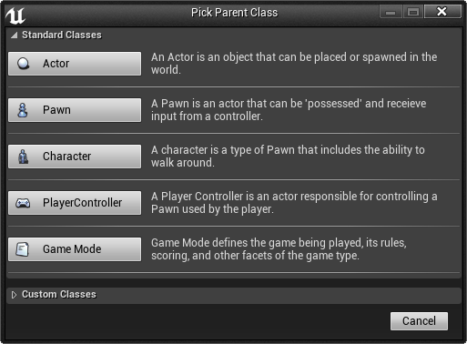

# 蓝图宏库

> 路径：虚幻引擎5.7文档 / 蓝图可视化脚本 / 专用蓝图节点组 / 蓝图类型 / 蓝图宏库

> 原始页面：https://dev.epicgames.com/documentation/unreal-engine/blueprint-macro-library-in-unreal-engine

**蓝图宏库（Blueprint Macro Library）** 是一个容器，它包含一组 **宏** 或自包含的图表，这些图表可以 作为节点放置在其他蓝图中。它们可以节省时间，因为它们可以存储常用的节点序列， 包括执行和数据传输所需的输入和输出。

宏在引用它们的所有图表之间共享，但是它们会自动扩展到图表中， 就像它们在编译期间是一个折叠节点那样。这意味着蓝图宏库不需要编译。但是， 对宏的更改仅反映在重新编译包含这些图表的蓝图时 引用该宏的图表中。

## 创建蓝图宏库

蓝图宏库存储在包中，可以像任何其他资源一样通过 **内容浏览器（Content Browser）** 创建。

1. 在 **内容浏览器（Content Browser）** 中，单击New Asset button。
2. 从显示的菜单中，选择 **创建高级资源（Create Advanced Asset）** 下的 **蓝图（Blueprints）> 蓝图宏库（Blueprint Macro Library）**。
3. 为您的蓝图宏库选择一个 **父类（Parent Class）**。

   
4. 您的蓝图宏库现在将显示在 **内容浏览器（Content Browser）** 中。在 **内容浏览器** 中的蓝图宏库图标下键入该蓝图宏库的名称。

   首次创建您的蓝图宏库时，或者当您在 **蓝图编辑器（Blueprint Editor）** 中对其进行更改时，星号将添加到 **内容浏览器（Content Browser）** 中的蓝图宏库图标中。这表示蓝图宏库尚未保存。

还有两种其他方法可以从 **内容浏览器（Content Browser）** 访问蓝图宏库创建（Blueprint Macro Library Creation）菜单。

1. **右键单击** **内容浏览器（Content Browser）** 的资源视图（Asset View）（右侧）面板，或单击 **内容浏览器（Content Browser）** 的资源树（Asset Tree）（左侧）的文件夹。
2. 在显示的菜单中，选择 **创建高级资源（Create Advanced Asset）** 下的 **蓝图（Blueprints）> 蓝图宏库（Blueprint Macro Library）**。
3. **选取父类（Pick Parent Class）** 窗口随即显示，从这里开始，蓝图宏库创建过程与使用 **新资源（New Asset）** 按钮时相同。

## 蓝图宏

**蓝图宏（Blueprint Macros）** 或 **宏（Macros）** 本质上与节点的折叠图相同。它们有一个由隧道节点 指定的入口点和出口点。每个隧道都可以有任意数量的执行或数据引脚，当在其他蓝图和图表中使用时， 这些引脚在宏节点上可见。

### 创建蓝图宏

蓝图宏可以在蓝图类或关卡蓝图中创建，就像蓝图函数一样。它们还可以组织到蓝图宏库中。

若要在蓝图类、关卡蓝图或蓝图宏库中创建蓝图宏，请执行以下操作：

1. 在 **我的蓝图（My Blueprint）** 选项卡中，单击宏列表标头上的 **添加按钮（Add Button）**创建一个新宏。
2. 为您的蓝图宏输入一个名称。

您的蓝图宏将在蓝图编辑器的 **图表（Graph）** 选项卡中的新选项卡中打开。

您还可以通过在 **我的蓝图（My Blueprint）** 选项卡中 **右键单击** 并选择 **宏（Macro）** 来创建蓝图宏。

### 构建蓝图宏

当您第一次创建蓝图宏时，将打开一个包含 **输入（Inputs）** 隧道节点和 **输出（Outputs）** 隧道节点的新图表。

在蓝图宏的 **细节（Details）** 窗格中，可添加输入和输出执行引脚和数据引脚。您还可以设置蓝图宏的 **描述（Description）**、**类别（Category）** 和 **实例颜色（Instance Color）**。

若要添加输入或输出参数，请执行以下操作：

1. 在 **细节（Details）** 窗格的 **输入（Inputs）** 或 **输出（Outputs）** 部分中，单击 **新建（New）** 按钮。
2. 命名新参数并使用下拉菜单设置其类型。在本例中，有一个名为 **分数（Score）** 的整数数据输入参数，一个名为 **测试（Test）** 的输入执行引脚，以及两个名为 **赢（Win）** 和 **输（Lose）** 的输出执行引脚。

   蓝图宏图表中的隧道节点将使用正确的引脚自动更新。
3. 您还可以通过展开参数的条目来设置默认值。

若要更改此参数在节点边缘上的引脚位置，请在展开的 **细节（Details）** 窗格条目中使用向上和向下箭头。

若要为蓝图宏提供一些功能，请将数据和执行导线连接到您的 **输入（Inputs）** 和 **输出（Outputs）** 隧道节点的引脚，并在它们之间创建一个网络。

这个示例蓝图宏检查输入到宏中的分数是否大于获胜所需的分数， 然后根据比较结果触发不同的输出执行流。注意，这里使用 **细节（Details）** 窗格中的向上和向下箭头翻转了 **测试（Test）** 和 **分数（Score）** 引脚，以避免蓝图宏图表中的导线交叉。

与函数不同，宏可以有多个输出执行引脚，因此可以有根据图表逻辑的结果 激活不同输出执行引脚的执行流。此外，只要宏中的节点不是执行节点，您就可以拥有一个没有执行引脚的宏，该宏只操作数据。

### 使用存储在蓝图宏库中的宏

将宏存储在蓝图宏库中可以让整个项目中的蓝图类和关卡蓝图都能够访问它们。

有几种方法可以将宏节点添加到另一个蓝图图表中。与函数节点和自定义事件调用节点一样，您可以在蓝图中的整个图表 中添加多个宏节点副本。

若要添加一个宏，请在图表中 **右键单击**，并在显示的上下文菜单中选择该宏。

您还可以拖放另一个节点的引脚，如果该宏具有相应变量类型和流方向的参数引脚，它将显示在上下文菜单中。

一旦您将宏节点添加到图表中，它会表现出像任何其他节点一样的行为，且输入和输出引脚可以相应地连接。**双击** 任何蓝图图表中的宏节点 将打开该宏的图表。
