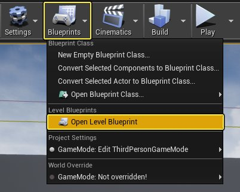
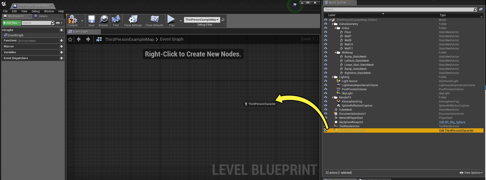

# 关卡蓝图

> 路径：虚幻引擎5.7文档 / 蓝图可视化脚本 / 专用蓝图节点组 / 蓝图类型 / 关卡蓝图

> 原始页面：https://dev.epicgames.com/documentation/unreal-engine/level-blueprint-in-unreal-engine

**关卡蓝图（Level Blueprint）** 是一种专业类型的 **蓝图（Blueprint）**，用作关卡范围的全局事件图。 在默认情况下，项目中的每个关卡都创建了自己的关卡蓝图，您可以在虚幻编辑器中编辑这些关卡蓝图， 但是不能通过编辑器接口创建新的关卡蓝图。

与整个级别相关的事件，或关卡内Actor的特定实例， 用于以函数调用或流控制操作的形式触发操作序列。 熟悉虚幻引擎3的人应该非常熟悉这个概念， 因为它与Kismet在虚幻引擎3中的工作原理非常相似。

关卡蓝图还提供了关卡流送和[Sequencer](../../../../working-with-media/integrating-media/real-time-compositing-with-composure/real-time-compositing-with-sequencer/index.md)的控制机制， 以及将事件绑定到关卡内的Actor的控制机制。

> [!NOTE]
> 有关关卡蓝图UI的更多信息，请参阅[蓝图编辑器中的关卡蓝图UI](../../../user-interface-reference-for-the-blu-73593f79/user-interface-breakdown/blueprints-visual-scripting-editor-user-interfa-85f836c8/index.md)。

## 默认关卡蓝图

每个游戏都可以在DefaultGame.ini配置文件中指定默认的关卡蓝图类。所有新地图的关卡蓝图 都将使用此类创建，以允许特定于游戏添加件和功能。

## 打开关卡蓝图

若要打开关卡蓝图进行编辑，请单击 **关卡编辑器工具栏（Level Editor Toolbar）** 中的 **蓝图（Blueprints）** 并选择 **打开关卡蓝图（Open Level Blueprint）**。

此操作将在 **蓝图编辑器（Blueprint Editor）** 中打开关卡蓝图：

**蓝图编辑器（Blueprint Editor）** 仅使用[图表编辑器](../../../user-interface-reference-for-the-blu-73593f79/user-interface-components/graph-editor-for-the-blueprints-visual-scripting-editor/index.md)、**我的蓝图（My Blueprints）** 面板和 **细节（Details）** 面板。**类默认（Class Defaults）** 面板使用菜单栏上的 **类默认（Class Defaults）** 按钮。

## 引用Actor

通常，您需要将对Actor的引用连接到关卡蓝图中节点上的 **目标（Target）** 引脚。若要获取包含Actor引用的节点，请执行以下操作：

1. 在 **关卡视口（Level Viewport）** 或 **世界场景大纲视图（World Outliner）** 中选择Actor。
2. 打开关卡蓝图。

   
3. 右键单击

   您要在其中添加节点的图表。
4. 在显示的快捷菜单中选择 **将引用创建到[SelectedActor]（Create a reference to [SelectedActor]）**。

或者：

1. 从 **世界场景大纲视图（World Outliner）** 选项卡中将一个Actor拖放至关卡蓝图中的某个图表。

   

   单击图片查看全图。

显示的Actor引用节点可以连接到任何兼容的 **目标（Target）** 引脚。

在某些情况下，您不需要引用节点，因为您可以将正确类型的输出引脚连接到 **目标（Target）** 输入引脚。

## 添加事件

有两种方法可以将特定Actor的[事件](../../events/index.md)添加到关卡蓝图中。

1. 右键点击关卡中的一个Actor，然后在 **关卡蓝图（Level Blueprint）** 下的快捷菜单中选择您想要添加的事件。

或者，一旦您选择了Actor，请执行以下操作：

1. 打开关卡蓝图。

   
2. 右键单击您要在其中添加节点的图表。
3. 在显示的快捷菜单中，展开 **为[ActorName]添加事件（Add Event for [ActorName]）** 并选择您想要的事件类型。
