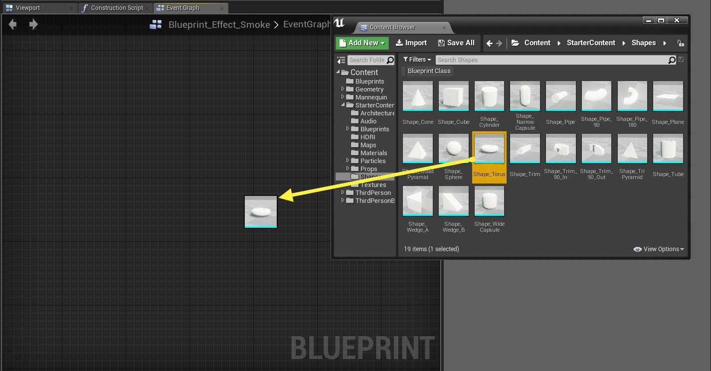

# 蓝图编辑器图表编辑器

> 路径：虚幻引擎5.7文档 / 蓝图可视化脚本 / 蓝图编辑器参考 / 蓝图用户界面组件 / 蓝图编辑器图表编辑器

> 原始页面：https://dev.epicgames.com/documentation/unreal-engine/graph-editor-for-the-blueprints-visual-scripting-editor-in-unreal-engine

**图表编辑器（Graph Editor）** 面板是蓝图系统的核心。您可在此创建节点和线路的网络，以定义脚本化行为。您可以单击节点以快速选择节点，并拖动节点来重新定位它们。

1. 图表区域（Graph Area）

   - 这是您将用于实际布置所有节点的位置。
2. 前进和后退按钮（Forward and Back Buttons）

   - 这些按钮允许您在不同图表之间切换，就像浏览网络浏览器一样。
3. 选项卡区域（Tabs area）

   - 当您打开不同图表时，各个图表的选项卡将在此处打开，允许您在不同图表之间快速切换。
4. 痕迹（Breadcrumbs）

   - 它们显示图表和子图表的进展。当您逐步深入函数或折叠图时，这将显示您在网络中所处的位置。
5. 缩放系数（Zoom Factor）

   - 它仅显示图表编辑器中的当前缩放比例。
6. 蓝图标签（Blueprint label）

   - 它显示您正在编辑的蓝图的类型。当您编辑蓝图接口（Blueprint Interface）、动画蓝图（Animation Blueprint）、宏（Macro）和其他类型时，此标签将更新。

### 图表编辑器控件

使用以下控件可浏览 **图表编辑器（Graph Editor）** 选项卡：

| 控制 | 操作 |
| --- | --- |
| **右键单击+拖动** | 平移图表。 |
| **鼠标滚动** | 缩放图表。 |
| **右键单击** | 弹出上下文菜单。 |
| **单击** 节点 | 选择该节点。 |
| 在空白区域内 **单击+拖动** | 选择字幕选择框内的节点。 |
| 在空白区域内 **Ctrl+单击+拖动** | 切换字幕选择框内的节点选择。 |
| 在空白区域内 **Shift+单击+拖动** | 将字幕选择框内的节点添加到当前选择。 |
| **单击+拖动** 节点 | 移动节点。 |
| 从引脚到引脚 **单击+拖动** | 将引脚连接到一起。 |
| 从引脚到引脚 **Ctrl+单击+拖动** | 将线路从原点引脚移至目标引脚。 |
| 从引脚到空白区域 **单击+拖动** | 弹出上下文菜单，仅显示相关节点。将原点引脚连接到已创建节点上的兼容引脚。 |
| **Alt+单击** 引脚 | 移除连接到选定引脚的所有线路。 |

> [!TIP]
> StaticMesh、SoundCue、SkeletalMesh和ParticleSystem资源可从 **内容浏览器（Content Browser）** 拖放到 **图表编辑器（Graph Editor）** 选项卡上，以使用自动分配的资源创建新的AddComponent函数调用。
>
> 
