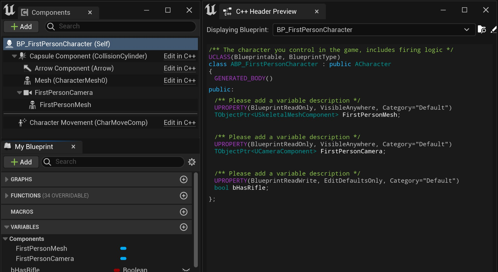
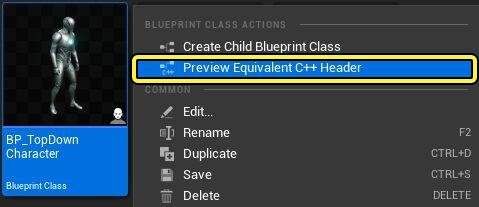
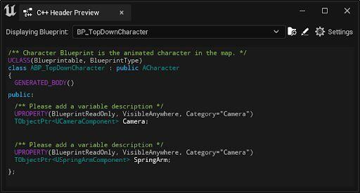
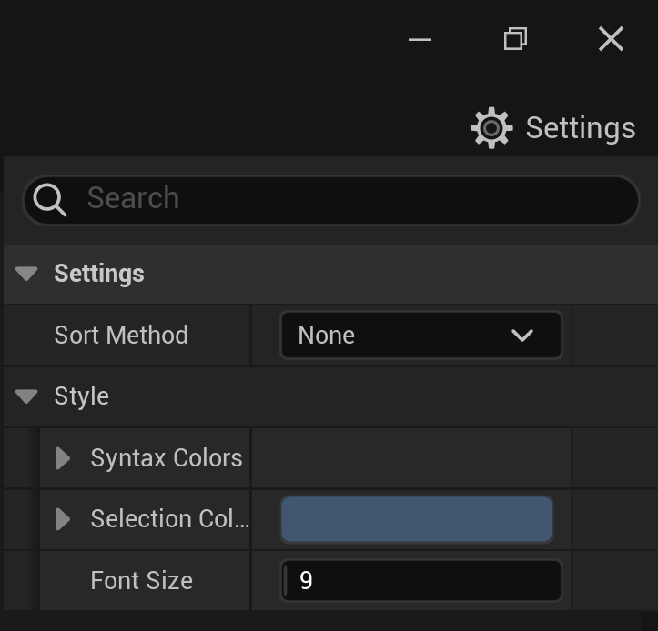
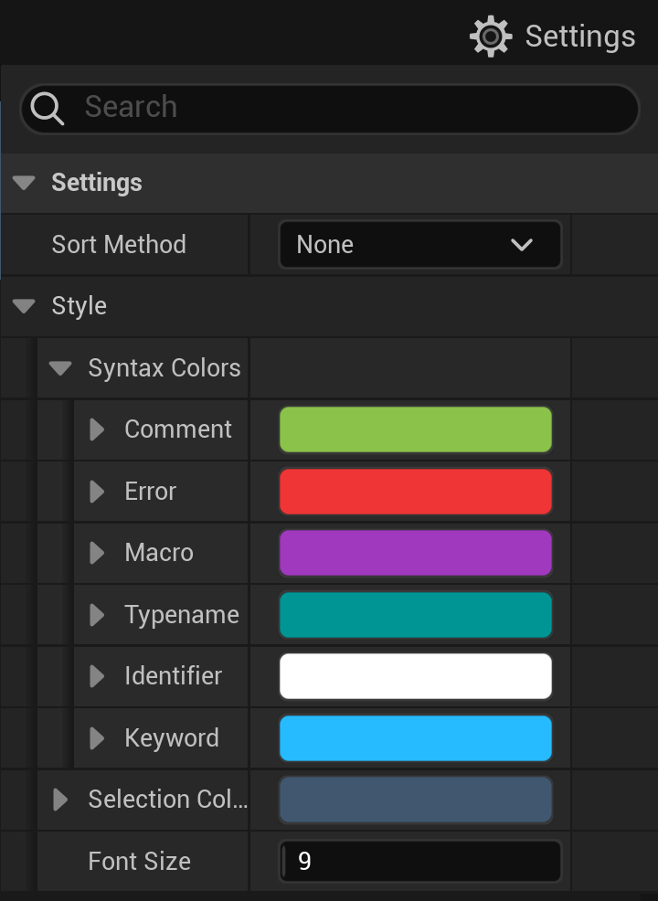
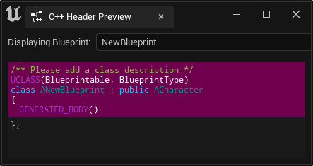

# 蓝图头文件视图

> 路径：虚幻引擎5.7文档 / 蓝图可视化脚本 / 蓝图编辑器参考 / 蓝图头文件视图

> 原始页面：https://dev.epicgames.com/documentation/unreal-engine/an-overview-of-the-blueprint-header-view-in-unreal-engine

**蓝图头文件视图（Blueprint Header View）** 可将虚幻引擎[蓝图类](../../specialized-blueprint-visual-scripting-node-groups/types-of-blueprints/blueprint-class-assets/index.md)和[蓝图结构体](../../specialized-blueprint-visual-scripting-node-groups/blueprint-variables/blueprint-struct-variables/index.md)转换为C++代码。

> [!TIP]
> 如果你用过虚幻引擎4，它就像虚幻引擎4中的[蓝图原生化](https://docs.unrealengine.com/4.27/zh-CN/ProgrammingAndScripting/Blueprints/TechnicalGuide/NativizingBlueprints/)。

在转换过程中，蓝图头文件视图会为蓝图的以下元素创建C++样式的声明：

- [变量](../../specialized-blueprint-visual-scripting-node-groups/blueprint-variables/index.md)
- [函数](../../specialized-blueprint-visual-scripting-node-groups/functions/index.md)
- [Actor组件](../../../understanding-the-basics/actors-and-geometry/basic-components/index.md)
- [事件分发器](../../specialized-blueprint-visual-scripting-node-groups/event-dispatchers/index.md)

## 使用蓝图头文件视图

要在项目中使用蓝图头文件视图，请执行以下操作：

1. 右键点击 **内容浏览器（Content Browser）** 中的蓝图 **类（Class）** 或 **结构体（Struct）** 。
2. 从上下文菜单，选择 **预览等效C++头文件（Preview Equivalent C++ Header）** 。

### C++头文件预览

从菜单选择 **预览等效C++头文件（Preview Equivalent C++ Header）** 时，将打开 **C++头文件预览（C++ Header Preview）** 窗口。该窗口将显示蓝图的变量、函数、Actor组件和事件分发器。

### 设置

点击 **设置（Settings）** 按钮，打开 **样式（style）** 和 **排序（sort）** 选项的下拉列表。

#### 排序方法

**排序方法（Sort Method）** 提供了在C++头文件预览窗口中对蓝图类和属性的显示排序的选项。从以下排序方法值选择：

| 排序方法 | 说明 |
| --- | --- |
| 无 | 属性按蓝图类中的相同显示顺序显示。 |
| 按访问说明符排序 | 属性按访问说明符以可视性（公开（public）、受到保护（protected）、私密（private））的顺序分组在一起。 |
| 为最优填充排序 | 属性排序为尽量减少编译的类布局中的填充。 |

#### 样式

**样式（Style）** 类似于语法高亮显示。你可以在C++头文件预览窗口中调整 **语法** 和 **选择颜色** 的 **字体大小（Font Size）** 和 **颜色RGB（Color RGB）** 。你可以配置以下语法元素：

- 注释
- 错误
- 宏
- 类型名称
- 标识符
- 关键字

#### 选择颜色

在C++头文件预览中使用鼠标时，更改 **选择颜色（Selection Color）** 可控制选择高亮显示。

在上图中，我们将选择颜色值设置为RGB颜色紫色。
