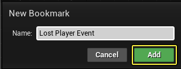
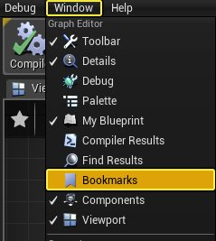
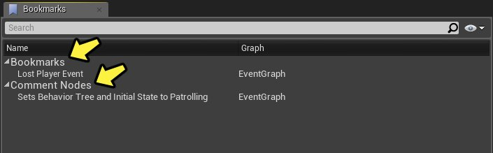
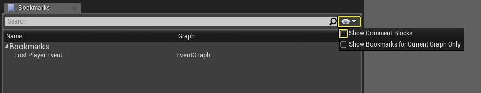
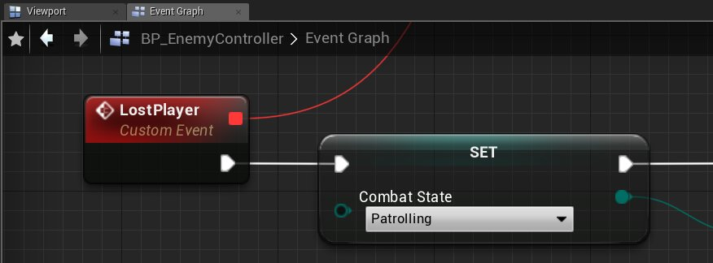

# 蓝图书签

> 路径：虚幻引擎5.7文档 / 蓝图可视化脚本 / 蓝图编辑器参考 / 蓝图书签

> 原始页面：https://dev.epicgames.com/documentation/unreal-engine/working-with-bookmarks-for-blueprint-graphs-in-unreal-engine

使用 **蓝图书签（Blueprint Bookmarks）**，您可以在蓝图编辑器中的任何函数图中创建已命名书签。此书签将捕获您在创建书签时正在查看的视口和活动选项卡的位置和缩放级别。书签存储在您的本地机器上，因此它们不会影响到蓝图本身，同步内容时不会用其他用户的书签覆盖您的书签。

## 创建书签

若要创建蓝图书签，请执行以下操作：

1. 对于要加书签的图表和缩放位置，单击图表左上角的 **星形** 图标。

   BlueprintBookmarks_Creation_01.png
2. 在 **新书签（New Bookmark）** 对话框中，输入所需名称并单击 **添加（Add）** 按钮。

   

## 查看和使用书签

若要查看或使用之前创建的书签，请从 **窗口（Window）** 菜单中选择 **书签（Bookmarks）** 选项。

这将打开 **书签（Bookmarks）** 菜单，该菜单显示当前资源的所有书签以及任何[注释节点](../../specialized-blueprint-visual-scripting-node-groups/comments/index.md#commentboxes)。

在书签（Bookmarks）窗口中，单击右上角的 **眼睛** 图标将展开其他选项。禁用 **显示注释块（Show Comment Blocks）** 会防止注释节点显示在菜单中。

启用 **仅显示当前图表的书签（Show Bookmarks for Current Graph Only）** 将显示您的活动图表的书签，而禁用它将在任何图表上显示资源的所有书签。

对于窗口中显示的书签，您可以右键单击书签（或注释）以展开其他选项。

右键单击上下文菜单，可 **删除（Delete）** 或 **重命名（Rename）** 书签，以及直接跳转到所选的书签（或注释）。

双击书签或注释节点块可跳转到您的图表的那一部分。

> [!NOTE]
> 跳转到某个书签时，图表左上角的 **星形** 图标也将填充，表示您在该书签上。

## 快速跳转书签

除了创建 **书签（Bookmarks）** 之外，您还可以创建 **快速跳转书签（Quick Jump Bookmark）**，其工作方式与书签在[关卡编辑器视口](https://docs.unrealengine.com/5.0/zh-CN/editor-viewports-in-unreal-engine/)中的工作方式相似。正如蓝图编辑器中的已标记书签那样，快速跳转书签将在编辑器会话之间持续存在，并且对于创建它们的用户和机器来说是本地书签。

若要指定和使用快速跳转书签（Quick Jump Bookmark），请执行以下操作：

1. 打开一个图表，按 **Ctrl + 0-9**（任意数字键）以记住您的当前蓝图、图表位置和缩放级别。
2. 在图表内，按 **Shift + 0-9**（上一步骤中的相同数字）以返回到该蓝图、图表位置和缩放级别。

> [!NOTE]
> 快速跳转书签不需要您打开资源。它们会自动打开资源、图表位置和缩放级别（如下方的示例视频中所示）。

> [!WARNING]
> 从4.21版本起，快速跳转书签已不再显示在书签（Bookmarks）窗口中。
