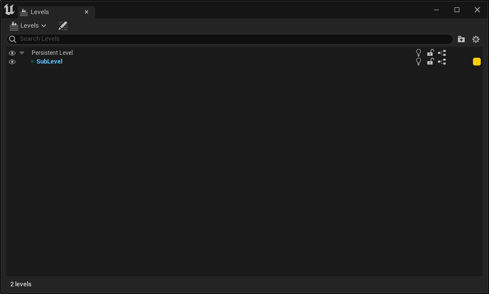
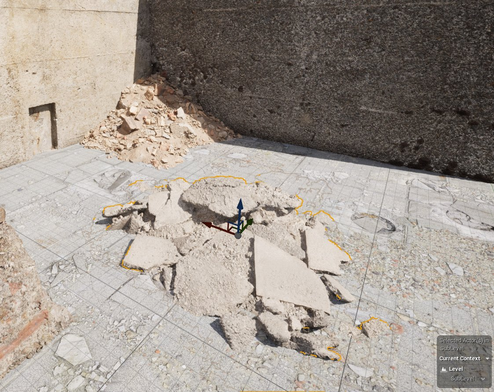
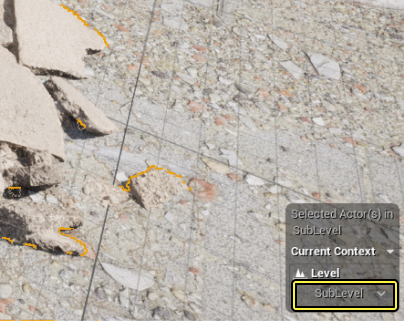
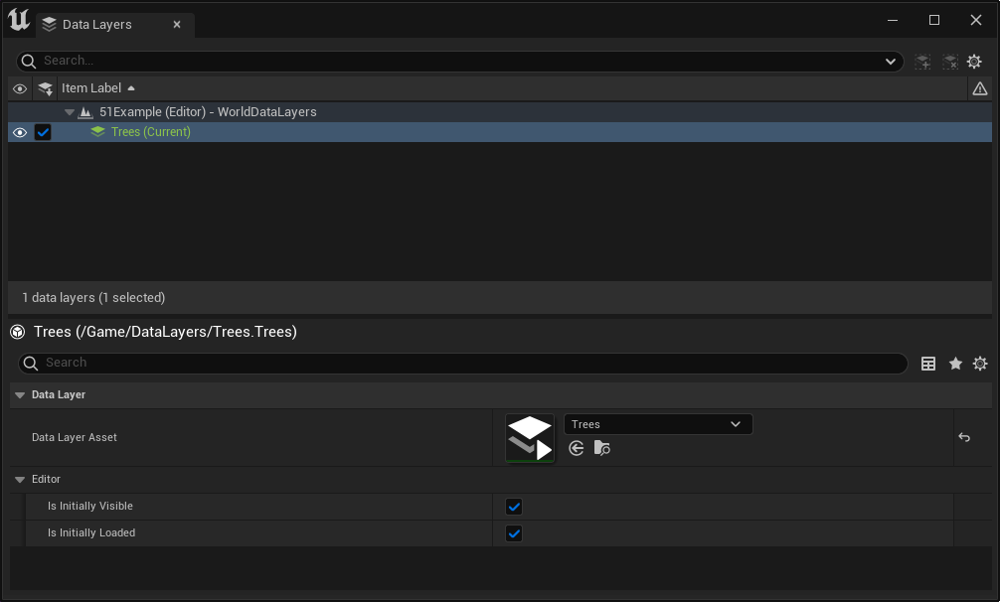
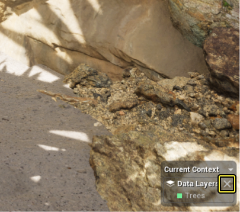

# Actor编辑器上下文

> 路径：虚幻引擎5.7文档 / 构建虚拟世界 / Actor编辑器上下文

> 原始页面：https://dev.epicgames.com/documentation/unreal-engine/actor-editor-context-in-unreal-engine

**Actor编辑器上下文（Actor Editor Context）** 是一种编辑器功能，可用于将[关卡](../../understanding-the-basics/levels/index.md)、[数据层](../world-partition/world-partition---data-layers/index.md)、[关卡实例](../world-partition/level-instancing/index.md), or [大纲视图Actor文件夹](../level-editor/outliner/index.md)设置为 **当前编辑器上下文**。设置为当前上下文时，你添加到视口的所有Actor都会分配到当前上下文。 若分配当前Actor编辑器上下文，将在添加大量Actor时自动将它们分配到指定上下文，这有助于让你的世界保持井然有序，例如将一个环境中的所有树保持在树大纲视图文件夹中，并将其分配到树数据层。

设置到树数据层和树Actor文件夹的Actor编辑器上下文。点击查看大图。

视口右下角的一个控件可显示当前处于活动状态的关卡、关卡实例、数据层或Actor文件夹。

## 设置当前上下文

### 当前关卡

在不使用[世界分区](../world-partition/index.md)的世界中，知道你在哪个关卡中工作是子关卡工作流程不可或缺的一环。使用"关卡（Levels）"窗口将子关卡添加到你的关卡之后，Actor编辑器上下文将显示当前关卡：

显示带有一个名为SubLevel的子关卡的持久关卡的关卡窗口。点击查看大图。

将SubLevel显示为当前关卡的Actor编辑器上下文。点击查看大图。

使用Actor编辑器上下文控件中的下拉菜单，你可以指定当前关卡。你添加到视口的所有Actor都会分配到该关卡。

点击下拉菜单更改当前关卡。

### 当前关卡实例

关卡实例化是基于关卡的工作流程，用于创建预制 **关卡实例（Level Instances）** ，你可以多次将其放入你的世界。编辑关卡实例时，虚幻引擎会创建新的空上下文，并且Actor编辑器上下文会显示当前关卡实例：

显示当前打开的关卡实例的Actor编辑器上下文。点击查看大图。

你添加到视口的所有Actor都会分配到当前打开的关卡实例。将更改提交到关卡实例时，编辑器会将你返回到之前的Actor编辑器上下文。

### 当前数据层

数据层会在编辑器中以及在运行时控制Actor的加载和卸载。不同于关卡，Actor可以分配到多个数据层。 要设置一个或多个当前数据层：

1.根据需要选择 **窗口（Window）> 世界分区（World Partition）> 数据层大纲视图（Data Layer Outliner）** ，打开 **数据层大纲视图（Data Layer Outliner）** 。 1.右键点击你想设为当前值的数据层，并选择 **设为当前数据层（Make Current Data Layer (s)）** 。

显示设为当前值的树数据层的数据层大纲视图。

这样会将所选数据层添加到当前上下文。其名称和分配的调试颜色现在显示在Actor编辑器上下文控件中。

Actor编辑器上下文控件将树显示为当前数据层。点击查看大图。

你添加到视口的所有Actor都会分配到当前数据层。要清除当前数据层上下文，请右键点击数据层大纲视图，然后选择 **清除当前数据层（Clear Current Data Layer(s)）** ，或点击Actor编辑器上下文控件的该分段中的 **X** 按钮。

点击Actor编辑器上下文控件中的X按钮以清除当前数据层。

### 当前Actor文件夹

与数据层的操作相似，你还可以在大纲视图中分配当前Actor文件夹。 要设置当前Actor文件夹：

1. 根据需要，选择

   窗口（Window）> 大纲视图（Outliner）

   ，然后选择四个大纲视图实例之一，以打开

   大纲视图（Outliner）

   。
2. 右键点击你想设为当前值的文件夹，然后从上下文菜单选择

   设为当前文件夹（Make Current Folder）

   。

> 图片已省略：Outliner showing Trees as the current Actor Folder

将树显示为当前Actor文件夹的大纲视图。

这样会将所选文件夹添加到当前上下文。其名称现在显示在Actor编辑器上下文控件中。

> 图片已省略：Actor Editor Context widget showing Trees as the current Actor Folder

将树显示为当前Actor文件夹的Actor编辑器上下文控件。点击查看大图。

你添加到视口的所有Actor都会分配到当前Actor文件夹。要清除此上下文，请右键点击大纲视图，然后选择 **清除当前文件夹（Clear Current Folder）** ，或点击Actor编辑器上下文控件的该分段中的 **X** 按钮。

> 图片已省略：undefined

点击Actor编辑器上下文控件中的X按钮，即可清除当前Actor文件夹。

## 在视口中切换Actor编辑器上下文

Actor编辑器上下文控件默认启用。要将其禁用，请执行以下步骤：

1. 点击视口左上角的 **视口选项（Viewport Options）** 按钮，然后选择 **高级设置（Advanced Settings）** 。这将打开 **编辑器偏好设置（Editor Preferences）** 窗口。

   > 图片已省略：点击

   点击"视口选项"按钮并选择底部的"高级设置"。
2. 找到 **关卡编辑器 - 视口（Level Editor - Viewports）** 设置的 **外观体验（Look and Feel）** 分段，取消勾选 **显示Actor编辑器上下文（Show Actor Editor Context）** 复选框。

   "关卡编辑器 - 视口"设置。点击查看大图。
