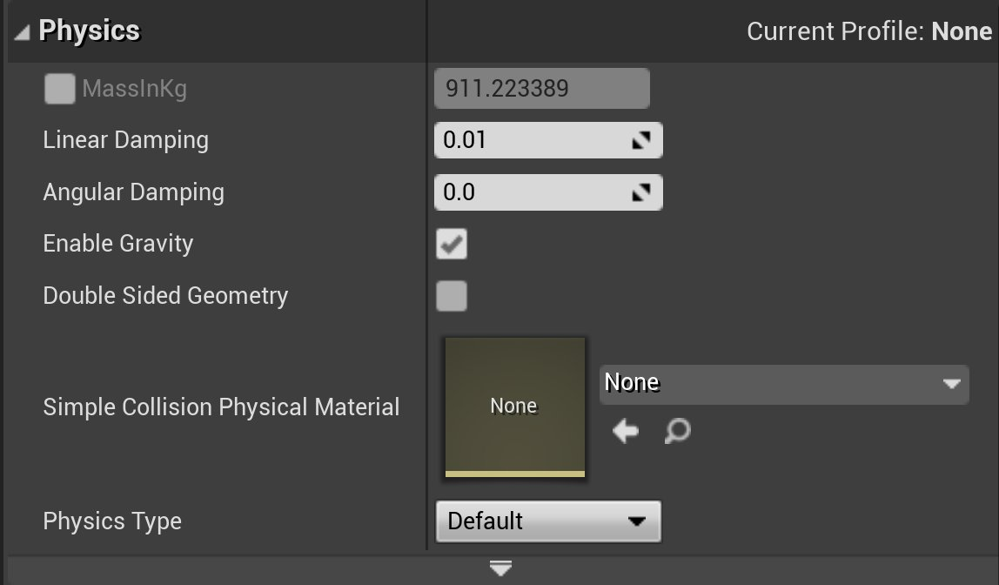
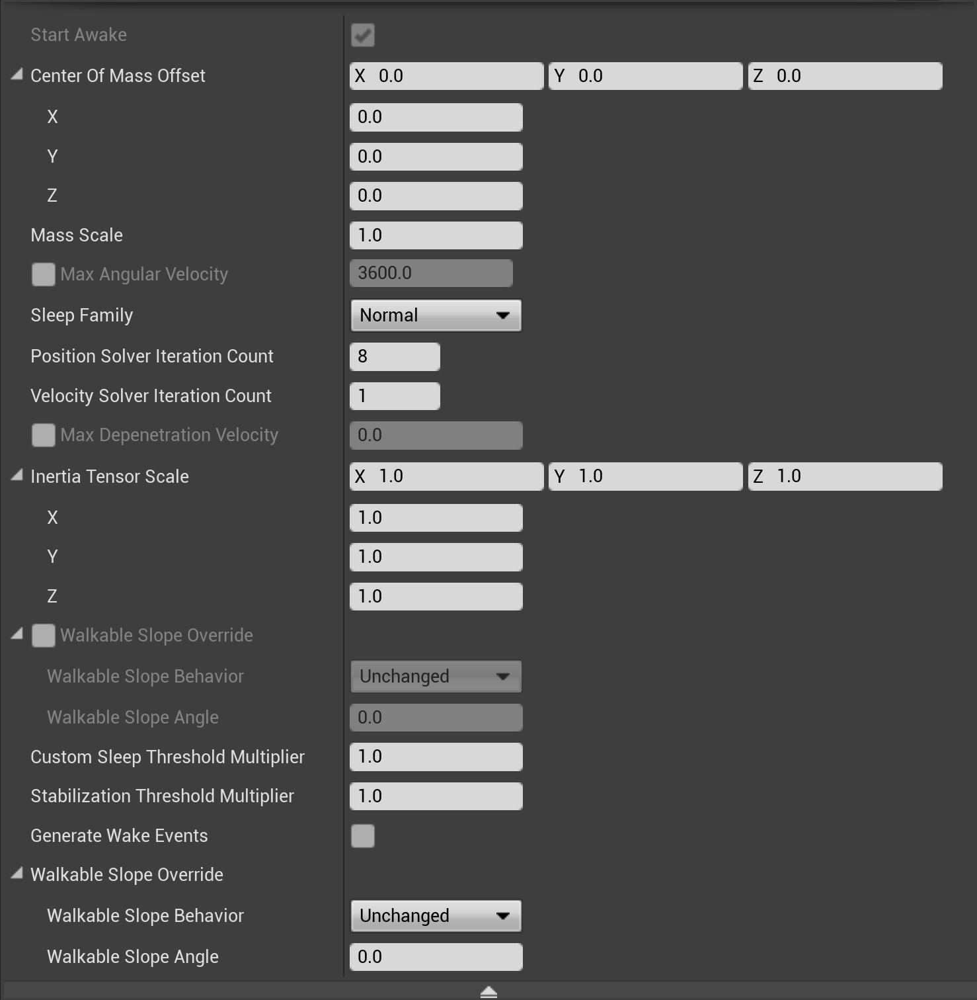
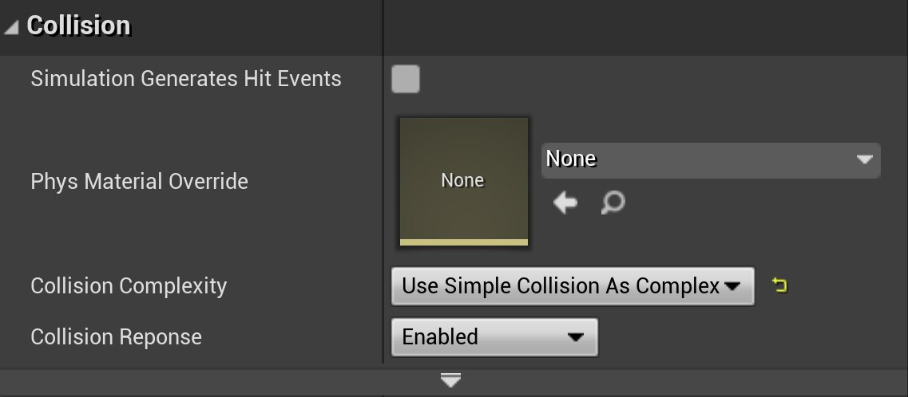
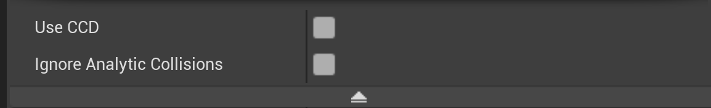

# 蓝图样条网格体组件属性参考

> 路径：虚幻引擎5.7文档 / 构建虚拟世界 / 蓝图样条 / 蓝图样条网格体组件属性参考

> 原始页面：https://dev.epicgames.com/documentation/unreal-engine/blueprint-spline-mesh-component-property-reference-in-unreal-engine

本页面包含了一个在 **蓝图样条网格体组件（Blueprint Spline Mesh Components）** 中可用属性的参考列表。如果在 **蓝图编辑器（Blueprint Editor）** 中选择了 **蓝图样条网格体组件（Blueprint Spline Mesh Component）**，是 **根组件（Root Component）**，或者在 **关卡编辑器（Level Editor）** 中选择了该组件，则显示的属性将略有不同。

## 属性

### 变形

| 属性 | 说明 |
| --- | --- |
| **位置（Location）** | **Actor** 或 **组件（Component）** 在 **世界场景空间（World Space）** 中或 **相对于（Relative）** 其父项的位置。 |
| **旋转（Rotation）** | **Actor** 或 **组件（Component）** 在 **世界场景空间（World Space）** 中或 **相对于（Relative）** 其父项的旋转。 |
| **缩放（Scale）** | **Actor** 或 **组件（Component）** 在 **世界场景空间（World Space）** 中或 **相对于（Relative）** 其父项的缩放。 |

### 插槽

| 属性 | 说明 |
| --- | --- |
| **父插槽（Parent Socket）** | 当这个组件是 **骨架网格体组件（Skeletal Mesh Component）** 的 **子项（Child）**（或带有 **插槽（Socket）** 的 **静态网格体组件（Static Mesh Component）**）时，你可以指定一个 **插槽（Socket）** 或 **关节（Joint）** 来将这个组件附加到其上。 |

### 静态网格体

| 属性 | 说明 |
| --- | --- |
| **静态网格体（Static Mesh）** | 指定要为该组件渲染的 **静态网格体（Static Mesh）**。 |

### 材质

| 属性 | 说明 |
| --- | --- |
| **元素#（Element #）** | 一旦在 **静态网格体属性（Static Mesh Property）** 中指定了一个 **静态网格体（Static Mesh）**，将会出现一些额外的 **材质属性（Material Properties）**。将基于应用到 **静态网格体（Static Mesh）** 的 **材质ID（Material IDs）** 命名这些属性。 |

### 样条网格体

| 属性 | 说明 |
| --- | --- |
| **起始位置（Start Pos）** | %doxygen:FSplineMeshParams::StartPos% |
| **起始切线（Start Tangent）** | %doxygen:FSplineMeshParams::StartTangent% |
| **结束位置（End Pos）** | %doxygen:FSplineMeshParams::EndPos% |
| **结束切线（End Tangent）** | %doxygen:FSplineMeshParams::EndTangent% |
| **样条向上方向（Spline Up Dir）** | %doxygen:USplineMeshComponent::SplineUpDir% |
| **前向轴（Forward Axis）** | %doxygen:USplineMeshComponent::ForwardAxis% |

#### 高级

| 属性 | 说明 |
| --- | --- |
| **起始缩放（Start Scale）** | %doxygen:FSplineMeshParams::StartScale% |
| **起始滚动（Start Roll）** | %doxygen:FSplineMeshParams::StartRoll% |
| **起始偏移（Start Offset）** | %doxygen:FSplineMeshParams::StartOffset% |
| **结束缩放（End Scale）** | %doxygen:FSplineMeshParams::EndScale% |
| **结束滚动（End Roll）** | %doxygen:FSplineMeshParams::EndRoll% |
| **结束偏移（End Offset）** | %doxygen:FSplineMeshParams::EndOffset% |
| **平滑插值滚动缩放（Smooth Interp Roll Scale）** | %doxygen:USplineMeshComponent::bSmoothInterpRollScale% |
| **样条边界最小值（Spline Boundary Min）** | %doxygen:USplineMeshComponent::SplineBoundaryMin% |
| **样条边界最大值（Spline Boundary Max）** | %doxygen:USplineMeshComponent::SplineBoundaryMax% |

### 样条

| 属性 | 说明 |
| --- | --- |
| **允许对每个实例进行样条编辑（Allow Spline Editing Per Instance）** | %doxygen:USplineMeshComponent::bAllowSplineEditingPerInstance% |

### 物理

## 物理

| 属性 | 说明 |
| --- | --- |
| **双面几何体（Double Sided Geometry）** | 如果启用，物理三角网格体在执行场景查询时将使用双面。这对于需要追踪以便在两个面上工作的平面和单面网格体非常有用。 |
| **简单碰撞物理材质（Simple Collision Physical Material）** | 在此形体上进行简单碰撞时使用的物理材质。对密度、摩擦力等信息进行编码。 |
| **物理类型（Physics Type）** | 模拟：物体将使用物理模拟。 运动学：物体将不会受到物理影响，但可以与以物理方式模拟的形体进行交互。 默认值：物体将从OwnerComponent的行为进行继承。 |
| **质量（以KG为单位）（Mass in KG）** | 形体的质量，以KG为单位。 |
| **线性阻尼（Linear Damping）** | 为减弱线性移动而附加的"拖拽"力 |
| **角阻尼（Angular Damping）** | 为减弱角运动而附加的"拖拽"力 |
| **启用重力（Enable Gravity）** | 物体是否受到重力作用 |

### 高级

| 属性 | 说明 |
| --- | --- |
| **初始状态为苏醒（Start Awake）** | 物体的初始状态为苏醒，或为休眠 |
| **质量中心偏移（Center Of Mass Offset）** | 用户为此物体质量中心指定的距离计算位置的偏移 |
| **质量缩放（Mass Scale）** | 质量的逐实例缩放 |
| **最大角速度（Max Angular Velocity）** | 实例的最大角速度 |
| **休眠集（Sleep Family）** | 将此形体设置为休眠时考虑使用的值集。普通、警觉、自定义 |
| **惯性张量缩放（Inertia Tensor Scale）** | 根据每个实例来缩放惯性（值越大表示越难旋转） |
| **可行走斜面覆盖（Walkable Slope Override）** | 此形体的自定义可行走斜面设置。请参阅 **[可行走斜面](../../../gameplay-systems/physics/walkable-slope/index.md)** 文档了解使用信息。 |
| **可行走斜面行为（Walkable Slope Behavior）** | 此表面的行为（是否影响可行走斜面）。 |
| **可行走斜面角度（Walkable Slope Angle）** | .覆盖可行走斜面，应用可行走斜面行为的规则。 |
| **自定义休眠阈值乘数（Custom Sleep Threshold Multiplier）** | 如果休眠集设置为 **自定义（Custom）**，则用此数量乘以自然睡眠阈值。数越大，形体休眠速度越快。 |
| **稳定性阈值乘数（Stabilization Threshold Multiplier）** | 如果启用了物理稳定性，则表示此形体的稳定性系数。数越大，稳定性将越激进，但存在以较低速度流失扩散性的风险。值为0将禁用此形体的稳定性。 |
| **缩放更改时更新质量（Update Mass when Scale Changes）** | 如为true，缩放发生变化时其将更新质量。 |
| **生成苏醒事件（Generate Wake Events）** | 确定当此物体被物理模拟设置为唤醒或进入休眠时，是否应该触发"苏醒/休眠"事件。 |

### 碰撞

## 碰撞

| 属性 | 说明 |
| --- | --- |
| **始终不需要已烘焙的碰撞数据（Never Needs Cooked Collision Data）** | 为了实现Chaos，可使用此属性对某些网格体排除CreatePhysicsMesh。 除非确认有某个网格体实例需要CreatePhysicsMesh，否则最好不要让长期网格体调用CreatePhysicsMesh。 |
| **碰撞复杂度（Collision Complexity）** | 碰撞追踪行为——默认情况下将区分简单（凸包）和复杂（按多边形）。 |
| **碰撞响应（Collision Responses）** | 请参阅[碰撞响应参考](../../../gameplay-systems/physics/collision/collision-response-reference/index.md)文档以了解更多信息。 |
| **模拟生成命中事件（Simulation Generates Hit Events）** | 当此物体在物理模拟中发生碰撞时是否发射"命中"事件。 |
| **物理材质覆盖（Phys Material Override）** | 允许覆盖用于此形体上简单碰撞的PhysicalMaterial。 |

### 高级

| 属性 | 说明 |
| --- | --- |
| **使用CCD（Use CCD）** | 如为true，连续碰撞检测（CCD）将用于此组件 |
| **忽略分析碰撞（Ignore Analytic Collisions）** | 如果设置为"真"，则忽略分析碰撞并将物体处理为通用隐式表面。 |
| **平滑边缘碰撞（Smooth Edge Collisions）** | 删除不必要的边缘碰撞，从而在由多个Actor/组件组成的表面上平滑滑动。 |

### 照明

| 属性 | 说明 |
| --- | --- |
| **投射阴影（Cast Shadow）** | %doxygen:UPrimitiveComponent::CastShadow% |

#### 高级

| 属性 | 说明 |
| --- | --- |
| **影响动态间接照明（Affect Dynamic Indirect Lighting）** | %doxygen:UPrimitiveComponent::bAffectDynamicIndirectLighting% |
| **影响距离场照明（Affect Distance Field Lighting）** | %doxygen:UPrimitiveComponent::bAffectDistanceFieldLighting% |
| **投射动态阴影（Casts Static Shadows）** | %doxygen:UPrimitiveComponent::bCastDynamicShadow% |
| **投射静态阴影（Cast Static Shadow）** | %doxygen:UPrimitiveComponent::bCastStaticShadow% |
| **投射体积半透明阴影（Cast Volumetric Translucent Shadow）** | %doxygen:UPrimitiveComponent::bCastVolumetricTranslucentShadow% |
| **仅自我阴影（Self Shadow Only）** | %doxygen:UPrimitiveComponent::bSelfShadowOnly% |
| **投射远阴影（Cast Far Shadow）** | %doxygen:UPrimitiveComponent::bCastFarShadow% |
| **投射嵌入阴影（Cast Inset Shadow）** | %doxygen:UPrimitiveComponent::bCastInsetShadow% |
| **投射电影级阴影（Cast Cinematic Shadow）** | %doxygen:UPrimitiveComponent::bCastCinematicShadow% |
| **投射隐藏阴影（Cast Hidden Shadow）** | %doxygen:UPrimitiveComponent::bCastHiddenShadow% |
| **投射双面阴影（Cast Shadow as Two Sided）** | %doxygen:UPrimitiveComponent::bCastShadowAsTwoSided% |
| **静态光源（Light as if Static）** | %doxygen:UPrimitiveComponent::bLightAsIfStatic% |
| **分组光源附件（Light Attachments as Group）** | %doxygen:UPrimitiveComponent::bLightAttachmentsAsGroup% |
| **间接照明缓存质量（Indirect Lighting Cache Quality）** | %doxygen:UPrimitiveComponent::IndirectLightingCacheQuality% |
| **来自固定光源的单一样本阴影（Single Sample Shadow From Stationary Lights）** | %doxygen:UPrimitiveComponent::bSingleSampleShadowFromStationaryLights% |
| **照明通道（Lighting Channels）** | %doxygen:UPrimitiveComponent::LightingChannels% |

### 渲染

| 属性 | 说明 |
| --- | --- |
| **可见（Visible）** | %doxygen:USceneComponent::bVisible% |
| **隐藏在游戏中（Hidden in Game）** | %doxygen:USceneComponent::bHiddenInGame% |

#### 高级

| 属性 | 说明 |
| --- | --- |
| **纹理流送（Texture Streaming）** | **强制Mip流送（Force Mip Streaming）**：%doxygen:UPrimitiveComponent::bForceMipStreaming% |
| **LOD** | **最小绘制距离（Min Draw Distance）**：%doxygen:UPrimitiveComponent::MinDrawDistance% **所需最大绘制距离（Desired Max Draw Distance）**： %doxygen:UPrimitiveComponent::LDMaxDrawDistance% **当前最大绘制距离（Current Max Draw Distance）**：%doxygen:UPrimitiveComponent::CachedMaxDrawDistance% **允许剔除距离体积（Allow Cull Distance Volume）**：%doxygen:UPrimitiveComponent::bAllowCullDistanceVolume% **细节模式（Detail Mode）**：%doxygen:USceneComponent::DetailMode% |
| **在主通道中渲染（Render In Main Pass）** | %doxygen:UPrimitiveComponent::bRenderInMainPass% |
| **接收贴花（Receives Decals）** | %doxygen:UPrimitiveComponent::bReceivesDecals% |
| **所有者看不到（Owner No See）** | %doxygen:UPrimitiveComponent::bOwnerNoSee% |
| **仅所有者能看到（Only Owner See）** | %doxygen:UPrimitiveComponent::bOnlyOwnerSee% |
| **视为遮挡的背景（Treat As Background for Occlusion）** | %doxygen:UPrimitiveComponent::bTreatAsBackgroundForOcclusion% |
| **用作遮挡物（Use As Occluder）** | %doxygen:UPrimitiveComponent::bUseAsOccluder% |
| **渲染CustomDepth通道（Render CustomDepth Pass）** | %doxygen:UPrimitiveComponent::bRenderCustomDepth% |
| **CustomDepth模板值（CustomDepth Stencil Value）** | %doxygen:UPrimitiveComponent::CustomDepthStencilValue% |
| **半透明排序优先级（Translucency Sort Priority）** | 排序优先级较低的半透明对象在优先级较高的对象后面绘制。具有相同优先级的半透明对象将根据其边界原点从后到前渲染。 |
| **Lpv偏差乘数（Lpv Bias Multiplier）** | %doxygen:UPrimitiveComponent::LpvBiasMultiplier% |
| **边界缩放（Bounds Scale）** | %doxygen:UPrimitiveComponent::BoundsScale% |
| **使用附加父级边界（Use Attach Parent Bound）** | %doxygen:USceneComponent::bUseAttachParentBound% |

### 标签

| 属性 | 说明 |
| --- | --- |
| **组件标签（Component Tags）** | 标签数组，可用于分组和分类。也可以通过脚本访问。 |

### 激活

| 属性 | 说明 |
| --- | --- |
| **自动激活（Auto Activate）** | 是在创建时自动激活组件，还是必须显式激活组件。 |

### 事件

| 属性 | 说明 |
| --- | --- |
| **在组件命中时（On Component Hit）** | 在组件命中某些固体，或被某些固体命中时调用的事件。 |
| **在组件开始重叠时（On Component Begin Overlap）** | 当某些物体开始与组件重叠时调用的事件，如玩家走入触发器。 |
| **在组件结束重叠时（On Component End Overlap）** | 当某些物体不再与组件重叠时调用的事件。 |
| **在组件唤醒时（On Component Wake）** | 当底层物理对象被唤醒时调用的事件。 |
| **在组件睡眠时（On Component Sleep）** | 当底层物理对象开始休眠时调用的事件。 |
| **在光标开始悬停时（On Begin Cursor Over）** | 当鼠标光标移动到此组件上方，且玩家控制器启用了鼠标悬停事件时调用的事件。 |
| **在光标结束悬停时（On End Cursor Over）** | 当鼠标光标离开此组件上方，且玩家控制器启用了鼠标悬停事件时调用的事件。 |
| **在单击时（On Clicked）** | 当鼠标光标位于此组件上方并按下鼠标左键，且玩家控制器启用了点击事件时调用的事件。 |
| **在释放时（On Released）** | 当鼠标光标位于此组件上方并释放鼠标左键，且玩家控制器启用了点击事件时调用的事件。 |
| **在输入触摸开始时（On Input Touch Begin）** | 当此组件上接收到触摸输入，且玩家控制器启用了触摸事件时调用的事件。 |
| **在输入触摸结束时（On Input Touch End）** | 当此组件上的触摸输入被释放，且玩家控制器启用了触摸事件时调用的事件。 |
| **在输入触摸进入时（On Input Touch Enter）** | 当手指移动到此组件上方，且玩家控制器启用了触摸事件时调用的事件。 |
| **在输入触摸离开时（On Input Touch Leave）** | 当手指离开此组件上方，且玩家控制器启用了触摸事件时调用的事件。 |
| **物理体积已更改（Physics Volume Changed）** | 当物理体积更改时将调用的委托。 |

### 移动

| 属性 | 说明 |
| --- | --- |
| **从固定灯源接收静态和CSM组合阴影（Receive Combined Static and CSM Shadows from Stationary Lights）** | %doxygen:UPrimitiveComponent::bReceiveCombinedCSMAndStaticShadowsFromStationaryLights% |
