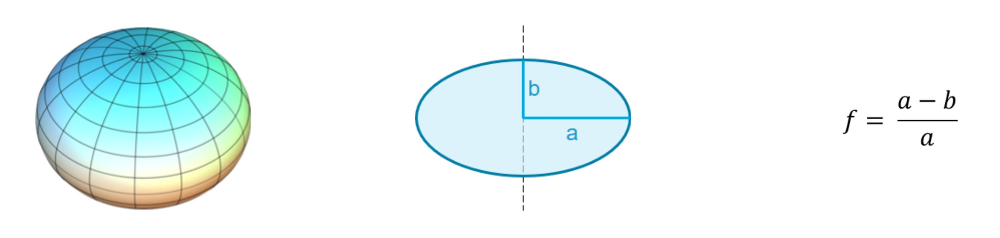
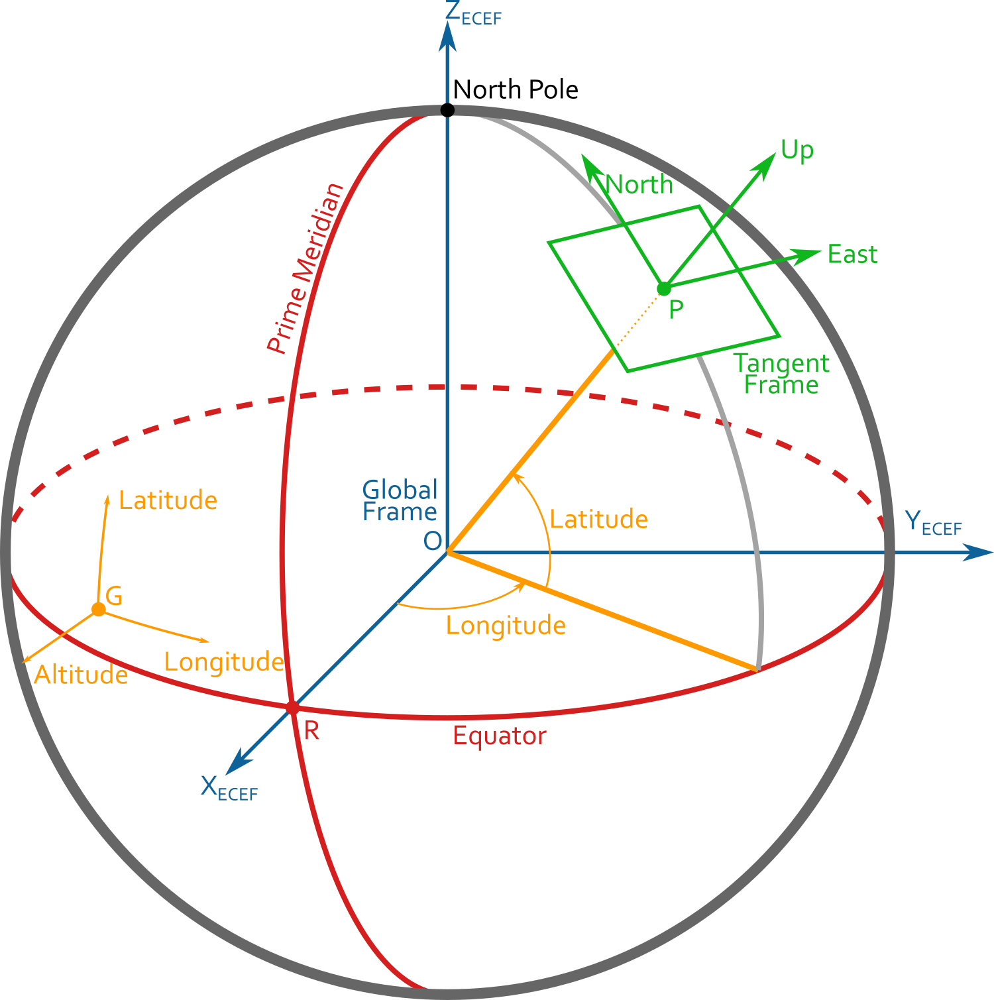
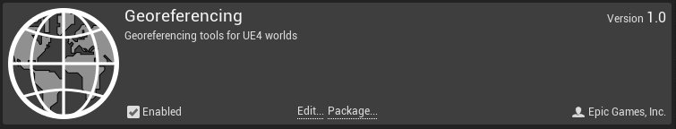
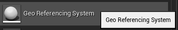
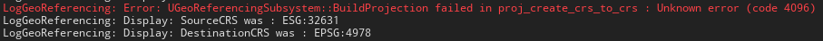
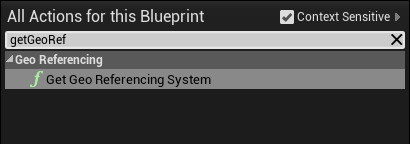
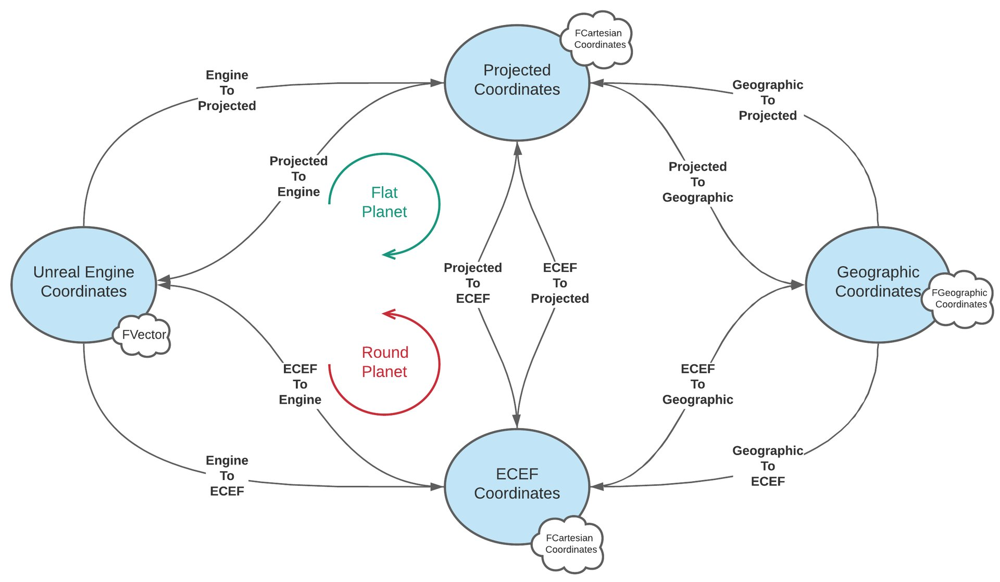

# 关卡地理配准

> 路径：虚幻引擎5.7文档 / 构建虚拟世界 / 关卡地理配准

> 原始页面：https://dev.epicgames.com/documentation/unreal-engine/georeferencing-a-level-in-unreal-engine

**地理配准（Georeferencing）** 意味着将虚拟场景与物理空间中的位置相关联。该术语常用于地理信息系统领域，以描述将物理地图或地图的栅格图像与空间位置相关联的过程。对环境进行地理配准后，虚幻引擎可以表示实际地理坐标（如纬度/经度或UTM坐标）。

#### 先决条件

- 必须启用地理配准插件，才能使用此处描述的功能。

## 理论背景

### 坐标参考系(CRS)和椭圆体

在行星上定位对象时，必须选择坐标参考系(CRS)来表示位置。

棘手的问题是，行星既不是平面也不是球体，而是椭圆体。椭圆体模型（称为基准）有很多，其中最著名的模型是表示地球的WGS84。

例如，对于WGS84椭圆体，两个轴长之差大约为22km！

- a = 6 378 137.0 m
- b = 6 356 752.314 245 m
- 1/f = 298.257 223 563

每个坐标参考系使用所基于的椭圆体模型定义位置。但是，CRS五花八门，每种都有额外的属性。

### 地理CRS

地理CRS使用极坐标表示行星上某个点的位置。

| 列 1 | 列 2 |
| --- | --- |
| 地理CRS表示 | 纬度 = 相对于赤道的仰角距离，以度为单位 经度 = 相对于本初子午线（格林威治）的方位角，以度为单位 海拔 = 相对于参考椭圆体的高度，以米为单位 角度表示为十进制度，即DMS（度分秒）。 |

> [!NOTE]
> 事实上，纬度有两种类型的定义；基准不是球体时，将涉及椭圆体模型的局部法线，这需要更复杂的计算，但那超出了本文的讨论范围。

### 地心CRS

地心CRS使用笛卡尔坐标定义行星上任意点的位置，其中原点位于行星中心。

以下图像显示了地心地固(ECEF)CRS，这是DIS/HLA等分布式模拟协议中使用的标准参考CRS。

| 列 1 | 列 2 |
| --- | --- |
| 地心CRS表示 | 原点 = 地球中心 X 轴指向赤道/本初子午线（格林威治）交点。 Z 轴与地球旋转轴对齐。 Y 轴与前两个轴正交。 坐标以米为单位表示。 |

### 投影CRS

投影坐标系是使用地图投影将行星"扁平化"的一种地理坐标系。纸质地图上总是使用这种坐标系。有不同的方式可将球体投影到平面，因此可能的地图投影有很多，但或多或少存在一些变形，具体取决于映射的区域。

大多数基本投影使用的是平面、圆锥形或圆柱形的形状。

| 列 1 | 列 2 | 列 3 |
| --- | --- | --- |
|  |  |  |
|  |  |  |

最常用的投影之一是墨卡托投影，它有多种变体。

例如，模拟行业广泛使用了通用横轴墨卡托投影。 这种CRS将地球划分为60个部分（也称为 *区域*），并使用正切每个区域中央经线的圆柱形投影来投影其中每个南北方向的区域。

显示经线区域的地球圆柱体映射到地面进行投影

这是笛卡尔坐标系，但在 XYZ 坐标基础上，我们还需要区域和半球ID来定义原点。为确保所有坐标是正数，需要做出特定假设。

每个6°范围的UTM区域都有一个中央经线，按照定义位于X=500,000米处。此中央经线是出于方便而设定的任意值，以免出现负数坐标。所有东偏移值都将大于此中央值，所有西偏移值都将小于此值，但所有值都将为正数。

在北半球，赤道的北偏移值为0米。在南半球，赤道始于10,000,000米。这是因为，赤道以南的所有值都将从此值扣减，同时保持为正数。这称为北伪偏移，因为南半球的 y 坐标将避免负值。

此参考系还有衍生系，如军事格网参考系(MGRS)。

### 如何描述CRS

可能的投影系如此之多，因此定义了规范来声明其特定设置，如椭圆体、单元、经线、投影等。此数据可以保存为各种格式，最常用的是Well-Known-Text(WKT)和欧洲石油调查组织(EPSG)代码。

有一些网站（如[http://epsg.io/](http://epsg.io/)）提供了有关每个CRS的信息，具体细节超出了本文档的讨论范围。

非常重要的一点是，了解你想要用于将坐标转换为正确值的CRS。

### 参考

有关 *测地学*（用于处理地球的形状和面积的数学域）的更多信息，可以看看以下链接。

- CRS：

  https://en.wikipedia.org/wiki/Geographic_coordinate_system
- 地理CRS：

  https://en.wikipedia.org/wiki/World_Geodetic_System#WGS84
- ECEF：

  https://en.wikipedia.org/wiki/ECEF
- 墨卡托投影：

  https://en.wikipedia.org/wiki/Mercator_projection
- UTM投影：

  https://en.wikipedia.org/wiki/Universal_Transverse_Mercator_coordinate_system
- MGRS：

  https://en.wikipedia.org/wiki/Military_Grid_Reference_System

## 地理配准插件

虚幻引擎随附了可用于在一个特定CRS中定义关卡原点坐标的 **地理配准** 插件，并提供了在每个不同CRS之间转换坐标的函数。在虚幻引擎中，每个 **Actor** 都有相对于此关卡原点定义的坐标，因此，要知道任意地理配准的位置，就需要找到地球上的引擎原点。

考虑两种不同的情况：

- 扁平行星

  ：虚幻引擎环境足够小，能够用一个扁平地表（小于几百千米）近似表示。在这种情况下，我们考虑地面按照

  投影模式

  建模，并且所有坐标可以在投影CRS中使用一个简单的转换偏移量来定义。
- 圆形行星

  ：虚幻引擎环境大到需要考虑行星曲率（如果你使用

  大型世界坐标

  功能，这几乎是必然）。在这种情况下，你的环境几何体可能覆盖整个行星，形状为球体或椭圆体。在此情况下，有两种方法来放置原点：在行星形状的中心，或在表面上的任意点。对于后一种情况，虚幻引擎假定Z轴向上指，并为椭圆体上此点处的法线。

这些情况可通过下图来演示。

- 在扁平行星上，环境是绿色正方形。为关卡选择的建模原点是P点。这是行星上的任意位置，并且可以使用地理坐标（纬度和经度）来定义，或使用笛卡尔坐标（但需要在特定投影CRS中）来定义。XYZ坐标会在CRS中表示为向东/向北/向上方向。
- 在圆形行星上，有两种不同的选择：

  - 将关卡原点放在行星中心。这是ECEF情况，在原点处没有几何结构，而是在值很大的坐标处才有几何结构，具体取决于行星半径。ECEF CRS是笛卡尔坐标系，并且各个轴会与引擎的相应轴对齐。
  - 将关卡原点放在行星表面上的任意点。与扁平行星情况类似，这些坐标可以在地理或投影CRS中表示。比较方便的做法是，使关卡的向上方向与此位置的椭圆体法线保持对齐，并确保平面几何的方向正确。使得前向量和右向量匹配北向量和东向量。

在地理空间行业，大部分坐标使用右手系表示，但虚幻引擎使用左手系。为保持与地理空间用法一致，地理配准插件使用右手逻辑表示坐标。这意味着，它会在转换坐标时在某个点反转Y坐标（这对于最终用户是透明的）。

对于地理配准插件，我们选择了以下默认轴规范：

| 列 1 | 列 2 |
| --- | --- |
| 扁平坐标轴规范 | ECEF坐标轴规范 |
| 虚幻引擎参考系（Unreal Engine Frame）匹配正切参考系时 | 虚幻参考系匹配ECEF参考系时 |

如果你偏好使用其他规范，就必须在调用地理配准函数之前执行坐标交换。

> [!NOTE]
> 参考系会自动处理在使用世界场景构成或执行手动基址重置时激活的世界原点偏移量移位。

### 设置地理配准系

从主菜单，转至 **编辑（Edit） > 插件（Plugins）** ，然后启用 **地理配准（Georeferencing）** 插件。重启虚幻引擎。

启用后，可以使用此插件在四种参考系之间转换坐标：

- 虚幻引擎坐标系
- 你选择的投影CRS
- 你选择的地理CRS
- 标准ECEF CRS

从 **放置Actor** 面板，找到 **地理配准系Actor** ，将其拖入你的关卡，然后将其选中以在 **细节** 面板中查看其属性。

#### 地理配准系

| 属性 | 说明 |
| --- | --- |
| 行星形状 | 扁平或圆形。这仅取决于你的项目几何形状/规模。 |
| 投影CRS | 由字符串识别。可以是PROJ库支持的任何CRS。请参阅[https://epsg.io/](https://epsg.io/)网站以查找相应的CRS定义。 |
| 地理CRS | 根据字符串识别。可以是PROJ库支持的任何CRS。请参阅[https://epsg.io/](https://epsg.io/)网站以查找相应的CRS定义。 |

#### 原点位置

| 属性 | 说明 |
| --- | --- |
| 投影CRS中的原点位置 | 确定原点是使用投影还是地理CRS坐标定义的。 |
| 原点在行星中心 | 限圆形行星。确定原点是否定义为行星中心。 |
| 原点投影坐标东偏移 | 使用投影CRS坐标时的原点东-西坐标。 |
| 原点投影坐标北偏移 | 使用投影CRS坐标时的原点北-南坐标。 |
| 原点投影坐标向上 | 使用投影CRS坐标时的原点上-下坐标。 |
| 原点纬度 | 使用地理CRS坐标时的原点北-南坐标。 |
| 原点经度 | 使用地理CRS坐标时的原点东-西坐标。 |
| 原点海拔 | 使用地理CRS坐标时的原点上-下坐标。 |

> [!WARNING]
> 将无效字符串用于CRS投影识别会生成错误消息。确保使用如[https://epsg.io/](https://epsg.io/)中所定义的正确CRS定义。
>
> 
>
> 

在下面的截屏中，几何结构是扁平的，在投影CRS中建模。EPSG代码32617适用于UTM北区域17，并且坐标对应于Epic Games总部附近的某个位置。EPSG:4326是WGS84椭圆体，意味着以纬度、经度和海拔表示的所有地理坐标都将按关系相应进行定义。

已启用投影CRS中的原点位置已禁用投影CRS中的原点位置

出于浮点准确性原因，这些原点值必须是整数，以避免错误的舍入。对环境建模时，请考虑此约束。地理配准插件在内部按双精度执行所有计算，以维持任意行星位置的准确性。

选择 **圆形行星** 时，将显示用于设置原点位置的额外复选框。

- 如果你选中了

  原点在行星中心

  ，这意味着你使用的是ECEF情况。原点会显式定义在行星中心，

  如前所述

  ，并且不需要更多信息。
- 否则，可以使用你选择的CRS在椭圆体上的任意位置设置

  关卡原点

  。

已启用原点在行星中心已禁用原点在行星中心

### 转换坐标

为了转换坐标，你需要访问地理配准系，然后调用地理配准类别中的函数。

地理配准输出函数节点1G地理配准输出函数节点2

下图说明了可能的转换。

> [!NOTE]
> 请务必注意，地理配准系使用双精度运作，并且无法直接在蓝图系中显示仅支持单精度浮点值的坐标。该参考系将输出特定结构( `FCartesianCoordinates`, `FGeographicCoordinates` )，我们建议在所有计算期间使用这些结构，然后在最后一步获取其浮点近似值。

**虚幻引擎CRS** 是你的关卡坐标系。每个Actor的坐标保存在 `FVector` 变量中。第一步是将这些坐标变换为地理配准的CRS，但仍使用笛卡尔坐标（ECEF或投影），具体取决于你的情况。这样，你就能够将此位置转换为地理坐标。

> [!TIP]
> 将虚幻引擎坐标变换为投影或ECEF坐标时，计算路径取决于"扁平行星/圆形行星"属性。
>
> 例如，如果你是在圆形行星上，并请求进行 **引擎到投影** 转换，那么会首先将坐标转换为ECEF（基本转换），然后转换为"投影"（复杂投影）。绿色和红色圆形箭头指明了中间步骤。 这意味着，如果你只希望获取地理坐标，当你在圆形行星上时，提升性能的最优路径为 **UE > ECEF > 地理** ，在扁平行星上时，为 **UE > 投影 > 地理** 。
>
> > 图片已省略：进行转换的最优蓝图路径

### 获取值

有了 `FCartesianCoordinates` 或 `FGeographicCoordinates` 之后，可以通过不同的选项来获取值：

- 在蓝图中，通过调用ToFloatApproximation（此近似值对应于从双精度到蓝图单精度的转换）。
- 通过使用自定义C++代码来执行你自己的处理；如果要维持完整双精度，我们建议通过编写直接采用

  FCartesianCoordinates

  或

  FGeographicCoordinates

  结构之一的函数来获取这些值。
- 通过将其转换为显示文本，并带有可能的舍入选项。

> 图片已省略：用于获取值的蓝图节点选项

| 格式化 | FCartesianCoordinates | FGeographicCoordinates |
| --- | --- | --- |
| 紧凑文本 | ([X], [Y], [Z]) | ([Latitude], [Longitude]) [Altitude]m 其中纬度、经度可能写为[Degree]° [Minutes]' [Seconds]" |
| 全文本 | X=[X], Y=[Y], Z=[Z] | 纬度=[Latitude] 经度=[Longitude] 海拔=[Altitude]m 其中纬度、经度可能写为[Degree]° [Minutes]' [Seconds]" |
| 单独文本 | [X] [Y] [Z] | [Latitude] [Longitude] [Altitude] |

### 切线向量和变换

可以使用地理配准系，通过 **Get ENUVectors at Geographic Location** 节点，获取在虚幻引擎CRS中表示的 **切线** 向量（东，北，上）。例如，这可以用于在行星表面上移动Pawn。

> 图片已省略：在地理位置蓝图节点处获取ENUVectorse

你还可以使用 **Get Tangent Transform at Geographic Location** 节点，在行星上的任意位置获取 **切线变换** 。将此变换与本地对象变换相结合，可对你的对象执行世界空间变换，以变换为虚幻引擎CRS。

> 图片已省略：在地理位置蓝图节点处获取切线变换

此外还提供了一个非常具体的函数节点： **获取行星中心变换** 。 如果你有自己的椭圆体行星网格体，想要将其摆放到特定位置，以与你在地理配准设置中声明的原点正切，那么调用此函数以设置此Actor变换，这样其方向就会朝向你定义的位置。

> 图片已省略：获取行星中心变换蓝图节点

## 其他工具和内容

地理配准系随附了其他工具，位于 **内容浏览器（Content Browser）** 中的 **地理配准内容（Georeferencing Content）** 文件夹中。如果在 **查看选项（View Options）** 下拉菜单中选择了 **显示插件内容（Show Plugin Content）** ，你将能够显示这些工具。

### 地理配准状态栏

`/GeoReferencing/UI/UMG_GeoStatusBar` 中的示例 **UMG 控件** 在添加到视口之后，将显示在各种CRS中的当前视图位置：投影、地理和ECEF。

> 图片已省略：地理配准控件

你可以将其复制并根据你的喜好进行自定义。

> 图片已省略：视口中正在运行的地理配准控件

### 坐标检查器辅助控件

有一个特殊的 **编辑器辅助控件** 位于 `/GeoReferencing/UtilityWidgets/EUW_CoordinatesInspector` 中。如果在编辑器内运行该控件，它将显示一个面板，可以在其中控制视图以及鼠标下方点的地理配准坐标。

> 图片已省略：坐标检查器控件

> 图片已省略：视口中正在运行的坐标检查器控件

### 位置探针和基址重置Actor

在 `GeoReferencing/Models/LocationProbe/BP_LocationProbe` 文件夹中，**BP_位置探针（BP_Location Probe）** 蓝图可用于执行游戏内的坐标测量。

将其放入你的关卡，添加到任意位置，它就会在每个CRS中显示坐标。

你甚至可以使用某个提供的生成器蓝图来生成探针网格，以自动执行该过程。

位置探针和重定基Actors位置探针蓝图

> 图片已省略：视口中正在运行的位置探针

为了处理很大的坐标，虚幻引擎能够将原点移位以确保准确性。

此基址重置参考系将在世界场景构成期间自动使用，但也可以直接进行控制。为此，提供了 **BP_Rebasing** Actor作为例子来演示如何控制此参考系。

地理配准系在计算时将始终考虑当前原点偏移量。
