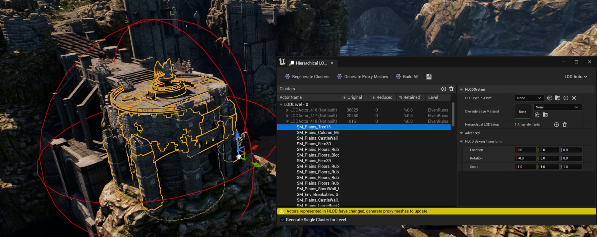
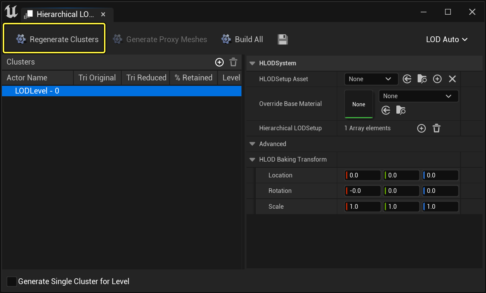
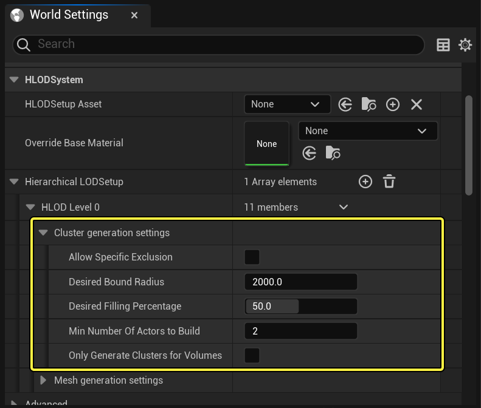
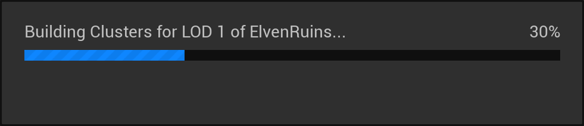
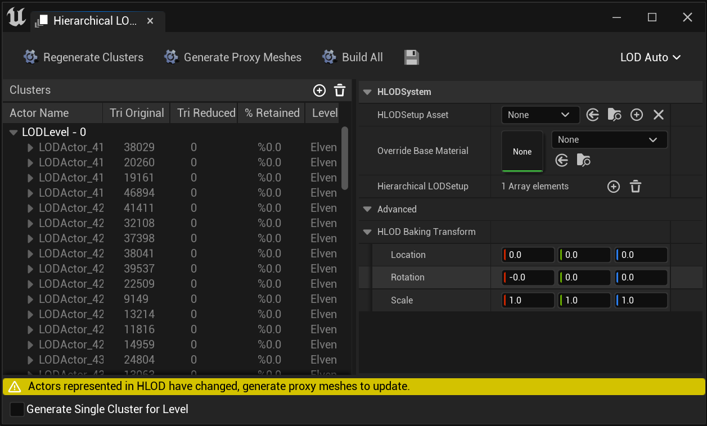
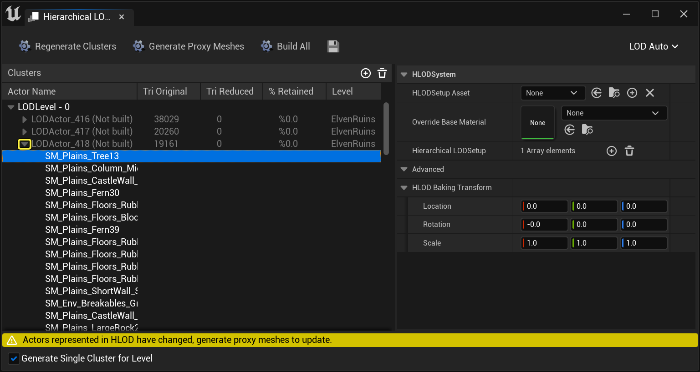
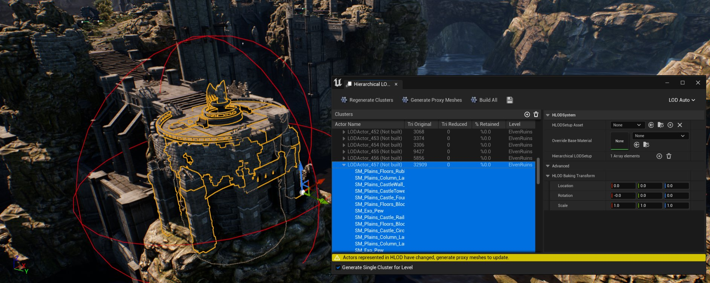
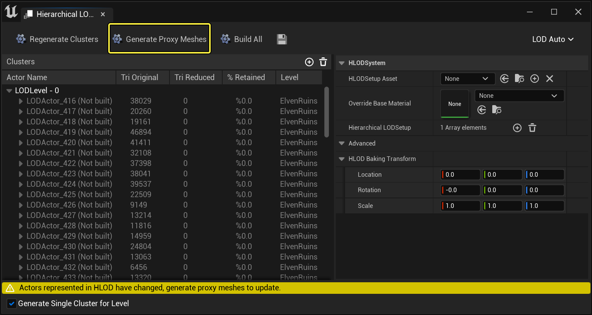

# 构建HLOD网格体

> 路径：虚幻引擎5.7文档 / 构建虚拟世界 / 分层细节级别（HLOD） / 构建HLOD网格体

> 原始页面：https://dev.epicgames.com/documentation/unreal-engine/building-hierarchical-level-of-detail-meshes-in-unreal-engine

为了使用 **分层细节级别（Hierarchical Level of Detail）** (HLOD)模型，你必须完成两个步骤后才能在关卡中设置HLOD模型。首先，你必须 **生成群集** 。群集会根据你在 **群集生成设置（Cluster Generation Settings）** 中指定的设置对关卡内的 **Actor** 进行分组。

生成群集后，你可以基于这些群集 **生成代理模型** 。代理模型的生成过程可能需要较长时间，具体取决于场景复杂程度或 **模型生成设置（Mesh Generation Settings）** 中的设置。

在本教程中，我们将通过一个示例来介绍如何通过生成群集和代理模型来构建HLOD模型。

点击查看大图。

## 步骤

1. 为所需的HLOD等级定义[群集生成设置](../hierarchical-level-of-detail-outliner/index.md)之后，单击 **生成群集（Generate Clusters）** 按钮。

   

   点击查看大图。

   

   点击查看大图。

   进程开始后，你会看到一个进度条，显示正在生成的LOD等级的进度。

   

   点击查看大图。
2. 群集生辰完毕后，群集的 **LOD Actor** 将显示到[HLOD大纲视图](../hierarchical-level-of-detail-outliner/index.md)窗口中。

   

   点击查看大图。

   单击名称左侧的展开箭头可展开 **LOD Actor** ，查看群集的静态网格体。

   

   点击查看大图。

   还可以从 **HLOD大纲视图（HLOD Outliner）** 中选择 **LOD Actor**（和静态网格体）来在 **视口（Viewport）** 中查看群集。

   

   点击查看大图。

   如果你想要对给定的群集进行更改，可以根据需要调整 **群集生成设置（Cluster Generation Settings）** ，然后重新 **生成群集** 。你还可以使用[HLOD上下文菜单](../hierarchical-level-of-detail-outliner/index.md#lodactor%E4%B8%8A%E4%B8%8B%E6%96%87%E8%8F%9C%E5%8D%95)，定义 **LOD Actor** 的设置或定义在群集中如何处理静态网格体Actor。
3. 对群集感到满意后，单击 **生成代理模型（Generate Proxy Meshes）** 按钮。

   

   点击查看大图。

   进程开始后，将出现一个进度条，指示将生成的代理模型总数中正在处理的 **LOD Actor** 和 **LOD级别** 。

   > 图片已省略：Build HLOD Mesh Generate Building

   点击查看大图。

   > [!WARNING]
   > 此进程可能耗时较长，具体取决于HLOD设置、场景复杂程度和计算机规格。举例参考：一个拥有12核i7处理器、GTX-980显卡和64GB RAM配置的系统，耗时约10-12分钟完成（其中HLOD等级为默认设置，每个HLOD等级约有100个以上LOD Actor）。

   > 图片已省略：Build HLOD Mesh Generate

   点击查看大图。

### 生成群集

群集生成使用单个HLOD等级的设置决定如何在场景中对 **静态网格体 Actor** 进行分组。生成过程的耗时由使用的设置、分组的 **Actor** 数量、是否生成材质，以及硬件配置（最主要的决定因素）决定。

1. 完成对所需单个HLOD等级的特定设置后，点击 **生成群集（Generate Clusters）** 按钮。

   > 图片已省略：Generate Clusters Button

   点击查看大图。

   进程开始后将出现一个进度条，显示生成的LOD等级。

   > 图片已省略：LOD Level Being Generated

   点击查看大图。
2. 进程完毕后，**HLOD大纲视图（HLOD Outliner）** 将被所有群集 **Actor** 填充。

   > 图片已省略：HLOD Outliner populated with all the Clustered Actors

   点击查看大图。
3. 点击名称左边的箭头按钮可展开单个 **LODActor** ，查看该群集由哪些 **静态网格体** 组成。

   > 图片已省略：Static Meshes make up the expand individual Cluster of LODActors

   点击查看大图。
4. 从 **HLOD大纲视图（HLOD Outliner）** 选择一个 **LODActor** 并在编辑器视口中将其找到，即可在关卡中显示群集。

   > 图片已省略：Selecting a LODActor from the HLOD Outliner and visualize it in the Editor Viewport

   点击查看大图。

要直观地看到生成的群集在编辑器中的运作方式，你可以使用 **强制的LOD级别（Forced LOD Level）** 菜单查看运行中的HLOD，而无需使其按特定屏幕大小过渡。这有助于排解出现在屏幕上的问题（可能为生成群集的一部分）。

> 图片已省略：Forced LOD Level

点击查看大图。

如果生成的群集遇到问题，可展开特定群集并选择对立的 **静态网格体 Actor** 。然后点击并将其拖至另一个群集，或右键点击列表中的 **Actor** 命名选择将其从群集的生成中 **移除** 或 **排除** 。

**Actor** 还可以逐个实例来排除，方法是在关卡中将其选中，并在 **细节（Details）面板** 中将 **可以位于群集中（Can be in Cluster）** 的选项设置为false。

此外，如果你想将 **Actor** 添加到 **群集（Cluster）** ，可以点击并从 **大纲视图（Outliner）** 拖移到你想将其包含到的 **群集（Cluster）** 。

> 图片已省略：Can be in Cluster

点击查看大图。

重复此过程，同时调整HLOD等级 **群集生成设置（Cluster Generation Settings）** 中的数值，直到生成满意的群集，然后进入下一节： **生成代理模型** 。

### 生成代理模型

生成满意的群集后，即可前往将群集构建到代理模型中的选项。此代理模型将会是新建的 **静态网格体 Actor** （如启用，它将组合材质），拥有自身的光照图，以及自身的可编辑静态网格体（可在静态网格体编辑器中打开）。

1. 如你已准备好构建代理模型，现在即可点击"生成代理网格体（Generate Proxy Mesh）"按钮开始。

   > 图片已省略：Generate Proxy Mesh Button

   点击查看大图。

   进程开始后将出现进度条，显示使用中的HLOD层级和生成中的代理模型数量。此进度条不显示全部HLOD层级和创建的代理模型总数，只显示特定层级的代理模型数。

   > 图片已省略：Proxy Meshes being Generated

   点击查看大图。

   此进程耗时取决于HLOD的等级设置、创建的代理模型数量，以及系统配置情况，高端机器也可能耗时较长！

> [!NOTE]
> 参考：拥有12-core i7处理器、GTX-980和64GB RAM配置的电脑需要约10-12分钟才能完成代理模型的生成（HLOD等级为默认设置，每个HLOD等级约有100多个 **LODActor**）。
