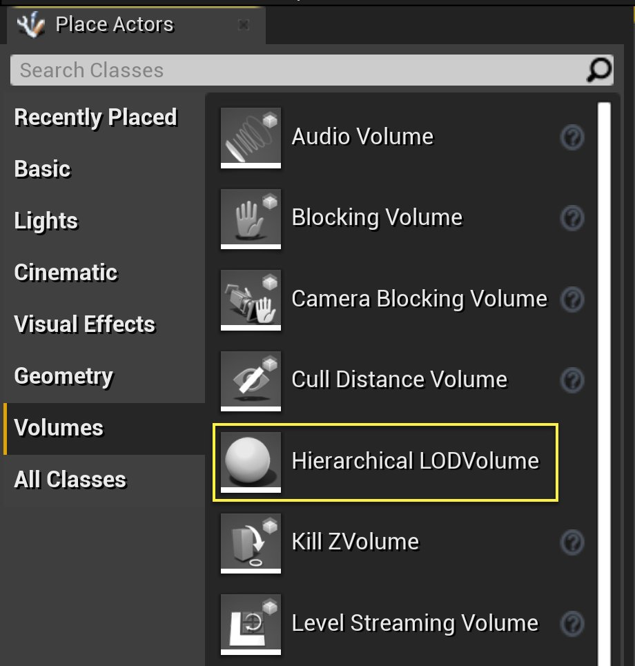
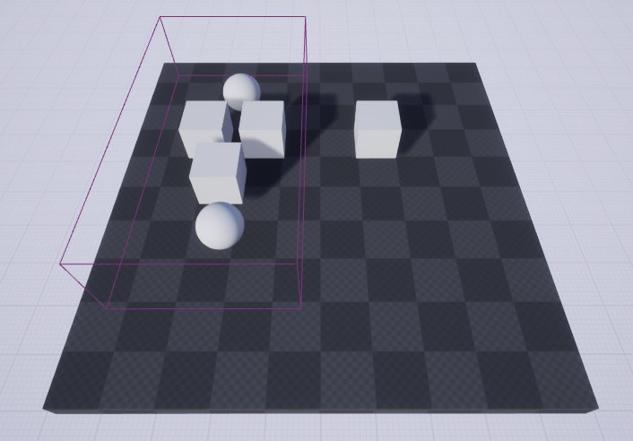
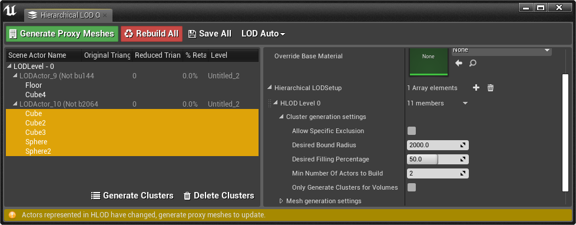
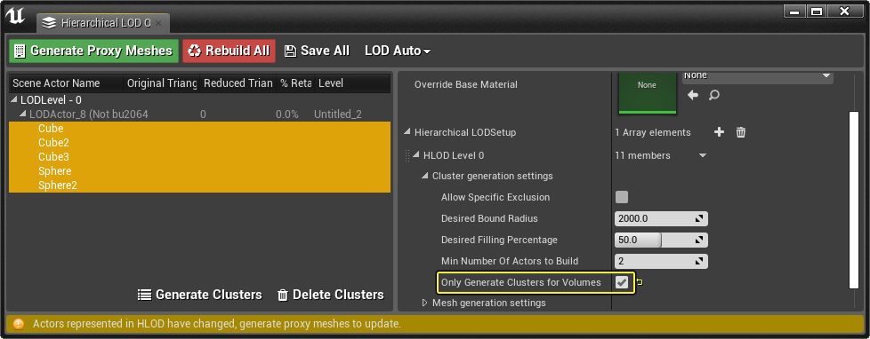
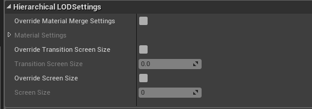

# HLOD概述

> 路径：虚幻引擎5.7文档 / 构建虚拟世界 / 分层细节级别（HLOD） / HLOD概述

> 原始页面：https://dev.epicgames.com/documentation/unreal-engine/hierarchical-level-of-detail-overview-in-unreal-engine

就其最简单的形式而言，**分层细节级别（Hierarchical Level of Detail）** （简称 HLOD）将预先存在的[静态网格体Actor](../../../understanding-the-basics/actors-and-geometry/unreal-engine-actors-reference/static-mesh-actors/index.md)组合为一个单一的HLOD代理模型和材质（带有图谱纹理）。因为HLOD可以将每个代理模型的多个绘制调用减少为一个调用，而不是每个静态网格体Actor一个绘制调用，因此使用它可以提升性能。生成HLOD代理模型时，可以调整几个参数，这些参数有助于定义如何将静态网格体Actor作为群集分组在一起，它们最终将被编译到代理模型中。

> [!NOTE]
> 要使用HLOD，需要在希望利用此系统的每个关卡中启用HLOD系统。

## 代理模型

代理模型可以单独打开，还可以根据需要调整它们的设置。

上方的代理模型包含数个不同元素，它们原本均拥有自身的纹理，现在这些纹理已组合为一个单一的纹理。

> [!NOTE]
> 对于使用 **遮罩** 和 **不透明度** 的任何内容，透明通道不会传递到合并的纹理。如果需要带不透明度或遮罩的内容，请禁用 **合并纹理（Merge Textures）** 选项。执行此操作时，代理模型将把原始材质指定为一个 **材质元素ID**，而非组合它们。

## 分层LOD体积域

**分层LOD体积域**（HLOD体积域）用于手动定义/创建HLOD群集。可从 **放置Actor（Place Actors）** 面板的 **体积** 选项卡中拖入关卡。

将此体积域放置在需要放入同一群集的Actor周围。将此体积域的范围设为略大于希望包含的Actor较好，不应包裹太紧。将体积域设置在Actor周围后，即可使用 **HLOD大纲视图（HLOD Outliner）** 中的选项 **生成群集（Generate Clusters）** 创建这些分组Actor的新群集。

下面，在HLOD体积域中有几个立方体和球体，在体积域之外有一个立方体和地面。

当我们在 **HLOD大纲视图（HLOD Outliner）** 中 **生成群集** 时，我们有两个单独的群集：一个群集包含HLOD体积域以内的静态网格体Actor，另一个群集包含HLOD体积域以外的静态网格体Actor。

点击查看大图。

您还可以选择启用 **仅生成体积群集（Only Generate Clusters for Volume）**（如下所示），仅为HLOD体积域中存在的静态网格体Actor生成群集。

点击查看大图。

### 示例

以下是添加HLOD体积域前后生成的群集示例。

HLOD等级所需的边界半径：500

拖入体积域并进行相应的缩放以覆盖 **Actor**。

从HLOD大纲视图选择生成的 **LODActor** 将显示创建的群集和群集边界。

在HLOD大纲视图中右键单击 **LODActor**，并单击 **选择包含的Actor（Select Contained Actors）** 查看用于场景中该特定 **LODActor** 的Actor。

## HLOD覆盖

当您选择了关卡中的一个LOD Actor时，您可以在 **详细信息（Details）** 面板中覆盖正在使用的 **分层LOD设置（Hierarchical LODSettings）**。

> [!NOTE]
> 请参阅[模型生成设置](../hierarchical-level-of-detail-outliner/index.md#%E7%BD%91%E6%A0%BC%E4%BD%93%E7%94%9F%E6%88%90%E8%AE%BE%E7%BD%AE)和属性了解详情。

## HLOD可视化

您可以使用可视化模式来在视口中查看模型LOD和HLOD。要访问这些，单击视口左上角的 **查看模式（View Mode）** 按钮并选择首选的LOD着色方法。

> [!NOTE]
> 在播放会话期间，您可以输入控制台命令 `viewmode hlodcoloration` 来获得相同的结果。
