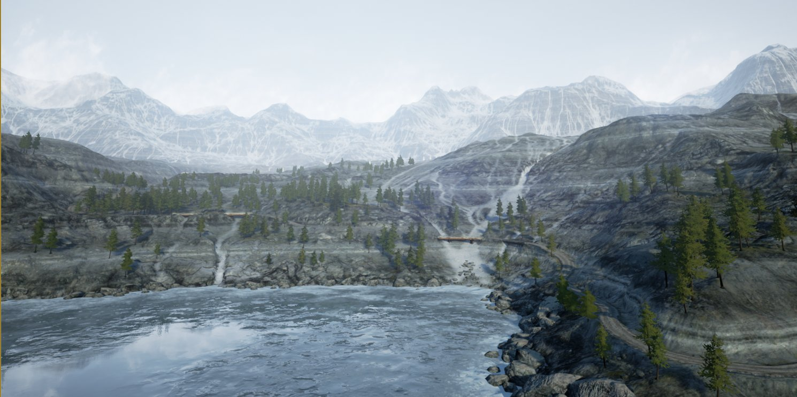
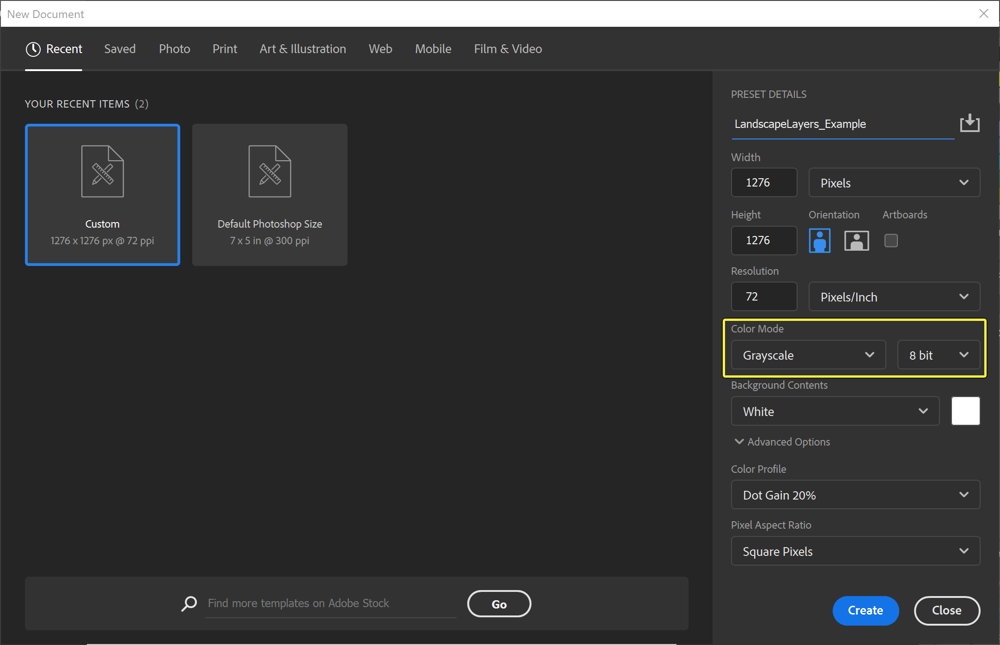
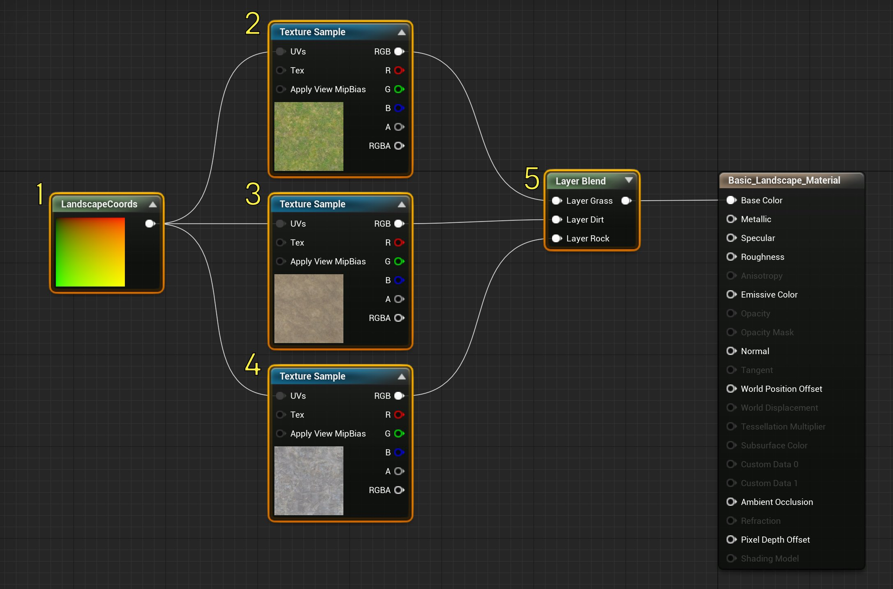
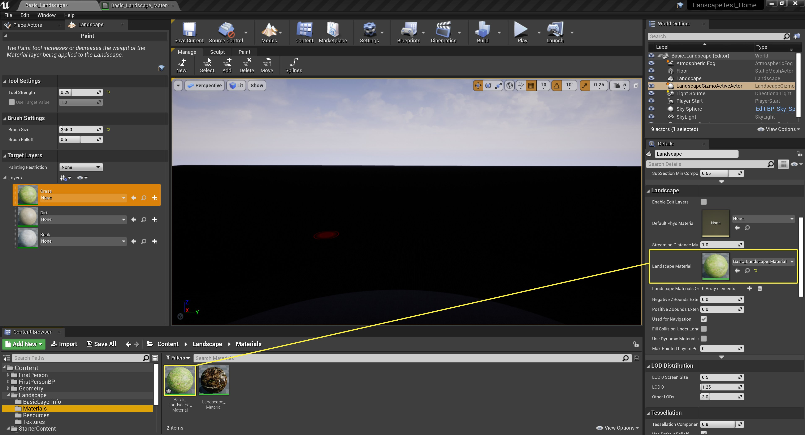
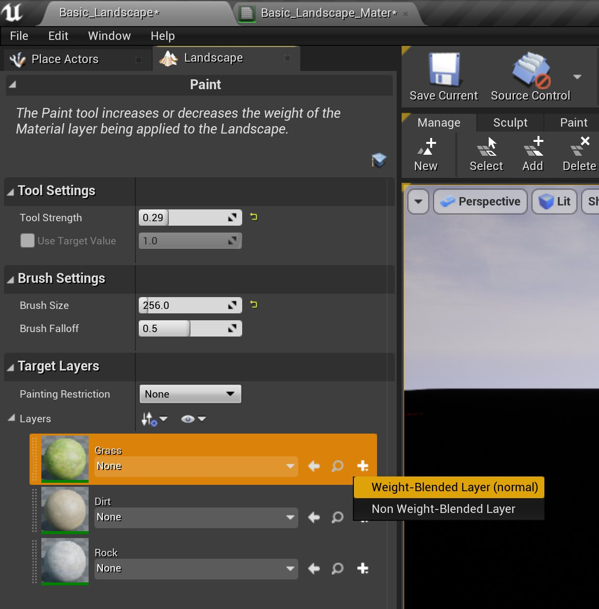
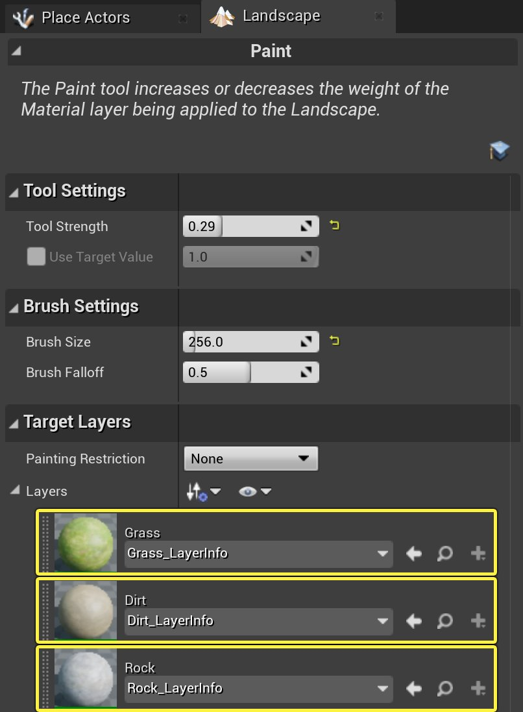
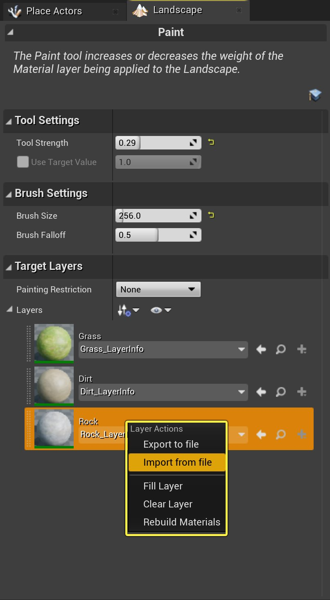
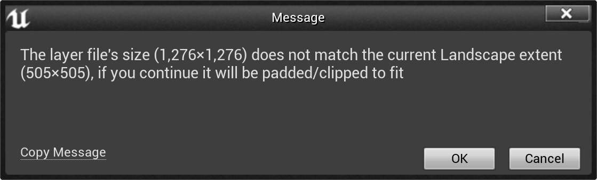

# 创建和使用自定义高度图和图层

> 路径：虚幻引擎5.7文档 / 构建虚拟世界 / 地形户外地貌 / 创建地形 / 创建和使用自定义高度图和图层

> 原始页面：https://dev.epicgames.com/documentation/unreal-engine/creating-and-using-custom-heightmaps-and-layers-in-unreal-engine

用户有时需要使用第三方程序来为地形创建需要的高度图和图层。 为了适应这一工作流程，虚幻引擎允许导入自定义的高度图和图层。

> [!NOTE]
> 如果这是您首次使用地形工具，可能需要首先查阅[地形总览](../../editing-landscapes/index.md)。

## 图层

地形图层是特殊的纹理，包含高度图和色彩数据。它可用户自定义地形的外观和感觉。

### 图层格式

通过 `ILandscapeHeightmapFileFormat` 和 `ILandscapeWeightmapFileFormat` 接口的实现即可从第三方程序导出地形图层。编辑器对基于图像的导出的现有支持已转换为使用此接口，且完全支持。内置格式的图像仍需要为灰阶、每像素8位、.PNG或.RAW格式的单通道文件。如果在Photoshop中创建层，创建新文件时应使用以下设置：

### 图层导入

为了适应不同的地形工作流程，从外部应用程序导入图层的流程十分灵活，但首先需要进行几项设置，才能让工作顺利进行。

1. 首先需要创建一个可使用的地形。如果你对地形创建流程有疑问，请参阅[地形创建](../index.md)。
2. 然后，制作一个新材质。在本例中，我们将制作一个非常简单的材质，它可以根据需求轻松延展。该材质的设置应与下图类似。

   

| 数值 | 描述 |
| --- | --- |
| 1 | LandscapeLayerCoords |
| 2 | TextureSample: T_Ground_Grass_D (Found in **StarterContent/Textures**) |
| 3 | TextureSample: T_Ground_Gravel_D (Found in **StarterContent/Textures**) |
| 4 | TextureSample: T_Rock_Slate_D (Found in **StarterContent/Textures**) |
| 5 | LandscapeLayerBlend |

1. 材质创建完成后，将其应用到地形Actor。这会让你的整个地形变成黑色。

   
2. 要解决此问题，你需要添加一些 **图层信息（Layer Info）** 到地形Actor。在本例中，你需要为全部三个图层各创建一个 **图层信息**。如需阅读关于 **图层信息** 对象的更多内容，请参阅[图层信息对象](../../editing-landscapes/landscape-paint-mode/index.md#%E5%9B%BE%E5%B1%82%E4%BF%A1%E6%81%AF%E5%AF%B9%E8%B1%A1)页面。

   
3. 操作完成后，地形面板中的 **目标图层（Target Layer）** 部分应与下图类似。

   
4. 现在可以导入自定义图层了。右键点击选中的 **目标图层**，然后在弹出的菜单中选择 **从文件导入（Import from file** 选项，再从出现的对话框中选择需要包含自定义图层数据的.PNG或.RAW文件。自定义图层文件的分辨率应与你创建地形Actor时设置的 **整体分辨率（Overall Resolution）** 保持一致（默认为505 x 505）。

   
5. 如果图层未以正确的尺寸输出，将出现以下警告：

   

   要修复此问题，请返回你的图片编辑软件，重新调整文件尺寸，使其与警告信息中显示的正确地形尺寸保持一致。

## 高度图

为了加快地形创建进程，使用第三方工具创建可在UE4中使用的基础高度图是一个很好的方法。World Machine和Terragen之类的软件都可以为你的地形快速创建基础高度图。之后即可使用虚幻编辑器中的编辑工具来导入、清理或修改它，使其与世界场景和所需的游戏玩法更为相符。

关于导入和导出高度图的更多详情，请参阅[导入和导出高度图](../importing-and-exporting-landscape-heightmaps/index.md)一文。
