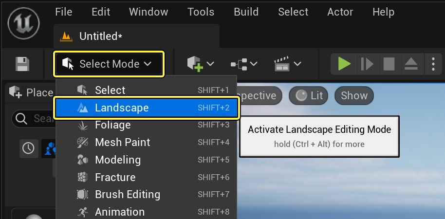
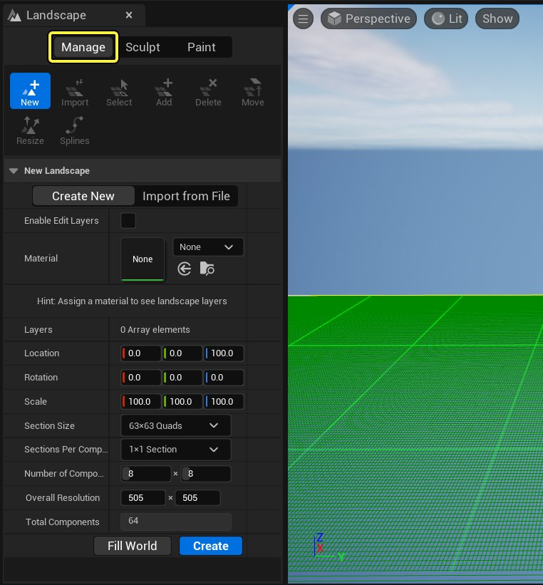
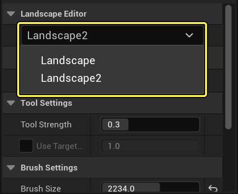
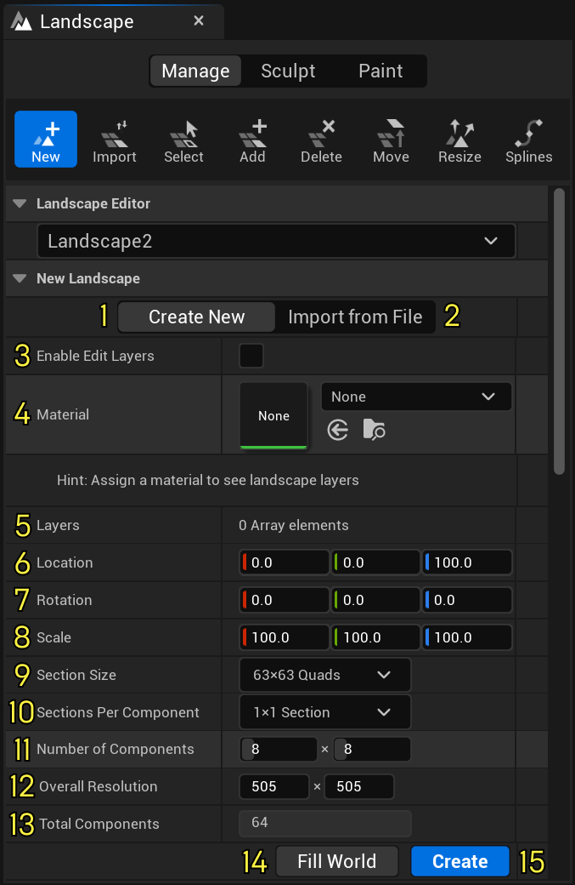
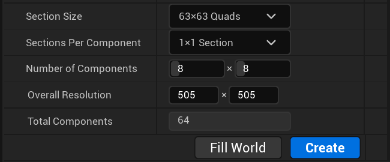
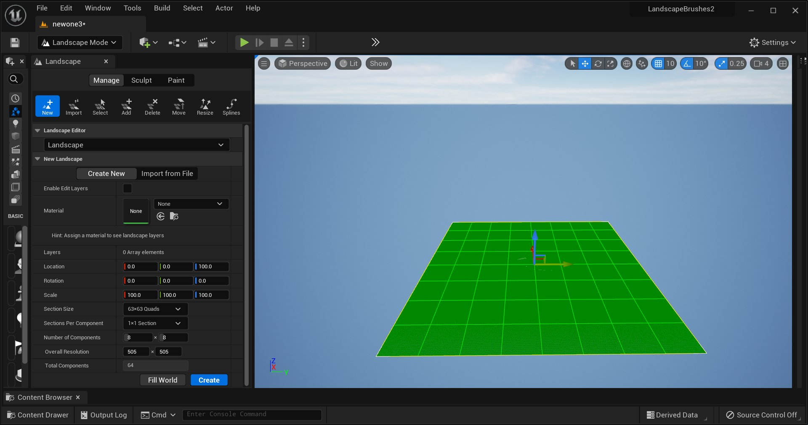
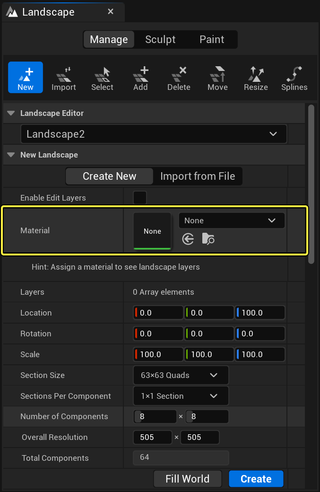
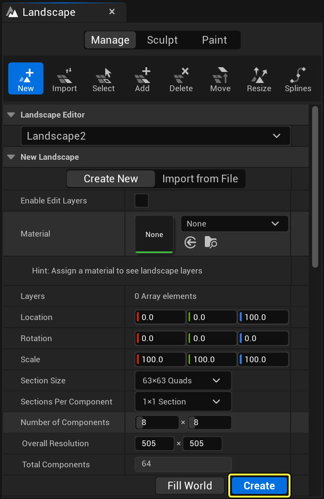

# 创建地形

> 路径：虚幻引擎5.7文档 / 构建虚拟世界 / 地形户外地貌 / 创建地形

> 原始页面：https://dev.epicgames.com/documentation/unreal-engine/creating-landscapes-in-unreal-engine

虚幻引擎5（UE5）能够使用其强大的地形编辑工具套件创建拥有广袤地貌的场景。你可以使用 **地形（Landscape）** 工具创建沉浸式室外地貌区域；这些地貌经过优化，可以在不同设备上保持稳定帧率运行。

你可以使用以下方法来创建自己的地形：

- 使用引擎内置的地形工具从头创建新的地形高度图。
- 导入以前在虚幻编辑器中创建的或在外部工具中创建的地形高度图。请参考[导入和导出地形高度图](importing-and-exporting-landscape-heightmaps/index.md)。
- 创建你自己的格式来导入地形。请参考[创建自定义地形导入器](../creating-custom-landscape-importers/index.md)。

> [!NOTE]
> 如需查看地形工具实操示例，请参阅[地形内容示例](../../../samples-and-tutorials/content-examples-sample-project/index.md)。

## 打开地形工具

在创建地形之前，你必须首先打开地形工具。在主工具栏中，点击 **选择模式（Select Mode）**，然后选择 **地形（Landscape）** 。

点击查看大图。

> [!TIP]
> 此外，你还可以按键盘上的 **Shift + 2** ，随时切换到使用地形工具。

首次打开地形工具时，将自动打开[管理模式](https://dev.epicgames.com/documentation/unreal-engine/landscape-manage-mode-in-unreal-engine)选项卡。如果当前关卡中没有任何其他地形Actor，系统会提示你新建一个。在地形管理模式中，你可以创建新的地形并修改现有的地形及其组件。

点击查看大图。

> [!TIP]
> 如果关卡已包含一个或多个地形，**地形（Landscape）** 选项卡的布局会略有不同。**地形编辑器（Landscape Editor）** 部分将显示一个下拉菜单，并显示 **选择（Selection）** 工具。在下拉菜单中，可以选择要处理的地形。
>
> 
>
> 点击查看大图。

## 使用地形工具创建新地形

你可以通过 **地形（Landscape）** 工具面板的 **新建地形（New Landscape）** 从头新建地形。

点击查看大图。

| **数字** | **选项** | **说明** |
| --- | --- | --- |
| **1** | **新建（Create New）** | 在关卡中创建新的地形Actor。 |
| **2** | **从文件导入（Import from File）** | 导入在外部程序中制作的地形高度图。 |
| **3** | **启用编辑图层（Enable Edit Layers）** | 允许使用非破坏性地形图层和样条线。 |
| **4** | **材质（Material）** | 将材质分配到地形。 |
| **5** | **图层（Layers）** | 显示地形材质中包含的所有图层。 |
| **6** | **位置（Location）** | 在用于创建地形的世界中设置位置。 |
| **7** | **旋转（Rotation）** | 在世界中设置地形的旋转。 |
| **8** | **缩放（Scale）** | 在世界中对地形进行缩放。 |
| **9** | **分段大小（Section Size）** | 地形会根据分段大小来执行LOD和剔除。分段越小的地形，LOD优化就越多，但CPU开销也更高。分段越大，组件越少，占用的CPU也越少。 如果希望具有大型地形，则需要使用较大的分段大小，因为如果使用较小的分段，然后放大地形，将增加CPU开销。 |
| **10** | **每个组件的分段数（Sections Per Component）** | 在单个地形组件中设置分段的数量。分段数量和分段大小决定了每个地形组件的大小。组件是渲染和剔除的基本单位。 如果使用较大的分段大小，可以缩短CPU计算时间。但是，地形可能会一次渲染太多顶点。在使用非常大面积的地形时，这个问题尤其常见。这些问题在移动设备上可能更加严重，由于存在硬件限制，绘制调用的数量将会受限。 |
| **11** | **组件数（Number of Components）** | 设置地形大小和分段大小。其最大值被限制为32 x 32，因为每个组件都有与其关联的CPU开销。超过此限制将导致地形出现性能问题。 |
| **12** | **总体分辨率（Overall Resolution）** | 地形所使用的顶点数。 |
| **13** | **组件总数（Total Components）** | 将为地形创建的组件总数。 |
| **14** | **填充世界（Fill World）** | 让地形尽可能大。 |
| **15** | **创建（Create）** | 使用指定的设置在世界中创建地形。 |

对于下面的示例，地形将全部使用默认参数，如下所示。

| **属性名称（Property Name）** | **值（Value）** |
| --- | --- |
| **分段大小（Section Size）** | 63 x 63 四边形 |
| **每个组件的分段数（Section Per Component）** | 1 x 1 个分段 |
| **组件数（Number of Components）** | 8 x 8 |
| **总体分辨率（Overall Resolution）** | 505 x 505 |

> [!NOTE]
> 在选择 **分段大小（Section Size）** 时应该谨慎，因为随着组件数量的增加，构建时间和性能可能会受到严重影响。通常建议每个分段为 63x63 个四边形，因为这样可以提供良好的性能和大小。

完成后，在 **新建地形（New Landscape）** 属性框中应该会得到类似如下的内容。

点击查看大图。

在主视口中，应该能看到新地形的预览效果，如下所示：

点击查看大图。

> [!TIP]
> 就像任何其他Actor，地形Actor可以移动、旋转和缩放。

创建地形时，可以将材质指定到地形。指定材质时，你需要先在 **内容浏览器（Content Browser）** 中选择适当的材质，然后点击指定箭头图标，将其指定给 **材质（Material）** 旁边的 **新地形（New Landscape）** 部分。如需了解地形材质的更多信息，请参阅[地形材质图层混合](../landscape-materials/index.md)。

点击查看大图。

在准备好创建新地形时，点击地形工具面板右下角的 **创建（Create）** 按钮。地形将以平面形式显示在视口中。如果向地形分配了材质，则会显示所应用的材质。如果未分配，将使用关卡编辑器的默认材质。

点击查看大图。

> [!NOTE]
> 如果地形很大或很复杂，可能需要几秒钟才能显示出来。

按下 **创建（Create）** 按钮之后，应该可以得到类似于以下的内容。

> 图片已省略：The final Landscape Actor

现在，你已经创建了新的地形，可以开始根据你的需要来[雕刻](../editing-landscapes/landscape-sculpt-mode/index.md)或[绘制](../editing-landscapes/landscape-paint-mode/index.md)地形。
